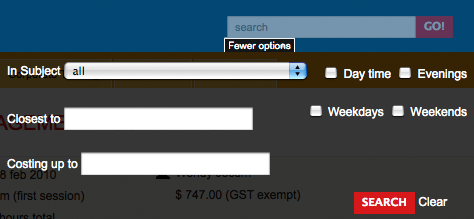

[[templates]]
= HTML Templates

== Editing templates

Once you have exhausted the capabilities of styling your site purely through modifying css, you may want to customise the html which is generated by the web application.
To do this, you will edit the templates which are used to build the site. You can do this using any WebDAV editor, like https://cyberduck.io/[Cyberduck].

If you want to override the templates below, simply place your modified files into an appropriate layout.
For example to customise the body structure on the default template, create a file here:

....
/templates/default/BodyStructure.tml
....

You can override any of the templates below, but don't go overboard: if you can achieve the results through modifying the css, do that first since it will be easier to upgrade your site to take advantage of new features as they become available in onCourse. If you do make a mistake and need to revert to the default source file, you can find them in the /templates/_system folder. These cannot be edited, but can be copied back into the /templates/default folder.

In onCourse templates are *well-formed XML documents*.
That means that every open tag must have a matching close tag, every attribute must be quoted, and so forth.
You can override any of the templates in this handbook by simply creating a file with the appropriate name in the /templates/default folder.
Naturally if you are using more than one layout, you can have multiple sets of templates, each in their own folder within /templates.

== Page wrappers

All pages on the site are wrapped in one of two main templates.
Most pages will have PageStructure.tml wrapped around them to render menus, headers, blocks, etc.
Other web requests might be drawn inside a 'lightbox' effect and so should not have all this extra content.

=== Page Structure

Page structure is one of the few templates that is not editable.
You cannot override this particular template since it controls how the CMS integrates to the site.
But you have enough other hooks that you should not need to worry about this template.

[source,xml]
----
<!DOCTYPE html>
<html xmlns="http://www.w3.org/1999/xhtml" xmlns:t="http://tapestry.apache.org/schema/tapestry_5_1_0.xsd"
xmlns:p="tapestry:parameter" lang="en">
<head>
  <head t:type="ui/pagehead" title="${title}"/>
</head>

<body t:type="any" class="prop:agentAwareBodyClass" id="prop:bodyId">
  

    <t:body/>
  

  
</body>
</html>
----

=== Body Structure

Filename::
BodyStructure.tml

The important thing about the body structure is that it is called by other page templates.
So when Courses.tml wants to render itself, PageStructure is used to provide the main structure of the page.
When you reach `<t:body/>` in the template below, Courses.tml is inserted.

=== Dialog Structure

Filename::
DialogStructure.tml

This is a more minimalist page layout which is used for things that display in a 'lightbox' style dialog within the page.
It contains no javascript references, but does include the main site.css stylesheet.

== Page templates

Some of the templates you can edit are reached by a particular URL. For example, the /course/ABC renders CourseDetails.tml.
All of these top level page templates begin with something like this:

....
<html t:type="ui/pagestructure" title="Page title" bodyId="literal:DetailsPage">
....

This will render the template, wrapped with the PageStructure.tml template (to draw the main page design and layout), and give you the opportunity to override the page title and body css id.

=== Courses

Filename::
Courses.tml

URL::
/courses/[tag]/[tag]/*

URL::
/courses?s=[search terms]

Renders the course list after a user performs a search or browses the subject tags.
The parameters in the URL define the position in the subject tag tree the user is looking at, or the search parameters they used.
The first form of URL showing the list for a particular subject tag is deliberately designed to be Google friendly and encourage bookmarking.

=== Course Details

Filename::
CourseDetails.tml

URL::
/course/[course code]

Renders a single course description page.

=== Class Details

Filename::
CourseClassDetails.tml

URL::
/class/[class code]

Renders a single class description page.
For technical reasons a class is called "CourseClass" within the internals of onCourse.

=== Tutor Details

Filename::
TutorDetails.tml

URL::
not public (ajax only)

Renders a tutor profile in a lightbox.

=== Sites

Filename::
Sites.tml

URL::
/sites

When called, renders a listing of Course sites (venues) and appropriate maps.

=== Site Details

Filename::
SiteDetails.tml

URL::
/site/[id]

Displays the details of the site including the map and site information.

=== Page Not Found

Filename::
PageNotFound.tml

URL::
undefined

Renders a page when the URL cannot be found.

=== Promo Codes Page

Filename::
PromoCodesPage.tml

URL::
not public (ajax only)

Allows the user to enter a promotional code within a lightbox.

=== Room Details

Filename::
RoomDetails.tml

URL::
/room/[id]

Displays details about the room, including the site details.

[source,xml]
----
----

=== Add Discount

Filename::
AddDiscount.tml

URL::
not public (ajax only)

Allows the user to enter a promotional code within a lightbox.

=== Sitemap XML

Filename::
SitemapXML.tml

URL::
/sitemap.xml

Google, Bing, Yahoo and other search engines love this.

== Component templates

These templates can never be called directly from a URL. Instead they are used by other templates to build up a page.

=== Block Display

Filename::
BlockDisplay.tml

Builds the parameters to include content - copy, images, components

=== Body Footer

Filename::
BodyFooter.tml

Builds the parameters for the Copyright, Disclaimer info, etc at the foot of the page

=== Body Header

Filename::
BodyHeader.tml

Builds the Header area for the mast - logo, navigation, search, etc at the top of the page.

=== Class Item

Filename::
CourseClassItem.tml

Produces the brief, panelled class descriptions.

You can add some extra detail to show the number of places left in a class by adding the following piece of code to this template.

....
<t:if test="isInStock">
     <link itemprop="availability" href="http://schema.org/InStock"/>
     <p:else>
           <link itemprop="availability" href="http://schema.org/OutOfStock"/>
     </p:else>
</t:if>
....

When added correctly you should see the following text below your Enrol Now buttons

=== Course Class Places Available

Filename::
CourseClassPlacesAvailable.tml

Produces a Class enrolment status display.
Called by "CourseClassItem".

=== Course Class Price

Filename::
CourseClassPrice.tml

Produces a class pricing display.
Called by "CourseClassItem".

=== Course item

Filename::
CourseItem.tml

Produces a brief introduction to a Course Class

Called by "Courses" and "CourseDetails"

getImages(courseItemModel.course) retrieves all images related to this course and have 'image/jpeg' mimeType

[source,xml]
----
<t:loop source="getImages(courseItemModel.course)" value="attachment">
    

</t:loop>

----

=== Course Search Form

Filename::
CourseSearchForm.tml

Produces a Course Class specific search

Called by "BodyHeader" and in turn calls "Search Inputs"

=== Course/CourseClass Tutors 

Filename::
TutorsDetails.tml

Renders list of all the tutors associated with particular course.

Display tutors in course detail using following piece of the code in CourseItem.tml

[source,xml]
----

----

Display tutors in course class detail using following piece of the code in CourseClassDetails.tml 

[source,xml]
----

----

=== Global Navi

Filename::
GlobalNavi.tml

Defines the parameters for global menus

Called by "BodyStructure"

=== Google Analytics

Filename::
GoogleAnalytics.tml

Places the appropriate Google Analytics code on the page

Called by "CourseClassItem" in "CourseClassDetails"

=== Google Map Sites

Filename::
GoogleMapSites.tml

Produces a Google map of the predefined site/sites/venue

Called by "Courses" and "Sites" and in turn calls "GoogleDirections"

=== Google Directions

Filename::
GoogleDirections.tml

Produces directions - written and verbal for site directions

Called by "GoogleMapSites" and "SiteDetailsComponent"

=== Hint Component

Filename::
HintComponent.tml

Provides validation text (showing data entry errors) for forms throughout the application, but particularly within the enrolment process.

=== Menu

Filename::
Menu.tml

Renders a Menu display.
Called by "BodyStructure".

=== Menu Item

Filename::
MenuItem.tml

Renders a specific menu.
Called by "Menu"

=== Page Head

Filename::
PageHead.tml

=== Payment Agreement

Filename::
PaymentAgreement.tml

=== Promo Codes View

Filename::
PromoCodesView.tml

=== Quick Search View

Filename::
QuickSearchView.tml

Produces specific parameters for the display of the page masthead

Called by "PageStructure"

=== Room Location

Filename::
RoomLocation.tml

=== Room Location Text

Filename::
RoomLocationText.tml

Produces specific parameters for the display of the page masthead

Called by "PageStructure"

=== Search Criteria

Filename::
SearchCriteria.tml

Produces specific parameters for the display of the page masthead

Called by "PageStructure"

Produces specific parameters for the display of the page masthead

Called by "PageStructure"

=== Search Inputs

Filename::
SearchInputs.tml

=== Search Terms Clarification

Filename::
SearchTermsClarification.tml

=== Shortlist

Filename::
ShortList.tml

Short List Manager

=== Site Details Component

Filename::
SiteDetailsComponent.tml

=== Timeline Event Detail

Filename::
TimelineEventDetail.tml

=== Timetable Events

Filename::
TimetableEvents.tml

=== Social Media

Filename::
SocialMedia.tml

Allows the user to order the preferred buttons for the Add This social media links which are placed against course and static pages.

