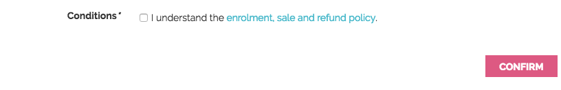
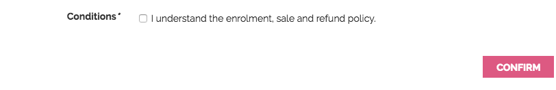
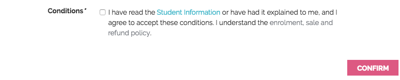

= Javascript
:doctype: book
:sectnums:
:toc: left
:icons: font
:experimental:
:sourcedir: .

[[_js]]
== File structure

Log into webDAV and look at this folder:
[source]
----
/s/js/
----

In there you'll see a number of javascript files which drive your onCourse website.
Some are third party vendor supplied files and others are default parts of onCourse itself.
site.js is the starting point and it has a list of all the other files which are included.
Note that the order of including files can sometimes be important.
Let's look at base.js now:

[source]
----
//= minify off
//= require base.js
//= require extra.js
----

This is telling you that minification is disabled and that the javascript files base.js and extra.js are included.
This is a different syntax to SCSS so don't get them confused.
The combined output file is called all.js and the files which are merged don't need to start with an underscore.

=== Minification

Unlike CSS, the javascript is not automatically minified.
This is because sometimes javascript minification can actually break your javascript (particularly if it contains errors). Browsers will often manage to figure out your broken javascript, but once minified, errors really cause problems.

You can enable minification by changing the "off" to "on" and saving the file.
Wait about 30 seconds and then review your site in staging before pushing it to live.

We use the Google Closure compiler to verify and minify the output.

=== Compression

all.js.gz is automatically created and used by browsers.
This is another reason minification may not be quite so important: compression often does a pretty good job of reducing the file sizes.

== Core libraries

We supply a number of third party javascript libraries with your site by default.
The following list are bundled together as dynamic.js and cannot be removed without breaking some key shopping basket functionality on the site:

* classnames
* react
* react-dom
* react-redux
* redux
* redux-thunk
* jquery 3.x

In addition there are some useful libraries which are often used when building sites:

* BxSlider 4.x
* jquery.customSelect
* jQuery Validation Plugin

You may wish to remove or add more libraries for your particular design

==  config.js

config.js controls the behaviour of the browser application parts of onCourse.
In particular, the checkout application that drives the shopping basket, enrol buttons, places available, discounts and the whole checkout and ecommerce engine.
config.js can be accessed via WebDAV, and can be found at the path `~/s/js/config.js`

You can add the following variables to your checkout_config to change and customise the behaviour of the web application.
These variables accept strings in the form of the path to the web page you want to direct a student to.
Example:

[source,javascript]
----
var checkout_config = {

  "checkoutPath": "/checkout",
  "paymentSuccessURL": "/products",
  "termsAndConditions": "/termsAndConditions",
  "featureEnrolmentDisclosure": "/policies/enrolment",
  "guardianRequiredAge": 16
}
----

Important variables can be configured in the config.js file.

checkoutPath::
The path on which your checkout page lives.
You can point this to any page on your site, as long as you create that page in the editor and add the correct markup for the checkout engine to be displayed.

paymentSuccessURL::
The path to the page where a student is directed after the enrolment process.
Perhaps you want to take them to the homepage, a survey, additional products or a page with enrolment terms and conditions.
You can set this here.
If you don't provide this, they remain on the thank you page at the end of the checkout process.

termsAndConditions::
A URL to outline any policies, procedures or terms and conditions a student must agree to.
On the payment page a checkbox is displayed with the words "I understand the enrolment, sale and refund policy." If you provide a URL in this variable, those words will be hyperlinked to that URL. 						    If you don't provide a value they will still have to check the option but there will be no link. 

featureEnrolmentDisclosure::
If you provide a URL here, a second sentence is added below the terms and conditions checkbox with the words "I have read the Student Information or have had it explained to me, and I agree to accept these conditions." The words "Student Information" is linked to whatever destination you enter here. 

guardianRequiredAge::
Students under this age will be allowed to enrol, however the checkout process will prompt the user to enter both the student and a parent/guardian over this age.
In order for this to work, you should ensure you have set up your data collection rules to collect the date of birth as a mandatory field.

canCreateContact::
If a student tries to enrol in a course, or sign up to a mailing or waiting list, the checkout web application can create a new contact record for this student . You can specify whether or not a new contact record  can be created if a student does not have a contact in your onCourse database.
You can set different rules for enrolments, waiting lists and mailiing lists.
+
If one of the *canCreateContact* parametres are set to FALSE, only an existing contact can be used for a transaction of this type, no new contact will be created.
+

[source,javascript]
----

canCreateContact: {
    enrol: true,
    waitingList: true,
    mailingList: true
 },
----