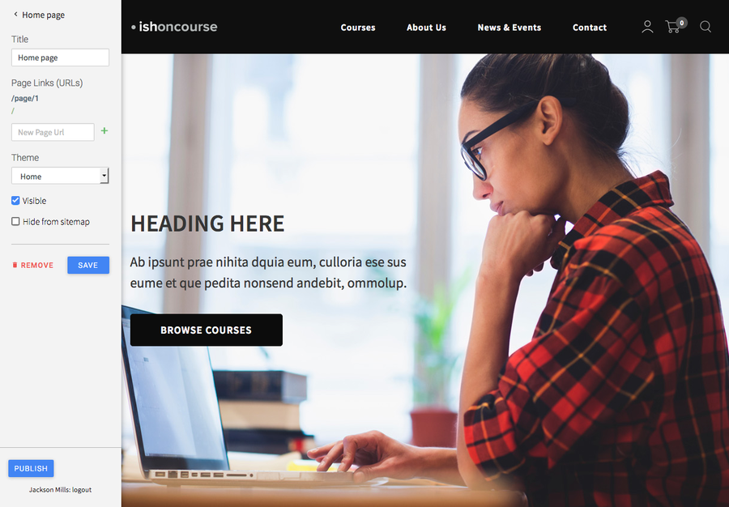

[[overview]]
= An overview

== Customising onCourse Web

onCourse Web is designed to be extremely flexible, allowing you to implement almost any concept you create for your site.
When you engage your graphic designer to work on your brand and website, you will want to make your onCourse website reflect your organisation at every level.
That means not only skinning the site to reflect your colour and logo, but thinking about navigation, search and the overall user experience (UX). onCourse has been built with this in mind.

At the same time, we want to save you time and money by giving you many of the basic building blocks you need to create your site.

If you are after quick simple results, skip straight to <<stylesheets>>
 and focus on changing just the stylesheets to get the look you are after.
A lot can be done with little effort in this way.
If you want to make changes to the structure of the site itself, read onto the link:#templates[templates chapter] for an understanding on how to change the html which makes up the site.

If you are not a web designer and reading this manual, you may find many of the concepts quite technical.
Don't worry: you can still edit content using the online CMS without understanding anything here.
Your designer, or ish, will be able to work on the page design and create something into which you can drop your content.

=== Editing your site via WebDAV

While you can log into your CMS to edit content, to make more granular changes to the code or design of your website you'll need to use WebDAV.
This is very similar to FTP (File Transfer Protocol) except it makes it easier for us to encrypt your connection and apply special automatic rules and filters.

To access and log into WebDAV we recommend using any standard compliant application, like http://cyberduck.io[Cyberduck], which is free for use on Windows and Mac.
To configure a connection in Cyberduck, first click the Bookmarks tab, then in the bottom left of that screen, click the '+' button to add a new bookmarked connection.

image:images/cyberduck_bookmarks.png[ The Bookmarks screen in Cyberduck,scaledwidth=80.0%]

A screen like below will appear:

image:images/cyberduck_configuration.png[ Cyberduck Configuration,scaledwidth=100.0%]

Enter the following details:

* Server = the URL of your website
* Username = the username you use to access your site's CMS
* Path (located under the expandable menu More Options) = /editor/webdav.

Close the box.
If you've entered everything correctly, your connection will now appear in the bookmarked like.
Double-click your new bookmarked connection and you'll be asked to enter your password, which will be the same as the one you use to access the CMS. Once you have access you'll see your site's folder structure.

== Draft site

All onCourse websites have both draft site and a live website.
The draft site will be visible to you only when you are logged into the Editor.
If your site is http://www.acme.edu.au, then you can log into the Editor at
https://www.acme.edu.au/#editor.
Any changes you make in the Editor or through WebDAV are only visible to you and any other users logged into the Editor.
You can make content changes and experiment in any way you choose without disturbing your live website.

Once you have finished with your changes to the draft site and are ready to publish them to the live site you can do this within the Editor.
The "publish" button can be found on the left hand side of the Editor panel.
Any changes made within either WebDAV or the Editor will be deployed to the live site when you press the publish button.
You'll need to wait a few minutes before the content is visible on your production site due to caching in our cluster of servers.
Some users may need to wait even longer if they have a local proxy server, which keeps a copy of the old site until it expires from its cache.

[[specialPages]]
== Special URLs

Some URLs in your site are reserved for special pages.
These pages are delivered by the onCourse software itself.
To customise them, consult the templates chapter for details of how these pages are created.
You cannot edit the content of the pages within the Editor because you will use the onCourse software to edit the courses, classes and other information which drives them.
These pages include:

/courses::
A list of all courses which are marked as web visible.
/courses/arts::
A list of all courses tagged with the tag "arts" from the "subject" tag group.
/course/ABC::
The detail of the course with code ABC.
/class/ABC-123::
The detail of the class with code ABC-123
/sites::
A list of all sites marked as web visible.
/site/12::
The detail of site with internal id 12.
/tutor/23::
The detail of the tutor with internal id 23.
/page/1::
Every page you make in the Editor will be given an automatic page number reference.
Even if you don't give it a nicer path, it will always be accessible by this URL.
/enrol::
All pages under this path are reserved for the enrolment, application and sales processing pages.
/cms::
All pages under this path are reserved for the cms engine.
/editor/webdav::
All pages under this path are reserved for webdav access.

== Building Editor pages

Pages which are not 'special' are delivered from the Editor.
That is, you are able to create pages and assign them to any URL you choose.
Each page belongs to a website.
You can have more than one website for the same onCourse database.
Each page can also be given a theme which defines which blocks appear on the page.
Themes are then linked to layouts which defines the html and stylesheets used.
The following graph shows the relationship between the onCourse database, websites, pages, themes and layouts.

Object hierarchy

=== The database

Starting from the top of the diagram we have the onCourse database itself.
This is the application which contains courses, classes, tags, students, tutors, and so on.
The data in the onCourse database is entered completely within the onCourse client/server applications and is automatically synchronised with the website.

=== The website

Each onCourse database can drive one or many websites.
Each website will have one or more domains which are used to access them.
So Acme Training might have the general leisure learning site at http://www.acme.edu.au
and the corporate training at http://corporate.acme.edu.au and also
http://www.acme-corporate.com.
The leisure and corporate sites can have completely different content (pages), different graphic design (layouts) and even display different sets of courses.

=== The pages

The website is made up of pages entered through the Editor.
For full details on how to write and build web pages, consult the onCourse website and Editor handbook.
Each page has content (text, pictures, etc) and will be linked to a theme.

=== The theme

Themes are a way of grouping pages and giving them their own character.
You can place blocks on a theme, so you might create a theme for policies, another theme for news, and one for general pages.
The policy theme could then include a block on the right side with information for students about lodging complaints and contacting the principal.
The news theme might contain a block down the left with a random 'hot' course and a block across the top with a rotating banner ad.
Finally, the general theme contains a block on one side with navigation elements and assorted other blocks of special offers.

Theme Editor

=== The layout

The final piece of this structure is the layout.
This is where you as a designer will weave your magic.
The layout is represented by a folder in the layouts folder you access in WebDAV. You can place templates inside that folder where each template overrides a certain piece of html on the page.
In this way you have full control over the entire layout and design of the site, right down to every line of html sent to the browser.

There is always a layout called 'default' which is used by the system for the special pages outlined above.
You can create as many layouts you like and link them to themes you create in the Editor.

== WebDAV files

When you login into WebDAV you will see folders like this:

* pages
* blocks
* templates
** default
* s
** stylesheets
** fonts
** img
** js

In addition you will see a redirects.txt file that will contain a full list of the redirects on your website.WebDAV folders The *s* folder contains static files which are not parsed by the application server.
These include css, fonts, images and javascript.
Keeping things organised within the folders as provided will make everything easier, but you are free to create whatever additional folders you need to here.
Template overrides live inside the *templates* folder.
One layout is provided for you called **default**which you cannot delete.

You can edit pages and blocks directly from within WebDAV. The result is the same as if you had edited those same items from within the CMS.

== Editing redirects in WebDAV

Any 301 redirects added to your site can be seen in plaintext format in the *redirects.txt* file, located in your sites root directory.
These redirects are structured with a *"From URL"* on the left, a *"To URL"* on the right, and a space seperating them.

301 redirects can be added in the Editor or typed directly into this file.

The redirects.txt file accepts 301 redirects that conform to the following structure:

* *"From" URLs* must point from a page on your site.
All "From" URLs must start with a forward slash "/"
+
Example:
** /
** /courses
** /contact/about-us
** /courses/business/business?tag=/business/accounting
* *"To" URLs* can point to another page on your site or an external webpage.
"To" URLs can start with a forward slash "/" (for internal redirects) , "http://", or "https://" (for external redirects).
+
Example:
** /
** /checkout
** https://www.ish.com.au/
* Each 301 redirect must be on a new line.
* The "From" and "To" URLs in a redirect must be seperated by a space.
"From" and "To" URLs must be on the same line.
+
Examples of valid redirects:
** /contact/about-us xml /contact
** /course/ABC123 /courses/
** /courses?near=2000 https://www.externalsite.com.au

If an invalid redirect is entered into the redirects.txt file, the file will not be able to be saved.

== Video

Although it is possible to load video files directly into the static folder, the onCourse servers are not optimised for serving video.
You will get much better results by hosting your video at a site such as YouTube or Vimeo and linking to them from within your pages.
Not only do they have servers placed in data centres around the world, but also the allow streaming of video.
That is, the video can start playing even before all of the file has downloaded.

Alternatively you can upload video to the onCourse document management system and deliver it from there, however you'll have to create your own video player and tie them all together so we still recommend one of the third party video delivery systems like YouTube or Vimeo.

== Favicon

Some websites show a tiny icon in the URL bar and in bookmarks.
This is called a favicon.
To add a favicon to your onCourse website, you need an image in both '.ico' and '.png' format.
The standard is to have the .ico images in either 16x16 or 32x32 size, and the .png up to 180x180.

Both of these images have to be uploaded via WebDAV to the directory '/s/images' with the names 'favicon.ico' and 'apple-touch-icon-precomposed.png' (you can use any names for these images, but these are the convention).

Next, add the relevant html to the PageHead.tml file, found in the '/templates/' directory in WebDAV.

Adding the following lines (assuming you have named the .ico and .png files conventionally) should have web browsers auto detect and display the favicon images

[source,xml]
----
<link href="/s/images/favicon.ico" rel="icon" type="image/vnd.microsoft.icon"/>
<link href="/s/images/favicon.ico" rel="shortcut icon" type="images/x-icon"/>
<link rel="apple-touch-icon-precomposed" href="/s/images/apple-touch-icon-precomposed.png"/>
----
