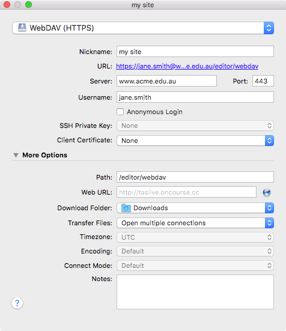
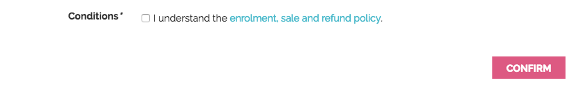

[[overview]]
== Customising onCourse Websites

Your onCourse Website is designed to be extremely flexible, allowing you to implement almost any concept you create for your site.
When you engage your graphic designer to work on your brand and website, you will want to make your onCourse website reflect your organisation at every level.
That means not only skinning the site to reflect your colour and logo, but thinking about navigation, search and the overall user experience (UX). onCourse has been built with this in mind.

At the same time, we want to save you time and money by giving you many of the basic building blocks you need to create your site.

If you are after quick simple results, skip straight to <<stylesheets>>
 and focus on changing just the stylesheets to get the look you are after.
A lot can be done with little effort in this way.
If you want to make changes to the structure of the site itself, read onto <<templates>> for an understanding on how to change the html which makes up the site.

If you are not a web designer and reading this manual, you may find many of the concepts quite technical.
Don't worry: you can still edit content using the online CMS without understanding anything here.
Your designer, or ish, will be able to work on the page design and create something into which you can drop your content.

[[overview-editing]]
=== Editing your site via WebDAV

While you can log into your CMS to edit content, to make more granular changes to the code or design of your website you'll need to use WebDAV.
This is very similar to FTP (File Transfer Protocol) except it makes it easier for us to encrypt your connection and apply special automatic rules and filters.

To access and log into WebDAV we recommend using any standard compliant application, like http://cyberduck.io[Cyberduck], which is free for use on Windows and Mac.
To configure a connection in Cyberduck, first click the Bookmarks tab, then in the bottom left of that screen, click the '+' button to add a new bookmarked connection.

A screen like below will appear:

Enter the following details:

* Server = the URL of your website
* Username = the username you use to access your site's CMS
* Path (located under the expandable menu More Options) = /editor/webdav.

Close the box.
If you've entered everything correctly, your connection will now appear in the bookmarked like.
Double-click your new bookmarked connection and you'll be asked to enter your password, which will be the same as the one you use to access the CMS. Once you have access you'll see your site's folder structure.

=== Draft site

All onCourse websites have both draft site and a live website.
The draft site will be visible to you only when you are logged into the Editor.
If your site is http://www.acme.edu.au, then you can log into the Editor at
https://www.acme.edu.au/#editor.
Any changes you make in the Editor or through WebDAV are only visible to you and any other users logged into the Editor.
You can make content changes and experiment in any way you choose without disturbing your live website.

Once you have finished with your changes to the draft site and are ready to publish them to the live site you can do this within the Editor.
The "publish" button can be found on the left hand side of the Editor panel.
Any changes made within either WebDAV or the Editor will be deployed to the live site when you press the publish button.
You'll need to wait a few minutes before the content is visible on your production site due to caching in our cluster of servers.
Some users may need to wait even longer if they have a local proxy server, which keeps a copy of the old site until it expires from its cache.

image::images/Publishing_your_site.png[title='How to publish your site']

[[specialPages]]
=== Special URLs

Some URLs in your site are reserved for special pages.
These pages are delivered by the onCourse software itself.
To customise them, consult the templates chapter for details of how these pages are created.
You cannot edit the content of the pages within the Editor because you will use the onCourse software to edit the courses, classes and other information which drives them.
These pages include:

/courses::
A list of all courses which are marked as web visible.
/courses/arts::
A list of all courses tagged with the tag "arts" from the "subject" tag group.
/course/ABC::
The detail of the course with code ABC.
/class/ABC-123::
The detail of the class with code ABC-123
/sites::
A list of all sites marked as web visible.
/site/12::
The detail of site with internal id 12.
/tutor/23::
The detail of the tutor with internal id 23.
/page/1::
Every page you make in the Editor will be given an automatic page number reference.
Even if you don't give it a nicer path, it will always be accessible by this URL.
/enrol::
All pages under this path are reserved for the enrolment, application and sales processing pages.
/cms::
All pages under this path are reserved for the cms engine.
/editor/webdav::
All pages under this path are reserved for webdav access.

[[specialPages-editor]]
=== Building Editor pages

Pages which are not 'special' are delivered from the Editor.
That is, you are able to create pages and assign them to any URL you choose.
Each page belongs to a website.
You can have more than one website for the same onCourse database.
Each page can also be given a theme which defines which blocks appear on the page.
Themes are then linked to layouts which defines the html and stylesheets used.
The following graph shows the relationship between the onCourse database, websites, pages, themes and layouts.

==== The database

Starting from the top of the diagram we have the onCourse database itself.
This is the application which contains courses, classes, tags, students, tutors, and so on.
The data in the onCourse database is entered completely within the onCourse client/server applications and is automatically synchronised with the website.

==== The website

Each onCourse database can drive one or many websites.
Each website will have one or more domains which are used to access them.
So Acme Training might have the general leisure learning site at http://www.acme.edu.au
and the corporate training at http://corporate.acme.edu.au and also
http://www.acme-corporate.com.
The leisure and corporate sites can have completely different content (pages), different graphic design (layouts) and even display different sets of courses.

==== The pages

The website is made up of pages entered through the Editor.
For full details on how to write and build web pages, consult the onCourse website and Editor handbook.
Each page has content (text, pictures, etc) and will be linked to a theme.

==== The theme

Themes are a way of grouping pages and giving them their own character, and are applied per URL path.

You can place blocks on a theme, so you might create a theme for policies, another theme for news, and one for general pages. The policy theme could then include a block on the right side with information for students about lodging complaints and contacting the principal. The news theme might contain a block down the left with a random 'hot' course and a block across the top with a rotating banner ad. Finally, the general theme contains a block on one side with navigation elements and assorted other blocks of special offers.

==== The layout

The final piece of this structure is the layout.
This is where you as a designer will weave your magic.
The layout is represented by a folder in the layouts folder you access in WebDAV. You can place templates inside that folder where each template overrides a certain piece of html on the page.
In this way you have full control over the entire layout and design of the site, right down to every line of html sent to the browser.

There is always a layout called 'default' which is used by the system for the special pages outlined above.
You can create as many layouts you like and link them to themes you create in the Editor.

=== WebDAV files

When you login into WebDAV you will see folders like this:

* pages
* blocks
* templates
** default
* s
** stylesheets
** fonts
** img
** js

In addition you will see a redirects.txt file that will contain a full list of the redirects on your website.WebDAV folders The `s` folder contains static files which are not parsed by the application server.
These include css, fonts, images and javascript.
Keeping things organised within the folders as provided will make everything easier, but you are free to create whatever additional folders you need to here.
Template overrides live inside the `templates` folder.
One layout is provided for you called default which you cannot delete.

You can edit pages and blocks directly from within WebDAV. The result is the same as if you had edited those same items from within the CMS.

=== Editing redirects in WebDAV

Any 301 redirects added to your site can be seen in plaintext format in the *redirects.txt* file, located in your sites root directory.
These redirects are structured with a `From URL` on the left, a `To URL` on the right, and a space seperating them.

301 redirects can be added in the Editor or typed directly into this file.

The redirects.txt file accepts 301 redirects that conform to the following structure:

* *"From" URLs* must point from a page on your site.
All "From" URLs must start with a forward slash "/"
+
Example:
** /
** /courses
** /contact/about-us
** /courses/business/business?tag=/business/accounting
* *"To" URLs* can point to another page on your site or an external webpage.
"To" URLs can start with a forward slash "/" (for internal redirects) , "http://", or "https://" (for external redirects).
+
Example:
** /
** /checkout
** https://www.ish.com.au/
* Each 301 redirect must be on a new line.
* The "From" and "To" URLs in a redirect must be seperated by a space.
"From" and "To" URLs must be on the same line.
+
Examples of valid redirects:
** /contact/about-us xml /contact
** /course/ABC123 /courses/
** /courses?near=2000 https://www.externalsite.com.au

If an invalid redirect is entered into the redirects.txt file, the file will not be able to be saved.

=== Video

Although it is possible to load video files directly into the static folder, the onCourse servers are not optimised for serving video.
You will get much better results by hosting your video at a site such as YouTube or Vimeo and linking to them from within your pages.
Not only do they have servers placed in data centres around the world, but also the allow streaming of video.

Alternatively you can upload video to the onCourse document management system and deliver it from there, however you'll have to create your own video player and tie them all together, so we still recommend one of the third party video delivery systems like YouTube or Vimeo.

=== Favicon

Some websites show a tiny icon in the URL bar and in bookmarks.
This is called a favicon.
To add a favicon to your onCourse website, you need an image in both '.ico' and '.png' format.
The standard is to have the .ico images in either 16x16 or 32x32 size, and the .png up to 180x180.

Both of these images have to be uploaded via WebDAV to the directory '/s/images' with the names 'favicon.ico' and 'apple-touch-icon-precomposed.png' (you can use any names for these images, but these are the convention).

Next, add the relevant html to the PageHead.tml file, found in the '/templates/' directory in WebDAV.

Adding the following lines (assuming you have named the .ico and .png files conventionally) should have web browsers auto detect and display the favicon images

[source,html]
----
<link href="/s/images/favicon.ico" rel="icon" type="image/vnd.microsoft.icon"/>
<link href="/s/images/favicon.ico" rel="shortcut icon" type="images/x-icon"/>
<link rel="apple-touch-icon-precomposed" href="/s/images/apple-touch-icon-precomposed.png"/>
----

=== Robots.txt

If you have specific pages on your website you'd like to stop search engines from crawling, you can manually add a robots.txt file to your WebDAV. There are, however, a few important things to note before you do this:

* You add the 'robots.txt' file to WebDAV, using a program like CyberDuck. The folder to place the file in is /templates/default/.
* You can add 'disallow' commands using the following syntax:

    Disallow: /room/200\n\
    Disallow: /course/abc123/\n\

* The content of your custom robots.txt file will replace the default robots.txt file, so you need to copy 'disallow' lines you want to keep from the default one before replacing it. You can do this by going to https://www.yourwebsiteURL.edu.au/robots.txt and simply copying and pasting all that text into the new robots.txt before adding your own entries.
* No additional 'user-agent' or 'sitemap' lines are required beyond the ones that are in the default robots.txt. You need to keep these in your new file as well.

Once you've uploaded the new robots.txt file to WebDAV, you'll need to publish the site from the CMS editor for changes to apply. Deleting robots.txt from templates again will cause the old robots.txt to regenerate.

=== Checkout

In order to help with styling the Checkout portion of the website, you need to first have a course added to the cart and add a student (move past the Add a Student page). Once these are done, you can appaend the following the checkout URL in order to see the Thank You/Confirmation page usually shown at the end of a transaction

    ?previewMode=true

If done correctly, the Thank You page should show, allowing you to style it without having to put through a transaction.

[[stylesheets]]
== Stylesheets

One of the first ways you'll want to modify the look of your site is by changing css stylesheets. onCourse comes with a set of default stylesheets to make your life easier, so you will probably start with a copy of our template-a, template-b or template-c.
These in turn build on our base stylesheets which we update once a year or so.

Because you are building on existing stylesheets, lots of things are already taken care of for you.
Your html/css developer can save weeks of work with our existing responsive layouts, grid and basic styling.

=== File structure

First let's see where all the files are.
To make it easier to navigate, all the CSS is broken up into lots of files within a set of folders.

Start inside the '*/s/stylesheets*' folder in WebDAV. You'll see two folders: 'css' and 'src'.
It is important that you do not edit the files in 'css' directly, but instead only edit the files in 'src'.

    /s/stylesheets/src/

Start by looking at the file site.scss.
That's the top of the stylesheet structure and it includes all the other files you need.
Look for lines like this:

[source,css]
----
@import "application/settings";
----

We recommend you create a new file with your customisations and add a reference to that from site.scss.
Don't remove the import of the 'base' stylesheets.
That import brings in the core stylesheet definitions which are required for your onCourse site: shortlists, course and class listings, enrolment templates and much more.
Override them however you want, but they will save you a lot of work rather than starting from scratch.

=== SCSS

If you didn't recognise the `@import` command above as CSS, that's because onCourse uses a variation of CSS called
http://sass-lang.com/documentation/file.SASS_REFERENCE.html[SCSS] (also known as SASS).
This extends the basic stylesheet concepts and adds some very useful abilities:nested rules, variables, mixins, selector inheritance

Every time you edit any file in `/s/stylesheets/src/`, the destination
`/s/stylesheets/css/site.css` is automatically regenerated by libsass.
This takes less than a second, so you can see the results almost immediately.
Remember that to see changes in the staging site you must be logged into the CMS in your web browser.
You should not edit the site.css file directly, as any changes you make will be overwritten.

If you don't want to bother with learning SCSS that's fine.
Just write ordinary CSS in the site.scss file.
As your stylesheets become more complex, you will find that SCSS gives you valuable shortcuts to achieving what you want and you will never want to go back.

If you would like to break up your stylesheets into more manageable pieces, add another import statement under the 'base' import like this:

[source,css]
----
@import "colours";
----

Then create a file `/s/stylesheets/src/_colours.scss` (with the underscore).
When you make changes to that file, onCourse will automatically merge any content from _colours.scss into the main css for your site.

Look through the default styles for variables which you can easily modify to change your site.
For example, override `$bodyFontFamily` in order to change the font right through your site.
Or change
`$primaryColor`, `$secondaryColor` and `$containerWidth`.

==== Bourbon

By default your stylesheets include Bourbon.
This css library gives you lots of useful functionality that you'd otherwise have to write by hand.
http://bourbon.io/[Read up on this library] and get instant rounded corners across all browsers, typography features, reset, and much much more.
As just one simple example

[source,css]
----
section {
  @includelinear-gradient(totop,red,orange);
}
----

will give you the following output

[source,css]
----
section {
  background-color:red;
  background-image:-webkit-linear-gradient(bottom,red,orange);
  background-image:linear-gradient(totop,red,orange);
}
----

without having to remember to put Opera, webkit, Mozilla and html5 elements into your css.
You don't need to use bourbon, but it can help you keep your site consistent across browsers more easily and save you time with common css blocks.

Read the http://bourbon.io/docs/[docs for Bourbon].

==== Compression

No matter how many separate files you break up your stylestyles into, the output will be compressed into one file and minified.
This means whitespace is stripped and the file is pretty hard to read.
However browsers will be able to parse it just fine; this minification can make a big improvement to page load speeds and also to your SEO.

Comments will be stripped out, so don't hesitate to put lots of useful notes in your scss files.

Finally we compress the file with gzip to serve it across the internet as fast as possible.
You'll see these output files as:

    /s/stylesheets/css/site.css
    /s/stylesheets/css/site.css.gz

==== Map

Because it can be hard to review minified and combined CSS in your browser, we also output a map file.
This allows Chrome and Firefox developer tools to identify the real file and line number in the source scss where your stylesheet rule can be found, saving you a lot of searching.
The map can be seen as:

    /s/stylesheets/css/site.css.map

Your browser will automatically find and use that file if it knows how.

=== Responsive design

It is extremely important in a modern world filled with tablets and smart phones that your site is built to make life easy for those users.
onCourse sites already are prepared with responsive designs at four sizes.
That means that as the browser window gets smaller with different sized devices, the design itself alters to work better at that size.
It is still up to you as a designer to properly take advantage of this responsive design, but the groundwork is already there for you in onCourse and the enrolment pages as well as skillsOnCourse are optimised already.

onCourse has media sizes of $small-screen, $tablet-screen and $desktop-screen throughout the base stylesheets and a grid based on bootstrap 3.

=== Bootstrap

Because we bring in http://getbootstrap.com/[bootstrap] 3 by default, you get not only a nice grid but also a lot of common component styles which are very useful.

[[javascript]]
== Javascript

=== File structure

Log into webDAV and look at the folder `/s/js/`.

In there you'll see a number of javascript files which drive your onCourse website.
Some are third party vendor supplied files and others are default parts of onCourse itself. site.js is the starting point and it has a list of all the other files which are included.
Note that the order of including files can sometimes be important.
Let's look at base.js now:

[source,javascript]
----
//= minify off
//= require base.js
//= require extra.js
----

This is telling you that minification is disabled and that the javascript files base.js and extra.js are included.
This is a different syntax to SCSS so don't get them confused.
The combined output file is called all.js and the files which are merged don't need to start with an underscore.

==== Minification

Unlike CSS, the javascript is not automatically minified.
This is because sometimes javascript minification can actually break your javascript (particularly if it contains errors).
Browsers will often manage to figure out your broken javascript, but once minified, errors really cause problems.

You can enable minification by changing the "off" to "on" and saving the file.
Wait about 30 seconds and then review your site in staging before pushing it to live.

We use the Google Closure compiler to verify and minify the output.

==== Compression

all.js.gz is automatically created and used by browsers.
This is another reason minification may not be quite so important: compression often does a pretty good job of reducing the file sizes.

=== Core libraries

We supply a number of third party javascript libraries with your site by default.
The following list are bundled together as dynamic.js and cannot be removed without breaking some key shopping basket functionality on the site:

* classnames
* react
* react-dom
* react-redux
* redux
* redux-thunk
* jquery 3.x

In addition there are some useful libraries which are often used when building sites:

* BxSlider 4.x
* jquery.customSelect
* jQuery Validation Plugin

You may wish to remove or add more libraries for your particular design

=== config.js

config.js controls the behaviour of the browser application parts of onCourse.
In particular, the checkout application that drives the shopping basket, enrol buttons, places available, discounts and the whole checkout and ecommerce engine. config.js can be accessed via WebDAV, and can be found at the path `~/s/js/config.js`

You can add the following variables to your checkout_config to change and customise the behaviour of the web application.
These variables accept strings in the form of the path to the web page you want to direct a student to.
Example:

[source,javascript]
----
var checkout_config = {
  "checkoutPath": "/checkout",
  "termsAndConditions": "/termsAndConditions",
  "guardianRequiredAge": 16
}
----

Important variables can be configured in the config.js file.

checkoutPath::
The path on which your checkout page lives.
You can point this to any page on your site, as long as you create that page in the editor and add the correct markup for the checkout engine to be displayed.

[source,html]
----

----

termsAndConditions::
A URL to outline any policies, procedures or terms and conditions a student must agree to.
On the payment page a checkbox is displayed with the words "I understand the enrolment, sale and refund policy." If you provide a URL in this variable, those words will be hyperlinked to that URL.

If you don't provide a value they will still have to check the option but there will be no link.

image::images/TandC_none.png[]

guardianRequiredAge::
Students under this age will be allowed to enrol, however the checkout process will prompt the user to enter both the student and a parent/guardian over this age.

In order for this to work, you should ensure you have set up your data collection rules to collect the date of birth as a mandatory field.
