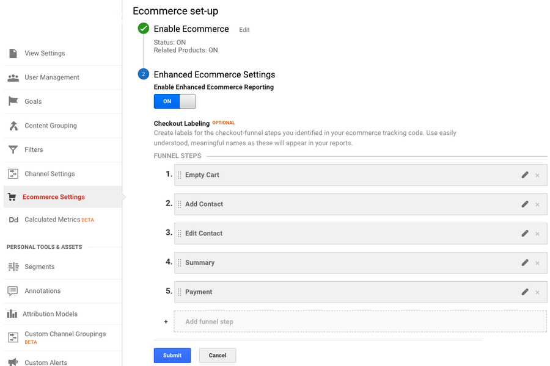

[[seo-overview]]
== SEO

onCourse is pre-configured with a whole range of SEO features to make your life easier and get good search ranking with minimal effort.

[[seo-copy]]
=== Copywriting
Although we take care of many of the technical details, there is absolutely no substitute for writing good copy. If you write descriptive text which is both engaging to potential students and incorporate the search terms that people will search for, you are well on your way to a successful website. Put these descriptions into:

* tags
* courses

Tags should be at least a paragraph and course descriptions should be 1-2 pages of copy. The first sentence of the course description is particularly important since it is used for the short description on the search results. Try to incorporate:

* aspirational goals. What will they gain from doing this course? Can they expect to advance their career? Will it be fun? Will they meet interesting people?
* what they will learn. Describe the outcomes in detail. Will it be challenging or easy?
* what should they bring? Do they need to prepare in any way?

Your goals are to:

* Get them excited about the content.
* Alleviate any concerns about difficultly. Give them enough information to feel confident about what will be expected of them.
* Explain the value proposition. What will they gain in exchange for their time and money?

Don't even think about SEO keywords until you can do all the above. There is no point in getting clicks unless you convert them into sales through engaging copy.

Next, log into Google Adwords (even it you aren't going to spend money with Google ads). Find the keyword planner and use it to understand what search terms rank for your site. Now add those words and phrases to your copy, but not at the expense of keeping your copy clear and engaging to humans.

[[seo-webmaster]]
=== Google search console

https://search.google.com/search-console[Google search console] (previously called Google Webmaster tools) is a useful resource for to you review aspects of your website.
Here you are able to see your site in the way Google sees it, understand how markup affects Google's schema parsing, and see which pages are indexed.
Its also an important place to tell Google if you've changed domain names, ensuring your SEO isn't left behind on your old site.

In order to log in, Google will give you an html file to upload to your site named something like `google4ddabfacdb4f6795.html`. Log into webDAV and put that file just inside the 's' folder, not inside any other folder. Publish your site for Google to be able to see this file.

[[seo-tagmanager]]
=== Tag Manager

Every site we build is created with Google Tag Manager integrated. This service drives the injection of javascript, tracking pixels and html into your site in really neat ways.

In particular it allows:

* Adding livechat systems to your site
* Facebook, Google and other tracking code
* A/B testing (show some elements to some people and not others)
* Different content for different country regions
* Inject advertising panels
* Javascript is asynchronously loaded (so it doesn't slow the page draw)
* Versioned changes (so you can roll back easily)
* Event tracking (such as add to shopping basket)

When we build your site, we'll give you access to Google Tag Manager, set up some initial Analytics tags for you, and get you started.
You can then build more tracking or hand over access to your SEO consultants. We will continue to need access to tag manager so that we can debug problems and update core code as needed.

[[seo-analytics]]
=== Google analytics

If you want to see how your site is performing, this is the tool for you. Typical analytics shows you page view, user demographics and much more, but onCourse injects even more data into your analytics:

* Transactional sales dollars.
Every sale through the website puts the dollar value into your Analytics. So not only can you see how many page views you got from that ad campaign, you can see the dollar value of the sales that generated. You'll discover that the two aren't always correlated. Do you care about ten thousand views from Facebook likes or the 200 real sales from a targeted campaign?
This is how you can tell the difference.
* Course and products.
Drill down in your data to see where sales are coming from. Getting lots of language course sales from an ad you placed on a friendly site? Great, now you know what works and where to focus your time and money.
* Events. Because we log "add to shopping basket" and other events, you'll be able to see who is engaging with your site but not following through to the end.
* Checkout steps. You can track each step in the checkout process through a Google Analytics acquisition funnel. See where and why people are dropping off.

==== Google Analytics Setup

In order to get data into your Google Analytics account you'll need to complete the following steps:

. Create a new https://analytics.google.com/analytics/web/[Google
Analytics] account (or use an existing one).
Under `Admin
> Property > Tracking code` look for the tracking id and make a note of it.
. Log into http://tagmanager.google.com/[Google TagManager] and find
`ish onCourse Google Analytics
settings` under variables.
Put your tracking id in there to replace the dummy one.
. Back in Google Analytics, you should soon be able to the Tracking Code status update to show data coming in.
Visit your website to generate a bit of traffic.
. Enable enhanced ecommerce reporting in the Google Analytics under
`Admin > View > E-commerce settings`
. Select names for your checkout steps

.. Empty Cart
.. Add Contact
.. Edit Contact
.. Summary
.. Payment
. Submit changes

When you have some time, explore the Analytics "goals" setup for ways to get useful information such as dropoff in your checkout rates.

===== Events

Events are sent to Google Analytics at various points in the checkout process.
Along with the event, onCourse sends a rich data structure which you can then report on.
The following steps are sent as events:

* Checkout step: 1 - checkout without any items in cart
* Checkout step: 2 - Add payer screen
* Checkout step: 3 - Edit contact screen
* Checkout step: 4 - Summary screen
* Checkout step: 4 option: Change Parent - change parent for child from summary
* Checkout step: 4 option: Add concession - add concession for contact
* Checkout step: 4 option: Add contact - add contact from summary
* Checkout step: 5 - Payment screen
* Checkout step: 4 option: Add a company - Add a company from payment screen
* Checkout step: 4 option: Add a payer - Add a payer from payment screen
* Checkout step: 4 option: Payment Page (Credit Card) - Payment Page Credit Card tab;
* Checkout step: 4 option: Payment Page (Corporate Pass); - Payment Page Corporate Pass tab;

Add or remove items from shopping cart:

....
dataLayer.push({
    'event': 'addToCart' | 'removeFromCart',
    'ecommerce': {
      'currencyCode': 'AUD',
      'add': {
        'products': [{
          'name': {{item_name}},
          'id': {{item_id}},
          'price': {{item_price}},
          'category': 'Course Class' | 'Product',
'quantity': 1,
        }],
      },
    },
  });
....

Set Checkout Page:

....
dataLayer.push({
    'event': 'checkout',
    'ecommerce': {
      'checkout': {
        'actionField': {
          'step': {{ 1 | 2 | 3 | 4 | 5 }},
          'option': "Init Checkout Process" | "Add Payer" | "Edit Contact Details" | "Summary Page" | "Payment Page"
        },
        'products': [{
         'name':{{item.name}},
         'id': {{item.id}},
         'price': {{item.price}},
         'category': 'Course Class' | 'Product',
         'quantity': 1,
        }],
      },
    },
  });
....

Set Checkout Page Option (something like sub page/phase):

At the moment we have options only for 4,5 steps

[source,javascript]
----
dataLayer.push({
  'event': 'checkoutOption',
  'ecommerce': {
    'checkout_option': {
      'actionField': {
        'step': {{ 4 | 5 }},
        'option': "Change Parent" | "Add concession" | "Add contact" | "Add a company" | "Add a payer" | "Payment Page (Corporate Pass)" | "Payment Page (Credit Card)"
      },
    },
  },
});
----

purchase:

....
dataLayer.push({
    'event': 'purchase',
    'ecommerce': {
      'purchase': {
        'actionField': {
          'id': {{ data.id }},
          'affiliation': 'credit card' | 'corporate pass',
          'revenue': {{ amount.total }}, // includes tax
        },
        'products': [{
         'name':{{ item.name }},
         'id': {{ item.id }},
         'price': {{ item.price }},
         'category': 'Course Class' | 'Product',
         'quantity': 1,
        }],
      },
    },
  });
....

When you're done setting up within Google Analytics, head over to the <<websiteSetup-analytics>> section to connect your analytics with your onCourse instance. You won't see any data from onCourse until this last step is complete.

[[seo-sitemap]]
=== Sitemap

We generate a /sitemap.xml file automatically which you can add to Google's webmaster tools.
This allows Google to quickly find all the pages on your site without crawling through them one at a time, and it also gives Google hints about when those pages are updated so that they are crawled more quickly.

onCourse will let Google know that this sitemap exists using a special entry in the robots.txt which is also generated.

[[seo-markup]]
=== HTML markup

The html markup of your site is customisable throughout, but by default you get some robust templates that Google will love.

==== Semantic HTML

By building the html of your onCourse site with a clear structure and meaning, search engines such as Google are able to make sense of the structure and meaning. onCourse comes with good html that gives you a good starting point.
For example, each page should only have a single h1 element, sections, footer and other modern html elements.

==== Accessibility

Although this is not strictly an SEO benefit, adhering to
https://www.w3.org/TR/WCAG20/[accessibility standards] means that students with disabilities such as poor sight will be able to access your website more easily.
This goes hand in hand with good semantic HTML and also means that Google and other search engines will properly index your site and understand the content structure rather than just index a mass of words.

==== Schema.org

Schema.org is a set of markup rules endorsed by Google and other search engines.
It specifies ways to annotate the html to give it specific meaning allowing Google to create rich search results.
For example, we can markup data so that Google can provide navigation structure, course dates, prices and other information right in their search results.image::images/schema-results.png[]

[[seo-nav]]
=== Navigation

The navigation and structure of the site's page are important to good search results.

==== Canonical links

Some pages in your onCourse site don't last very long.
In particular, the class pages with a URL like `/class/ABC-123` will be irrelevant as soon as that class is finished.
You don't want to accumulate page rank on these pages, only for that to evaporate. onCourse automatically adds a canonical link to the correct course page, transferring any page rank and inbound links to somewhere it will do good.

Canonical links are generated for all pages:

For pages created using the editor, the canonical link is the page URL set as default

For pages of Course and Class canonical link = https://website.com/course/course_code

For pages of Product canonical link = https://website.com/product/product_skuCode

For pages of Site and Room canonical link = https://website.com/site/site_Id

For pages of Tutor canonical link = https://website.com/tutor/Id

For Web static pages like canonical link = https://website.com/page_url

The canonical link will also follow the rules described above if you use redirects. Example:
Page: Memberships (URL = https://website.com/memberships)
Redirect: page/tutors → page/memberships
Canonical Link = https://website.com/memberships (because we render Page membership)

==== URLs

onCourse has clean URLs which are easy for users and contribute to your SEO. All course detail and list pages contain the word "course" and you are free to create long course codes which contain useful SEO keywords.
And your tag structure can be structured however you want.. For example, a URL like "/courses/business/communication" picks up several important keywords.

==== Redirects

If you ever change URLs it is vital that you don't lose page rank on those old pages.
While you don't need to worry about classes, tags and course pages can accumulate valuable scores and you should implement redirects to the closest new page.

[[seo-meta]]
=== Meta headers

onCourse does not implement meta-keyword headers since it is well documented that no search engines use them for indexing.
However we do implement:

* og:image for course and class detail pages.
The image is pulled from the first attachment of the appropriate type (jpg/png) linked to the course.
* og:type is hardcoded to "website" to satisfy Facebook.
* og:description and meta-description.
The contents of this field is automatically populated from the beginning of the text in the course description or page content.
Special formatting is stripped out (eg.
headers and images).
For this reason, it is useful for you to ensure the first paragraph of text is relevant and well written.
* Page title (and og:title) is constructed using the name of your college and other details such as the name of the course or tag, or the name of the page.

These tags are useful for both Facebook, Bing and Google, helping you display better search results from data discovered by each of their crawl engines.

Should you wish to customise the behaviour of how onCourse inserts meta headers you can do this in PageHead.tml.
You can customise the page title in Title.tml

[[seo-tls]]
=== SSL/TLS encryption

Google has indicated that sites with end-to-end encryption will get higher search rankings since they are more likely to be ligitimate sites which care about the privacy of their users.
All onCourse sites redirect immediately to HTTPS for even the non-payment gateway parts of the site.

[[seo-speed]]
=== Page speed

A lot of effort goes into making onCourse really fast, even when displaying faceted search results from thousands of courses.
We use separate SSL/TLS load balancers to remove encryption load from the application servers, we cache database requests and page rendering, and use Apache Solr as a high speed search cache.
We also offload large image serving to a third party AWS S3 storage, again increasing the speed with which your site displays.

The end result of all this is that search engines give your site bonus points for being fast.
Which is good.
