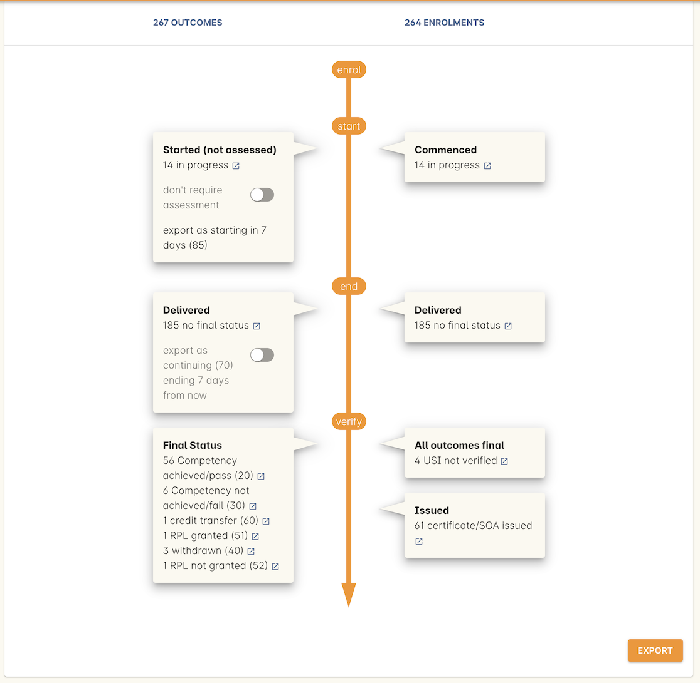

[[AVETMISS8]]
== AVETMISS

=== Navigation

To access the AVETMISS Export window, search for Export AVETMISS 8 in the navigation search.

Below is the AVETMISS runner window where you select your type of reporting you need to do--known in onCourse as 'Flavour'--as well as confirming the data you need included in the export.
Click the 'Flavour' box to show a drop-down of all the possible selections.

You need to ensure you select a date range from the 'Outcomes in progress during' box.
You can select from a preset date range or year, or choose 'custom date range' and choose your own date range.
Note: it is STRONGLY recommended you do not select an end date for your date range that is in the future.
You can also choose to include all outcomes that might be outside your selected date range, but are linked to the same enrolment.

Once you've selected your flavour, the data sets to be included and chosen a date range, the 'Find' button will become active.
Once you select this, the button will change into a loading spinner and the query will run.

Once the query has run, you will be presented with a breakdown of all the query's findings.
You can review the findings here, and if you're happy with them, hit Export.

The export itself can take some time to run and varies from database to database depending on size.
Once it's complete, the ZIP filw will download in your browser, and you can access it from your Downloads folder.

=== VET Provider Collection Specifications

==== Training Organisation (NAT00010) file

All the data in this file is collected in the onCourse general preferences window.
Go to File > Preferences > General.
Select the AVETMISS tab and enter the contact details of your business.
It is important your RTO Identifier and name match the details recorded on training.gov.au

==== Training Organisation Delivery Location (NAT00020) File

These are your onCourse sites.
Set up each site where you deliver training and enter the address details.
You can ignore the latitude and longitude fields. onCourse will require you to create at least one room for each site (this has nothing to do with AVETMISS, it is part of our timetabling feature) so to make it simple, give each site a room with a generic name like 'default'.

It is important to ensure that each Australian site you create has an address with a State, Suburb and Postcode that matches a value in the Australian Postcode data file.
Sites in other countries will automatically export OSPC for the postcode value.

The site you have designated as your Admin site in onCourse will be the site any self paced classes will be reported at.

==== Program (NAT00030) File

This information comes from the Qualification data entered into the Course VET tab where the option 'Satisfies complete qualification or skill set' is ticked.
Qualification Certificates you create in onCourse also will add records to the NAT00030 file.
Each Qualification or Skill Set will only be added once.

If your delivery includes any locally recognised skill sets, qualifications or courses (i.e. not from training.gov.au) then a NAT00030A file will be generated instead of a NAT00030. This file contains the same rows, but each record has additional fields.
If you are delivery includes a Smart and Skilled Skills Group, for instance, you will generate a NAT00030A file.

==== Subject (NAT00060) File

Records that form this AVETMISS file are collected from the units or modules you add to your courses, or manually add to student's enrolment records or prior learning records.
Each unit you deliver is only added once to the NAT00060 file, regardless of how many times you deliver it.

Non-accredited courses, both VET flagged and not VET flagged also add records to this file, using their course name and a random ISH code designator.
You will also see these 'dummy' modules added to the student enrolment record.
On the VET tab of these courses, you can set the Reportable Hours (Nominal hours in the export) for these courses and a six digit Field of Education ID. If you don't set these values, the nominal hours will be calculated from the class delivery hours and FoEID reported as 129999. Only some types of providers are required to report this non-accredited enrolment data under the AVETMISS standard.
If you are not required to report this data, then there is no need to add Reportable Hours or Field of Education data to your course.

==== Client (NAT00080 & NAT00085) File

Client AVETMISS files are created from onCourse contact records who have an outcome whose dates match the reporting period you've selected on export.
Unique client identifiers are auto assigned and called 'Student Numbers' in onCourse.
You don't see these in the contact detail other than in the header bar, but you can search on them from the contact window advanced search if you later get a validation error for one of your clients.

The Unique Student Identifier (USI) is reported in the NAT00080 file for each student engaged in Vocational Education and Training.
Students who have only attended non-vocational courses do not need to have a USI supplied for AVETMISS reporting.
As of 1 January 2017, students studying AQF units will be required to have a valid USI. If you do not have a value in the USI field of the NAT00080 file the AVS Validation will generate an error.

[NOTE]
====
Any students with a 30/31/32 set as the funding source in any associated outcomes will have their postcode set as OSPC in these NAT files.
All other students will have their standard postcode export.
====

==== Disability (NAT00090) File

This information is taken from the disability info on the student's contact record.

==== Prior Educational Achievement (NAT00100) File

Information for this is taken from the prior learning field on the student contact record.

==== Enrolment (NAT00120) File

Student specific information is taken from the enrolment, other information is taken from the preferences, class, course or funding contract as per above.

==== Program Completed (NAT000130) File

This information is taken from the certificates crated in onCourse.
Some states will include information from the enrolment as well.
