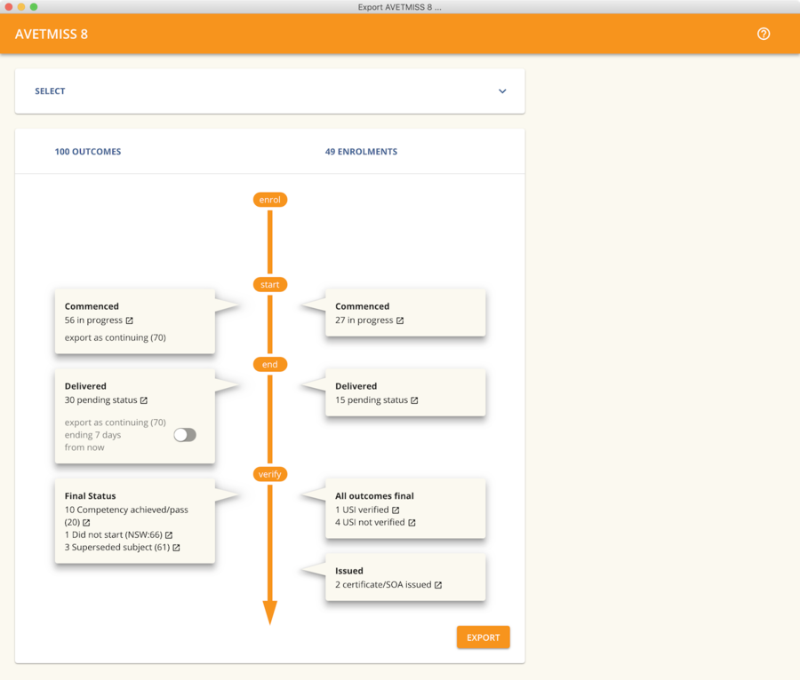
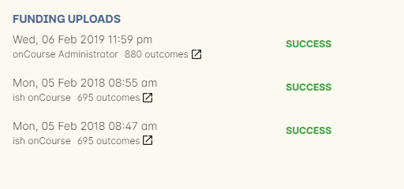
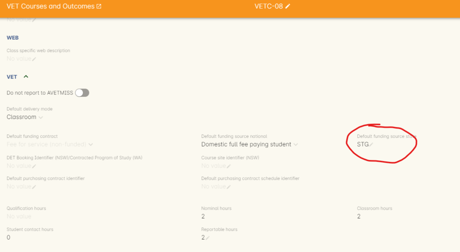
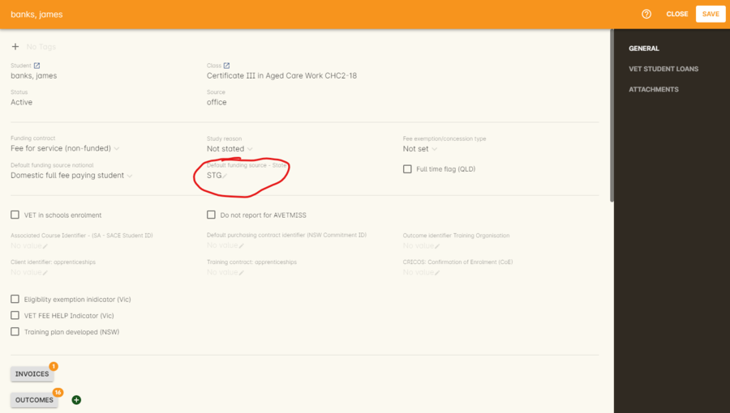
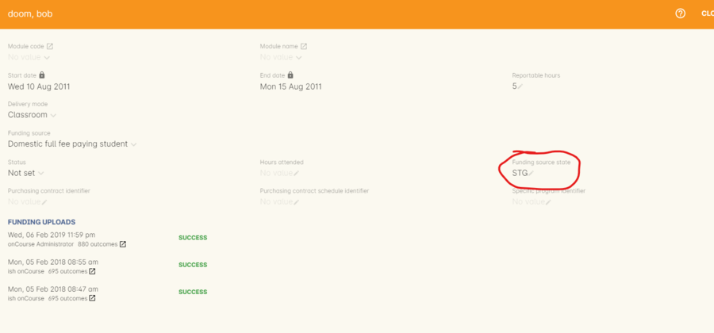
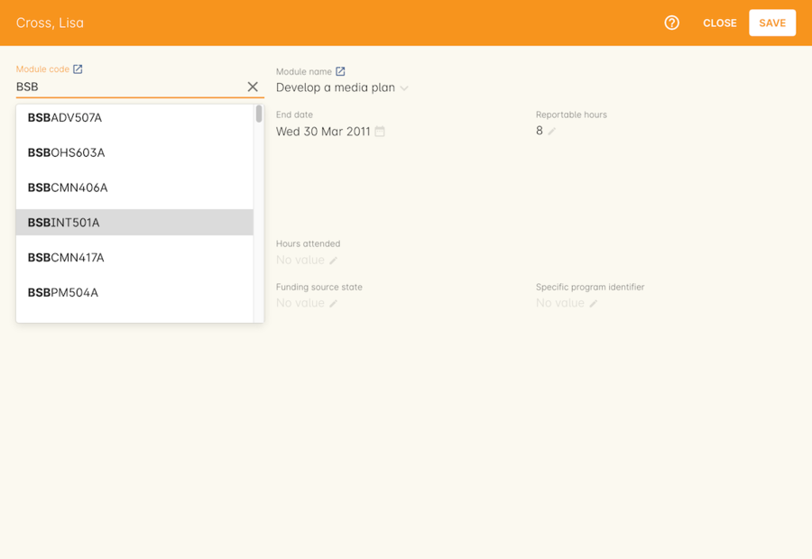

[[AVETMISS]]
== AVETMISS Reporting

This chapter looks at the AVETMISS reporting process in onCourse, including how to extract your data from the system, and how to navigate the different choices and selections you can make from the AVETMISS export window.

[[AVETMISS-AVETMISSExports]]
=== AVETMISS Exports

There are a number of ways to export your data in onCourse, however the easiest and best way is to do so directly from the Export AVETMISS 8 window.

. On the Dashboard, type 'AVETMISS' into the search and select Export AVETMISS 8
. Select the AVETMISS Flavour you wish to report. Total VET Activity will be NCVER (Standard AVETMISS).
. Select the funding courses and fee for services state training you wish to include. Not all states require you to lodge your Total VET Activity with NCVER, particularly if you already have a funding contact. The NCVER (Standard AVETMISS) Flavour is only accepted by NCVER and NT. Every other state has its own variations.
. Enter the date range for your AVETMISS data. By default, the dates will be the recent or previous calendar year.
You may also select a custom date range if you wish. Then push the Find button to run your initial query.
. If you run both VET and non-VET training, you may choose to export only VET courses. Non-VET training can be exported under the AVETMISS standard as needed, by ticking the 'non VET' checkbox but for Total VET Activity Reporting it can usually be excluded.
. If running Total VET activity, do not check the option 'include all outcomes linked enrolment'.
This is used for funded training.
. You can optionally select to export all completed but not yet set outcomes with continuing enrolment (70) by pushing the end date forward by 7 days. This is useful if you have students who have not completed their training on time according to their original schedule. However, for Total VET Activity, these students should have completed or actually have their end dates manually moved. You can use the find related icon next to "x completed VET outcomes need a status' to open a list of the outcomes affected and modify the end date manually or set a final status if available.
. Outcomes that are still in progress will be automatically exported as 70. A count of these is provided.
. The export runner will also indicate the total number of outcomes you have selected.
. Click Export to complete.

The export will download a ZIP file containing all the generated files.

If you have activated a default or custom funding contract in onCourse, you can use this to pre-select the enrolments during export.

. On the Dashboard, type 'AVETMISS' into the search and select Export AVETMISS 8
. Choose an export location. The location MUST be on a local drive, you cannot export to a folder on a network drive. The 10 text files will then be created here in a folder ready to be submitted to the government reporting agency of your choice.
. Select the AVETMISS Flavour for the lodgement e.g. STSOnline(NSW)
. The AVETMISS export flavour chosen will auto select all Funding contract enrolments from the contracts associated with that funding. You can tick additional checkboxes as needed. Funding Contract types are discussed further <<fundingContract, in the Funding Contracts Chapter>>.
. A note on non VET data: Some training contracts, like CSO include non Non-VET training courses. If you have set the Funding Source for these courses, the VET and non-VET data will be included. However, if you tick 'Non-VET' training here, you will export all your non-VET data - not just the non VET data attached to the funding source. It would be rare you want to do this.
. Enter the date range for your data. 'Commenced outcomes' is usually the preferred choice for funding contract data.
. When running a funded export, you often need to select 'include all outcomes linked by enrolment' as this collects the additional outcomes associated with the funded enrolment that may fall outside the outcome date range selected.
. You can optionally select to export all completed but not yet set outcomes with continuing enrolment (70) by pushing the end date forward by 7 days. This is useful if you have students who have not completed their training on time according to their original schedule. You can use the find related icon next to "x completed VET outcomes need a status' to open a list of the outcomes affected and modify the end date manually or set a final status if available.
. Outcomes that are still in progress will be automatically exported as 70. A count of these is provided.
. The export runner will also indicate the total number of outcomes you have selected.
. Click Export to complete.

You should use the Funding Contract feature instead of this method for exporting, however if you need to export a small specific group of records, this feature may be useful.

Sometimes you may wish to export one or a select group of classes only. You can do this from the class window.

. Open the class window and run the query or filter to return the classes you wish to export
. Highlight from this list the classes you want to export
. In the cog wheel, select AVETMISS export
. Select the funding contract or requirement you are exporting for. You can choose to define a date range for the export at this point, or leave it blank. Choosing a date range will restrict to exporting the outcomes from the class that start or end between the date range. If you leave the dates field blank, all outcomes from the class will be exported. Note: Outcomes from cancelled classes or enrolments will be exported, if their outcomes were retained during the cancellation process.
. Your files will be downloaded to the browser.

You should use the Funding Contract feature instead of this method for exporting, however if you need to export a small specific group of records, this feature may be useful.

Sometimes you may wish to export one student's enrolment only, or a selected group of enrolments. You can do this from the enrolment window.

. Open the enrolment window and run the query or filter to return the enrolments you wish to export. You can search on items like contains 'NSW Commitment ID', to find all Smart & Skilled enrolments, or Funding source - state begins with CS to find all CSD/CSR coded enrolments for the CSO program.
. Highlight from this list the enrolments you want to export
. In the cog wheel, select AVETMISS export
. Select the State or requirement you are exporting for. You can choose to define a custom date range for the export at this point, or leave it blank. Choosing a date range will restrict to exporting the outcomes from the enrolments that start or end between the date range. If you leave the dates field blank, all outcomes from the enrolments will be exported. Note: Outcomes from cancelled classes or enrolments will be exported, if their outcomes were retained during the cancellation process.
. Your files will be downloaded to the browser

[[AVETMISS-reporting]]
=== Explaining the AVETMISS runner choices

Flavour:: This AVETMISS variation type you want to export. Often these variations are based on State.

Select enrolments from:: This directs the export runner to chose certain enrolments based on their Funding Source. If you haven't set any funding sources, all your courses will be Fee for service VET (non-funded) by default.
For 'Fee for Service', you can further refine by delivery state. You can select multiple options here.

Date range:: The options available here are date based and will collect the OUTCOMES that fall into this date range:

Commenced Outcomes:: all outcomes that have a start date in the past from the chosen enrolments. Be careful choosing this with 'Fee for service VET' or 'Non VET' as you will export every outcome ever created in your onCourse database. It is better chosen in combination with a specific Funding Source.

Previous calendar year:: this will show in the drop down as a date range like '2017 year'

Previous calendar quarter:: this will show in the drop down as a date range like '1 Jan 2018 - 30 April 2018'

Custom date range:: this will display two text fields where you can enter your own start and end dates.

[NOTE]
====
AVETMISS reporting is designed to report data in the past, so your date range end should be no later than today.
The end date is considered to be 'Reporting as of' date, meaning that the exported data will be true to how it was set as of the end date in this field.
====

Include all outcomes linked by enrolment (Checkbox):: When running a funded export, you often need to select this option as this collects the additional outcomes associated with the funded enrolment that may fall outside the outcome date range selected. For example. when reporting to Smart and Skilled, you must always report all outcomes associated with the funding, even if they haven't yet commenced, or completed in the past. This option is only available when you run the AVETMISS export from the Export AVETMISS 8 window directly. It doesn't display when running from the cogwheel, as all outcomes from enrolments are always included.

History:: This section shows you a list of the most recent AVETMISS exports to be run on your system, allowing you to run them again or review the outcomes exported by each. You can also set a status for each–either Success, Fail or Unknown–so you can tell in the future which extracts were reported successfully. You must set this manually; the next time you open the AVETMISS export window after running an extract you'll be asked a question about your previous export, whether it was successful, failed or outcome unknown. Once you choose an answer the export will be 'filed' in the History section as the most recent export, and display the time of the export, the number of outcomes, the user who ran it and the success/failure flag.

These records will last in the system dependent on how they're flagged. Exports flagged as Success will remain forever, while those set as Unknown will remain for 28 days. Any set as failed will only be stored for three days.

[NOTE]
====
Any outcome that is reported as a part of a funding upload that is listed as 'Success' or 'Unknown' will be locked.
====

Other options will appear once you have made your initial query (after hitting the 'find' button), these are outlined below:

Outcomes & Enrolments Count:: The exact number of outcomes, and their attached enrolments, will appear at the top of the new window. Check this number matches the value you are expecting.

Status Breakdowns:: Each outcome status has an individual breakdown showing the number of outcomes to be exported with this status. Click the 'open related' icon to the right of the number count to see a full list of each outcome with this status.

Delivery - xxx pending status. Export as continuing (70) ending 7 days from now:: If the AVETMISS pre-run checks find outcomes that ended in the past where you haven't set a final status, you can automatically push the outcome end date forward by 7 days and report a 70. This does not change the outcome end date in onCourse, only for the data in the export file. The find related icon here also allows you to open the records in question and actually set a final outcome status if required. Note that if you have set an export end date in the future, this setting will not make much sense. e.g. If I have an outcome that was due to end next week, it would be reported today as an in progress 70. If I set an outcome end date of the end of the calendar year, the outcome is considered to have been completed, but not properly finalised. *Moral of the story - don't set an export end date after today's date unless you want some funky data issues.*

Final Status:: This is a breakdown of the number of different outcomes included in the final export data. This window, in fact the whole screen, is a useful tool to review the data before you generate the file, so you can visually see any possible issues before you submit to AVS. If you do spot anything out of the ordinary, you can click the 'open related' icon to the right of each record to see an overview of each outcome included with that status.

=== History

When you run an AVETMISS export, a history of the upload is stored in the History section of the AVETMISS Export window. When you open the export window after running an export, you'll be asked whether the previous upload was successful or not, and will record the answer. This section also allows you to change the status of the export to record if it was successfully exported (and uploaded) to NCVER or your funding provider, or if it failed. By adding this information to onCourse, you will have a history stored of each time you export your data as is required under various contractual arrangements, and can access the same exports more quickly in the future by simply clicking the 'run again' button next to the export you wish to run.

Each funding upload record shows how many outcomes were exported. You can use the find related option to look at the outcomes that were exported. _Please note: the outcomes may have been changed in onCourse since the export was run - when you use the find related option you are looking at the outcome values as they exist right now - not at the time of the export._

When opening the export window, if you've run an export in the past you'll be asked to let the system know whether the upload to the reporting body was successful, failed or unknown. This lets you keep a centralised record of previous exports and whether they were successful or not, which can be useful when needing to report again in the future, letting you access them again quickly.

An access right control exists for this feature, so each user who needs permission to view or edit these records must have the appropriate access right assigned.

==== Outcome funding history

From within an individual outcome record, you can review which funding uploads this outcome has been included in by looking under the Funding Uploads heading. It will show you a list of AVETMISS 8 Exports this outcome was included in, when the export was run, who it was run by, the number of other outcoimes included, and the success flag of the export.

[NOTE]
====
If the outcome is included in a funding upload that is flagged as 'Success', you will not be able to edit that outcome any further as it is considered reported and therefore unchangeable.
====

[[AVETMISS-FAQs]]
=== AVETMISS FAQ

==== Can I stop a class and all its students being exported for AVETMISS?

Yes. In the class VET tab, select the option 'Do not report for AVETMISS'.

==== How about a single enrolment, can't I stop that also?

Yes. In the enrolment general tab, select the option 'Do not report for AVETMISS'. This is something you may need to do if reporting a withdrawn Smart & Skilled student in NSW.

==== Where do I enter the State Funding Codes in onCourse for the state where I am reporting to?

There are three places where you can set your state funding source codes; the Class level, then the Enrolment level, and the Outcome level. This data is semi-hierarchical, meaning anything set at the Class level will be mirrored at the Enrolment and Outcome levels for any new enrolments taken for that class, but won't change any previously taken enrolments. When you set a funding source at the Class level, this makes it the default code for all associated enrolments and outcomes moving forward, but does not change any existing enrolments.

To update the state funding source code at the Class level you'll need to open the Class record, navigate to the VET section and then enter the code into the Default funding source state field. You will need to make sure you have an up to date list of the appropriate State Funding Codes to use within your reporting state. onCourse doesn't maintain a list of these codes, you will need to contact your local reporting officer to obtain this information.

If a student has a different funding code which applies to them, you can just change their enrolment or outcome funding codes to make it different to the one set at the class level. If all students in the class have different funding codes, you don't need to set anything at the class level, but can set each enrolment or outcome separately.

For the Enrolment level:: Find and open the enrolment record, then add the code to the 'Default funding source - state' field.

At the Outcome level:: Find and open the outcome, then add the code to the 'funding source state' field.

You can also override these values in the outcome, where needed E.G. if the student had funding to complete some outcomes but not others. Just go to the correct outcome record using the find related tool and amend the field, then Save it.

==== How do I record a student's outcome who has completed a different elective from the rest of class?

Once you have set up the outcomes at the Course level, every student enrolling in a Class from that Course will have all the outcomes applied to their record. If a student chooses a different elective from the one you have set at the course level you can change their outcomes at the enrolment level. That way it is linked to a different Unit of Competency.

To update, edit, add or remove an outcome at the enrolment level, go to the Enrolments window, find the enrolment record for the student you wish to update and double-click to open it, then click the Outcomes button. It will take you to the Outcomes window with the appropriate outcome records available. Open the record, make your edits and then click the Save button.

If you wish to add or delete an outcome from the student's record, you need to do this from the Enrolment Outcome tab. You will see a + and a - button in the top right-hand corner. Use these to add or delete outcome records as required.

==== How do I record information about a clients traineeship?

When a student is completing a traineeship, you will have been given a 'Training Contract Identifier' and a Client 'Identifier' by your state funding body. They may call them by different names, but the important thing to confirm is that they are the data that exports into the NAT000120 in positions 70 & 80 respectively.

This data is entered into the onCourse enrolment window. This data will need to be entered after enrolment by going to the Enrolment window, locating the student's enrolment record and double clicking on it. On the general tab you will find these fields.

In NSW, you will need to put your Training Contract ID into BOTH of these fields, as NSW doesn't issue a separate Client Identifier for trainees.

If you have broken the traineeship into multiple enrolments, each with one or more units of competency, you will need to enter this information into each enrolment record for the student that relates to the traineeship. This information is not recorded as part of the student's master contact record, as the student may also have other enrolment records which don't form part of this traineeship.

==== Why do some outcomes in the NAT000120 export with start and end dates of 00000000?

This is a date that has not been defined, e.g. instead of exporting an eight digit date like 01012012, it has exported no date, or a string of zeros as placeholders.

What this means is that the class the outcome belongs to has no sessions defined.  With no sessions, there are no start or end dates available. Also, if you have a self paced class where you have not defined the duration, the start date will be the date of enrolment as usual, but the end date will default to 12 months after the start date.

Look for any unscheduled or self paced classes in your onCourse records, and add either some session information or manual start and end dates to each outcome in the class.

==== Why, in the AVETMISS export, do my non-VET courses have codes like ISH123?

In onCourse version 5.0 we increased the Course Code field length to 32 characters, to give onCourse Web users more SEO choices for the URL that was created for their course page.

The AVETMISS standard NAT00060 allows for up to 12 characters in the 'subject identifier text'.
We also have some users who have to report to other government bodies which further restrict them to using 8 or 10 of these available characters only as they append their own codes to this field.

While we require course codes in onCourse to be unique, if we only exported the first 8 characters of user defined course code, we could very easily end up exporting two courses with duplicate codes that then causes an AVETMISS validation error. Take, for example course codes ComputerClassSeniors and ComputerClassOpen, both which are valid in onCourse and create good URLs like www.mycollegename.com.au/course/ComputerClassSeniors and www.mycollegename.com.au/course/ComputerClassOpen.

Exporting the first 8, 10 or 12 characters for these courses would give us the identical code 'Computer', 'ComputerCl' or 'ComputerClas', all of which would be duplicates. Instead of this possible duplication, we export a made up code that will look something like ISH123 and will not ever create duplicate records in the export.

Keep in mind, that for courses that aren't linked to training packages, the code reported in AVETMISS here has no meaning at all - it just has to be a unique identifier within your organisation. These 'made up' codes only affect your non-VET courses - real VET enrolments are always referenced to the unit(s) of competency the student enrolled in.

This does mean if you need to follow up another sort of validation error referencing an enrolment in ISH123 you'll need to check your NAT00060 export file to see that ISH123, for example is the export code for the course with the name 'Introduction to Computers for Seniors'.

As always, we walk the line in meeting the best business, sales and marketing functions for your college AND meeting the AVETMISS requirements in the most non-onerous way we can. Where these two needs conflict, we will try and code our way around it in the export process so we that don't stop you doing what you want in the onCourse software.

==== How does prior learning affect AVETMISS reports?

Prior learning records only export from AVETMISS exports run directly from the Export AVETMISS 8 window. They will not export from the cogwheel option in the classes or enrolments window, because they are not associated with either a class or an enrolment, but instead are attached directly to the student.

When you create a prior learning record with one or more outcomes attached, and the start and end dates of the prior learning outcomes fall into the 'outcomes after' to -'outcomes before' date range set in the AVETMISS export runner, then the data associated with the prior learning record will export.

At a minimum, to create successful AVETMISS files your prior learning outcomes need, in addition to a start date and end date, an outcome status. All other values are optional.

If a Delivery Mode is not set, 'classroom based' will export as the default, unless the outcome has an RPL status, in which case the delivery mode ' not applicable' will export.

If the Funding Source - national is not set, then the default funding source set in the college preferences will be applied.

If the prior learning record was linked to a qualification or skills set, then the Commencing Program Identifier will export as '3 - commencing enrolment', otherwise it will export as '8 - module only enrolment'.

If the prior learning record was linked to a qualification or skills set, then the Study Reason Identifier will export as '11 - other reasons'.

The VET in Schools flag will always export as No.

The training location for all prior learning outcomes will be set to your college default administration site address.

==== How can I add the outcome 85 to my AVETMISS data?

This outcome is not available in the drop down list to set in onCourse because it is a transactional outcome status, not a final status. Transitional statuses are outcomes that change over the duration of the student's study and just have meaning related to the outcome start and end date, like 'in progress' or 'not yet commenced'. 85 means 'Not Yet Started' therefore, the outcome start date is after the day you run the export. If your start and end dates are set to represent the student's intended training plan, 85 will export automatically where it is the only correct value. The same process applies to '70 - Continuing Activity', where the outcomes start date is before today and end date is after today.

==== I set an outcome status in onCourse, but something different came out in the AVETMISS export. Why?

onCourse includes advanced error correction in the AVETMISS export process to reduce the error rate during the reporting process. For example, if you have an outcome end date after the export end date (or today, if you have entered no export end date), then the only valid outcome is '70 - Continuing Activity' because the outcome is still in progress. If you have set a final outcome, like '20 - Competency Achieved' but the end date is in the future, then 70 will be exported because it is the only valid status for the date range.

Note that if your tutors use the SkillsOnCourse portal to set outcomes, it will automatically set the outcome end date to the day a final status is set, reducing the instance of this issue.

==== Why can I add the outcome 70 to my AVETMISS data if it applies automatically when it's required?

For the management purposes of enrolments with complex and changing training plans, some organisations like to manually set 70 to indicate a student has actually commenced their scheduled training, and leave the outcomes that are yet to commence as 'not set'. This can be a second process check along with ensuring the training plan dates in onCourse are accurate.

There is no need to ever set 70 in onCourse for accurate AVETMISS reporting, but you can set 70 for other, internal data management, reasons.
