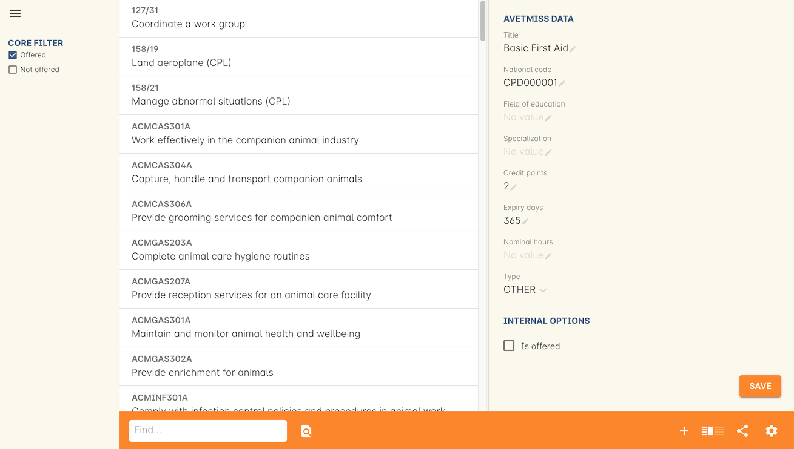

[[cpd]]
== Continuing Professional Development

Continuing Professional Development, or CPD, refers to industry-related training, learning and development that keeps professionals engaged and up to date with developments in their industry. In some cases a certain number of hours or points of student are a requirement to renew a professional license each year, especially in health, legal and accounting industries. It is sometimes called Continuing Education (CE) or Continuing Professional Education (CPE) in different countries.

=== CPD and onCourse Modules

In onCourse, points for CPD are set up against a module/unit of competency record, found in the Units of Competency window. If you want to track or apply CPD points to a module, it's recommended that you create your own module first and apply the points and expiry days, you can learn how to do that in our <<rto-createModules, RTO chapter>>.

Both CPD points -- referred to as credit points in onCourse -- and the expiry days are set directly within the unit of competency record, and both of these will filter through to certificates. The best example of where this is useful is with first aid certificates; these usually have an expiry date attached to them. Setting the expiry days field in the first aid modules delivered will allow those expiry dates to flow automatically down to the certificate.

==== Adding credit points and expiry days to a module record
To add credit points or expiry days, simply go the Units of Competency window, find the record that you wish to add the details to and enter the data into the fields, then hit Save.

* *Credit points* - enter the number of points to be acheived for completing this module successfully
* *Expiry days* - enter the number of days the CPD points are valid from completion e.g. for a year you'd enter 365 days, for 3 years you'd enter 1095.

The other fields are not essential for CPD.

=== CPD and Certificates
When students want a physical representation of their CPD achieved through one of your courses or activities, you can use <<certification, an onCourse certificate>>. Specfically, a statement of attainment style certificate will show the name of the modules completed along with the CPD points achieved.

These certificates can also utilise <<verifyVET-certificates, our certificate verification portal>>, which uses <<rto-qr, onCourse generated QR codes>> to verify the authenticity of a certificate against the data in the onCourse system, giving you confidence that the information presented on the certificate is genuine.