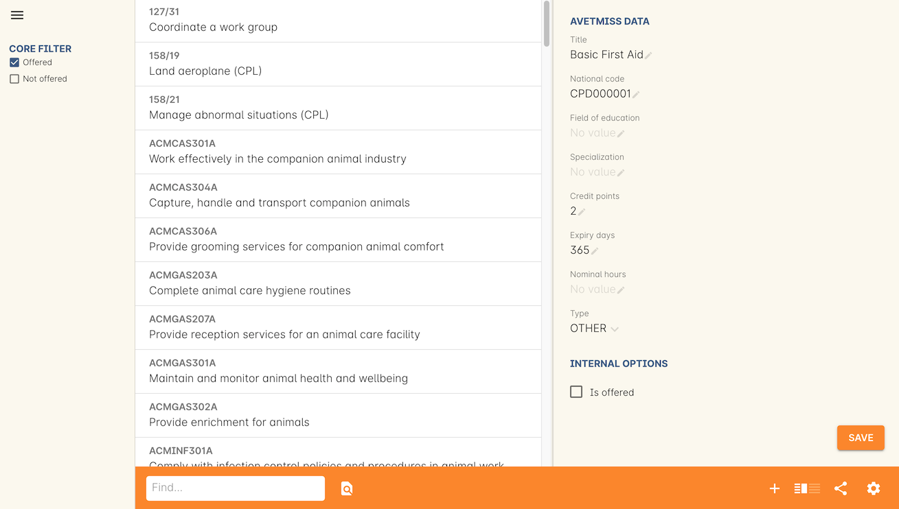

[[faq]]
== Frequently Asked Questions

[[faq-enrolments]]
=== Courses

*How do I create a new course?*

. Navigate to the “Courses” page from the dashboard.
. From the bottom right of the “Courses” page press the plus button on the bottom right.
. Input all the mandatory information

*How can I change this course's online description?*

. Navigate to the course that needs changing.
. Scroll down to the “Marketing” section.
. Edit it under the area labelled web description.

*How do I add units of competency to the course?*

. Navigate to the course that you want to add units of competency to.
. Scroll down to the bottom of the course to the modules/units of competency section.
. Press the plus button and search to find the module you want to add to the course.

[[faq-classes]]
=== Classes

*How do I create a new class?*

. Navigate to the “Classes” page via the dashboard
. Select the plus button from the bottom right
. Input the information of the Course it is attached to, and if you want a custom class code, edit it

*How do I set the timetable for a class?*

. Navigate to the class
. Scroll down to the timetable section
. Press the plus button
. Select the start date, time, and duration of the class
. Add any additional details that you are aware of, it can be edited later
. you want this exact class to be repeated, but on a different date, select the copy button that is on the top right of the timetable block

*How do I select what room the class is held in?*

. Navigate to the class
. Scroll down to the timetable section
. Select the timetabled block that needs a room
. Under the site and room section, search for the site and room that needs to be applied

*How do I add a tutor to a class?*

. Navigate to the class
. Scroll down to the tutors section
. Press the plus button
. Find the contact and add their role
If known/available, select their confirmed on date

*How do I add a cost to the class?*

. Navigate to the class
. Scroll down to the budget section
. If needing to add an enrolment fee, click on the income section, then double click the ‘Student Enrollment Fee’ to make changes
. If needing to add another form of income press the plus button next to budget, select income, then fill in the details

*How do I set an enrollment limit for the class?*

. Navigate to the class
. Scroll down to the enrolments section
. Select the number under ‘maximum’
. Change it to the desired class enrolment limit

*Can a class have multiple tutors?*

Yes, a class can have multiple tutors, they can be added the same way every other tutor is. Two tutors can be scheduled for the same time in the same class, overlapping times, or no shared time at all.

[[faq-rooms]]
=== Rooms

*How do I create a room?*

. Navigate to the sites page
. Select the site that needs a room added on
. Scroll down to the rooms section
. Press the plus button
. Fill in the details

*How can I change the capacity of a room?*

. Navigate to the room that needs editing, can be done via sites or rooms pages
. Change the seated capacity limit

*How can I change the availability rules of a room?*

. Navigate to the room that needs editing
. Scroll down to the bottom to availability rules
. Fill in all the details, can be repeated every hour, day, week, month or year

*How can I change the site where this room is located?*

. Navigate to the room that needs to be edited
. Locate the site information
. Select an option from the drop down list

[[faq-sites]]
=== Sites

*How do I create a site?*

. Navigate to the sites page
. Select the plus button on the bottom right
. Fill out all known information about the site

*How can I change the site's timezone?*

. Navigate to the site that needs editing
. Scroll down to the ‘Default Timezone’
. Select the desired location

*How can I delete a room from a site?*

. Navigate to the site
. Scroll down to the rooms section
. Press the garbage can button from the right of the room title

*How can I change the availability of a site?*

. Navigate to the seat that needs editing
. Scroll down to the bottom to availability rules
. Fill in all the details, can be repeated every hour, day, week, month or year

*How can I provide information on how to access the site via the website?*

. Navigate to the site that needs the information added
. Scroll down to the directions section
. Fill in the information, depending on what instructions you want to give

[[faq-contacts]]
=== Contacts

*How do I create a contact?*

. Navigate to the contacts page
. Press the plus button on the bottom right
. Fill in all available/known information

*How can I change contact information after a contacts creation?*

. Navigate to the contact
. Find what information needs to be changed
. Save the changes

*What if I accidentally make a duplicate contact?*

. Locate the two contacts
. Select them both
. Select the cogwheel on the bottom right
. Press the merge 2 contacts button
. Select what information should remain on the merged contact

*How can I link a contact to a different contact?*

. Navigate to one of the contacts
. Scroll down to the relations section
. Press the plus button
. Search for the other contact
. Select how these two contacts are linked

*How can I create a new type of contact relation?*

. Search for “Contact relation types” on the dashboard
. Select the plus button on the page

*How can I view a contact's financial records?*

. Find the desired contact
. Scroll down to the “Financial” drop down

*How can I view contact enrollment records?*

. Find the desired contact
. Scroll down to the “Education” drop down
. Press the hyperlink button to view all linked enrollment records

*What's the difference between a student and tutor contact?*

A student cannot be set as a tutor for classes, and cannot receive payment from payroll. It is important to note that a tutor can also be a student if a tutor enrols into a class. They can be both a tutor and a student and it does not remove their ability to receive payroll payments and be set as a tutor in a class.

[[faq-tutors]]
=== Tutors

*How can I change tutor rolls and pay rates?*

. Navigate to “Preferences” from the dashboard
. Locate “Tutor pay rates” on the left column
. Add/Find the desired tutor roll and set the rate to the desired amount

*How can I view tutor payslips?*

. Navigate to “Tutor pay” from the dashboard
. Filter the list by the options on the left column, OR, search for the desired contact using the Find bar at the bottom

*How do I approve tutor payslips?*

. Navigate to the payslip/s that needs approval
. Select it
. Click the cogwheel on the bottom right
. Press the approve button

[[faq-automations]]
=== Automations

*Can I create my own automations?*

Users on the premium and enterprise plan have the ability to create their own automations. For a cost, any user can have a custom script, imports and exports, PDF report or PDF background developed by Ish and implemented on your system.

*What are all the templates?*

There are three types of templates within onCourse. Import templates, export templates and message templates. Import templates are used to bring information from an outside source into onCourse. Export templates are used to export all information about a certain record in onCourse to an external document. The message template is a pre-designed message that can be sent out from your system, such as an enrolment confirmation, or an unpaid invoice notice.

*How do I create a new template?*

. Navigate to the “Automations” page
. Select the type of template that you want to create (Import, Export or Message)
. Create the desired template

*How do I upload a new pdf background?*

. Navigate to “Automations”
. Select the PDF Backgrounds from the left column
. Press the plus button and then upload the desired pdf

*How do I create a new report?*

. Navigate to “Automations”
. Select the PDF Reports from the left column
. Press the plus button to create

*How do I manually run a report?*

. Navigate to the record that the report needs to be ran on
. Select all the records
. Press the share button
. Select the report from the list.

*How do I add a new integration to onCourse?*

. Navigate to the “Integrations” page from the dashboard
. Select the plus button
. Choose what system you want onCourse to integrate with
. Fill out all the necessary information
. Enable any scripts that come with the integration
. For extra help with the specifics look at <<externalintegrations, section 58>> of the manual

[[faq-discounts]]
=== Discounts

*How do I create a discount?*

. Navigate to the “Discounts” page from the dashboard
. Press the add record button
. Fill in all necessary information

*How can I limit a discount to certain individuals?*

. Navigate to desired discount
. Scroll down to “Students” section
. Select what options you want the discount limited to

*How can I limit a discount to certain classes?*

. Navigate to the desired discount
. Scroll down to the “Classes” section
. Press the plus button
. Add the desired discounted classes

[[faq-invoices]]
=== Invoices

*What is a credit note?*

A credit note is money that is owed to a customer. This money will be listed as a negative number on your system, as it is money that is coming out of the businesses account.

*How do I create a new invoice?*

. Navigate to the “Invoices” screen from the dashboard
. Select the add record button
. Choose to make an invoice or a credit note
. Fill in the details of the invoice/credit note

*How do I reverse an invoice?*

. Find the created invoice
. Select it
. Go to the cogwheel and select “Duplicate and reverse invoice”
. Create this new invoice
. Select the new invoice
. Go to the cogwheel and select “Contra invoice”
. Contra this duplicated invoice against the mistakenly created invoice

[[faq-checkout]]
=== Checkout (Quick Enrol)

*What if the person trying to enrol doesn’t already exist in the system?*

A contact record can be easily created through the checkout by typing in the new students name, then selecting the “Create new student” option. You may want to collect more data from the student if you need more information then just a name

*Can you enrol multiple people into a class at the same time?*

Yes, multiple people can be enrolled at the same time in the checkout. Simply type the other students' names in the “Find contact” bar and select them. However there can only be one payer for all of the enrollments.

*How do you set up payment plans through the checkout?*

. Get to the payment section of the checkout
. Go to the payments plan section
. Input how much they will be paying in the first instalment, and select the date of that payment
. Input the date of the second payment
. A longer payment plan can be added by going directly to the invoice after creation and manually creating one

=== CPD and onCourse Modules

In onCourse, points for CPD are set up against a module/unit of competency record, found in the Units of Competency window. If you want to track or apply CPD points to a module, it's recommended that you create your own module first and apply the points and expiry days, you can learn how to do that in our <<rto-createModules, RTO chapter>>.

Both CPD points -- referred to as credit points in onCourse -- and the expiry days are set directly within the unit of competency record, and both of these will filter through to certificates. The best example of where this is useful is with first aid certificates; these usually have an expiry date attached to them. Setting the expiry days field in the first aid modules delivered will allow those expiry dates to flow automatically down to the certificate.

==== Adding credit points and expiry days to a module record
To add credit points or expiry days, simply go the Units of Competency window, find the record that you wish to add the details to and enter the data into the fields, then hit Save.

* *Credit points* - enter the number of points to be acheived for completing this module successfully
* *Expiry days* - enter the number of days the CPD points are valid from completion e.g. for a year you'd enter 365 days, for 3 years you'd enter 1095.

The other fields are not essential for CPD.

=== CPD and Certificates
When students want a physical representation of their CPD achieved through one of your courses or activities, you can use <<certification, an onCourse certificate>>. Specfically, a statement of attainment certificate will show the name of the modules completed along with the CPD points achieved.

These certificates can also utilise <<verifyVET-certificates, our certificate verification portal>>, which uses <<rto-qr, onCourse generated QR codes>> to verify the authenticity of a certificate against the data in the onCourse system, giving you confidence that the information presented on the certificate is real and genuine.

