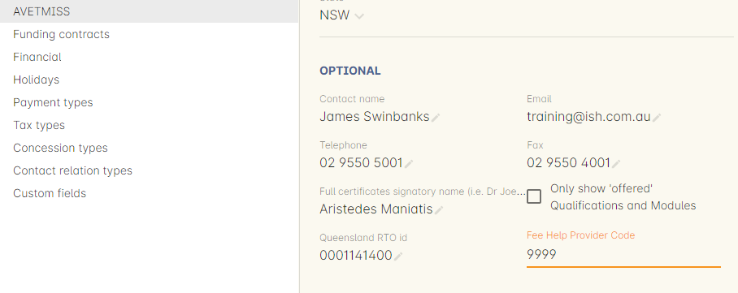
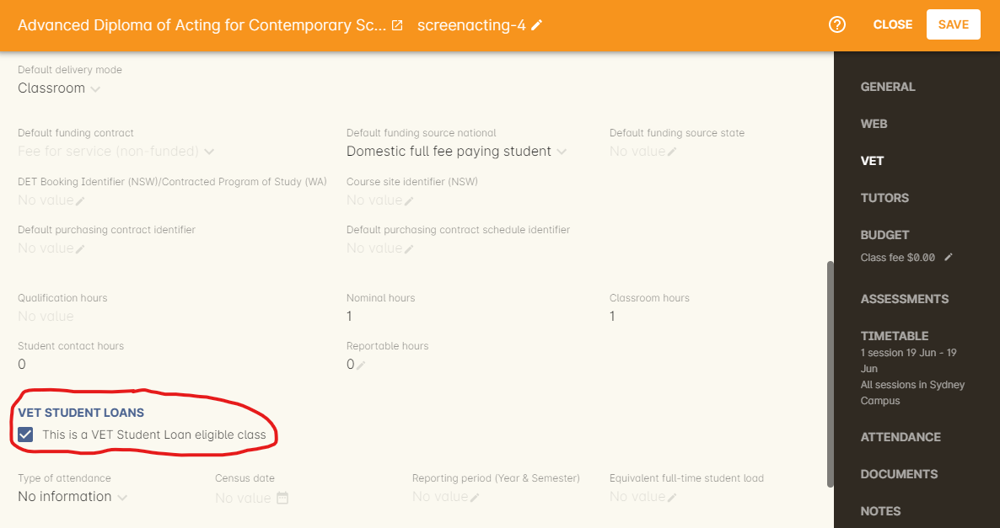
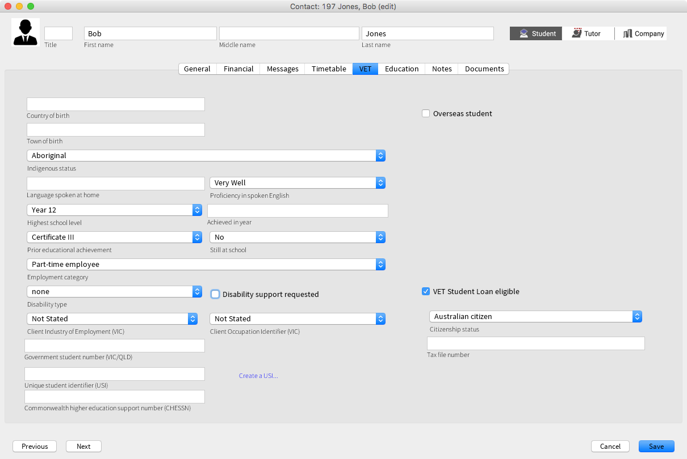
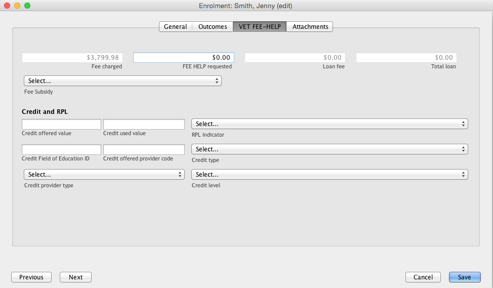

[[FEEHELP]]
== VET Student Loans and FEE-HELP

[[FEEHELP-whatIs]]
=== What are VET Student Loans?

In the onCourse context, VET Student Loans are a type of database export and reporting standard for students enrolled in courses for which they can apply for a government study loan.

VET Student Loans are available to assist eligible students studying approved Diploma level and above VET Qualifications to pay their tuition fees. Part, or all, of an eligible student's tuition fees can be deferred into VET Student Loan, up to a capped amount. Some Government funded course fees can also be deferred under the VET Student Loan scheme.

An RTO needs to be pre-approved to offer VET Student Loans on some or all of their courses. If you are an approved RTO, onCourse Fee Help functions will enable you to meet your reporting and record keeping obligations.

Set your Fee Help Provider Code in the AVETMISS general preferences panel to export your VET Student Loan files with your code embedded.

[[FEEHELP-Creating]]
=== Creating a VET Student Loan eligible course

onCourse Courses are used to map to both the VSL courses and VSL units of study. You set this up in onCourse by creating a parent course as the VSL course, and then another course for each unit of study - e.g. if there are four units of study to the course, then you'd make one parent course and four more 'unit of study' courses.

For the course modules, set up each unit of study course with one module each in order for the TCSI export to work correctly.

You'll need to set a relation between all these courses soon, but first, in the *course* VET section, you will need to begin by checking the option 'This is a VET Student Loan eligible course'. This will show the additional VSL fields.

* This is a VET Student Loan eligible course - When ticked, sets the course as VSL enabled and displays further VSL related fields.
* Equivalent full-time student load - this must be expressed as a whole number where 1 = a full time student load, 05 is 50% of a full time load and 0125 is equal to 1/8th of a full time student load.

When creating VSL class records within VSL courses, the following fields are available to set:

* Type of attendance - select from Full time, Part Time, OUA (Open Universites Australia) or non-higher degree, and no information.
* Census date - This is the last date students can withdraw before incurring the course VET Student Loan fee. This must match your pre-approved census dates for the course or subject. This only displays when the parent course has 'This is a VET Student Loan eligible course' ticked.

Make sure each field is set correctly for the course/unit of study you're creating.

The last step is these courses then need to be connected with a special type of relation called 'Higher Education'. From within the parent course record, go to Relations and create a relationship with each of the applicable unit of study courses you've made, using relation 'Unit of study (Higher education)'. Make sure that each unit of study course has this relationship with the parent course. If viewing a unit of study course, the relationship to the parent course will appear as 'Course (Higher Education)'.

You can learn more about this specific type of relationship <<courseRelations-higherEducation,by visiting our Course Relationships chapter here>>.

[[FEEHELP-studentEligibility]]
=== Setting the Student's VET Student Loan eligibility

For all students enrolled in a class where VET Student Loans are available, every participant must have additional data in their student VET section record completed, even if they are not applying for a loan.

You will need to create and record a CHESSN for each student, and complete the student's contact details and AVETMISS questions responses as usual.

There are some additional fields in the VET section of a contact record that need to be completed if the student is applying for VET FEE-HELP. You will need to mark the checkbox called 'VET FEE-HELP eligible' for them to appear, these are:

* Citizenship status - select an option from the drop down box
* Tax file number - record the number provided by the student which they have obtained from the ATO

[[FEEHELP-loanRequests]]
=== Student VET Student Loan requests

Every enrolment record has a VET Student Loans section that is used to record the VET Student Loan request, or report that the student doesn't wish to apply for a loan. This section is hidden by default unless the student is enrolled in a VET Student Loans eligible class.

First you must set a reporting status on the enrolment. The default setting is 'eligible' but you can choose from one of four. Each setting does something different:

* *Eligible* - the default selection. It hides the VSL fields but adds the enrolment to the TCSI reporting.
* *Not eligible* - hides the VSL fields and the enrolment is NOT added to the TCSI reporting.
* *Ongoing* - displays the VSL fields, allows the VSL fields to be edited and adds the enrolment to TCSI reporting.
* *Finalized* - displays the fields but locks them for editing. This will also stop the enrolment being reported to TCSI.

image::images/vsl_reporting_status.png[title='VET Student Loan fields shown after setting the reporting status as "Ongoing"']

In the FEE HELP requested field you can indicate that the student doesn't wish to apply for a loan by leaving the default value as $0.00 or enter an amount up to the full class fee.

The loan fee will be calculated based on the date of the enrolment and the value you have set in Fee Subsidy (read below). Non-state government subsidised courses will incur a 20% loan fee that you'll see added to the Total Loan amount. Subsidised courses incur no loan fee.

The Fee Subsidy field is hidden from the UI but is drawn automatically from other data:

If 'fee help requested' is $0 then we export one of the 400 codes. Which 400 code we export depends on the flavour/state associated with the funding contract set on the enrolment. E.G. if the fee help requested field is $0 and the funding contract is STSOnline, which uses the STSOnline flavour, then we export fee subsidy as 404.

If 'fee help requested' is more than $0 then we export one of the 500 codes, and again also use the flavour/state associated with funding contract on the enrolment to determine which one we use. Using the same example above, if the same enrolment had a fee help requested of more than $0 then the fee subsidy field would export as a 504.

You can also override the Type of Attendance information at the enrolment level. By default, the enrolment will inherit the attendance type of the class, but you can change it here if you have students attending the same class, but with different attendance types.

Beyond this required data, you can optionally complete the fields in the section headed 'Credit and RPL'. Leave the fields blank that do not apply this student's enrolment.

* Credit offered value - This field contains EFTSL value of the credit/RPL offered at the reporting date towards the total requirements of the course and can contain values from 0001 to 9999.
* Credit used value - This field should report the sum total value of all credit/RPL used by a student toward their current course, at the reporting date.
The value reported in this element must be less than or equal to the value reported in the 'Credit offered value' and can contain values from 0001 to 9999.
* RPL Indicator - select from the drop down list
* Credit Field of Education ID - A code that records details of the field of education of the VET study for which credit/RPL was offered. Valid codes are in the range 0100 - 1299 and can be found on the http://heimshelp.education.gov.au/sites/heimshelp/resources/pages/appendices[Heims Help website]
* Credit offered provider code - A code indicating the Higher Education Provider where the studies for which the credit/RPL was offered were undertaken. Valid codes are in the range of 1000 to 6000 and can be found on the http://heimshelp.education.gov.au/sites/heimshelp/resources/pages/appendices[Heims Help website]
* Credit type - select from the drop down list
* Credit provider type - select from the drop down list
* Credit level - select from the drop down list

[[FEEHELP-exportingData]]
=== Exporting VSL

The export process for VSL is very simple provided all your data has been entered correctly. Simply go to the Enrolments window in onCourse, highlight the enrolments you wish to export then click the cogwheel and select 'Execute script' > 'VSL Export'.

This will not only export the data, but will push it to the TCSI system for reporting.

==== Fields for export

The following fields are mapped for inclusion in the TCSI export:

.VSL Data Elements - Student packet
[cols=",,",options="header",]
|===
|*VSL Field Name*|*onCourse Field Name*|*onCourse Window*
|https://www.tcsisupport.gov.au/element/313[Student identification code]|Student number|Contacts
|https://www.tcsisupport.gov.au/element/314[Date of birth]|Date of birth|Contacts
|https://www.tcsisupport.gov.au/element/402[Student family name]|Last name|Contacts
|https://www.tcsisupport.gov.au/element/403[Student given name - first]|First name|Contacts
|https://www.tcsisupport.gov.au/element/404[Student given name - others]|Middle name|Contacts
|https://www.tcsisupport.gov.au/element/315[Gender code]|Gender|Contacts
|https://www.tcsisupport.gov.au/element/316[Aboriginal and Torres Strait Islander Code]|Indigenous Status|Contacts
|https://www.tcsisupport.gov.au/element/346[Country of birth code]|Country of Birth|Contacts
|https://www.tcsisupport.gov.au/element/348[Language spoken at home code]|Language spoken at home|Contacts
|https://www.tcsisupport.gov.au/element/572[Year left school]|Achieved in year|Contacts
|https://www.tcsisupport.gov.au/element/612[Level left school]|Highest school year|Contacts
|https://www.tcsisupport.gov.au/element/661[Term address country code]|Country|Contacts
|https://www.tcsisupport.gov.au/element/658[Residential address country code]|Country|Contacts
|https://www.tcsisupport.gov.au/element/319[Term address postcode]|Postcode|Contacts
|https://www.tcsisupport.gov.au/element/320[Residential address postcode]|Postcode|Contacts
|https://www.tcsisupport.gov.au/element/410[Residential address street]|Street|Contacts
|https://www.tcsisupport.gov.au/element/469[Residential address suburb]|Suburb|Contacts
|https://www.tcsisupport.gov.au/element/470[Residential address state]|State|Contacts
|https://www.tcsisupport.gov.au/element/416[Tax file number]|Tax file number|Contacts
|https://www.tcsisupport.gov.au/element/488[CHESSN]|Commonwealth higher education support number (CHESSN)|Contacts
|https://www.tcsisupport.gov.au/element/584[Unique student identifier]|Unique Student Identifier (USI)|Contacts
|https://www.tcsisupport.gov.au/element/615[Disability code]|Disability type|Contacts
|https://www.tcsisupport.gov.au/element/358[Citizen Resident Code]|Citizenship Status|Contacts
|===

.VSL Data Elements - Course packet
[cols=",,",options="header",]
|===
|*VSL Field Name*|*onCourse Field Name*|*onCourse Window*
|https://www.tcsisupport.gov.au/element/307[Course code]|Code|Courses
|https://www.tcsisupport.gov.au/element/308[Course name]|Name|Courses
|https://www.tcsisupport.gov.au/element/350[Course of study load]|Equivalent full-time student load|Courses
|https://www.tcsisupport.gov.au/element/596[Standard course duration]|An aggregate of first class duration of all related courses|Classes
|https://www.tcsisupport.gov.au/element/609[Course effective from date]|Date of the earliest related class|Classes
|https://www.tcsisupport.gov.au/element/610[Course effective to date]|Date of the last related class|Classes
|===

.VSL Data Elements - Delivery location packet
[cols=",,",options="header",]
|===
|*VSL Field Name*|*onCourse Field Name*|*onCourse Window*
|https://www.tcsisupport.gov.au/element/625[Delivery location code]|Site ID|Sites
|https://www.tcsisupport.gov.au/element/609[Campus effective from date]|Earliest outcome start date|Outcomes
|https://www.tcsisupport.gov.au/element/627[Delivery location street address]|Street|Sites
|https://www.tcsisupport.gov.au/element/678[Delivery location suburb]|Suburb|Sites
|https://www.tcsisupport.gov.au/element/660[Delivery location country code]|Country|Sites
|https://www.tcsisupport.gov.au/element/477[Delivery location postcode]|Postcode|Sites
|https://www.tcsisupport.gov.au/element/630[Delivery location state]|State|Sites
|https://www.tcsisupport.gov.au/element/610[Campus effective to date]|(optional field)|N/A
|===

.VSL Data Elements - Disability packet
[cols=",,",options="header",]
|===
|*VSL Field Name*|*onCourse Field Name*|*onCourse Window*
|https://www.tcsisupport.gov.au/element/615[Disability code]|Disability type|Contacts
|https://www.tcsisupport.gov.au/element/609[Disability effective from date]|Enrolment creation date|Enrolments
|https://www.tcsisupport.gov.au/element/610[Disability effective to date]|Always 'null'|N/A
|===

.VSL Data Elements - Citizenship packet
[cols=",,",options="header",]
|===
|*VSL Field Name*|*onCourse Field Name*|*onCourse Window*
|https://www.tcsisupport.gov.au/element/358[Citizen resident code]|Citizenship status|Contacts
|https://www.tcsisupport.gov.au/element/609[Citizenship effective from date]|Enrolment creation date|Enrolments
|===

.VSL Data Elements - Citizenship packet
[cols=",,",options="header",]
|===
|*VSL Field Name*|*onCourse Field Name*|*onCourse Window*
|https://www.tcsisupport.gov.au/element/313[Student resource key or Student identification code]|Student number|Contacts
|https://www.tcsisupport.gov.au/element/307[Course resource key or Course code]|Course code|Courses
|https://www.tcsisupport.gov.au/element/534[Course of student commencement date]|An aggregate of first class duration of all related courses|Classes
|https://www.tcsisupport.gov.au/element/330[Type of attendance code]|Type of attendance|Classes
|https://www.tcsisupport.gov.au/element/620[Highest attainment code]|Prior educational achievement|Contacts
|https://www.tcsisupport.gov.au/element/575[Study reason code]|Study reason|Enrolments
|https://www.tcsisupport.gov.au/element/576[Labour force status code]|Employment category|Contacts
|https://www.tcsisupport.gov.au/element/599[Course outcome code]|Depends on enrolment status for parent course.

*1* when enrolment completed.

*3* when enrolment cancelled.|Enrolments (not based on a single field, but enrolment status)
|https://www.tcsisupport.gov.au/element/592[Course outcome date (required only if course completed)]|Last related outcome end date|Outcomes
|https://www.tcsisupport.gov.au/element/327[Basis for admission code]|Basis for admission|Enrolments
|https://www.tcsisupport.gov.au/element/560[Credit used value]|NULL|N/A
|https://www.tcsisupport.gov.au/element/561[Credit basis code]|NULL|N/A
|===

.VSL Data Elements - Basis for admission packet
[cols=",,",options="header",]
|===
|*VSL Field Name*|*onCourse Field Name*|*onCourse Window*
|https://www.tcsisupport.gov.au/element/327[Basis for admission code]|Basis for admission|Enrolments
|===

.VSL Data Elements - Course prior credit packet
[cols=",,",options="header",]
|===
|*VSL Field Name*|*onCourse Field Name*|*onCourse Window*
|https://www.tcsisupport.gov.au/element/560[Credit used value]|NULL|N/A
|https://www.tcsisupport.gov.au/element/561[Credit basis code]|NULL|N/A
|===

.VSL Data Elements - Unit enrolment packet
[cols=",,",options="header",]
|===
|*VSL Field Name*|*onCourse Field Name*|*onCourse Window*
|Course admission resource key or Unique course admission combination|Combination of student number, course code of the higher education related course and aggregated start/end dates of related higher education courses|Contacts and Courses
|https://www.tcsisupport.gov.au/element/354[Unit of Study code]|Course code|Courses
|https://www.tcsisupport.gov.au/element/625[Delivery location resource key or Delivery location code]|Site ID|Sites
|https://www.tcsisupport.gov.au/element/464[Discipline code]|Field of education|Units of Competency
|https://www.tcsisupport.gov.au/element/622[Unit of study year-long indicator]|If End date - Start Date > 10 months then is true, otherwise false|Class start and end dates
|https://www.tcsisupport.gov.au/element/489[Unit of study census date]|Census date|Classes
|https://www.tcsisupport.gov.au/element/600[Unit of study commencement date]|Outcome start date|Outcomes
|https://www.tcsisupport.gov.au/element/339[Equivalent full-time student load]|Equivalent full-time student load|Courses
|https://www.tcsisupport.gov.au/element/355[Unit of study status code]|
*1* - If child course enrolment is cancelled

*3* - If all outcomes in child course are successful (or no outcomes at all) and end date has passed, or

*4* - None of the above are true|Set automatically
|https://www.tcsisupport.gov.au/element/601[Unit of study outcome date]|Outcome end date|Outcomes
|https://www.tcsisupport.gov.au/element/619[Course assurance indicator]|This will always come out False|N/A
|https://www.tcsisupport.gov.au/element/329[Mode of attendance code]|Type of attendance|Enrolments
|https://www.tcsisupport.gov.au/element/490[Student status code]|Fee subsidy field|Enrolments
|https://www.tcsisupport.gov.au/element/384[Amount charged]|Fee charged|Enrolments
|https://www.tcsisupport.gov.au/element/381[Amount paid upfront]|Fee charged|Enrolments
|https://www.tcsisupport.gov.au/element/529[Loan fee]|Loan fee|Enrolments
|https://www.tcsisupport.gov.au/element/558[HELP loan amount]|Fee HELP requested|Enrolments
|https://www.tcsisupport.gov.au/element/577[Recognition of prior learning code]|RPL Indicator|Enrolments
|https://www.tcsisupport.gov.au/element/446[Remissions reason code]|Always NULL|N/A
|===