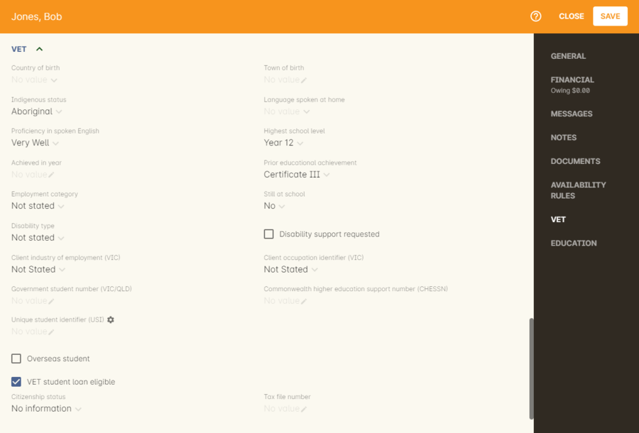
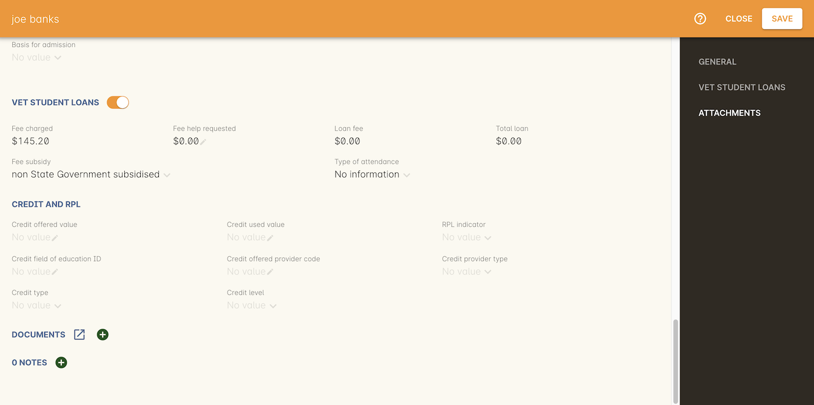

[[FEEHELP]]
== VET Student Loans and FEE-HELP

[[FEEHELP-whatIs]]
=== What are VET Student Loans?

In the onCourse context, VET Student Loans are a type of database export and reporting standard for students enrolled in courses for which they can apply for a government study loan.

More information about the current reporting standard can be found on the http://heimshelp.education.gov.au[Heims Help website]

VET Student Loans are available to assist eligible students studying approved Diploma level and above VET Qualifications to pay their tuition fees. Part, or all, of an eligible student's tuition fees can be deferred into VET Student Loan, up to a capped amount. Some Government funded course fees can also be deferred under the VET Student Loan scheme.

An RTO needs to be pre-approved to offer VET Student Loans on some or all of their courses. If you are an approved RTO, onCourse Fee Help functions will enable you to meet your reporting and record keeping obligations.

Set your Fee Help Provider Code in the AVETMISS general preferences panel to export your VET Student Loan files with your code embedded.

image::images/fee_help_provider_code.png[title='Setting your Fee Help provider code']

[[FEEHELP-Creating]]
=== Creating a VET Student Loan eligible class

Creating the VET Student Loan course may involve creating a single course, for a full qualification, with all appropriate units of competency attached, if your course is delivered as a single program with one census date. This is generally no longer allowed, and in most cases you will need multiple courses, to represent multiple units of study.

Where your VET Student Loan course contains multiple subjects, each with one or more unit, and with varying census dates, you'll need to create the appropriate number of onCourse courses, and at least one VET Student Loan eligible class for each course.

The data you set in the course and class records is combined with student and enrolment data to create the VET Student Enrolment (VEN), VET Enrolment Revisions (VER), VET Load Liability (VLL), VET Unit of Study Completions (VCU), VET Course Completions (VCC) and VET Commonwealth Assisted Students - HELP Due (VDU) export files.

On the class VET section, you will need to begin by checking the option 'This is a VET Student Loan eligible class'. This will show the additional class fields.

* Type of attendance - select from Full time or Part Time
* Equivalent full-time student load - this must be expressed as a whole number where 1 = a full time student load, 05 is 50% of a full time load and 0125 is equal to 1/8th of a full time student load.
* Census date - This is the last date students can withdraw before incurring the course VET Student Loan fee.
This must match your pre-approved census dates for the course or subject.
* Reporting period - This is the year and semester period in the format YYYYp.
A valid entry in this field would be 20151 or 20152

[[FEEHELP-studentEligibility]]
=== Setting the Student's VET Student Loan eligibility

For all students enrolled in a class where VET Student Loans are available, every participant must have additional data in their student VET section record completed, even if they are not applying for a loan.

You will need to create and record a CHESSN for each student, and complete the student's contact details and AVETMISS questions responses as usual.

There are some additional fields in the VET section of a contact record that need to be completed if the student is applying for VET FEE-HELP. You will need to mark the checkbox called 'VET FEE-HELP eligible' for them to appear, these are:

* Citizenship status - select an option from the drop down box
* Tax file number - record the number provided by the student which they have obtained from the ATO

[[FEEHELP-loanRequests]]
=== Student VET Student Loan requests

Every enrolment record has a VET Student Loans section that is used to record the VET Student Loan request, or report that the student doesn't wish to apply for a loan.

The fee charged field will show the enrolment fee the student was charged. This data is tied to the invoices generated is not editable in their enrolment record.

In the FEE HELP requested field, you can indicate that the student doesn't wish to apply for a loan by leaving the default value as $0.00 or enter an amount up to the full class fee.

The loan fee will be calculated based on the value you have set in the Fee Subsidy drop down box. Non-state government subsidised courses will incur a 20% loan fee that you'll see added to the Total Loan amount. Subsidised courses incur no loan fee.

You can also override the Type of Attendance information at the enrolment level. By default, the enrolment will inherit the attendance type of the class, but you can change it here if you have students attending the same class, but with different attendance types.

Beyond this required data, you can optionally complete the fields in the section headed 'Credit and RPL'. Leave the fields blank that do not apply this student's enrolment.

* Credit offered value - This field contains EFTSL value of the credit/RPL offered at the reporting date towards the total requirements of the course and can contain values from 0001 to 9999.
* Credit used value - This field should report the sum total value of all credit/RPL used by a student toward their current course, at the reporting date.
The value reported in this element must be less than or equal to the value reported in the 'Credit offered value' and can contain values from 0001 to 9999.
* RPL Indicator - select from the drop down list
* Credit Field of Education ID - A code that records details of the field of education of the VET study for which credit/RPL was offered. Valid codes are in the range 0100 - 1299 and can be found on the http://heimshelp.education.gov.au/sites/heimshelp/resources/pages/appendices[Heims Help website]
* Credit offered provider code - A code indicating the Higher Education Provider where the studies for which the credit/RPL was offered were undertaken. Valid codes are in the range of 1000 to 6000 and can be found on the http://heimshelp.education.gov.au/sites/heimshelp/resources/pages/appendices[Heims Help website]
* Credit type - select from the drop down list
* Credit provider type - select from the drop down list
* Credit level - select from the drop down list

