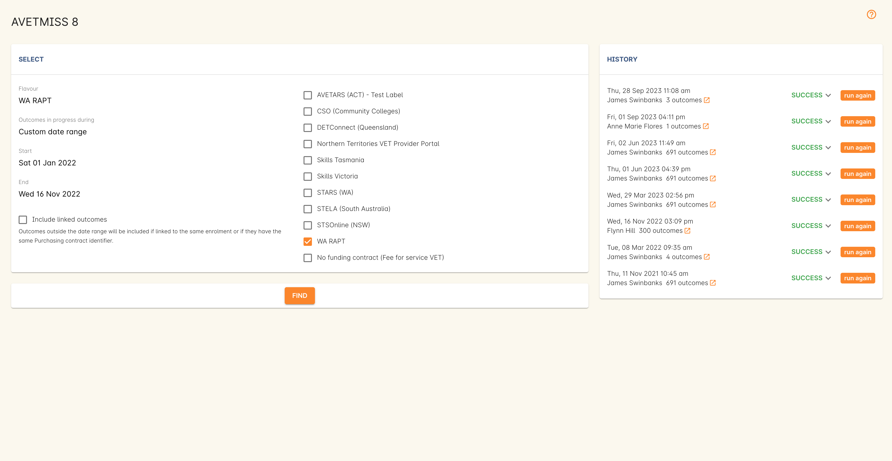

[[rapt]]
== RAPT - AVETMISS Reporting in Western Australia

=== RAPT Reporting

The Resource Allocation Program for Training (RAPT) contract management system is the reporting standard used to collect data from registered private providers.
AVETMISS information is extracted from RAPT to meet the local and national timetables for vocational education and training enrolment statistics reporting

All publicly funded data reporting is submitted directly to DTWD, the State Training Authority (STA) in WA via current RAPT reporting requirements.

The RAPT formatted data is like a cut down version of AVETMISS, and includes student enrolment information like their USI.

You can export your onCourse enrolment data to the RAPT Standard for either your:

. Total onCourse training activity (enrolment and prior learning outcome data) for a date range period
. Training activity for a selection of onCourse classes (enrolment outcome data only)
. Training activity for a selection of onCourse enrolments (enrolment outcome data only)

==== Exporting all training activity to RAPT

Where your training data includes both outcomes created via students enrolling in onCourse classes and outcomes created by importing data into onCourse (prior learning), this option will collect all outcomes for all students that fall within the specified date range.

. Go to File > Import/Export > Export AVETMISS > AVETMISS 8...
. In the window that opens, enter the date range export dates
. Select the AVETMISS flavour 'WA RAPT'
. Click 'Find', then when the results overview pops up, proceed to run the export and create the RAPT files on your computer

==== Exporting selected classes or enrolments to RAPT

If you only want to select student enrolment data for a specific class group, or for selected enrolments, you can begin the RAPT export process from either the class or enrolment window.

Start by highlighting the particular classes or enrolments in the list view, and then go to the cogwheel in the top right hand corner and select the option 'AVETMISS 8 Export'

As per the instructions for exporting all training activity above, a sheet will open.
When you are exporting from the classes or enrolment cogwheel option, however, you do not have to enter a date range.

It is still important that you select the AVETMISS flavour 'WA RAPT' in this window.

image::images/rapt_export_class.png[title='Selecting a group of classes to run the RAPT export against']

==== Total VET Activity Reporting in WA

All other data is reported directly to NCVER via the
https://avs.ncver.edu.au/avs/[AVETMISS validation software].
You can extract your AVETMISS data from onCourse via the AVETMISS standard to meet the total VET activity reporting (TVA) requirement in WA.

Following the same instructions as 'Exporting all training activity to RAPT' above, but this time selecting the flavour 'AVETMISS standard' will export the standard AVETMISS files you then need to upload to AVS for validation and lodgement.

=== Client Qualifications Register (CQR) Reporting

The Client Qualifications Register (CQR) is a system for the permanent recording of ​Australian Qualifications Framework (AQF) student records from RTOs.

Therefore in the event that an RTO ceases to trade, students will still have access to their records and employers will be able to verify qualifications.

WA RTOs are required to submit information on student achievements to TAC via the CQR. RTOs need to provide data on achievement at the unit of competency and the qualification level as well as provide some minimal student information for identification purposes.
Reporting is due biannually as follows:

* student achievement data for January to June is due by 31 July
* student achievement data for July to December is due by 31 January.​

The CQR system is accessible only through RTONet . Instructions on how to submit CQR data to TAC can be found in the
http://www.tac.wa.gov.au/SiteCollectionDocuments/Fact%20Sheet%20-%20RTO%20Reporting%20Requirements%20V02-15.pdf[RTO
reporting requirements​​ fact sheet​​.] ​

To export this data from onCourse, begin by opening the certificate window from Activity > Certificates.

Once in the certificate window you can export the required data by following the steps below:

. Run a date range the query to return the certificates for the time period you wish to export
. Highlight what you want to export from this list of certificates
. From the export icon, select 'Certificate CQR CSV export' from the drop down list of export options and select export
+
image::images/export_CQR_report.png[title='Selecting the CQR report in the list view of the Certificates window']
. Your files will be saved in a folder in the location you have chosen.
Locate your files and then upload them to TAC

image::images/certificate_export.png[title='View of the CQR report']
