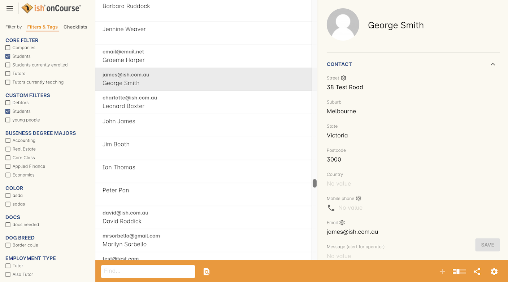
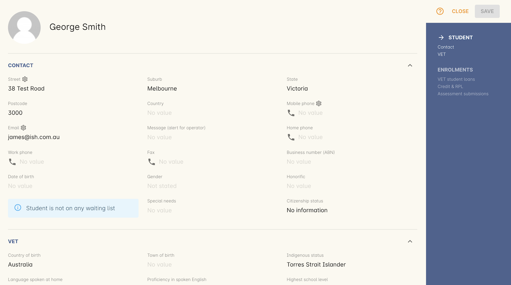
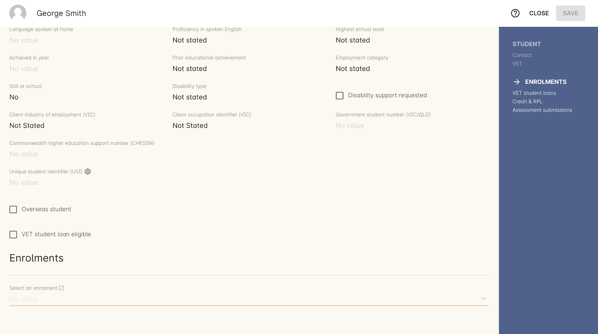
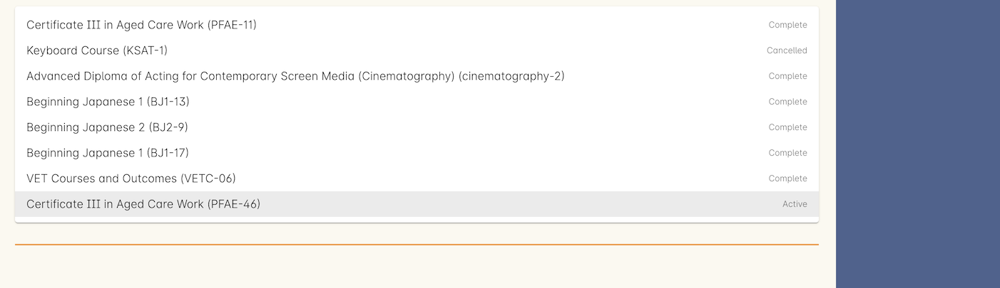
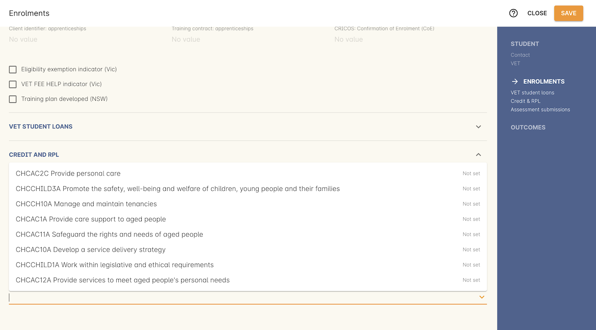
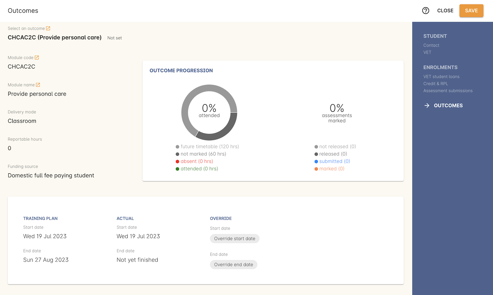

[[VETReporting]]
== VET Reporting

The VET Reporting screen is the easiest place in onCourse to manage all the data relating to individuals who are undertaking some kind of reportable, government-funded training. As these fields appear across three different types of records, Contacts (students), Enrolments and Outcomes, we've combined the VET fields from each of these sections into one, easy-to-use window, so you can now manage most of, if not all of your VET data from the one spot in onCourse.

The process is as simple as selecting your student from the list and opening the record to their contact data. From here you can select one of their enrolments within the same window and the VET data for that enrolment will display. Then finally you can select any outcome from that enrolment and set any relevant data at the outcome level as well.

[[VETReporting-contact]]
=== Editing student reporting data - Contact

The VET Reporting screen looks just like the Contacts window, opening with a list of students. You can use queries and filters to help filter out any records you don't need.

Select a student and you'll see something similar to their contact record, where you can edit some of their basic information, as well as any VET-related fields that appear on their contact record.

[[VETReporting-enrolment]]
=== Editing student reporting data - Enrolment

Below the contact information you'll see an 'Enrolments' heading and a drop-down box.

Select the enrolment of this student you wish to edit the data of. The search results will show you both the name of the course and class that the student enrolled in as well as the enrolment's status.

Once an enrolment is selected, the VET fields that normally appear on the enrolments window will display for the selected enrolment record, allowing you to edit and change anything you need to at this level.

At this level is where you can also set any fields relating to VSL (VET Student Loans), Credit and RPL.

[[VETReporting-outcome]]
=== Editing student reporting data - Outcome

Lastly, the final section to appear is a list of Outcomes. The list of results will automatically show the outcomes associated with the enrolment selected above.

[NOTE]
====
If the outcome search results are empty, then you've selected a NON-VET enrolment. Change the enrolment selection to one that contains Units of Competency.
====

Select the outcome you wish to amend and the full outcome edit view will open., allowing you to set the status, training plan dates and other VET-related data fields.

Once you have completed your changes, click the 'Save' button at the top of your window.