[[accounting]]

== Accounting

The following chapter provides an overview of the principles of the onCourse financial process.

[[accounting-Relationship]]
=== Relationship between the Student and the Debtor within onCourse

onCourse has a clear separation between financial data and enrolment data. Students enrol in classes. Students may not be a company, since only natural people can enrol in a class. The contact linked to an invoice (the debtor) may however be a company or a natural person. The student and the debtor may be the same person; this often happens for a simple enrolment of one person into one class. The student and the debtor could be two different people, or in fact a debtor could pay for the enrolment of multiple students on one invoice.

In the following example of a basic enrolment, there are students Peter and Amy, and the invoice is issued to the debtor Geoff (1). Geoff then pays the full amount (3).

[plantuml]
----
hide footbox

actor Geoff
actor Peter
actor Amy

  Note over Geoff: Geoff wants to send his staff on a course.
    Geoff -> Peter: enrol in Photography for $50
    Geoff -> Amy: enrol in Photography for $50
    Geoff --> Geoff: pay $100 invoice
----

If an enrolment needs to be cancelled for whatever reason, the cancellation process will generate a credit note to the debtor. It is important to note that although Peter might phone to cancel his enrolment, the credit can only be issued back to Geoff in onCourse.

[plantuml]
----
hide footbox

actor Geoff
actor Peter
actor Amy

  Note over Peter: Peter cancels his enrolment
    Peter -> Geoff: Cancel enrolment
    Geoff --> Geoff: $50 credit note issued
----

As the credit note is attached to the debtor, it can be applied to another enrolment for the same student or a different student. In the following example Peter wishes to cancel his enrolment, so the credit note is issued to Geoff as the debtor. Geoff is then able to enrol another person (Sue) into another course using the credit note that has been issued.

[plantuml]
----
hide footbox

actor Geoff
actor Peter
actor Sue

  Note over Peter: Peter cancels his enrolment
    Peter -> Geoff: Cancel enrolment
    Geoff --> Geoff: $50 credit note issued
  Geoff -> Sue: Enrol in Photography for $50
 Geoff --> Geoff: $50 invoice created and paid by credit note
----

[[accounting-principles]]
=== Principles of Accrual Accounting

In cash accounting system income is recorded to the General Ledger (GL) at the time payment is received. Although this is simple, it isn't a good way to understand what your debtors and creditors represent on your balance sheet and it can limit how you structure your tax at the end of a financial year. You may receive large payments in advance (for example prepayment for training at the start of term) which aren't matched by expenses (like tutor wages) and look like large profits that in reality don't exist. onCourse is not a cash accounting system and cannot be used in that way. Trying will end in tears.

onCourse works on the principle of deferred accrual accounting, which means that the income is recorded to the General Ledger (GL) at the point the invoice has been generated, irrespective of when the payment is received. The following diagrams illustrate the difference between accrual accounting and cash accounting, and the point at which income is recorded against the GL.

You will note also that the income that is received will initially be assigned to a liability account, then transferred to the income account once the class commences. For further information see <<accounting-deferredIncome>>

[plantuml]
----
hide footbox

participant invoice
participant payment
participant class
box General ledger
collections transactions
end box

... Enrolment/invoice created ...

invoice -[#green]> transactions:  <&arrow-top> Prepaid fee liability $300
invoice -[#blue]> transactions: <&arrow-top> Trade debtor asset $300

... Payment made ...

payment -[#CornflowerBlue]> transactions: <&arrow-top>Cheque account asset $300
payment -[#blue]> transactions: <&arrow-bottom>Trade debtor asset $300

... Class commences sometimes later ...

group daily for 10 days
class -[#green]> transactions: <&arrow-top>Prepaid fee liability $30
class -[#DeepPink]> transactions: <&arrow-bottom>Student fee Income $30
end loop
----

[[accounting-deferredIncome]]
==== Unearned Income

In this section we provide an overview of how unearned income works within onCourse and how the system deals with adjustments and or cancellations to a Class.

Transfer of funds from Liability Account to Income Account at time of Course Delivery.

Unearned income is income received before goods are sold or a service is provided. When you enrol students, you collect the fees for the class. When the class is delivered, the income is then 'earned' by the provider. This is sometimes called deferred accrual accounting.

When an invoice is generated within onCourse, those funds are initially listed within the GL against the Pre Paid Fees (Liability account). These funds are then transferred to the income account of the GL at the commencement of the Class.

As you can see from the above diagram, the method by which onCourse determines how the unearned income is transferred across from the Pre Paid Fees (liability) account is as follows:

. First session of class is run
. At approximately 1am the following morning, the system will run a comparison between the amount of funds in the liability account and the amount of funds in the income account for that Class. It will also check how many hours of the overall Class have been run and how many are yet to be run
. Based on the above comparison, onCourse automatically transfers an instalment of funds from the Pre Paid Fees account to the Income account
. This nightly comparison will continue for the duration of the Class until all remaining funds are transferred from the Pre Paid Fees account to the Income account.

==== What Happens If I have to Cancel or Add a Session to a Class?

As you would have noted within the previous section, onCourse runs a nightly comparison of the amount of funds in the Pre Paid Fees account against the amount of funds in the Income account.

If for example you have to cancel a session within a given Class, the next time the system does an overnight check of the status, it will allow for this cancellation and transfer all remaining funds to the Income account.

Alternatively, if you have to add additional sessions to a Class, the system will adjust the nightly instalment of funds being transferred to allow for the increased number of total hours in the given Class.

==== What if I want all funds to be transferred at the commencement of the Class?

A College may decide that they do not wish to transfer income incrementally across the duration of a given Class.

If you don't want to use this feature within onCourse, you can easily deactivate this within the Financial Preferences in the onCourse Application.

By choosing to not assign funds from liability to income in nightly increments, the system will instead transfer all funds from the Pre Paid Fees account to the Income account the night after the first session of the Class is run.

Please note that this setting is universal, so all Classes are either assigned funds incrementally across the duration of the Class, or the funds are transferred in one installment after the first session of the Class is completed.

[[accounting-financialTransactions]]
=== Explanation of Financial Transactions Generated by the System

onCourse follows the basic concepts of double-entry accounting: all financial transactions are written to the general ledger in balanced pairs. Asset and expense sit on the left, and liability and income on the right. So an increase in Asset could be matched with an equal decrease in another Asset. An increase in Expense might be matched by an equal increase in Liability.

|===
| Debit   | Credit

| Asset   | Liability/Equity
| Expense | Income
|===

==== Financial Transactions generated by Enrolment and Payment Process

Within the Transaction window of onCourse, you can clearly see the individual transaction lines that are generated by an enrolment. In this first example, a user creates an enrolment for one student into a class with no GST.

. $300 is added to the Pre Paid Fees Liability Account linked to the Class being enrolled in
. $300 is added to Trade Debtors which is a record of the money owed to the college
. Now the payment reverses the $300 in Trade Debtors
. $300 is credited to the cheque account, also known as the deposited funds account, where your income is receipted,
. Unearned income is transferred from Prepaid Fees Liability account to Income account once the Class commences.

[plantuml]
----
@startmindmap
*_ <&person>
** checkout
*** invoice
****_ <&arrow-top> Prepaid fee liability $300
****_ <&arrow-top> Trade debtor asset $300
*** enrolment
*** payment
****_ <&arrow-top>Cheque account asset $300
****_ <&arrow-bottom>Trade debtor asset $300

** Class commence
***_ <&arrow-top>Prepaid fee liability $300
***_ <&arrow-bottom>Student fee Income $300
----

For a class fee that includes GST, this would add 2 x additional transaction lines for the GST component of the class fee as shown.

. $350 is added to the liability account linked to the Class being enrolled in
. $350 is added to Trade Debtors which is a record of the money owed to the college
. $35 is added to Trade Debtor which is a record of the GST amount owing
. $35 is the GST amount to be received from the Customer (shown as a liability)
. Now the payment reverses the total amount owing (Fee + GST component) in Trade Debtors
. $385 is credited to the cheque account, also known as the deposited funds account, where your income is receipted
. Unearned income is transferred from Prepaid Fees Liability account to Income account once Class commences.

[[accounting-COS_financials]]
==== Transactions created when a COS discount is applied

For each discount created, you can choose to either charge the discount to a Cost of Sale (COS) account - to track the discount as a business expense - or to allow the discount to reduce the income received. Manual discounts given at the point of sale by overriding the class fee in Checkout are always posted as reduced income, and will not post to the COS account(s).

Generally, discounts like promotional codes are better set up as COS discounts, while variable course fees for differently funded students are better set up as discounts which reduce income. Discounts which aren't linked to a COS post the reduced income as per the standard liability > income processes.

By default, Discounts linked to a COS account are charged to an account called Discounts Given. You can also create additional COS accounts as needed for different departments or promotional types. The transactions processed to this account, and balance of this account allow you to keep an accurate track of the cost to the business of the discounts given during the sales process. To determine the income earned, you can deduct the balance of the COS accounts(s) from the appropriate income account(s).

Discounts work in conjunction with the standard enrolment transaction posting process, and the unearned income posting for income.

For example, for a $300 (GST free) enrolment fee, with a $100 COS discount applied at time of enrolment, the student owes and pays the balance of $200 in full during enrolment:

. $200 is recorded as pre-paid fees liability. This is the income for the full enrolment, excluding the discounted amount.
. $200 is recorded as owing in the Trade Debtors account.
. $100, the value of the discount, is posted to the classes set income account.
. $100, the value of the discount is posted to the COS sale account Discounts Given.
. The student pays the balance of the enrolment fee, $200 and the cheque account, also known as the deposited funds account, is credited while the Trade Debtor account is debited. The student has now paid in full and owes no further money.
. When the class (or other choice of setting) commences, the remaining income, $200 from the enrolment is debited from the pre-paid fees liability and credited to the income account set for the class.

image::images/Invoice_and_Discount_transactions.png[title='Transactions generated by simple enrolment GST Class including unearned income']

==== Financial Transactions Generated by Enrolment Cancellation Process

When canceling an enrolment a credit note is issued, this results in the opposite effect to the original invoice.
Note that this does not automatically generate a payment out to the student since they might use that credit against a further enrolment or choose to have it paid to them in one of a number of ways.

If you need to cancel an enrolment or enrolments for a Class that has not yet commenced, the cancellation process will trigger the deferred income held in the Prepaid Fees Liability Account to be transferred to the income account.
This transfer is the first part of the cancellation process.

[TIP]
====
If an enrolment or enrolments are cancelled after the Class has commenced, the remainder / balance of funds will be transferred from the Prepaid Fees Liability Account to the Income account, this is triggered by the cancellation process.
====

. Unearned income is transferred from Prepaid Fees Liability account to Income account.
. $300 is removed from your income.
. $300 is deducted from the trade debtor account since you are reversing the debt this person had to you.

image::images/class_cancellation_non_gst_with_deferred_income.png[Transactions generated by the cancellation of a GST free enrolment including transfer of unearned income]

If a refund is to be given to the original debtor, the resulting financial transactions are as follows:

. When you pay the debtor their refund, $300 goes out of the cheque account, also known as the deposited funds account
. $300 of trade debtors is removed.

image::images/simple_refund_non_gst.png[title='Transactions generated by refund for a non GST Class']

Here is an example of the transactions generated for an enrolment cancellation and refund for a class with GST:

. Unearned income is transferred from Prepaid Fees Liability account to Income account
. $350 is deducted from the trade debtors account since you are reversing the debt this person had to you
. $350 is removed from your income
. The $35 GST portion of the debt is expunged
. $35 debt to the ATO for this GST is also removed
. When you pay the debtor their refund, $385 goes out of the cheque account, also known as the deposited funds account
. $385 of trade debtors is removed.

image::images/cancellation_refund_with_deferred_income_gst_inc.png[Transactions generated by a GST inclusive class cancellation and refund including unearned income]

===== Transactions created when a COS discount is reversed

For example, for a $300 (GST free) enrolment fee, with a $100 COS discount applied at time of enrolment, the student owes and pays the balance of $200 in full during enrolment. When this enrolment is cancelled and the student is refunded, the following transactions are processed:

. $200 is reversed from the income account. This is the income for the full enrolment, excluding the discounted amount.
. $200 is recorded as owing to the student/payer in the trade debtors account.
. $100, the value of the discount is also reversed from the classes set income account.
. $100, the value of the discount is reversed from the COS sale account Discounts Given.
. The student is refunded $200 and the cheque account, also known as the deposited funds account is debited and the Trade Debtor account is credited. The student has now been paid in full and the college owes them no further money.

image::images/Reverse_Invoice_and_Discount_transactions.png[title='Transactions generated by simple enrolment GST Class including unearned income']

==== Vouchers and Financial Transactions

Vouchers are a mechanism to pre-purchase access to training before the user has selected a product and in effect, have credit available to redeem at a point of their choosing up until the voucher automatically expires. For more information on creating and selling vouchers, refer to <<vouchers>>.

All voucher sales are non-taxable supply, as the GST component cannot be determined until the voucher is redeemed and onCourse knows if the product chosen has GST applied or is GST free. Voucher sales are grouped on invoices under the heading 'The following items are not a taxable supply'.

When a voucher is purchased, the purchase price of the voucher is held in a liability account until such time as the voucher is redeemed or expired. The choice of liability account is set in your financial preferences, but by default will be called Voucher Liability.

As a voucher can be sold for less than it's redemption value, or given away for free, the difference between the sale cost and the redemption cost will be calculated as a Cost of Sale and charge to your chosen account for Voucher Underpayment.

At the point of redemption, a voucher acts as a payment in method, and behaves like cash, cheque or card. Mixed payments can be made during redemption if the voucher balance doesn't cover the full cost of sale.

. In this example a voucher is sold for $200 with a redemption value of $200. When the voucher is purchased, an invoice is raised for the sale price. The Trade Debtors account is increased.
. The sale price of the voucher increases the Voucher Liability account by the same amount. If the voucher was given away for free, the sale price would be $0.
. When the invoice for the voucher is paid for, the Cheque Account, also known as the deposited funds account, is increased by the value of the payment made.
. The Trade Debtors account is reversed by the value of the payment in for the invoice. Vouchers do not have to be 'paid for' to be redeemable. Your invoice payment terms for vouchers can be negotiable as per all your invoice terms.
. A student enrols in a class and the cost of the enrolment fee is posted to the Trade Debtors account as per any other invoice created.
. The income component of the class fee is posted to the Prepaid Fees Liability account if the class has not yet commenced, as per all enrolments.
. The voucher is used as a payment method. In this example, the total invoice balance outstanding is $264, but the voucher is only valid for $200. The Trade Debtors account is debited by the value of the voucher.
. The Voucher Liability account is debited by the sale price of the voucher. There is no Voucher Liability (or credit available to the voucher holder) remaining.
. The balance outstanding of the invoice is paid by another payment method such as cash or credit card.
. The Trade Debtors asset is reduced by the amount paid in the previous step. The amount payable on the invoice created on enrolment is now $0.

image::images/voucher_sale_redeem_simple.png[title='Transactions generated by creating and redeeming a voucher for the same purchase and redemption price']

. In this second example a voucher is sold for $300 with an open-ended redemption value of one enrolment (from a pre-approved list of courses). The actual dollar value of the redemption value will depend on what class is chosen. When the voucher is purchased, an invoice is raised for the sale price. The Trade Debtors account is increased by the sale price.
. The sale price of the voucher increases the Voucher Liability account by the same amount.
. When the invoice for the voucher is paid for, the Cheque Account, also known as the deposited funds account, is increased by the value of the payment made.
. The Trade Debtors account is reversed by the value of the payment in for the invoice.
. A student enrols in a class and the cost of the enrolment fee is posted to the Trade Debtors account as per any other invoice created. In this example the class fee is $5,200, which is significantly more than the purchase price of the voucher.
. The income component of the class fee is posted to the Prepaid Fees Liability account if the class has not yet commenced, as per all enrolments.
. The voucher is used as a payment method. In this example the total invoice balance outstanding is $5,200, but the voucher is only for $300. The Trade Debtors account is debited by the purchase price of the voucher.
. The Voucher Liability account is debited by the original sale price of the voucher. There is no Voucher Liability (or credit available to the voucher holder) remaining.
. The balance outstanding of the invoice is 'paid for' by charging the difference to the Cost of Sale account for Voucher Underpayment, in this case $4,900.
. The Trade Debtors asset is reduced by the amount charged in the previous step. The amount payable on the invoice created on enrolment is now $0.

image::images/voucher_sale_redeem_COS.png[title='Transactions generated by creating and redeeming a voucher for a higher value than the purchase price']

Unlike in these examples, the entirety of the Voucher redemption value does not need to be used in a single enrolment for a single student. The voucher credit can be redeemed over time or can be used to pay for multiple invoices and/or enrolments.

If a voucher expires before it's value is fully redeemed, any remaining credit in the Voucher Liability general ledger account will be transferred to the Vouchers Expired income account.

You can manually extend voucher expiry dates prior to them expiring, but they cannot be adjusted after the expiry date.

[[accounting-contraPaymentTypes]]
=== Contra Payment Types for invoice reversals

A contra payment is a special type of payment that debits the balance outstanding on an invoice with the balance of an available credit note. It saves you from having to look at the total balance of a student's debits and credits and works out what their end position is. It may be especially useful for companies who process multiple students in an invoice and have some students cancel and credited.

Contra payments are processed automatically for a credit note that is created through the enrolment cancellation process. For example, if the student had enrolled but not paid for their class and it was later cancelled, you would issue them a credit note. Automatically both the credit note and their original invoice would have a $0 balance, as they would cancel each other out. The credit note will 'contra pay' the unpaid invoice.

In the enrolment transfer process, a credit note created from the original enrolment invoice cancellation will be used to contra pay the new enrolment invoice being created during the transfer process.

These are the only two instances where contra payments will apply automatically. In other situations, you will need to decide how to apply the credit as a contra payment.

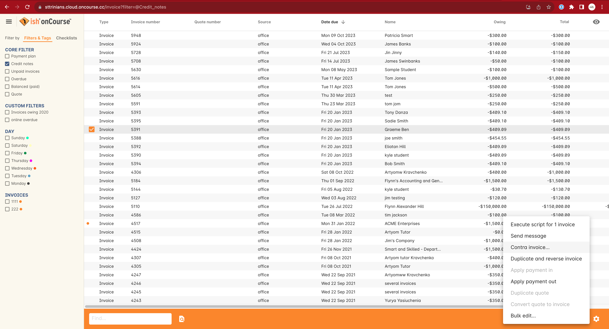

When a cancellation or transfer takes place and the student has credit remaining, as well as other unpaid invoices, you can choose to manually apply the credit as a contra payment against the invoice of your choice.

For example, if a student had an invoice for $100 for an enrolment that they have not made a payment against, so have a balance outstanding of $100, and they're then issued a credit note for $70 for a different class they had paid for, you could choose to 'contra' the $70 credit note balance against the $100 outstanding balance on the invoice. This would then show their credit note as having a $0 balance (as though you had refunded them, or they had used the credit note for another enrolment) and their invoice as having a balance of $30 outstanding they need to pay.

To manually contra a credit note against and unpaid invoice, do the following:

. Locate the credit note in the invoice / credit note list view and single click on it to highlight it
. In the cogwheel, select 'contra invoice'
. A new window will open showing all the invoices for the contact with balances outstanding
. In this window tick the invoice or invoices you want the credit note to contra pay against and save.
+
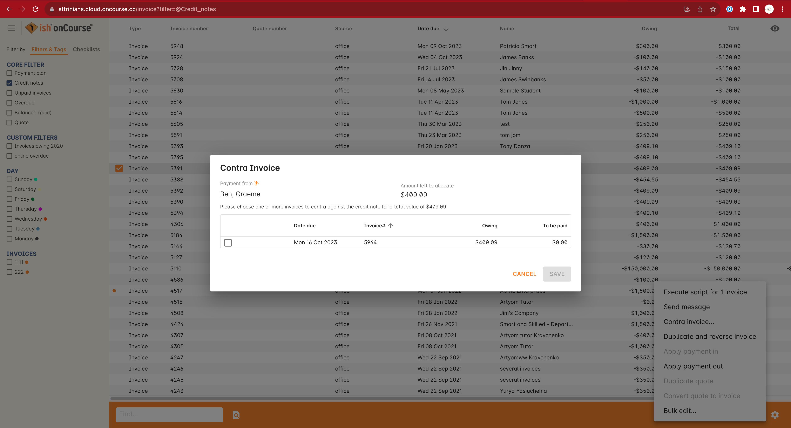

You can only use credit notes to contra invoices for the same contact. You can't take a credit note from Student A and use it to 'pay off' an invoice that was issued to Student B.

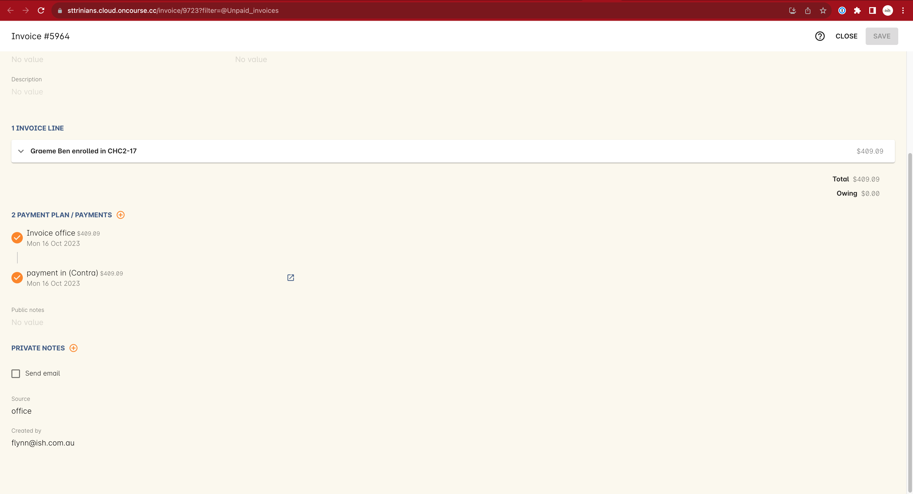

[[accounting-accountCodes]]
=== Creating additional income accounts

onCourse set up comes with a number of general ledger accounts preconfigured. These accounts are used by onCourse during standard system transactions and can be renamed or recoded as needed. In the general preferences, financial, the default system accounts are nominated and can be changed as needed.

You can also add additional accounts to match your general ledger requirements of your primary accounting software. Only accounts onCourse will post to need to be added.

Each class in onCourse is assigned to an income account. Some organisations have a single income account, while others have multiple income accounts. For each income account, you can select its default tax setting. This tax setting can be overridden at the class level when the account is selected, or when creating a manual invoice line joined to this income account.

You can add to the standard list of accounts, or edit existing accounts, in the Accounts window. Just search for Accounts from the Dashboard.

Within the accounts list view, use the + on the bottom hand corner to add a new account. When adding the new account code, you will need to stipulate what type of account it will be, either asset, liability, equity, income, COS or expense.

If the account is type income, you will have the choice of setting a default tax.

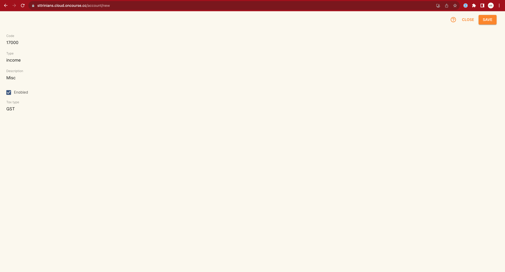

Once you have set up all your income accounts, you can then assign those accounts to individual classes via the budget section of the class.

[[accounting-financialInformation]]
=== Accessing Financial Information from onCourse

When running any kind of query against onCourse to extract financial information, keep in mind that enrolment information is attached to the student and all financial information (such as invoices / payments / credit notes) are attached to the debtor within the system. Therefore there is no direct data relationship between the student and the debtor.

There are multiple methods you can use to extract / examine financial information within onCourse;

==== Automated reporting from scripts

An automated weekly or monthly Trial Balance report from onCourse is available by enabling the script 'send weekly finance summary report'.

By default, this script is set up to run every Monday morning. It prints to PDF and emails the Trial Balance report for the previous 7 days to the default system administrator email address. You can make the following changes in the script to meet your requirements:

*Change the email address receiving the report* - The default system administrator email address is the one you have set in the Messaging section of the Preferences window. If this is not the email address you want to use, change the reference in the script that says:

[source]
----
smtp {
    from preference.email.from
    to preference.email.admin
}F
----

to say:

[source]
----
smtp {
    from preference.email.from
    to "accounts@mycollege.com.au"
}
----

Where "accounts@mycollege.com.au" is the email address of the person who should receive the report, being sure to include the speech marks.

*Change from weekly to monthly automated reports* -
To make this change you need to make some changes to the code in the script, and also the CRON. The CRON is the scheduler that defines how often the script runs. By default the CRON is 3am every Monday morning:

[source]
----
0 0 3 ? * MON
----

Change it to 3am the 1st of every month:

[source]
----
0 0 3 1 1/1 ? *
----

And then inside the body of the script, you need to change which actions are commented out. Lines of code which are comments and not run by the software begin with //. Change the script from:

[source,groovy]
----
    //If you want to change date period use one of the sections below:

    //set period in number of days (e.g. for the last 7 days)
    def endDate = Calendar.getInstance().getTime()
    endDate.set(hourOfDay: 0, minute: 0, second: 0)
    def startDate = endDate - 7

//    set period in calendar months (e.g. for the last month)

//    def endDate = Calendar.getInstance().getTime()
//    endDate.set(dayOfMonth: 1,hourOfDay: 0, minute: 0, second: 0)
//    println endDate
//    def startDate = DateUtils.addMonths(endDate, -1)
----

To:

[source,groovy]
----
    //If you want to change date period use one of the sections below:

    //set period in number of days (e.g. for the last 7 days)
    //def endDate = Calendar.getInstance().getTime()
    //endDate.set(hourOfDay: 0, minute: 0, second: 0)
    //def startDate = endDate - 7

//    set period in calendar months (e.g. for the last month)

   def endDate = Calendar.getInstance().getTime()
   endDate.set(dayOfMonth: 1,hourOfDay: 0, minute: 0, second: 0)
    println endDate
    def startDate = DateUtils.addMonths(endDate, -1)
----

==== Locating data using related records

In all onCourse windows, you can track through the relationships between the data using the 'Find related' function in the cogwheel in the top right-hand corner. For example, if you wanted to find all the invoices related to the payments in taken on a given day, you can select all the payment in records for the day, click the 'Find related' icon and select invoices. This will open all the related invoices in a new window.

In the new Invoices window, you can run additional queries and or print reports. This window has opened in a special state that only ever shows the maximum set of results as being the list then generated from your original find related search, so all your searches, filters and reports will only relate to this subset of data until you close the Invoice list window.

==== Printed Financial Reports

onCourse comes with a number of different Financial Reports and each of these are looking at one particular aspect or area of the database such as Invoices. You may also wish to analyse the financial information that is being generated. You can do this by comparing information from one report to the next.

For example, a data comparison that will allow you to verify the accuracy of the financial information is the deposited funds account, balance = Payment in - Payment out for the same time period.

New Custom Reports can be developed upon request, just bear in mind the rules of how the data is structured within onCourse when considering what kind of information you want to appear on the Report.

==== Copying info within list view windows to Excel

Copy and paste list view records into excel. Run your desired query within a given window, highlight the records you want in the list window and copy. Open excel to paste records.

The benefit of this approach is that it allows you to copy information from a number of different windows on to the same excel worksheet in order to better compare and verify the data.

==== CSV Exports

onCourse allows you to export data directly from onCourse. As is the case with the printed reports, these exports are essentially flat tables of data, which means that you are only looking at one specific area such as invoices.

For more information regarding exporting financial data from onCourse, refer to <<importExport>>.

==== Exporting to MYOB

onCourse allows you to generate a text file export of your Financial Data in order to import this information directly into MYOB. Search for the 'MYOB export' in the dashboard search and click the search result to run the export. Only Admin users will be able to see and access this.

[[accounting-Deposit]]
=== Banking and Reconciliation

In the onCourse preferences, multiple payment types can be created, in addition to the system payment types already defined by onCourse.

For each payment type, you can define if the payment type is banked automatically or manually, and if the payment type is reconcilable, and which asset account the payment is deposited into prior to banking, and moved into after banking.

By default, an asset account named 'undeposited funds' is where all manually banked payments are deposited on creation. The asset account 'deposited funds' is where all automatically banked payments are deposited on creation, and where all manually banked payments are moved to when they are banked.

Automatically and manually banked payments are grouped where possible into daily totals. These banking deposits can then be reconciled as a group, or where needed, transaction by transaction.

==== Banking

As onCourse is integrated with a credit card payment gateway, the system will automatically settle payments in and payments out received via the credit card gateway, whether these payments are processed through your office or via website enrolments.
This settlement process is automatically done between 7pm and 9pm each evening and will be deposited into your nominated merchant account the following business day as a single sum. If a payment is processed into onCourse after the nightly settlement cut off time, the payment will not be banked or appear in your nominated account until the day after. The grouping of the deposited credit card bankings in onCourse will match the batching of the deposits processed by your bank.

If you accept AMEX credit cards, these payment types will be grouped and deposited in a separate banking deposit in onCourse. This is because the AMEX settlement process works differently to Mastercard & Visa, and does not always settle on a daily basis. Instead, it is dependent on the value of the transactions you have processed.

If you have an EFTPOS terminal that you use in conjunction with, or instead of the onCourse credit card gateway, ensure you select EFTPOS, rather than EFT or credit card, as the payment in type, even if you have processed a credit card through the terminal. EFTPOS transactions will be marked as banked on creation, and like your onCourse credit card gateway, will be settled automatically into your bank account overnight.

For payments received via Cheque, Electronic Funds Transfer (EFT), Money Order or Cash, a manual banking process will group and deposit these transactions. The 'Deposit Banking' function within the onCourse client allows you to track the date of settlement, method of payment, payment amount and staff member who performs this function. It also ensures that you do not 'double count' any funds to your nominated bank account.

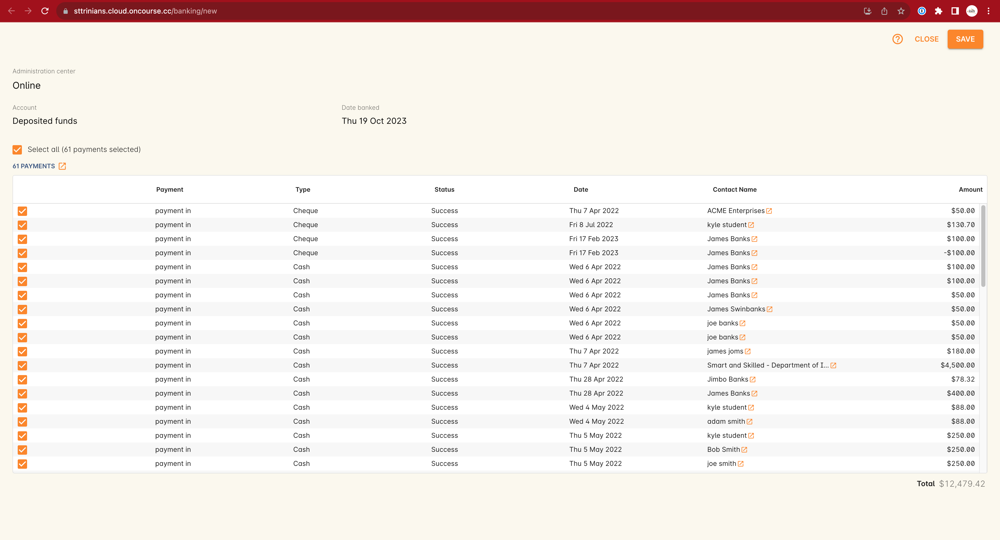

Manual banking is done on a site by site basis. As in, each physical site where manual payment types are collected should run its own banking process. You can see the site you are logged into as a user in the onCourse dashboard. If you wish to process the banking for an alternate site, you need to change your location on the dashboard first.
Usually, an administration manager at each site would be responsible for running the bank process at their site.

You should collect all your payments received and confirm you have the same cash balance and cheques indicated in the bank deposit window as you complete this process.

. From the favourites section of the Dashboard, choose the option 'Deposit Banking'.
. If you only have one 'Deposited funds' asset account, then you will not need to make a choice of bank account. However, if you have multiple accounts, you will need to bank to each bank account as a separate process.
. This will open a window showing all the payments that have been receipted for that bank account at the site you are logged into, that have not yet been banked since the last time the banking process was run.
. Ensure the correct administration centre/banking site is selected. It appears in the top-left of the window with a drop-down box. Once the banking has been 'deposited' this cannot be changed, so you must ensure it is correct before completing the process.
. All payments are selected by default, however you can choose to untick some payments if you do not wish to bank them at this time.
. By default, the banking deposit date will be today. You can change this to a date of your choice, in the future or in the past.

If an onCourse user has reversed a payment in because they recorded the payment in error and this reversal occured prior to banking, you will see both the original payment in and the reversal of that payment in the banking window.

It is generally recommended you bank both the payment and reversal together, so they cancel each other out in a single banking process. However, if the reversal is processed due to a bounced cheque, you may wish to deposit the original payment on the day it was received and banked, and the reversal on the day it bounced.

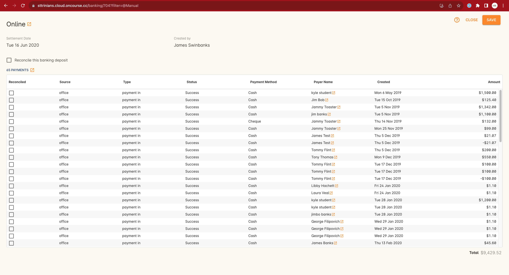

===== Viewing and adjusting banking records

You can see a list of your banking history, including transactions banked automatically, by viewing the Banking Deposits window. You can access it by typing Banking Deposits into the dashboard search.
In this list view you will be able to see the following information:

* The date that each amount of money is banked - The date will have been set by a user as they manually banked the money e.g. cash or cheques. Alternatively if the deposit is automatically banked, the settlement date will be automatically set as the date the funds should be received into your bank account.
* The type or the method of how these funds got banked - The method could be MANUAL (banked via a manual process), AUTO_MCVISA (Visa and Mastercard credit cards banked automatically by the onCourse credit card gateway), AUTO_AMEX (American Express credit cards banked by the onCourse credit card gateway) or AUTO_OTHER (non-credit card payments banked automatically). Prior to the 8.20 upgrade, Amex, Mastercard and Visa were banked together in a grouping type called GATEWAY.
* The site and user - This information is only displayed when the banking is type MANUAL. The site is the office location where the banking process was run, and the user is the staff member who ran the process.
* Reconciled - this check box shows as ticked if the whole banking deposit record has been reconciled.

image::images/banking_3column.png[title='Banking Deposits list in 3-column view']

You can double-click on a banking deposit record from this list view to adjust deposit dates or unbank transactions as required. You can alter the deposit date of the entire deposit grouping, or for individual transactions. Altering the deposit date for an individual transaction will move it from this deposit group to the deposit group of the new date. If there isn't a deposit group for that date, a new group will be created.

Should you wish to reprint the banking report, usually created during a manual banking deposit process, you can do this from the window by selecting one or more banking deposit records and choosing 'banking report' from the Share screen.

You can also 'unbank' a transaction by highlighting the payment in the banking list and clicking on the delete icon in the top right-hand corner of the window. This will change journal the transaction from the 'deposited funds' asset account to the 'undeposited funds' asset account. The payment can be banked again using the manual banking deposit process as needed, or if it was processed in error or reversed.

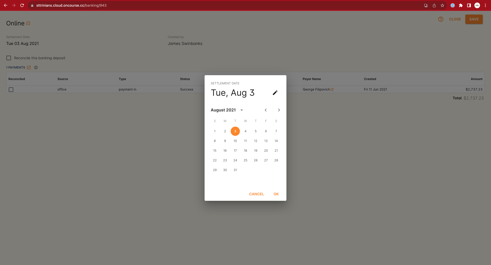

To change the deposit date of a payment in or payment out record, double-click on an individual payment in record and change its date banked. It is common in the case for the date banked of EFT payments to be changed to the date the payment appeared in the bank account - often a date prior to the payment in being created, and banked, in onCourse.

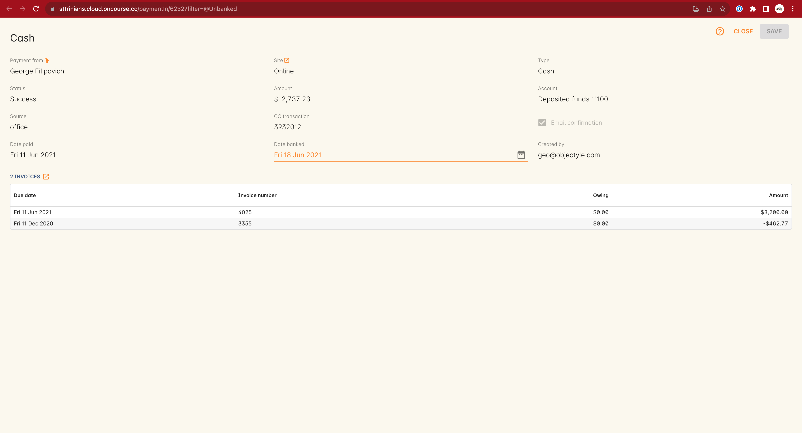

==== Reconciliation

Reconciliation is a process you may optionally undertake within onCourse to confirm your banking deposits match the amounts listed on your bank statement.

Reconciliation can be done on a whole of deposit basis, which is preferable for grouped automatically deposited payments, like onCourse gateway credit card payments. The same is true if done by a payment by payment basis, which is preferable for payment types like cheque deposits, or EFT.

From the dashboard, search for 'Banking deposits'. This lists all the grouped banking deposits recorded. You can double-click on one of these entries and reconcile the whole deposit by ticking 'reconcile this banking deposit', or tick individual payment records as reconciled within the transaction. When all the payments have been ticked, the whole banking deposit will be ticked as reconciled automatically.

If you prefer to reconcile from a printed report, you can also select a range of banking deposit records e.g. the complete calendar month, matching your bank account statement, and from the share screen, select the option 'cash movements detail report'. The PDF this creates can also be ticked off onscreen (although this will not update the reconciled value in onCourse) if you prefer not to print the report to hard copy.

image::images/onCourse_Reconciliation_Statement_Window.png[title='Reconciling a banking deposit']

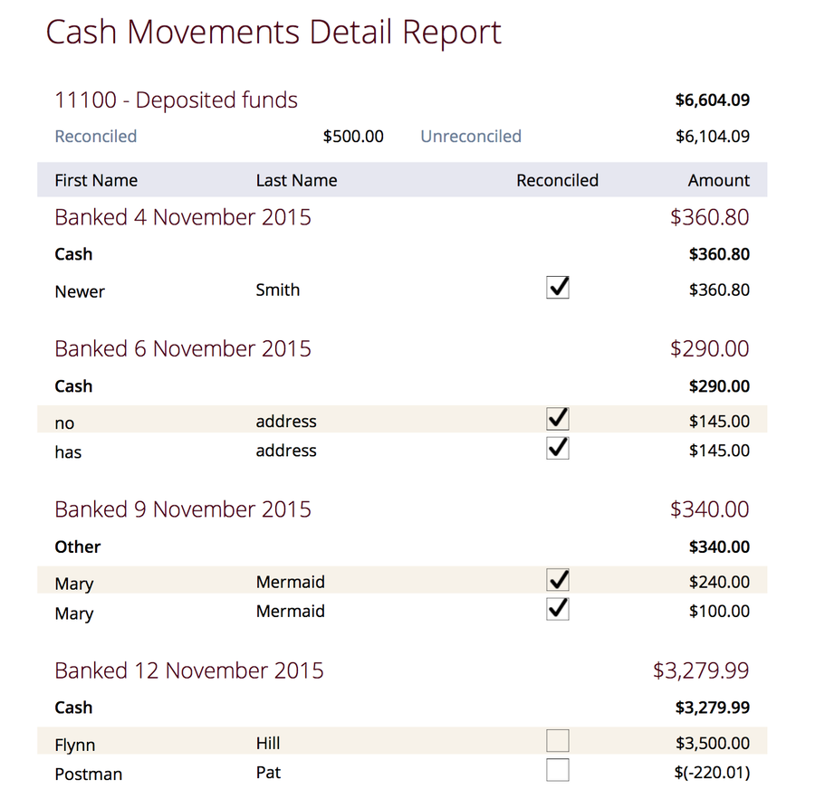

[[accounting-finalise]]
==== Finalising periods

When you wish to lock a financial period from any further adjustments in onCourse, you can close and finalise that period.

Once a period is closed, no payments, banking records, invoices, journals or other transaction data can be added to that period, or adjusted within this period.

This process is final, and cannot be undone. Proceed with caution.

Search for 'Finalise period' in the dashboard search and select 'Finalise period' to open the window.

When the window opens, it will display the current 'locked until' date, and allow you to enter the date you wish to finalise until. This date must be in the past.

After entering the date, onCourse will check for any financial records that may need your attention before the finalisation process should proceed.

Records that should be addressed include unreconciled payments and unbanked payments.

You can run the Trial Balance for a period by searching for 'Trial Balance' in the dashboard search. Admin users will be able to run it by simply clicking on Trial Balance in the search results.

You can export a daily grouped set of journal transactions for the period by clicking on the export icon in this window.

By opening the banking deposit records for the period, you can also quickly print standard banking and reconciliation reports.

When you finalise and close the period, any banked but unreconciled payments will be banked automatically. Any unbanked payments will remain unbanked. If you bank these payments in the future, they can only be banked on dates after the finalised period.

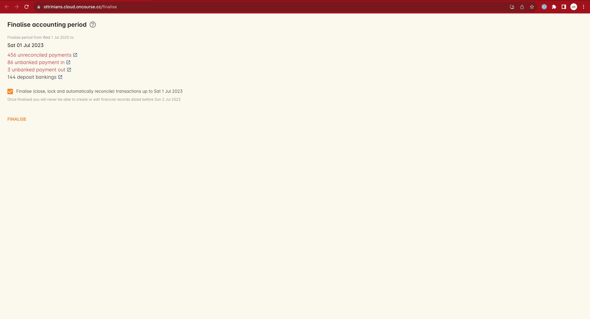

==== General Ledger Journals

On occasion, you may find income in onCourse has been posted to the wrong account, due to the error in a class set up.

This can be resolved by journalling amounts from one account to another.

To do this, navigate to Transactions (Financial > Transactions) then click the + button.

This will open a simple window where you can choose the value as well as what account you want to journal money from and to. You can also choose to process the journal into the past, provided the period hasn't been locked.

Journals processed in onCourse will be visible in the transactions window by selecting the core filter 'other' i.e. they are transactions in the database that were not created by either invoices or payments.

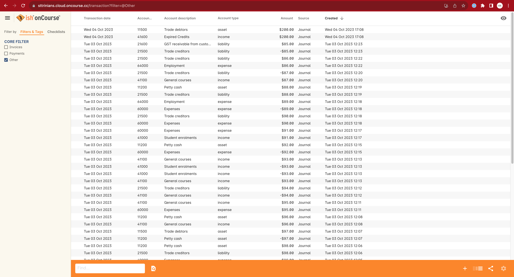

If you use an accounting system external to onCourse, you may decide to do your journalling there instead.

[[accounting-cash]]
=== FAQ: I want cash accounting

We are asked for this a lot by colleges who migrate to onCourse. Often this is because they might be used to managing accounting on paper or that's how they did things in their old accounting system. Usually the conversation starts like this:

"I get how onCourse works, and it looks great, but I really want to report the class name, code and income account alongside every payment. Surely onCourse can tell me what every payment was for!"

In a *Cash Accounting* system, this is slightly easier. You only assign income to your general ledger once you receipt payment. It is at that point you decide where to post that income in your P&L, breaking it up by account code as required. An *Accrual Accounting* system is more complex but also much more accurate. onCourse goes a step further and can be described as a *Deferred Accrual Accounting* system. Let's look at what that means.

Jane enrols in a class with you for $500 plus $50 GST. Her friend Bob enrols in another class for $435 with no GST. They enrol together on the same invoice under Jane's name. First, that $50 immediately goes to a liability since it is payable immediately to the tax office. Even before you receipt the payment. That's a nuisance for your cash flow, but at least the ATO gives you 22-50 days to pay. At the same time you have an asset (Jane owes you $985) and a liability ($935 worth of training needs to be delivered).

Now Jane pays you a first installment of $130. So if you wanted your 'cash payment income' report what would go on it? What happens if that $130 payment also finished paying off a previous invoice for $17.50 and only $112.50 went toward the new invoice?

Now you might cry "Oh, that never happens. Our accounts are simpler than that."

onCourse can't make those assumptions, and it certainly can't generate reports and exports which might sometimes be wrong based off an assumption that an invoice will never be partially paid, or that more than one invoice won't be paid at once or indeed that invoices only ever have one invoice line.

So how do you solve this? Separate your financial management reporting from your cash reconciliation audit. Don't mix them up. Look at your trial balance in onCourse to make management decisions. Look at detailed budget reports from the class list to analyse which classes have problems and which areas are doing well. Then look at the banking list and associated reports to balance the cash in your bank against what should be there. But don't try and do management high level analysis of the money landing in your bank. It will not end well.
