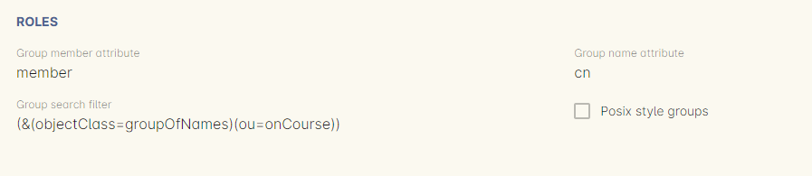
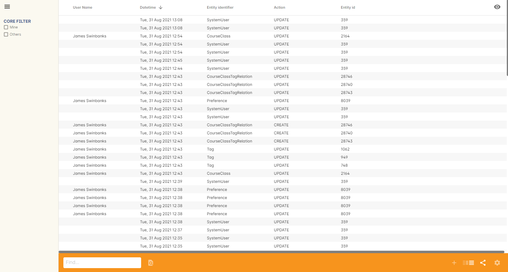

[[advancedSetup]]
== Advanced Setup and Configuration

[[advancedSetup-accessControl]]
=== Controlling User Access (authorisation)

==== Setting up Active Directory (AD) authentication and authorisation.

The below example has been completed with Windows Server 2003 R2 SP2 and onCourse 1.7.13. onCourse has the ability to use an external LDAP/AD server for authentication and authorisation, what we mean by this is that you do not need to use the onCourse user and group database but you can use your already setup AD database. Firstly on your Windows Server 2003 Machine go to "My Computer" right click and select "Properties" and you will find the following screen.

image::images/Windows_2003_system_properties.png[]

Please take careful note of the "Full Computer Name" and the "Domain" as with this information you now have the building blocks for our configuration.

Now the next thing we need to get the LDAP/AD authentication working is either the Administrator password or, a user account which is a member of the Administrators group. This is because when a query happens on the AD server it is required to login first before it can do any searches on users. If your administrators want to lock it down further they are welcome to do so, we only need read access to all user and group objects in the AD as well as the passwords for all of those users. So now we enter "Active Directory Users and Computers" and create our user: and add it to the administrators group and remember your password!

Now we have everything we need! Complete the setup screen as follows:

image::images/onCourse_LDAP_AD_screen_setup.png[]

Once you have substituted all of the settings as necessary press the "Test Connection" button to ensure that onCourse can bind to the LDAP server. Once that works, you can then go to the "Users" section of this configuration page and place "sAMAccountName" and (objectClass=user) for the search filter. Now test a user in your domain and see if it authenticates. If it works, congratulations you are now authenticating against your AD server!

==== AD Authorisation

Authorisation is the process of giving your users the correct rights when they are logged in, this has a direct relationship with the different roles you can setup or create within onCourse. If you wish to use your AD server to allocate roles to your users, complete the following:

At the top of your "Active Directory Users and Computers" create an "Organizational Unit" (OU) and call it "onCourse".

In that OU create security groups which reflect the names of the roles in onCourse. Say for example the roles which are build into onCourse (you can find this in the Security window in onCourse, under 'User Roles'):

* Administration Manager
* Course Manager
* Enrolment Officer
* Financial Manager

You can add or delete roles here as you wish, but a corresponding group must exist in AD for the authorisation/access rights to be allocated.

When you have created those groups in AD add the necessary users who belong to each group.

We can then turn it on the onCourse preferences under LDAP/Authorisation and Roles and set it up the same as the following picture:

[[advancedSetup-Help]]

=== Audit Logging

Audit logs are created when a record is created, edited or deleted. When a script fails or an email key collision occurs, an audit log record is also created. You can find the Audio Logs window by typing 'Audit Logs' into the search on the Dashboard, or by clicking the question mark icon on a window in onCourse, then clicking 'View audit trail'.

The Audit Log list view window displays all entities edited or created by each onCourse user and the date and time of that action.

The advanced search function in Audit logs allows you to search for a particular type of log e.g. script failure or log from a particular user.

Double clicking on the audit log for a script failure or email key collision will provide additional information in 'message' field in the edit view. Edit, create or delete logs do not show any additional information in the edit view.

You can also access the audit logs for a particular record by using the 'find related' feature from any list view.
For example, you can select a class and find the related audit logs for that one particular class, or from the user account record, all audit logs for one particular user.

