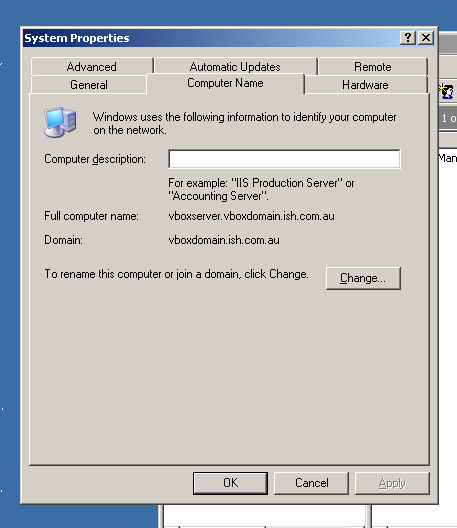

[[advancedSetup]]
== Advanced Setup and Configuration

This chapter outlines the advanced configuration options for access control, users and groups, using external databases and server memory allocation.

[[advancedSetup-accessControl]]
=== Controlling User Access (authorisation)

==== Setting up Active Directory (AD) authentication and authorisation.

The below example has been completed with Windows Server 2003 R2 SP2 and onCourse 1.7.13. onCourse has the ability to use an external LDAP/AD server for authentication and authorisation, what we mean by this is that you do not need to use the onCourse user and group database but you can use your already setup AD database.
Firstly on your Windows Server 2003 Machine go to "My Computer" right click and select "Properties" and you will find the following screen.

Please take careful note of the "Full Computer Name" and the "Domain" as with this information you now have the building blocks for our configuration.

Now the next thing we need to get the LDAP/AD authentication working is either the Administrator password or, a user account which is a member of the Administrators group.
This is because when a query happens on the AD server it is required to login first before it can do any searches on users.
If your administrators want to lock it down further they are welcome to do so, we only need read access to all user and group objects in the AD as well as the passwords for all of those users.
So now we enter "Active Directory Users and Computers" and create our user: and add it to the administrators group and remember your password!

Now we have everything we need!
Complete the setup screen as follows:

image:images/onCourse_LDAP_AD_screen_setup.png[image,scaledwidth=100.0%]

Once you have substituted all of the settings as necessary press the "Test Connection" button to ensure that onCourse can bind to the LDAP server.
Once that works, you can then go to the "Users" section of this configuration page and place "sAMAccountName" and (objectClass=user) for the search filter.
Now test a user in your domain and see if it authenticates.
If it works, congratulations you are now authenticating against your AD server!

==== AD Authorisation

Authorisation is the process of giving your users the correct rights when they are logged in, this has a direct relationship with the different roles you can setup or create within onCourse.
If you wish to use your AD server to allocate roles to your users, complete the following:

At the top of your "Active Directory Users and Computers" create an "Organizational Unit" (OU) and call it "onCourse".

In that OU create security groups which reflect the names of the roles in onCourse.
Say for example the roles which are build into onCourse (you can find this in "File" --> "Preferences" --> "Access" in onCourse):

* Administration Manager
* Course Manager
* Enrolment Officer
* Financial Manager

You can add or delete roles here as you wish but a corresponding group must exist in AD for the authorisation/access rights to be allocated.

When you have created those groups in AD add the necessary users who belong to each group.

We can then turn it on the onCourse preferences under LDAP/Authorisation and Roles and set it up the same as the following picture:

image:images/LDAP_AD_authorisation_settings.png[image,scaledwidth=100.0%]

That is all for Windows Server AD/LDAP authentication and authorisation!
good luck!

[[advancedSetup-serverconfigurationfile]]
=== Server configuration file

Sometimes the onCourse server defaults aren't perfect for your office.
Ports may be blocked, another server might already be set up.
We've added the ability to specify useful parameters in a configuration file that onCourse Server will check on startup.

Create a text file called with the name 'onCourse.cfg' and place in the same folder as the onCourse Server executable, whether that be running on Windows (.exe), OSX (.app) or Unix/Linux (.jar).

The directives allowed in this file are:

....
        ip – specify which IP addresses to listen on. Repeat this line as many times as you require.
        ssl_port – specify which port to listen on for SSL client connection.
        db – specify and URI for your database.
        max_concurrent_users - maximum number of users who can connect at once
        client_server_compression_level - compression between client and server connection. 0 is off, 6 is default and 9 is the maximum compression setting. More compression uses more CPU at each end.

....

A sample onCourse.cfg might contain:

....
        port=0
        ssl_port=8182
        db=jdbc:mysql//db.example.com/onCourse
        ip=192.168.0.1
        ip=192.168.0.2
        max_concurrent_users=10
        client_server_compression_level=8

....

examples of URLs for internal Derby database (OS X, FreeBSD):

....
        db=jdbc:derby:/Users/admin/onCourse/
        db=file:/Users/admin/onCourse/
....

examples of URLs for internal Derby databse (Windows):

....
        db=jdbc:derby:/C:/onCourse/
        db=file:/C:/onCourse/

....

[NOTE]
====
use 3 slashes after the protocol name 'file' in both cases, use /, not \ also under Windows, onCourse will replace all white spaces with '%20', If you use windows or there are white spaces in the URI path you must surround the URI with ".
====

[[advancedSetup-externalDatabase]]
=== Using an external database

In order to connect to external databases such as MySQL and MS SQL, onCourse Server needs to know where the external database lives.

Starting the server with special arguments (in the cases of headless configurations commonly found on Unix-derivative systems such as FreeBSD, Linux and Solaris), or choosing the external database option through GUI when first starting onCourse Server.

[NOTE]
====
connecting to an external database is a paid for feature, you must contact us to enable it.
====

A valid URI contains the following information: host, e.g. 203.29.62.146 or delish.ish.com.au, port, e.g. 1376, 3306 or 1521, database name, e.g. onCourse, user name, e.g. oncourse, password, e.g. oncourse, every vendor has its own URI (URL) format which has to be used (remind quotations) MS SQL Server:

....
                  db=jdbc:jtds:sqlserver://<host>:<port>/<dbName>;user=username;password=password
                  db=jdbc:jtds:sqlserver://203.29.62.146:1376/onCourse;user=oncourse;password=oncourse

....

MySQL:

....
                  db=jdbc:mysql://<host>:<port>/<dbname>?user=username&password=password
                  db=jdbc:mysql://delish.ish.com.au:3306/onCourse?user=oncourse&password=oncourse

....

It is not necessary to specify a port, if the default port is used.

More information about URIs at
http://blogs.msdn.com/ie/archive/2006/12/06/file-uris-in-windows.aspx

[[advancedSetup-serverMemory]]
=== Server Memory Allocation

In addition, you can specify a different memory utilisation for onCourse Server. onCourse Server will try to use all the memory you allocate to it, since it makes use of that memory for caching.
Up to a certain point, adding more memory will help, but after that more memory will have no effect or even slow things down since the server has more work to do managing all that cache.
You will have to tune your settings according to your own needs, but the default will do fairly well for most installations.

If you are running Linux or Unix, you will find the necessary settings in the startup script.
On Windows you need to create a text file with the name onCourseServer.vmoptions or onCourseService.vmoptions.
The name of this file before the dot must match exactly the name of your executable before the dot.
In that file put this:

....
-Xmx1500M
....

That will increase the cache to 1500 Mb for onCourse Server.
About another 80Mb will be used by the application itself, so the total usage will be those two combined.
On Windows 32bit, never go past 1.5Gb for onCourse because of limitations in Windows.
A Unix or OSX 32bit environment will allow you to assign up 3.5Gb.

The onCourseServer.log will report errors of java.lang.OutOfMemoryError if you have given the onCourse Server insufficient RAM for your usage requirements.
Prior to this your end users may also detect processing errors, such as failing enrolments.

Beyond what you have allocated to onCourse, make sure the server has sufficient RAM to run the operating system and other applications.
It is very important that the server doesn't swap memory to disk at any time or you will encounter major performance problems.

In a 64bit operating system you can install more than 4Gb of RAM in the server memory.
OS X users will be running 64bit by default.
We recommend installing 64bit operating systems for all servers.

[[advancedSetup-Help]]
=== Log files

The onCourse server application and the onCourse client application both create daily log files.
The onCourse server log levels are set by the onCourse database manager inside the config file.

=== Audit Logging

Audit logs are created when a record is created, edited or deleted.
When a script fails or an email key collision occurs, an audit log record is also created.
You can find the Audio Logs window by typing 'Audit Logs' into the search on the Dashboard, or by clicking the question mark icon on a window in onCourse, then clicking 'View audit trail'.

The Audit Log list view window displays all entities edited or created by each onCourse user and the date and time of that action.

The advanced search function in Audit logs allows you to search for a particular type of log e.g. script failure or log from a particular user.

Double clicking on the audit log for a script failure or email key collision will provide additional information in 'message' field in the edit view.
Edit, create or delete logs do not show any additional information in the edit view.

You can also access the audit logs for a particular record by using the 'find related' feature from any list view.
For example, you can select a class and find the related audit logs for that one particular class, or from the user account record, all audit logs for one particular user.

image:images/audit_log_list_view.png[ The list view of the audit logs,scaledwidth=100.0%]
