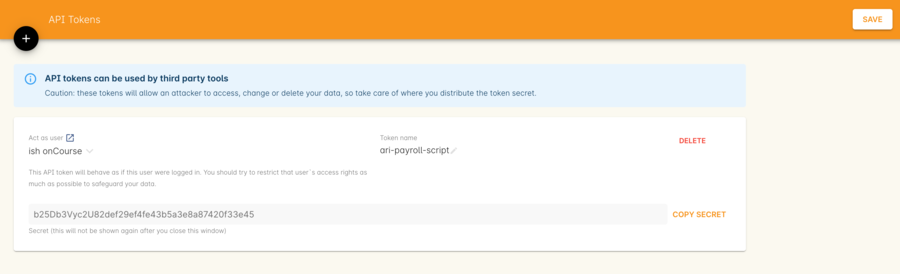

[[api]]
== API

onCourse can be accessed by third party tools through its API. This allows those tools to access, update, create, print, export and even delete records from onCourse. Anything you can do in the onCourse user interface you can do from the API.

The onCourse API is RESTful with json encoding of objects. It can only be accessed over TLS and HTTP/2.

Read the https://www.ish.com.au/onCourse/doc/server-api/v1/[documentation] for specifics of how to access the data you need.

[[api-security]]
=== API Security

You'll provide access by creating API tokens in the Security window. When you create a token you'll be given a token password which is then used to access the API. Once you close the window you'll never be able to see that password again, but you can easily create a new one.

You should create a separate token password for each service you want to connect to onCourse. Keeping them separate gives you more control.

Each API token acts as a particular onCourse user. This will show in audit logs and might be shown in the user interface as the user who created an invoice, added a note or performed some other task.

[TIP]
====
Make sure that onCourse user has the minimum permissions possible. Remember that these API connections can change or destroy data, fill up your document storage or do any number of other harmful things. So reduce the exposure of those tokens by reducing permissions to just what is needed.
====

=== Examples

In the following examples, we've used `curl` installed from https://brew.sh/[homebrew] because the existing curl installation in OSX is not capable of the latest TLS 1.3 standard.

First, we get a list of records, similar to what you see in the onCourse list view.

[source,shell]
----
 /usr/local/opt/curl/bin/curl --location --request GET 'https://sttrinians.cloud.oncourse.cc/a/v1/list?entity=CourseClass&search=startDateTime+next+month' --header 'Authorization: b25Db3Vyc2U731853f97e624424ba1a922a5a15e700'
----

[source,json]
----
{
	"entity": "CourseClass",
	"search": "startDateTime next month",
	"pageSize": 4,
	"offset": 0,
	"sort": [{
		"attribute": "startDateTime",
		"ascending": true,
		"complexAttribute": []
	}],
	"columns": [{
		"title": "Code",
		"attribute": "uniqueCode",
		"type": null,
		"sortable": true,
		"visible": true,
		"system": null,
		"width": 200,
		"sortFields": ["course.code", "code"]
	}, {
		"title": "Course",
		"attribute": "course.name",
		"type": null,
		"sortable": true,
		"visible": true,
		"system": null,
		"width": 232,
		"sortFields": []
	}, {
		"title": "Starts",
		"attribute": "startDateTime",
		"type": "Datetime",
		"sortable": true,
		"visible": true,
		"system": null,
		"width": 200,
		"sortFields": []
	}, {
		"title": "Ends",
		"attribute": "endDateTime",
		"type": "Datetime",
		"sortable": true,
		"visible": true,
		"system": null,
		"width": 200,
		"sortFields": []
	}, {
		"title": "Sessions",
		"attribute": "sessionsCount",
		"type": null,
		"sortable": true,
		"visible": true,
		"system": null,
		"width": 55,
		"sortFields": []
	}, {
		"title": "Fee",
		"attribute": "feeIncGst",
		"type": "Money",
		"sortable": false,
		"visible": true,
		"system": null,
		"width": 107,
		"sortFields": []
	}, {
		"title": "Tutor",
		"attribute": "tutorsAbridged",
		"type": null,
		"sortable": false,
		"visible": true,
		"system": null,
		"width": 200,
		"sortFields": []
	}, {
		"title": "Site name",
		"attribute": "room.site.name",
		"type": null,
		"sortable": true,
		"visible": true,
		"system": null,
		"width": 200,
		"sortFields": ["room+.site+.name"]
	}, {
		"title": "Enrolments",
		"attribute": "validEnrolmentCount",
		"type": null,
		"sortable": false,
		"visible": true,
		"system": null,
		"width": 200,
		"sortFields": []
	}, {
		"title": "Vacancies",
		"attribute": "placesLeft",
		"type": null,
		"sortable": false,
		"visible": true,
		"system": null,
		"width": 200,
		"sortFields": []
	}, {
		"title": "Cancelled",
		"attribute": "isCancelled",
		"type": "Boolean",
		"sortable": true,
		"visible": false,
		"system": true,
		"width": 200,
		"sortFields": []
	}, {
		"title": "Web visible",
		"attribute": "isShownOnWeb",
		"type": "Boolean",
		"sortable": true,
		"visible": false,
		"system": true,
		"width": 200,
		"sortFields": []
	}, {
		"title": "Enabled",
		"attribute": "isActive",
		"type": "Boolean",
		"sortable": true,
		"visible": false,
		"system": true,
		"width": 200,
		"sortFields": []
	}, {
		"title": "Self paced",
		"attribute": "isDistantLearningCourse",
		"type": "Boolean",
		"sortable": true,
		"visible": false,
		"system": true,
		"width": 100,
		"sortFields": []
	}, {
		"title": "Time zone",
		"attribute": "clientTimeZoneId",
		"type": null,
		"sortable": false,
		"visible": false,
		"system": true,
		"width": 200,
		"sortFields": []
	}],
	"rows": [{
		"id": "2915",
		"values": ["ACCt2-1", "Accounting Term 2", "2021-04-04T23:00:00.000Z", "2021-06-21T00:00:00.000Z", "12", "150.00", "Eliatan Hill", "Newtown Learning", "0", "999", "false", "false", "true", "false", "Australia/Sydney"]
	}, {
		"id": "2992",
		"values": ["BBBeginners-1", "Bread Baking", "2021-04-07T00:00:00.000Z", "2021-05-05T06:00:00.000Z", "5", "132.00", "John Tutor", "The Lions Club Building", "4", "26", "false", "true", "true", "false", "Australia/Sydney"]
	}, {
		"id": "3007",
		"values": ["BJ1-18", "Beginning Japanese 1", "2021-04-20T04:15:38.000Z", "2021-11-09T04:15:38.000Z", "30", "1100.00", "James Banks", "Newtown Learning", "0", "20", "false", "true", "true", "false", "Australia/Sydney"]
	}, {
		"id": "2998",
		"values": ["ELE4-1", "Certificate V in Electrical", "2021-04-29T23:00:00.000Z", "2021-10-29T06:00:00.000Z", "27", "1760.00", "John Tutor", "Newtown Learning", "0", "10", "false", "true", "true", "false", "Australia/Sydney"]
	}],
	"filteredCount": 4,
	"layout": "Two column",
	"filterColumnWidth": 246
}
----

Next, we'll fetch a single class by id.

[source,shell]
----
/usr/local/opt/curl/bin/curl --location --request GET 'https://sttrinians.cloud.oncourse.cc/a/v1/list/entity/courseClass/2992' --header 'Authorization: b25Db3Vyc2U731853f97e624424ba1a922a5a15e700'
----

[source,json]
----
{"id":2992,"code":"1","courseId":1057,"courseCode":"BBBeginners","courseName":"Bread Baking","endDateTime":"2021-05-05T06:00:00.000Z","startDateTime":"2021-04-07T00:00:00.000Z","attendanceType":"No information","deliveryMode":"Classroom","fundingSource":"Domestic full fee paying student","budgetedPlaces":20,"censusDate":null,"createdOn":"2021-03-03T22:22:51.000Z","modifiedOn":"2021-03-15T01:28:42.000Z","deposit":132.00,"detBookingId":null,"expectedHours":0,"feeExcludeGST":132.00,"finalDetExport":null,"initialDetExport":null,"isActive":true,"isCancelled":false,"isDistantLearningCourse":false,"isShownOnWeb":true,"maxStudentAge":null,"maximumDays":null,"maximumPlaces":30,"message":"Remind student to bring own apron","midwayDetExport":null,"minStudentAge":null,"minimumPlaces":5,"sessionsCount":5,"suppressAvetmissExport":false,"vetCourseSiteID":null,"vetFundingSourceStateID":null,"vetPurchasingContractID":null,"vetPurchasingContractScheduleID":null,"webDescription":null,"relatedFundingSourceId":null,"qualificationHours":null,"nominalHours":30.00,"classroomHours":30.00,"studentContactHours":0,"reportableHours":0,"roomId":526,"virtualSiteId":null,"taxId":1,"summaryFee":null,"summaryDiscounts":null,"enrolmentsToProfitLeftCount":8,"allEnrolmentsCount":4,"allOutcomesCount":4,"inProgressOutcomesCount":4,"passOutcomesCount":0,"failedOutcomesCount":0,"withdrawnOutcomesCount":0,"otherOutcomesCount":0,"successAndQueuedEnrolmentsCount":4,"canceledEnrolmentsCount":0,"failedEnrolmentsCount":0,"tags":[],"documents":[],"isTraineeship":false,"customFields":{},"feeHelpClass":false}
----
