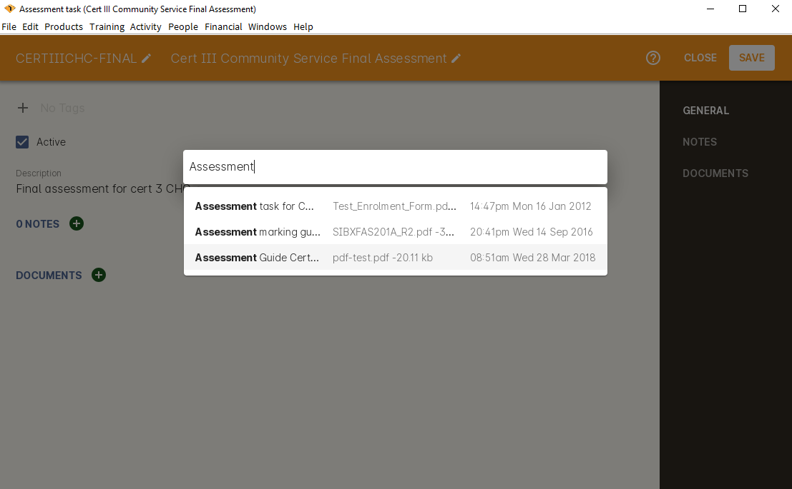
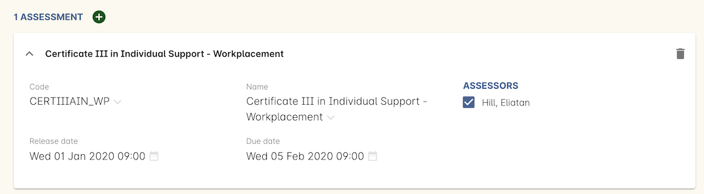
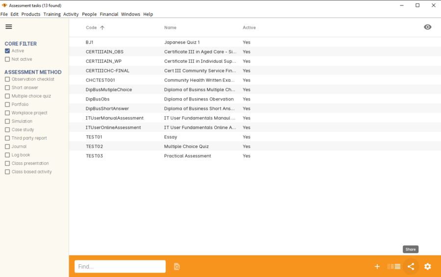
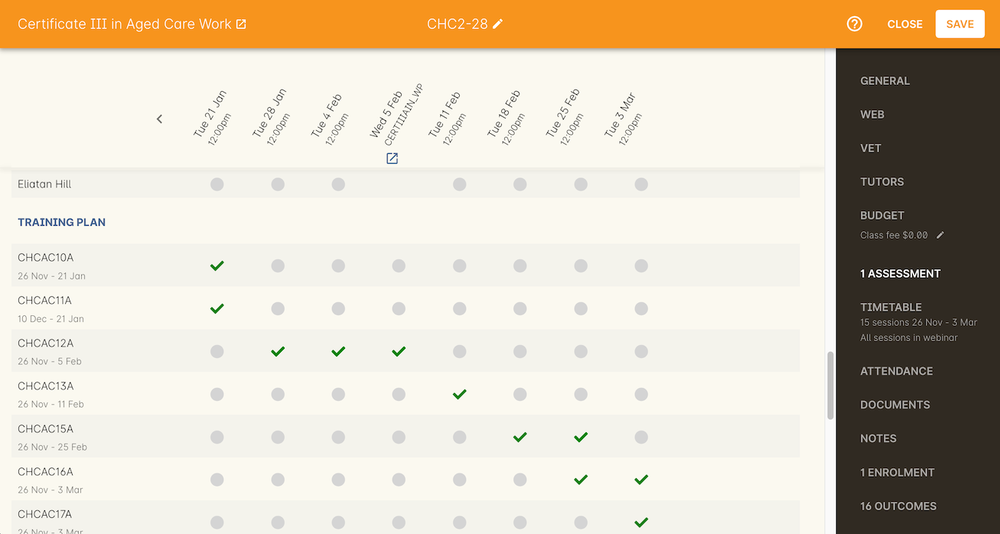
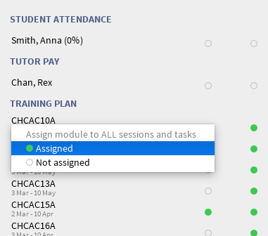

[[assessment]]
== Assessment

[[assesment-whatIs]]
=== Assessment in onCourse

Assessments are tasks that you create and assign to classes in onCourse. When an assessment task is assigned to a class, it has a release date, due date and assessor nominated.

An assessment comprises a name, description and attached documents, and is designed to:

* Instruct the candidate, or student, of the assessment activity they are required to complete for the assessment task
* Instruct the assessor, or tutor, of the marking guidelines and criteria for the assessment

[[assesment-creating]]
=== Creating an Assessment task

Assessments can be set as 'active' or 'not active'. Only active assessments can be assigned to classes.

. Type 'Assessment tasks' into the Dashboard search and click the link to open the Assessment tasks list view
. In the bottom right-hand corner, click the plus button to create a new assessment task
. Give your assessment task a code and name you will remember. This is how you will look up the task later.
. Add a description to the description field that describes the overall assessment task and its requirements. This will be visible to candidates and assessors in their web portal. The description field allows for rich text entry, so you can format your text with headings and other elements to make the content easy to read.

image::images/assessment/assessment_task_general.png[title='The general tab of an assessment task']

Any content added to the notes tab is internal, and will not be visible to candidates or assessors.

To add a document to the assessment, click the + button to the right of the Documents heading, type the name you gave the document in onCourse, or click the Browse button to upload a new document from your machine. Add any assessment documents to distribute to the candidates or assessors. Be sure to set the appropriate permission for each document attached e.g. 'Tutors and enrolled students' for documents that the candidates and assessors can access like the assessment task instructions, and 'Tutors only' for documents that only the assessors can access, such as marking guides.

When you're done, save and close the assessment task. By default, it will be set as 'Active', so you can add it to classes.

[[assesment-class]]
=== Assigning an Assessment task to a class

After you have created your assessment tasks in onCourse, you can assign them to classes. To do this:

. Open an existing class and click on Assessments in the right-hand column.
. Click on the plus button next to the heading Assessments.
. Type in the code or name of the assessment task to look it up and add it to the class.
. Select from the existing class tutor list who will be set as the assessor responsible for marking this assessment task for the class group. You can select multiple assessors if multiple tutors are assigned to the class.
. Enter an optional release date. The release date is when the assessment task is made visible to students enrolled in this class through the portal. You may choose to make this a date prior to the class commencement, on commencement, during or after training. If you do not set a date here, the assessment task will be available on enrolment.
. Enter a due date. This is when the students are required to submit their completed assessment task.
. Save the class to save the assessment. You can repeat this process to add multiple assessments to a class as needed.

During the class duplication process your assigned assessments will be duplicated also, and moved forward by the same date schedule, unless you uncheck this option.

[[assesment-listview]]
=== Assessment tasks list view

The Assessment task list view uses pre-populated filters for the status, and comes with its own set of Assessment specific tags. You can add to or delete the individual tags, but the tag and tag group cannot be edited.
Assessment tasks can have more than one tag.

=== Training and Assessment Plans

Assessments assigned to the class inform the training and assessment plan for that class.

In the VET section of the class record, you will see all sessions, outcomes, and scheduled assessments for a class under the heading 'Training Plan'.

Assessments will be mixed with the scheduled sessions based on their date. Some assessments will have due dates during the class training period where other assessments will have due dates after the training period is complete.

For each assessment task, you can indicate if a scheduled unit of competency will be assessed via that task by assigning the unit to the task.

In this example, there is an assessment task due on 5 Feb (with an open related icon link). This assessment task has been linked to the third unit of competency listed in the class. Assessment tasks can be linked to more than one module if need be.

If the assessment due date is after the class completion, outcomes attached to the assessment will have end dates linked to the due date.

The training plan set up in the VET section can also be modified in this view. There is a tick / untick all units assigned to a session date. This allows you to set up the training plan per column of this view.

You can tick or untick all sessions assigned to the unit. Next to each unit code is a chevron that appears when you hover over the name. Clicking here give you a drop down list to assign the unit to all sessions and tasks, or unassign the unit to all sessions and task. This allows you to bulk edit the training plan per row.

Between the column and row edit options, you can quickly create your class training and assessment plan.

==== How training and assessment plans calculate outcome start and end dates

Outcome start and end dates are inherited from the class attendance settings. If you have an Assessment task attached to the outcome the end date will be the last due date of the last Assessment task.

If you class has no scheduled sessions (a self paced class) the outcome start and end date will default to the day the student enrolled (start date) plus the 'maximum number of days to complete' (end date). If no 'maximum number of days to complete' has been set, the end date will default to 12 months after the start date.
