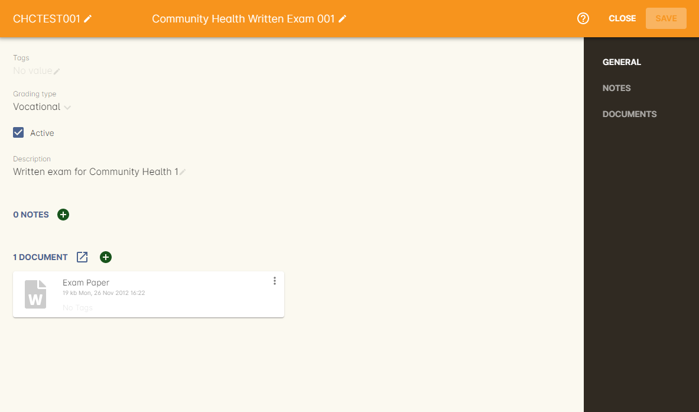
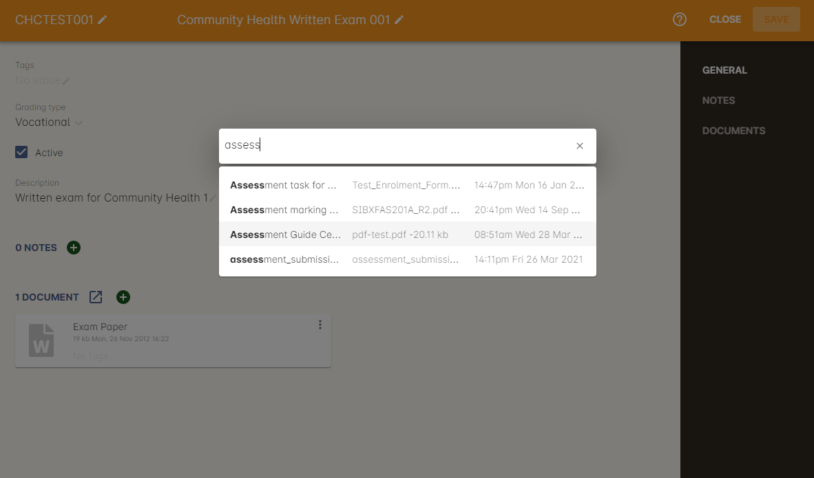
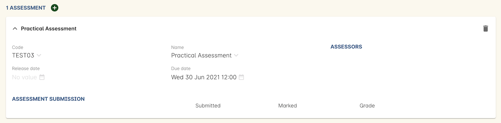
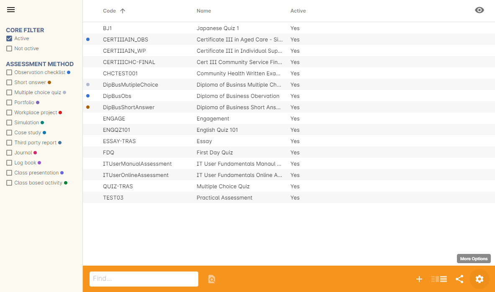
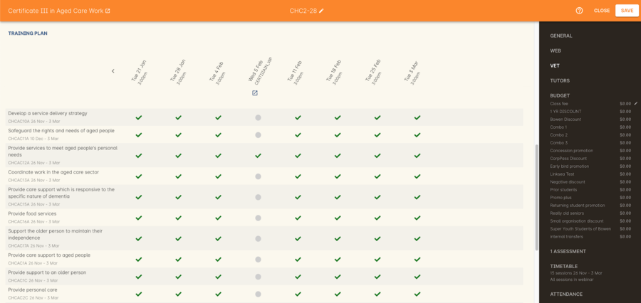
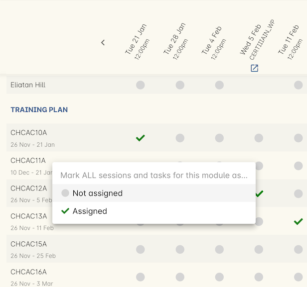
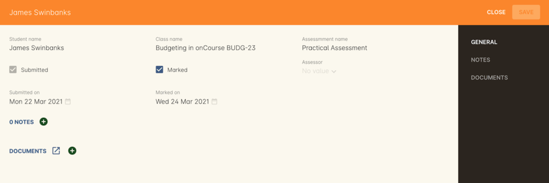
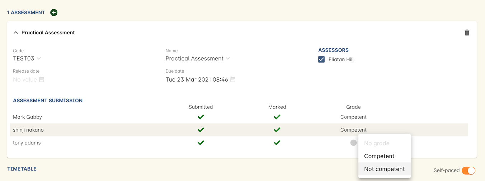
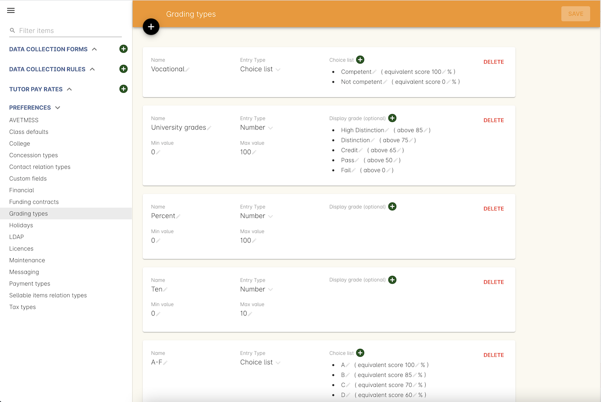
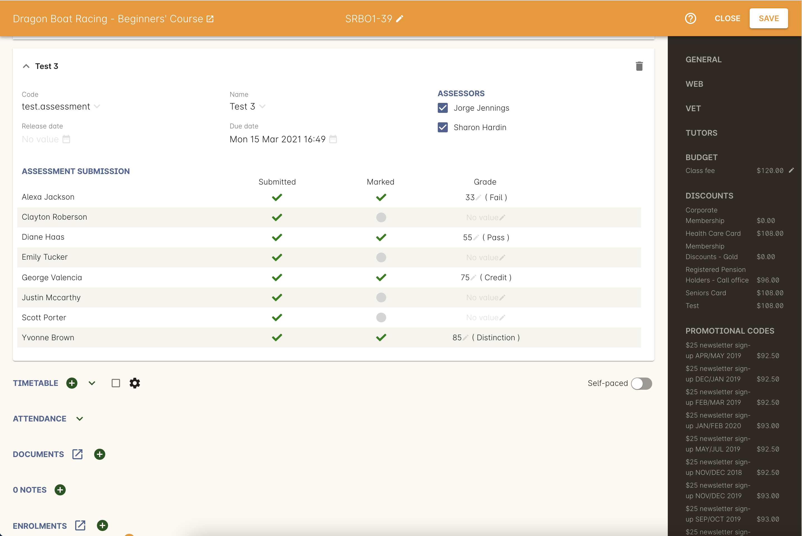

[[assessment]]
== Assessment tasks

You can access Assessments by finding 'Assessment tasks' in the Dashboard.

[[assesment-whatIs]]
=== Assessments in onCourse

Assessment tasks are records that you create and assign to classes in onCourse. When an assessment task is assigned to a class, it has a release date, due date and assessor nominated, as well as a 'submitted on' date and 'marked on' date for each student enrolled in the class. Next to these dates is a 'grade' column, where you can set the student's assessment score according to criteria set in the Preferences > Grading types section.

An assessment task comprises a name, description and attached documents, and is designed to:

* Instruct the candidate, or student, of the assessment activity they are required to complete for the assessment task
* Instruct the assessor, or tutor, of the marking guidelines and criteria for the assessment

[[assesment-creating]]
=== Creating an Assessment task

Assessments can be set as 'active' or 'not active'. Only active assessments can be assigned to classes.

. In the bottom right-hand corner of the assessment tasks window, click the + button to create a new assessment task
. Give your assessment task a code and name you will remember. This is how you will look up the task later.
. Add a description to the description field that describes the overall assessment task and its requirements. This will be visible to candidates and assessors in their web portal. The description field allows for rich text entry, so you can format your text with headings and other elements to make the content easy to read.

Any content added to the notes tab is internal data and will not be visible to candidates or assessors.

To add a document to the assessment, click the + button to the right of the Documents heading, type the name you gave the document in onCourse, or drag and drop the document into the window from your desktop.

Add any assessment documents to distribute to the candidates or assessors. Be sure to set the <<documentManagement-accessRights, appropriate permission>> for each document attached.

When you're done, save and close the assessment task. By default, it will be set as 'Active', so you can add it to classes.

[[assesment-class]]
=== Assigning an Assessment task to a class

After you have created your assessment tasks in onCourse, you can assign them to classes. To do this:

. Open an existing class and click on Assessments in the right-hand column.
. Click on the plus button next to the heading Assessments.
. Type in the code or name of the assessment task to look it up and add it to the class.
. Select from the existing class tutor list who will be set as the assessor responsible for marking this assessment task for the class group. You can select multiple assessors if multiple tutors are assigned to the class.
. Enter an optional release date. The release date is when the assessment task is made visible to students enrolled in this class through the portal. You may choose to make this a date prior to the class commencement, on commencement, during or after training. If you do not set a date here, the assessment task will be available on enrolment.
. Enter a due date. This is when the students are required to submit their completed assessment task.
. Save the class to save the assessment. You can repeat this process to add multiple assessments to a class as needed.

During the class duplication process your assigned assessments will be duplicated also, and moved forward by the same date schedule, unless you uncheck this option.

[[assesment-listview]]
=== Assessment tasks list view

The Assessment task list view uses pre-populated filters for the status, and comes with its own set of Assessment specific tags. You can add to or delete the individual tags, but the tag and tag group cannot be edited. Assessment tasks can have more than one tag.

[[assesment-trainingPlan]]
=== Training and Assessment Plans

For VET classes, assessment tasks assigned to the class inform the training and assessment plan for that class.

In the VET section of the class record, you will see all sessions, outcomes, and scheduled assessments for a class under the heading 'Training Plan'.

Assessments will be mixed with the scheduled sessions based on their date. Some assessments will have due dates during the class training period where other assessments will have due dates after the training period is complete.

For each assessment task, you can indicate if a scheduled unit of competency will be assessed via that task by assigning the unit to the task.

In this example, there is an assessment task due on 5 Feb (with an open related icon link). This assessment task has been linked to the third unit of competency listed in the class. Assessment tasks can be linked to more than one module if need be.

If the assessment due date is after the class completion, outcomes attached to the assessment will have end dates linked to the due date. Additonally, if an assessment has a marked on date set, as this is usually after the day of submission, that will become the primary end date for the outcome.

The training plan set up in the VET section can also be modified in this view. There is a tick / untick all units assigned to a session date. This allows you to set up the training plan per column of this view.

You can tick or untick all sessions assigned to the unit. Next to each unit code is a chevron that appears when you hover over the name. Clicking here give you a drop down list to assign the unit to all sessions and tasks, or unassign the unit to all sessions and task. This allows you to bulk edit the training plan per row.

Between the column and row edit options, you can quickly create your class training and assessment plan.

[[assessment-submissions]]
=== Assessment Submissions

Assessment submissions is another window in onCourse that automatically creates a new record any time an assessment task is marked as submitted by a student.

The record contains the student name, class name, assessment task name, two checkboxes for 'submitted' and 'marked', a grade field for grading, a date field for each checkbox, and notes and documents.

The 'marked' date field can also have a tutor applied to it, to denote who marked the assessment.

[[assessment-bulkChangingOutcomes]]
==== How training and assessment plans calculate outcome start and end dates

Outcome start and end dates are inherited from the class training plan settings.

If you have an assessment task attached to the outcome in the training plan section of the class, the end date for that outcome will become the 'marked on' date of the assessment.

You can change this in bulk for a whole class by setting a marked on date for all students. Open the assessment task record in the class and hover your mouse over the Marked heading, a calendar icon appears. Click the icon and set a date, then save the record. Provided this date is past the currently set outcome end date, this date will now show as the outcome end date.

If your class has no scheduled sessions (a self paced class) the outcome start and end date will default to the day the student enrolled (start date) plus the 'maximum number of days to complete' (end date). If no 'maximum number of days to complete' has been set, the end date will default to 12 months after the start date.

=== Bulk adding or removing tags

You can add or remove tags in bulk from assessment task records by, in the list view, highlighting the records you wish to change, clicking the cogwheel and selecting either 'add tags' or 'remove tags'. Select the tag and click 'Make Changes'.

[[assessment-gradingTypes]]
=== Grading types
In the Preferences window of onCourse there is a Grading types section where you will be able to define the various types of grades offered on assessments. onCourse has numerous default options that cover a number of standard assessment scoring methods, however you can also create your own by hitting the + button at the top of this section.

There are two types of grading:

* *By Number* - For when you simply want to choose a score between the minimum and maximum set values, usually 0 to 100.
* *by Choice List* - Lets you choose from a set of defined options, which can also map to a score if you wish. E.G. The University grades type uses terms like High Distinction, Distinction, Credit, Pass and Fail, but all of these also map to scores as well. If both a score and choice type are set, then both will display in the assessment submission record.

[NOTE]
====
If an assessment has no grading type set, then the 'Marked' and 'Grade' columns will not appear in the assessment submission view.
====