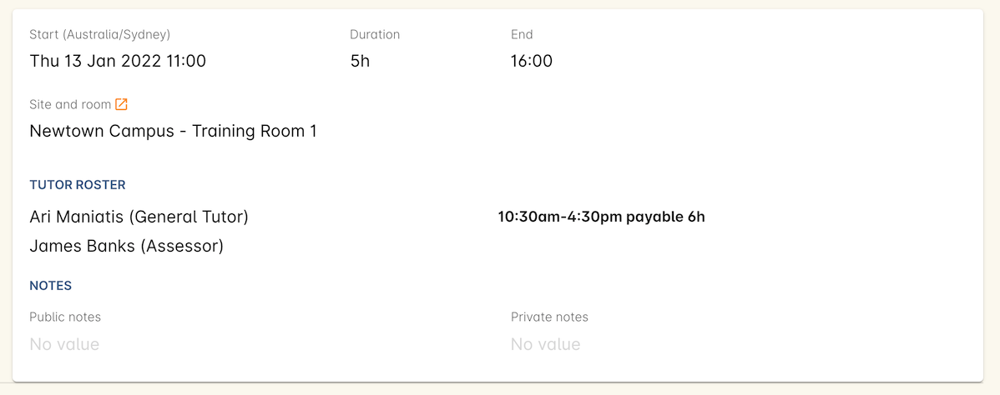
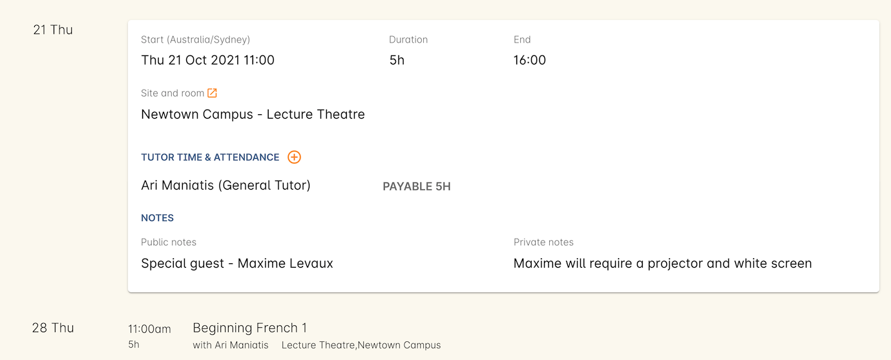
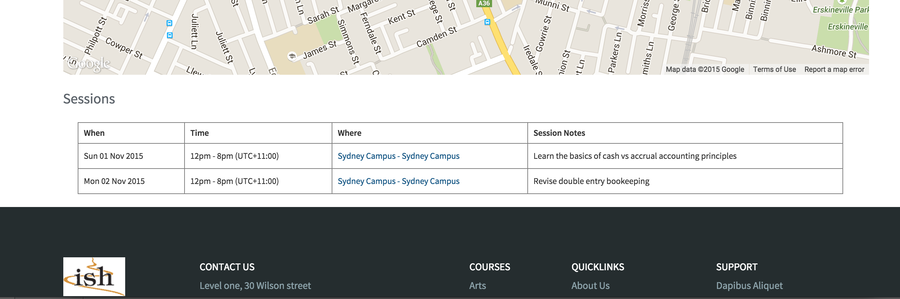

[[classes-timetable]]
== Class type and timetable

The class timetable is where you set up the class type (timetabled, self-paced or hybrid) which is how a class is delivered.

* *Timetabled* - These are standard classes that are made of one or more sessions.
* *Self-paced* - These are classes that have no scheduled timetable, but rather a set time to completion.
* *Hybrid* - Allows for a combination of timetabled sessions and self-paced study. Students are required to attend a minimum number of sessions to be considered 'completed'.

For a <<classes-aboutSelfPaced,self-paced>> class, ensure the 'self-paced' switch is turned on within this section, then save and close the record. For <<classes-hybrid,Hybrid>> classes, make sure the 'Is Hybrid' switch is turned on and that you set a minimum number of sessions for completion as well as set up at least the same number of sessions.

For a class with <<classes-aboutClassTimetables,timetabled sessions>> you'll need to create each session. Sessions have their own start and end time, tutors, sites and rooms. Tutors assigned to sessions can each have their own rostered hours, separate of the session.

For classes with lots of sessions, create one and then duplicate the rest from that initial session.

[[classes-timetableSessions]]
=== Creating sessions

In the timetable section of the class record, hit the + button to create a new session. First enter the start date and time, then the session's duration in hours; this will fill in the session end time.

Next, set the location of the session by setting the site and the room that the session will take place in.

[CAUTION]
====
If the Tutor Time and Attendance section appears empty, then you haven't added any tutors to the class. Add your tutors to the class by clicking the + button next to the Tutors heading and filling in the fields. Once added, come back to this section.
====

Click + next to Tutor Time and Attendance and select one of your class tutors from the drop-down list. By default, any tutor added to the session will be assigned a roster exactly the same as the session. E.G. if the session starts at 9am and ends at 3pm, any assigned tutor will by default have the same roster; 9am to 3pm, unless explicitly changed.

To set a custom roster, click the chevron next to the tutor's name reveal the roster start, roster end and payable time fields, as well as the attendance notes field. Add your times and ensure the payable duration is correct. If the roster is different from the session, this will appear next to the tutor's name in the session card.

Lastly, set any public or private notes for the session. These are covered later in this chapter.

==== How to easily create multiple sessions for different days

The following is a detailed example of how you would add sessions for a class on different days of the week. This example will use the scenario of a user wanting to add a total of 10 sessions over consecutive Saturdays and Sundays.

The idea here is to create the first session for each different day of the week the sessions are being held on, and then we'll duplicate those sessions as many times as we need. First we'll create the first Saturday session, then we'll create the first Sunday session. Lastly, we'll duplicate those sessions four more times each so that they take place each subsequent week from the first session, making it a 10 session class.

Here's how:

In the timetable section of the class record, hit the + button to create a new session. First enter the start date and time, then the session's duration in hours; this will fill in the session end time.

Next, set the location of the session by setting the site and the room that the session will take place in. Lastly, add tutors to your session.

Below is an example of how your first class will look once filled out. This one starts on the Saturday 03rd June 2023 at 9am. The class goes for 6 hours, and each tutor has the same roster as the session timetable. If any tutor is given a different roster, this will be clearly indicated next to their name.

Next, repeat the steps above but for the Sunday session. When you're done, you should have two sessions, one for Saturday and one for Sunday.

Now we need to create the other sessions. Rather than going through all of that again, we'll simply duplicate both sessions four times each, giving us five sessions on Saturday, five sessions on Sunday, and a total of ten sessions altogether. In the session you wish to duplicate first, click the repeat button, it's directly to the left of the delete icon inside the session view.

image::images/class_repeat_icon.png[title='The Repeat Session icon']

Set the number of times you want the session to repeat, and then how regularly you want it repeated. You can select between Hours, Days (including weekends), Days (excluding weekends), Weeks, Months and Years. For this example we'll set this to repeating 4 times and to repeat every week.

Press the button 'create sessions'. You should now see the sessions for Saturday appearing like so:

image::images/after_repeat_session.png[title='Newly repeated sessions appear like this until you save the class']
Now you need to do all of this again for the Sunday sessions. Once completed, your timetable should appear as the example below.

If you create any sessions in error, simply hit the delete button on that session and it will be removed.

image::images/new_class_timetable_example.png[title='The ten class sessions for the scenario described above.']

[[classes-tutorRoster]]
=== Tutor rostering

You can set a separate roster for each tutor, per session.

When creating a session, click the name of the tutor you want to set a new roster for and the roster fields, including payable duration, will display. Here you can set the roster start and end time, and the payable duration for the session, which will directly flow on to the tutor pay when generated.

Once a separate roster has been set, you will be able to see this clearly marked for each tutor. Tutors with nothing indicated use the same roster as the session.

[NOTE]
====
Session times and tutor roster times are separate, so if you attach tutors to a session and then alter the session time, the tutor roster WILL NOT update as well. Ensure you set all your sessions first before setting tutors and their rosters.
====

[[classes-bulk-change-sessions]]
=== Bulk changing sessions

If you make a mistake in setting up a class and happen to duplicate that mistake across all your sessions, the easiest and fastest way to resolve it will be to use the bulk editing tool.

You can select all sessions, or individual sessions, to edit or delete entirely either by clicking the checkbox next to each record, or clicking the checkbox next to the Timetable heading in the class edit view to select all sessions for this class.

Select your sessions using the checkbox, as shown in the screenshot below

image::images/bulk_edit_select_sessions.png[title='The checkbox next to the Timetable heading will select all sessions']

Click the Cogwheel next to this checkbox. Here you can choose whether you want to delete all the selected sessions, or edit them

Selecting 'Bulk change...' will open up a pop-over window where you can select what aspects of the sessions you want to edit. Tick the checkboxes to mark what you want to change. Here's what you can edit in bulk:

. Tutors - Allows you to select which tutors to assign to the selected sessions. *REMEMBER:* Tutors must be added to the Class before they can be added to the sessions
. Location - Allows you to change the Site and Room setting for the selected sessions
. Actual Payable Duration - Allows you to set a new payable duration amount in hours and minutes e.g. 3 hours and 30 minutes would be expressed as `3h 30m`
. Start Time - Allows you to set a new start time for the selected sessions. Click the clock icon in the field to select a new time, or type it out e.g. 12:45 pm is simply 12:45, while 5:45pm would be written as `17:45`.
. Duration - Allows you to set the duration of the class e.g. 3 hours and 30 minutes would be expressed as `3h 30m`
. Move Forward - Allows you to move the sessions forward a set number of days.
. Move Backward - Allows you to move the sessions backwards a number of days.

image::images/bulk_change_sessions_popover.png[title='The bulk change pop-over. Both Payable Duration and Move Forward have been selected here']
Click the Update button. This confirms the changes and updates the selected sessions.

[[classes-collision-detection]]
=== Session collision detection

If you create sessions with tutors, rooms or timetables that clash in any way, you'll be notified within the Timetable of the class edit view. Clashes appear in red, but will not stop you from creating a session. They are only provided as a guide, not a hard-stop form of validation.

image::images/session_collision.png[title='Multiple clashes have been detected. Clashes also take into account holidays set in General Preferences']

[[classes-aboutClassTimetables]]
=== About class timetables

The timetable section is used to create sessions for your class. You can set the following for each individual session:

* If a class is self-paced
* Session times
* Tutor(s) assigned to deliver each session
* Session Duration in hours and minutes. You can also enter 3.5 for 3h 30mins
* Tutor roster - Set separate start and end times for tutors based on a roster.
* Payable duration - the time payable to the tutor, for example this could be shorter than the session duration by 30mins to account for an unpaid break, or longer than the session duration to account for coordination duties
* Private notes (for scheduling or equipment notes)
* Public notes (for session content you want to publish to students and the web)

You can also see if any sessions or resources you have chosen conflict with other existing bookings. This might be other classes in the same room, or with the same tutor, or unavailability bookings across the whole college, or linked resource.

Each session can also have its own public and private notes. Public notes are designed for information you want to publish to students like the training content of each session. Private notes are for internal notes like resourcing or room configuration issues you want to record for the delivery of each session.

==== Adding public and private information to class sessions

Click on a single session in the timetable section to view the fields for adding public and private session information.

The public information will appear on your onCourse website, to provide additional information to students enrolling in the class about the content they will learn each session, or any special instructions for materials they need to bring for the session.

Any information added to public notes will also appear inside the student and tutor portal for the session. The tutor will also see the private notes.

The private information will appear on printed reports that your venue coordinators can be given. Private information may be useful for recording information you don't want seen publicly. The report 'Class Timetable Report - Planning' can be accessed from either the site, room or class share windows.

image::images/session_hover.png[title='The public notes showing in the session information hover on the website']

image::images/portal_private_public_notes.png[title='The tutor portal view shows both the private and public notes recorded for each session']

[[classes-aboutSelfPaced]]
=== About self-paced classes

Self-paced classes are classes that do not have sessions but a set time to completion.

Switching on 'self-paced' within the Timetable section will update the display to show different fields for the user to add both the 'maximum days to complete' and the 'expected study hours' for this class. You can also select a virtual site for this class. You can learn more about virtual sites in our <<sites-virtual, sites chapter>>.

Please note that by nominating the class as self-paced, the class record will no longer display a timetable or attendance, and any session you had previously created for the class will be deleted.

image::images/class_general_tab_self_paced_settings.png[title='Set the class as Self-Paced using the switch in the Timetable section']

[NOTE]
====
When setting a given class as self-paced, the start date and end date for the student outcomes are set as follows:

* Start date = the date the student enrols in the Class
* End date = the start date plus the maximum days to complete that has been set for the class.
====

Self-paced classes display online similarly to a timetabled class. The words 'self-paced' appear in place of the start and end dates and instead of a fixed duration, show the words 'approximately xx hours' based on the expected study hours you set in the class general section.

As there is no start or end date, self-paced classes will stay online and available for enrolment until you choose to change their status and remove them from website display.

image::images/self_paced_online.png[title='This is an example of a self paced class which has been enabled for online enrolment']

[[classes-hybrid]]
=== About hybrid classes

Hybrid classes are classes that have a combination of timetabled sessions alongside a self-paced component.

Switching on 'Hybrid' within the Timetable section will update the display to show different fields for the user to add both the 'maximum days to complete' and the 'expected study hours' for this class. You can also select a virtual site for this class. You can learn more about virtual sites in our <<sites-virtual, sites chapter>>.

Hybrid classes must also have at least one session. You will not be able to save the class if it's set as Hybrid and there isn't at least one session and a maximum number of days to complete set.

[NOTE]
====
When setting a given class as hybrid, the start date and end date for the student outcomes work the same as in standard classes. You can set units of competency to be delivered on certain dates, or onCourse will just use the default start and end session dates. Otherwise, if it's a non-VET class, the start date will be the date of enrolment, while the end date will be the date of the last session. As always, these can be overidden using the override fields in each outcome.
====

Hybrid classes display online similarly to a timetabled class, showing the date of the first session, as well as the expected hours to completion.

[[payroll-Unavailability]]
==== Availability rules

All bookable resources in onCourse, such as sites, rooms and tutors can be given availability rules. After you have created these rules the unavailable periods will be highlighted in the timetable with a warning if you try to book the resources in a way that conflicts with their availability. Double bookings receive the same warning i.e. when you try to assign a tutor to two classes whose sessions overlap. onCourse does not prevent you from making double bookings as their may be legitimate reasons for you to do this, it just brings them to your attention.

You can flag a Tutor as not available, for whatever reason, in the following way:

. In an open tutor record, click the + button next to the Availability Rules header. This will create a new rule.
. Add the start and end dates and times. You can choose whether it will be all day and how often to repeat the record, e.g. you may have someone who is not available any Thursday, so you'd add a Thursday date, and then repeat every week.
. The 'next' box is most useful when repeating days, as it will show you each day the tutor is out in the coming future. Set an end repeat date is required.
. You can delete an availability rule by clicking the Delete button, and then confirming.

image::images/unavailabilities.png[title='Tutor unavailblity set']
