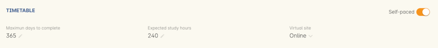
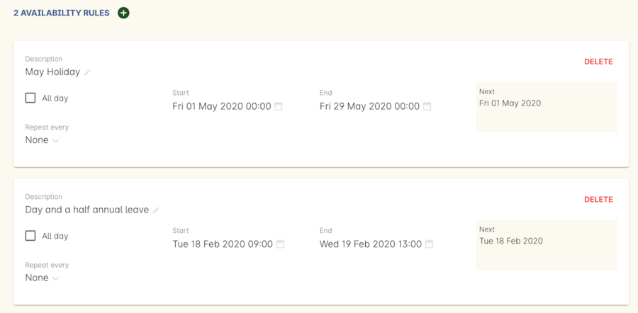

[[classes-timetable]]
== Class timetable

The class timetable is where you set up how a class is delivered; either through one or more sessions, or as a self-paced class.

For a <<classes-aboutSelfPaced,self-paced>> class, ensure the 'self-paced' switch is turned on within this section, then save and close the record.

For a class with <<classes-aboutClassTimetables,timetabled sessions>> you'll need to create each session. Sessions have their own start and end time, tutors, sites and rooms. For classes with lots of sessions, create one and then duplicate the rest from that initial session.

[[classes-timetableSessions]]
=== Creating sessions

The following is a detailed example of how you would add sessions for a class on different days of the week. This example will use the scenario of a user wanting to add a total of 10 sessions over consecutive Saturdays and Sundays.

The idea here is to create the first session for each different day of the week the sessions are being held on, and then we'll duplicate those sessions. So first we'll create the first Saturday session, then we'll create the first Sunday session. Then, we'll duplicate those sessions four more times each so that they take place each subsequent week from the first session, making it a 10 session class.

Here's how:

In the timetable section of the class record, hit the + button to create a new session. First enter the start date and time, then the session's duration in hours. You can also edit the payable duration, which ties to your tutor pay settings allowing you to exclude times for breaks etc. If you've assigned tutors to the class, you'll be able to leave a check mark next to the tutors who will be assigned to this session. Lastly, you can set the location from a list of your Sites and Rooms.

Below is an example of how your first class will look once filled out. This one starts on the Saturday 03rd June 2023 at 9am. The class goes for 6 hours, though the lecturer is paid for 5 hours and 30 minutes due to an unpaid 30-minute break. The selected tutor for this session is James Swinbanks, and he's being paid at the Course Manager pay rate, although Eliatan Hill could also be selected. The session will take place at Sydney Campus in the Training Lab.

image::images/payable_hours.png[title='You can have a different value for the session duration and for the sessions payable hours']

Next, repeat the steps above but for the Sunday session. When you're done, you should have two sessions, one for Saturday and one for Sunday.

Now we need to create the other sessions. Rather than going through all of that again, we'll simply duplicate both sessions four times each, giving us five sessions on Saturday, five sessions on Sunday, and a total of ten sessions altogether. In the session you wish to duplicate first, click the repeat button, it's directly to the left of the delete icon inside the session view.

Set the number of times you want the session to repeat, and then how regularly you want it repeated. You can select between Hours, Days (including weekends), Days (excluding weekends), Weeks, Months and Years. For this example we'll set this to repeating 4 times and to repeat every week.

image::images/duplicate_sessions.png[title='You can have a different value for the session duration and for the sessions payable hours']

Press the button 'create sessions'. You should now see the sessions for Saturday appearing like so:

Now you need to do all of this again for the Sunday sessions. Once completed, your timetable should appear as the example below.

If you create any sessions in error, simply hit the delete button on that session and it will be removed.

image::images/new_class_timetable_example.png[title='The ten class sessions for the scenario described above.']

[[classes-bulk-change-sessions]]
=== Bulk changing sessions

If you make a mistake in setting up a class and happen to duplicate that mistake across all your sessions, the easiest and fastest way to resolve it will be to use the bulk editing tool.

You can select all sessions, or individual sessions, to edit or delete entirely either by clicking the checkbox next to each record, or clicking the checkbox next to the Timetable heading in the class edit view to select all sessions for this class.

Select your sessions using the checkbox, as shown in the screenshot below

Click the Cogwheel next to this checkbox. Here you can choose whether you want to delete all the selected sessions, or edit them

image::images/sessions_edit_cogwheel.png[title='Your two choices when bulk editing sessions; delete or edit']

Selecting 'Bulk change...' will open up a pop-over window where you can select what aspects of the sessions you want to edit. Tick the checkboxes to mark what you want to change. Here's what you can edit in bulk:

. Tutors - Allows you to select which tutors to assign to the selected sessions. *REMEMBER:* Tutors must be added to the Class before they can be added to the sessions
. Location - Allows you to change the Site and Room setting for the selected sessions
. Payable Duration - Allows you to set a new payable duration amount in hours and minutes e.g. 3 hours and 30 minutes would be expressed as `3h 30m`
. Start Time - Allows you to set a new start time for the selected sessions.
lick the clock icon in the field to select a new time, or type it out e.g. 12:45 pm is simply 12:45, while 5:45pm would be written as `17:45`.
. Duration - Allows you to set the duration of the class e.g. 3 hours and 30 minutes would be expressed as `3h 30m`
. Move Forward - Allows you to move the sessions forward a set number of days.
. Move Backward - Allows you to move the sessions backwards a number of days.

Click the Update button. This confirms the changes and updates the selected sessions.

[[classes-collision-detection]]
=== Session collision detection

If you create sessions with tutors, rooms or timetables that clash in any way, you'll be notified within the Timetable of the class edit view. Clashes appear in red, but will not stop you from creating a session. They are only provided as a guide, not a hard-stop form of validation.

[[classes-aboutClassTimetables]]
=== About class timetables

The timetable section is used to create sessions for your class. You can set the following for each individual session:

* If a class is self-paced
* Session times
* Tutor(s) assigned to deliver each session
* Session Duration in hours and minutes. You can also enter 3.5 for 3h 30mins
* Payable duration - the time payable to the tutor, for example this could be shorter than the session duration by 30mins to account for an unpaid break, or longer than the session duration to account for coordination duties
* Private notes (for scheduling or equipment notes)
* Public notes (for session content you want to publish to students and the web)

You can also see if any sessions or resources you have chosen conflict with other existing bookings. This might be other classes in the same room, or with the same tutor, or unavailability bookings across the whole college, or linked resource.

Each session can also have its own public and private notes. Public notes are designed for information you want to publish to students like the training content of each session. Private notes are for internal notes like resourcing or room configuration issues you want to record for the delivery of each session.

image::images/class_timetable_view.png[title='This class shows a number of sessions with double booked resources']

==== Adding public and private information to class sessions

Click on a single session in the timetable section to view the fields for adding public and private session information.

The public information will appear on your onCourse website, to provide additional information to students enrolling in the class about the content they will learn each session, or any special instructions for materials they need to bring for the session.

Any information added to public notes will also appear inside the student and tutor portal for the session. The tutor will also see the private notes.

The private information will appear on printed reports that your venue coordinators can be given. Private information may be useful for recording information like, TV & DVD player needed for this session. The report 'Class Timetable Report - Planning' can be accessed from either the site, room or class share windows.

image::images/session_notes_class.png[title='The public and private notes fields in the session']

image::images/session_hover.png[title='The public notes showing in the session information hover on the website']

image::images/session_class_page.png[title='The public notes showing at the end of the class page on the website']

image::images/portal_private_public_notes.png[title='The tutor portal view shows both the private and public notes recorded for each session']

[[classes-aboutSelfPaced]]
=== About self-paced classes

Self-paced classes are classes that do not have sessions but a set time to completion.

Switching on 'self-paced' within the Timetable section will update the display to show different fields for the user to add both the 'maximum days to complete' and the 'expected study hours' for this class. You can also select a virtual site for this class. You can learn more about virtual sites in our <<sites-virtual, sites chapter>>.

Please note that by nominating the class as self-paced, the class record will no longer display a timetable, and any session you had previously created for the class will be deleted.

[NOTE]
====
When setting a given class as self-paced, the start date and end date for the student outcomes are set as follows:

* Start date = the date the student enrols in the Class
* End date = the start date plus the maximum days to complete that has been set for the class.
====

Self-paced classes display online similarly to a timetabled class. The words 'self-paced' appear in place of the start and end dates and instead of a fixed duration, show the words 'approximately xx hours' based on the expected study hours you set in the class general section.

As there is no start or end date, self-paced classes will stay online and available for enrolment until you choose to change their status and remove them from website display.

image::images/self_paced_online.png[title='This is an example of a self paced class which has been enabled for online enrolment']

[[payroll-Unavailability]]
==== Availability rules

All bookable resources in onCourse, such as sites, rooms and tutors can be given availability rules. After you have created these rules the unavailable periods will be highlighted in the timetable with a warning if you try to book the resources in a way that conflicts with their availability. Double bookings receive the same warning i.e. when you try to assign a tutor to two classes whose sessions overlap. onCourse does not prevent you from making double bookings as their may be legitimate reasons for you to do this, it just brings them to your attention.

You can flag a Tutor as not available, for whatever reason, in the following way:

. In an open tutor record, click the + button next to the Availability Rules header. This will create a new rule.
. Add the start and end dates and times. You can choose whether it will be all day and how often to repeat the record, e.g. you may have someone who is not available any Thursday, so you'd add a Thursday date, and then repeat every week.
. The 'next' box is most useful when repeating days, as it will show you each day the tutor is out in the coming future. Set an end repeat date is required.
. You can delete an availability rule by clicking the Delete button, and then confirming.

