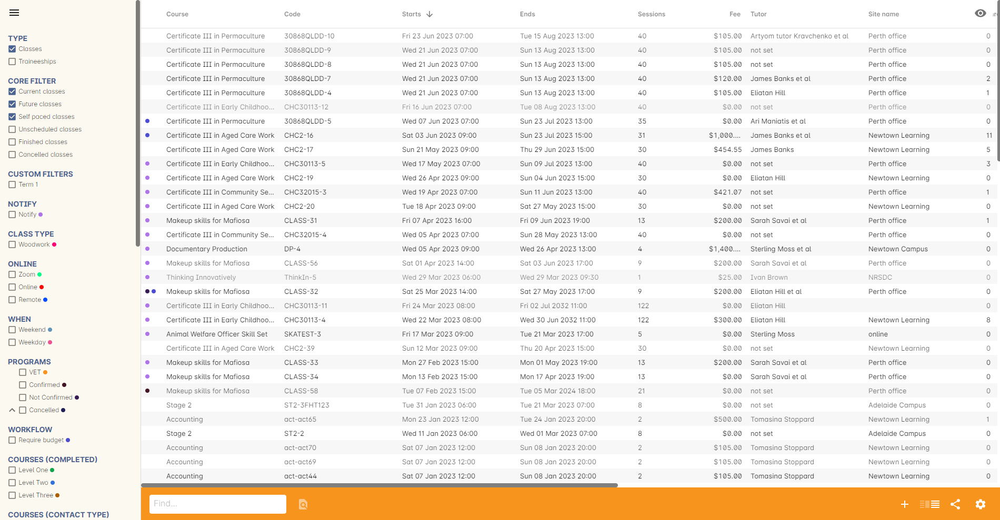
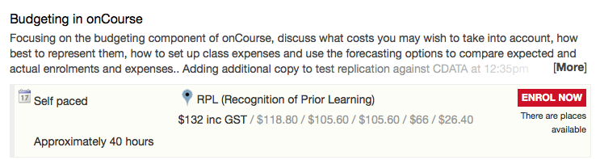
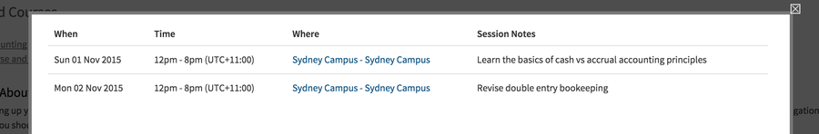
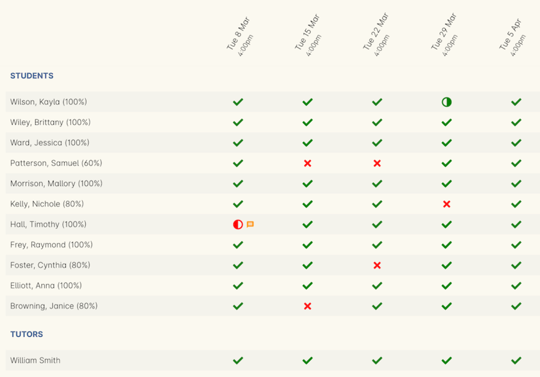
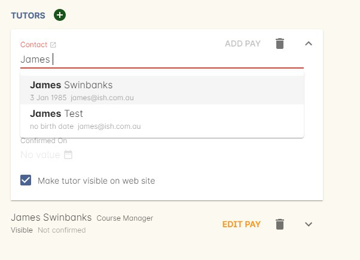
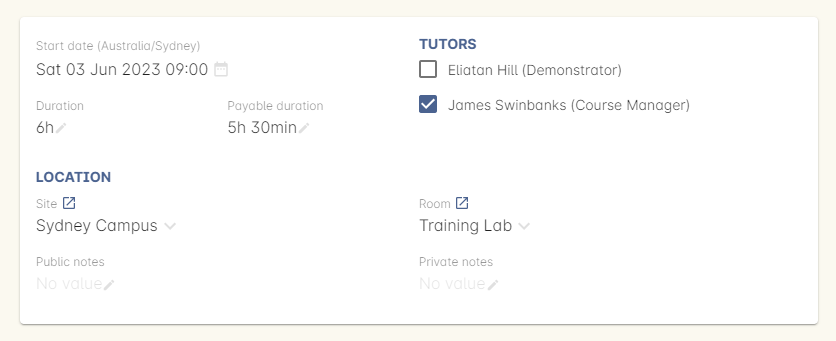
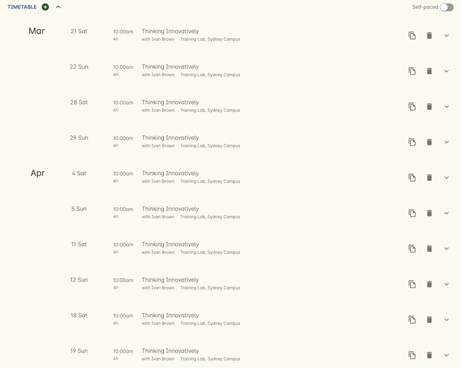

[[classes]]
== Creating Classes

[[classes-Definitions]]
=== onCourse Terms and Definitions

Course::
A course is the training product delivered by your organisation.
For example: Computers for Beginners, Advanced Jewellery Making or MYOB for Professionals.
A course can be given any course code to identify that course uniquely.
Class::
A class is the instance of a course run at a particular time and date, led by one or more tutors and with a group of students enrolled.
Classes may meet for one or more sessions depending on the subject outline and timetable.
Timetable::
Each class has a timetable which represents each meeting between the students and the tutor(s).
The timetable can link to rooms and sites and each session in the timetable has the flexibility to be allocated to a different tutor or a different room.
Students::
A student is a person enrolled in a class.

[[classes-workingWith]]
=== Working with Classes

All records in onCourse can be viewed in either a list view or record view.
You need to open the list view to access individual records.

To access the class records go to the Dashboard and search for Classes.
Click the result to view the Classes list view.

You can enter a class record by double clicking on it in the window.

[[classes-specialFunctions]]
=== Special Class Functions

==== Cogwheel icon

image:images/cog.png[ The cog wheel - used to perform special actions to selected classes,scaledwidth=100.0%]

On the classes list view you will see a cog wheel icon on the right hand side of the window.
If you highlight one or more classes in the list and then click on the cog wheel, a drop down list will appear offering a range of different options.
Some of these functions are only available through the cog wheel, while others are options that you can set in an individual class, but though the cog wheel can set for a group of classes.

* *Send message to students from x class* - This option allows you to send email and/or sms, or postal messages to students enrolled in the selected class or classes.
You might use this option to let all the students enrolled in classes with a particular tutor know that their tutor is sick and classes this week are cancelled.
* *Send message to tutors from x class* - You can contact the tutor from one or more classes using this options.
You might use it to notify all tutors who are teaching this term of a staff meeting.
* *Duplicate x class* - To create another instance of an existing class, the duplicate function will save you the effort of setting all the information again.
Need to offer another class in a fortnight?
Duplicate the class and move it forward by 14 days.
You can also move a whole term of classes forward to the next term in one action.
When duplicating a class with a payment plan, the payment plan structure is duplicated across as well.
+
These options are saved separately for each user, so the next time you have to duplicate a class the previous selections you made should be saved and carry over.
+
image:images/duplicating_a_class.png[ Duplicating a class,scaledwidth=100.0%]
* *Cancel class* - If a class is not viable, you can use this cogwheel function to cancel it and create credit notes for all the enrolled students.
Students can't enrol in cancelled classes.
* *AVETMISS export* - Exporting AVETMISS from the classes window allows you to export the data for one or more classes for a funding submission.
A whole term or year's worth of data can be exported from the Export window.
* *Create certificates* - For VET classes, this will create Statements of Attainment or Qualifications for all eligible students.
For all other classes, this option will create a Certificate of Attendance for all enrolled students.
* *Generate payslips for x class* - Use this option to create payslips for a selected group of classes.
* *Show class on website* - You can add classes in bulk to your onCourse website with this option, instead of doing it one at a time in the individual class window.
* *Remove class from website* - Use this option to remove classes in bulk from your onCourse website.

[[classes-recordTabs]]
=== Class Record View

[[classes-General]]
==== General

This is a summary section where you can edit the Class Code, apply tags and control any restrictions around the age limits for enrolment, whether the class is visible online and controlling whether enrolment is even allowed or disabled.

You can click any of the heading in the right-hand column to be taken to that section of the record instantly.

You can select from the following options:

* Enrolments Allowed - If turned on, enrolments will be enabled for this class

As well as all this, the general section has a handy summary above the status drop down list:

* Timetable Summary - including number of sessions, start and end dates (if applicable), Site and Room information
* Budget Summary - including Class fee which can be adjusted via the edit link to amend the fee amount.
* Discounts fee rates applicable to this Class
* Indicative information on number of enrolments required to meet the Class running costs
* Tutor Summary - listing all teaching staff assigned to the Class
* Tags - any class specific tags that have been attached to this record
* Message alert for operator - important information you wish to share with your fellow onCourse users about this class e.g. 'remind enrolling students there is no class on the Queen's Birthday long weekend'.
The copy entered here will appear in red text inside QuickEnrol when this class is selected for enrolment.
This information is not published to the web.

This overview and these calculations are designed to show you at a glance if the class is financially viable based on the budget expenses and current enrolment numbers.

You can also set minimum and maximum enrolment ages for the class in this window.
These restrictions apply only for enrolment in this particular instance of the class, and will prevent students without a date of birth from enrolling in this class, as well as preventing students who don't meet the age requirements from enrolling.

image:images/class_general_tab.png[ Example of content within the Class/General section,scaledwidth=100.0%]

[[classes-Tutor]]
==== Tutor

This section allows you to add one or more current tutors to the class.
If the tutor has an employment end date in the past, and is no longer and active employee you cannot select them in this section.
You will need to go to their contact and remove the end date before you can add them to a class.

Tutors roles can be selected, tutors can be confirmed and tutor payrates set.
You can also choose if the tutor is to be published as part of the class promotional material, either online or in a printed format.
Select the "Show this tutor in class information" checkbox to have the tutor appear on your onCourse website linked to the class and in any exports or reports you run.

If you show you tutors in your onCourse website, this also allows their associated profile picture, resume/bio and links to other classes they are teaching to be displayed.

Tutor roles are defined in the onCourse preferences > Tutor roles.
This is where you can name the roles specific to your organisation and set the default pay rates that apply to a tutor of this role type.
More information about this feature can be found in thelink:#payroll[Payroll Chapter].
You can override the payrate that applies for this particular instance of the class where needed, while keeping the relationship to the original tutor role name.

Tutors can use their skillsOnCourse portal to confirm their availability to teach the class, or you can manually set the date they confirm in their tutor record.

If you select the option 'Add the selected tutor to all class sessions' the tutor will be ticked against each session.
This will create a payroll line for the tutor for that session.
You can check and uncheck each tutor per session in the timetable section.

image:images/class_tutor_tab.png[ Edit view of Tutor window to allow a Tutor to be assigned and tutor role to be set,scaledwidth=100.0%]

[[classes-Budgets]]
==== Budget

The budget feature is enabled with some paid onCourse support contracts.
Check your college's support agreement to see if this feature has been enabled for your organisation.

Class budgets allow users to add additional income, expense and wages lines to assist your program coordinators to determine the profitability of a class.
In addition to the income collected from your current enrolments, you can predict the income and expenses you will incur for any projected number of enrolments.

This function can be particularly useful for long term income planning.
For example, if you are in a position to schedule your classes a year in advance, you can predict the income for each class based on the class budget.
Throughout the year you can compare your actuals to your predicted income and see how you are tracking against the budget.

For more information about how to create a class budget and track expenditure and income for classes, visit link:budgets.html[budgets]

image:images/class_budget_tab.png[ The budget section outlines all costs associated with a class,as well as income and profit margins,scaledwidth=100.0%]

[[classes-Timetable]]
==== Timetable

The timetable section is used to create sessions for your class.
You create sessions individually, although the fast way to create multiple sessions is to create one, and then duplicate it, which is explained
link:#classes-duplicate-sessions[in the section below].
From here you can set the following:

* If a class is self-paced
* Session times
* Tutor(s) assigned to deliver each session
* Session Duration in hours and minutes.
You can also enter 3.5 for 3h 30mins
* Payable duration - the time payable to the tutor, for example this could be shorter than the session duration by 30mins to account for an unpaid break, or longer than the session duration to account for coordination duties
* Training plan (for courses with multiple units of competency attached)
* Private notes (for scheduling or equipment notes)
* Public notes (for session content you want to publish to students and the web)

The timetable section let's you view the class sessions in different visual formats, via switching the tabs on the bottom on the page between:

* Day
* Week
* 8 Weeks
* Month
* List - offers a summary of all sessions and their attributes like start date and time, tutors and duration.

In the class timetable, you can also see if any sessions or resources you have chosen conflict with other existing bookings.
This might be other classes in the same room, or with the same tutor, or unavailability bookings across the whole college, or linked resource.

If the parent course of your class is linked to multiple units of competency you can use the class timetable to create a training plan.
By default, all outcomes will be set to be delivered on all sessions of the class, meaning the start and end date of each student outcome will default to the start and end date of the class.
More information about creating training plans is available in the link:rto.html[RTO chapter]

Each session can also have it's own public and private notes.
Public notes are designed for information you want to publish to students like the training content of each session.
Private notes are for internal notes like resourcing or room configuration issues you want to record for the delivery of each session.

image:images/class_timetable_view.png[ This class shows a number of sessions with double booked resources,scaledwidth=100.0%]

[[classes-duplicate-sessions]]
===== Creating multiple sessions

You can create multiple sessions quickly by using the duplicate function.
You can duplicate any session by clicking the repeat icon, which sits directly to the left of the delete icon.
Here you can set the number of times you want the sessions to repeat, and the regularity with which they repeat.

[NOTE]
====
Duplicating sessions is the best way to create classes with more than one session.
====

You can repeat sessions every:

* Hour
* Day (excluding weekends)
* Day (including weekends)
* Week
* Month
* Year

===== Self paced classes

If you select Self Paced learning within the general section, the section will update to display additional fields for the operator to add the Maximum days to complete and the Expected study hours for this Class.
You can also select a Virtual sitefor this Class.
Please note that by nominating that the Class is to be self paced, the Class record will no longer display a Timetable, as this is not relevant for a self-paced class.
Any sessions you have previously created in the timetable will be deleted when you set a class to self paced.

image:images/class_general_tab_self_paced_settings.png[ Set the class as Self-Paced using the switch in the Timetable section,scaledwidth=100.0%]

[NOTE]
====
When setting a given Class as Self Paced, the start date and end date for the student outcomes are set as follows:

* Start Date is the date the student enrols in the Class
* End date is the start date plus the maximum days to complete that has been set for the Class via the General section.
====

Self paced classes display online similar to a timetabled class.
The words 'self paced' appear in place of the start and end dates and instead of a fixed duration, show the words approximately xx hours' based on the expected study hours you set in the class general section.
As there is no start or end date, self paced classes will display online and available for enrolment until you choose to change their status and remove them from website display.

===== Adding public and private information to class sessions

Click on a single session in the timetable section to view the fields for adding public and private session information.

The public information will appear on your onCourse website, to provide additional information to students enrolling in the class about the content they will learn each session, or any special instructions for materials they need to bring for the session.

You can also use rich text in the public notes field, as per other web information fields, to format information into lists, or separate with headings.
This information will also appear inside the student and tutor portal for the session.
The tutor will also see the private notes.

The private information will appear on printed reports that your venue coordinators can be given.
Private information may be useful for recording information like, TV & DVD player needed for this session.
The report 'Class Timetable Report - Planning' can be accessed from either the site, room or class share windows.

image:images/session_notes_class.png[ The public and private notes fields in the session,scaledwidth=100.0%]

image:images/session_class_page.png[ The public notes showing at the end of the class page on the website,scaledwidth=70.0%]

image:images/portal_private_public_notes.png[ The tutor portal view shows both the private and public notes recorded for each session,scaledwidth=70.0%]

[[classes-Attendance]]
==== Attendance

For each session created, and each student enrolled or tutor attached to the class, an attendance record will be created.
Both students and tutors can be marked and you can add notes to the attendance record.
The percentage attendance will be calculated and displayed next to the student name.
Tutor attendance is used for payroll calculations.

Click the cross-section of the date and student you want to mark attendance for and the icon will change.
You can select only three of the five options using method; Attended (green tick), Absent without reason (a red x) and Not Marked (a grey circle).
To mark a single session as partial attendance or absent with reason, you must hover your mouse over the icon, then select the notes icon that appears next to it.
From here, you can select any of the five following icons, as well as add a note for the reason.
Attendance records with notes will show this icon at all times.

* Attended - accompanied by a green tick
* Absent with reason - accompanied by a grey cross
* Absent without reason - accompanied by a red cross
* Partial attendance- accompanied by a clear tick
* Not marked - accompanied by little icon of person

You can edit a student's or tutor's attendance in bulk by clicking their name in the attendance list.
This will show you a dropdown list of options you can select.
You will also see a calculation of the percentage the class the student has attended, to monitor the student's attendance requirements.

Sessions that are marked as attended, partially attended (minutes of attendance) or absent with reason will contribute to the student's positive attendance percentage calculation.
Sessions that are marked as partially attended (minutes of non-attendance) and absent without reason will contribute to the student's negative attendance calculation.
Sessions not yet marked do not contribute to the overall calculation of attendance, nor do sessions marked in advanced (attendance marking for days after today).

[[classes-VET]]
==== VET

This section relates to RTOs.
AVETMISS reporting defaults and VET Fee Help funding source information can be set here for the whole class group, and modified on a student by student basis via their enrolment or outcome records as needed.
You can also suppress all data related to this class, including its enrolments and outcomes from reporting by choosing the 'Do not report for AVETMISS' switch.

Please note some of these reporting fields are state specific.
This is indicated in the field label.
The default values of the 'Delivery mode' and 'Funding source national' can be set in the general preferences AVETMISS section.

The Qualification and nominal hours shown here are based on the values set for the qualification and units attached to the parent course.
A summary of the classroom hours (from the timetabled sessions) and student contact hours (nominal hours multiplied by the number of students enrolled) is also displayed.

You can override the hours reported for this class by editing the reportable hours field.
It will default to reporting the nominal hours, or the classroom hours if no nominal hours have been supplied.
The reportable hours field allows you to enter numbers with decimal places, but this value will be rounded to the nearest whole number during the AVETMISS export process, as per the requirements of the standard.

image:images/class_vet_tab.png[ The class vet section,with the VET Fee Help fields displayed,scaledwidth=100.0%]

[[classes-Web]]
==== Web

You can add class specific web information to this section to appear on the public website, and in the student and tutor portals for this class.

Most advertising information will come from the course record's marketing section.
Content added to the class web section will appear in the class display box with the heading: Important information.
It is recommended that you only use this field for limited content, like 'Funding available for existing workers' or 'This class is assessment only for RPL/RCC candidates'.

image:images/website_class_description.png[ Example of content in the class Web section displayed within the class summary,scaledwidth=100.0%]

==== Documents

Class specific documents and attachments can be uploaded and cloud-stored in this section to be displayed either publicly, in the student portal or privately hosted for internal use.
Just click the +
button next to the section header, this will show a pop-over.
If you've already uploaded the document to onCourse, type in the name you gave the file when you uploaded it and then select it from the drop down list of selections.
If you can't find your file, you likely named it differently and should try something else.

If the file isn't uploaded yet, select the file off your desktop by clicking the Browse button.
This will open a window where you can browse your computer for the file and then upload it.
Once the upload is complete, the window will allow you to enter a name for the file, set its access level, apply any tags, write a description and a checkbox that sets whether the document is allowed to be attached to multiple records at the same time.
Once finished, click Add and the document will be added to the class.

Access levels can be set as public, private, tutors and enrolled students only and tutors only.
You can read more about the specifics of each access level
link:documentmanagement.xml#documentManagement-accessRights[here, in the
Document Management] section of our manual.

image:images/classes_documents.png[ A new document being added,with access rights set to Private,scaledwidth=100.0%]

[[classes-Notes]]
==== Notes

This section allows you to make your own internal notes regarding the class.
These are not published to the website.

You can add a new note by clicking the + button next to the Notes heading.
Below this will show you a list of previous notes created.
Notes are only editable if you have the correct access rights set for your user.
Notes will always contain the date and time it was created, along with which user created it.

[[classes-Enrolments]]
==== Enrolments

The Enrolments section displays a 'Successful and Queued' button that links to the Enrolments window, and also shows the number of successful or completed enrolments.
Click the button to be taken to the Enrolments window, where the results should filter out to display successful and completed enrolments for the class.
It also shows other buttons that ill show you enrolments with other statuses, like Cancelled or Credited enrolments.

You can also create a new enrolment by hitting the + button next to the section heading.
This will open up Quick Enrol.

image:images/Enrolments_and_outcomes.png[ The buttons under Enrolments and Outcomes point to associated records with that status,scaledwidth=100.0%]

[[classes-Outcomes]]
==== Outcomes

This is a section relevant to RTOs that displays the number of outcomes with any given status associated with this class.
Click any of the buttons to open the Outcomes window displaying a list of all outcomes associated with this class, with that status.
You can double-click any record to open it at the detail level.
For classes in progress, this button will generally read 'In Progress'.

image:images/classes_outcomes.png[ An outcome record. This record is set to Satisfactorily completed (81),scaledwidth=100.0%]

For each unit of competency set in the parent course, the students enrolled will have an outcome record.
Outcomes can be set and modified here.
The list view contains the following columns:

* Module/Course - the name or the module or unit of competency
* National code - code of the module or unit of competency
* Name - enrolled student's name
* Status - click on this field to select and set and outcome status.
By default, all outcomes will be set to 'not set' until a value is defined.
* Start date - the default value in this field is derived from the class training plan e.g. the first session date where this outcome is selected.
Click in this field to override the start date for an individual outcome.
* End date - the default value in this field is derived from the class training plan e.g. the last session date where this outcome is selected.
Click in this field to override the end date for an individual outcome.
* Delivery mode - the default value in this field is derived from the class VET section.
Click in this field to override the value for an individual outcome.

Each of these columns can be used to sort the list of data, and each record can also be double clicked on to see and edit more options relating to the outcome.

===== Rules for adding outcomes to existing records

There are some validation rules that dictate when an outcome can be added to a particular record.
These rules include:

* You can add non-VET outcomes to an enrolment
* Cannot be created without a related enrolment or prior-learning
* Cannot mix VET and non-VET outcomes in one enrolment
* Cannot remove the last outcome from an enrolment
* Cannot remove an outcome with a related certificate record
* Cannot change an outcome module or status for an outcome with a related certificate
* Can add any VET outcome (with a module) to an enrolment with other VET outcomes

[[classes-creatingClasses]]
=== Creating Classes

Before you try to create a class, you need to have already created a course.

Through the classes screen you can:

* Create classes and make them ready for enrolment
* Allocate rooms
* Assign Tutors
* Set the price of classes and applicable discounts
* Create sessions and timetables
* Keep check of enrolments
* Update budgeting information
* Enter and update your VET funding information
* Enter student outcomes and mark attendance
* Publish your classes on your website so it's ready to take online enrolments

When you create a class, you bring together all the different elements of data that you have already entered into onCourse.
Information relating to tutors, courses, sites and rooms etc. gets linked through the classes screen to create the event that is your class.

For example when you assign a tutor to a class through the class screen, this information is also duplicated on the tutor's contact screen.
So when you look at that tutor's screen you will see what class, which location and when the tutor is scheduled to teach.

Once you have created a class, if you wish to offer the same program again, but starting on a different date, it is a simple process to duplicate the class.
This allows all the information you have already set up to be copied into a new class, but moves the sessions forward to your new start date.
You can also manage class duplications in bulk, copying all your classes from one semester to the next.

[TIP]
====
Many colleges develop special codes to assist in identifying classes in groups like categories or regions to make them easier to remember and search on.
A simple method is to number or alphabetise the classes.
For example if your course is Dancing For Beginners and the course code is DFB, you may wish to create the class code for the first class of this course as "01".
This will then allow future classes in this same course to be listed in order i.e.. 01, 02, 03. When you duplicate the class the final number will automatically increment.
====

. Open the class list window, click on the + button in the bottom right hand corner of the screen.
A new class screen will open to the general section.
. All classes must be linked to a course you have already created.
Begin setting up your class by typing the course name in the top-left field and select it from the drop down list.
Once you have entered the course name you will see that the course code is automatically displayed in the 'Course code' field.
+
image:images/new_class_step2.png[ The first part of creating a new class is selecting the right course,scaledwidth=100.0%]
. The next available class code—the number that appears after the dash next to the course code—will be automatically assigned, however you can change it to a code of your choice.
Your class code must be unique; that is a code not used by any other class already created for that course.
Please note that the class code must not have any spaces or hyphens between characters.
If you must separate parts of the code, use a full stop with no spaces.
The pink coloured field will change from invalid (pink) to valid (white) once you have entered your information correctly.
+

. Complete any relevant fields on the General section, such as if the class has an aged based enrolment restriction or requires a message alert.
By default, your class will be set to a status of 'Enrolment allowed'.
Change it if needed to another status.
. Save your class by clicking the Save button in the top right of the window.
You must save your new class before you can begin to edit any of the budgets or any other part of your new class.
. Your class will automatically have the default minimum and maximum enrolment numbers as per your general preferences.
Update these numbers as applicable for this class, and enter the number of your predicted enrolment numbers in the 'Projected' field.
. Go to the Budget section to set the class fee by expanding the Budget section, then clicking 'Income', then selecting the edit icon next to 'Student Fee'.
It is important if your college has multiple income accounts to select the correct account for the class during the setup phase.
To add new items to the budget, click the + button next to Budget and select whether you want to add an Expense (any associated cost), Income (enrolment fees or extra fees), or Tutor Pay.
Details can be found link:budgets.xml#budgets-addingAndEditing[in the Budgets chapter
of our documentation].
+
image:images/add_student_fee_budget.png[ Where you add a new Student enrolment fee. Click the edit icon to change the fee or set a payment plan,scaledwidth=100.0%]
. To set a student fee for the class firstly, select whether or not to charge GST for the class or N for no GST. Make your selection then either enter your student fee exclusive of tax in the field 'Amount' or enter in the total fee including tax in the 'Amount inc tax' field.
Which ever field you enter, the value of the other field will be automatically calculated.
+
[NOTE]
====
IMPORTANT: if you're setting a payment plan instead of an upfront fee, ensure you have set your Timetable first.
Follow the steps listed in 'How to create sessions' below.
====
+
image:images/student_fee_edit.png[ Setting the Student enrolment fee. This example has set it at $120 inclusive of GST,scaledwidth=100.0%]
. Now go to the tutor section.
This is where you can assign tutors to classes.
Click on the + sign on the right hand side of the screen.
A drop down sheet will appear.
Type the tutor's name in the tutor field, surname first.
This is an auto complete field so once you start typing, a selection of tutor's names you have previously entered will be listed.
Select the tutor you want from the list and complete the appropriate information in the section.
Repeat these steps to enter an additional tutor or course supervisor.
+

. Add any class specific information that is required to the web section or notes section.
. For a self paced course, ensure the 'self-paced' switch is turned on within the Timetable section, then save and close the record.
For a class with timetabled sessions, move on to the Timetable section and complete the steps from the below example, 'How to create sessions'.

The following is a detailed example of how you would add sessions for a class on different days of the week.
This example will use the scenario of a user wanting to add 10 sessions on consecutive Saturdays and Sundays.

The idea here is to create the first session for each different day of the week the sessions are being held on, and then we'll duplicate those sessions.
So first we'll create the first Saturday session, then we'll create the first Sunday session.
Then, we'll duplicate those sessions four more times each so that they take place each subsequent week from the first session, making it a 10 session class.
Here's how:

. On the timetable section, hit the + button to create a new session.
. First enter the start date and time, then the session's duration in hours.
You can also edit the payable duration, which ties to your tutor pay settings allowing you to exclude times for breaks etc.
If you've assigned tutors to the class, you'll be able to leave a check mark next to the tutors who will be assigned to this session.
Lastly, you can set the location from a list of your Sites and Rooms.
+
Below is an example of how your first class will look once filled out.
This one starts on the Saturday 21st March at 10am.
The class goes for 4 hours though the lecturer is paid for 3 hours and 30 minutes because of a 30 minute break.
The tutor for this session is Ivan Brown and he's being paid at the General Tutor pay rate.
The session will take place at Sydney Campus in the Training Lab.
+

. Next, repeat the steps above but for the Sunday session.
When you're done, you should have two sessions, one for Saturday and one for Sunday.
. Now we need to create the other sessions.
But rather than going through all of that again, we'll simply duplicate both sessions four times each, giving us five sessions on Saturday, five sessions on Sunday, and a total of ten sessions altogether.
In the session you wish to duplicate first, click the repeat button, it's directly to the left of the delete icon inside the session view.
+
image:images/class_repeat_icon.png[ The Repeat Session icon,scaledwidth=100.0%]
. Set the number of times you want the session to repeat, and then how regularly you want it repeated.
You can select between Hours, Days (including weekends), Days (excluding weekends), Weeks, Months and Years.
For this example we'll set this to repeating 4 times and to repeat every week.
+
image:images/duplicate_sessions.png[ You can have a different value for the session duration and for the sessions payable hours,scaledwidth=100.0%]
. Press the button 'create sessions'.
You should now see the sessions for Saturday appearing like so:
+
image:images/after_repeat_session.png[ Newly repeated sessions appear like this until you save the class,scaledwidth=100.0%]
. Now you need to do all of this again (from step 4 to 6) for the Sunday sessions.
. Once completed, your timetable should appear as the example below.

If you create any sessions in error, simply hit the delete button on that session and it will be removed.

You can also had either public or private notes to a session.
These fields can be used for free notes to add training plan information, catering information or other resourcing requirements.

To edit the training plan or session notes you need to click on each session to see these fields.

[[classes-bulk-change-sessions]]
==== Editing sessions in bulk

If you make a mistake in setting up a class and happen to duplicate that mistake across all your sessions, the easiest and fastest way to resolve it will be to use the bulk editing tool.
You can select all sessions, or individual sessions, to edit or delete entirely either by clicking the checkbox next to each record, or clicking the checkbox next to the Timetable heading in the class edit view to select all sessions for this class.

. Select your sessions using the checkbox, as shown in the screenshot below
+
image:images/bulk_edit_select_sessions.png[ The checkbox next to the Timetable heading will select all sessions,scaledwidth=100.0%]
. Click the Cogwheel next to this checkbox.
Here you can choose whether you want to delete all the selected sessions, or edit them
+
image:images/sessions_edit_cogwheel.png[ Your two choices when bulk editing sessions; delete or edit,scaledwidth=100.0%]
. Selecting 'Bulk change...' will open up a pop-over window where you can select what aspects of the sessions you want to edit.
Tick the checkboxes to mark what you want to change.
Here's what you can edit in bulk:

.. Tutors - Allows you to select which tutors to assign to the selected sessions.
*REMEMBER:* Tutors must be added to the Class before they can be added to the sessions
.. Location - Allows you to change the Site and Room setting for the selected sessions
.. Payable Duration - Allows you to set a new payable duration amount in hours and minutes e.g. 3 hours and 30 minutes would be expressed as 3h 30m
.. Start Time - Allows you to set a new start time for the selected sessions.
Click the clock icon in the field to select a new time, or type it out e.g. 12:45 pm is simply 12:45, while 5:45pm would be written as 17:45.
.. Duration - Allows you to set the duration of the class e.g. 3 hours and 30 minutes would be expressed as 3h 30m
.. Move Forward - Allows you to move the sessions forward a set number of days.
.. Move Backward - Allows you to move the sessions backwards a number of days.
+
image:images/bulk_change_sessions_popover.png[ The bulk change po-over. Both Payable Duration and Move Forward have been selected here,scaledwidth=100.0%]
. Click the Update button.
This confirms the changes and updates the selected sessions.

[[classes-collision-detection]]
==== Session collision detection

If you create sessions with tutors, rooms or timetables that clash in any way, you'll be notified within the Timetable of the class edit view.
Clashes appear in red, but will not stop you from creating a session.
They are only provided as a guide, not a hard-stop form of validation.

image:images/session_collision.png[ Multiple clashes have been detected. Clashes also take into account holidays set in General Preferences,scaledwidth=100.0%]

[[classes-VETdata]]
=== Adding RTO and VET data to class records

To assist you in reporting accurate AVETMISS data, some information can be set and collected at the class level.
You can always modify information at the individual student or outcome level later if needed.
The information you set at the class level is the usual case scenario e.g. the main funding source for this particular group of students.

The VET information can all be found on the VET section - most of these fields are only relevant to RTOs and businesses who report AVETMISS statistics as part of a government funding arrangement.
If this doesn't apply to you, you can safely ignore these fields.

. In the "delivery mode" field choose the delivery mode of the selected class from the drop down list.
Do the same for the "funding source national" field.
The options in the list are set by the AVETMISS standard.
Note that this information can be updated per student once you have enrolments.
. Enter your funding source details, either in 'default funding contract', 'default funding source national' or 'default funding source state' (this field is only used by some states, check with your reporting body for the appropriate codes/field for your state)
. There are two NSW only fields here, DET booking identifier (NSW only field) and Course site identifier (NSW only field).
If you are in NSW and submitting data to the Training Market, they will supply you with the data required for these fields for each of your contracts.
. Purchasing contract identifier and Purchasing contract scheduler are fields is used by some states.
You should check with your reporting body for the appropriate codes for your state and the circumstances where you are required to supply them.
. Both your nominal hours and classroom hours will be calculated.
Nominal hours are calculated based on the hours you set at the unit of competency level.
Classroom hours are based on the timetabled hours for the class.
The nominal or classroom hours multiplied by the number of students enrolled is used to calculate your student contact hours.
Where you have provided them, your reportable hours will default to the nominal hours, or classroom hours if nominal hours haven't been set up.
If you wish to report different hours, override the data in the reportable hours field with the numbers of your choice.
+
If you are reporting to Queensland or Victoria it is vital you set the nominal hours for each unit of competency you deliver.
The nominal hours are used to calculate the student fee per unit by dividing the class fee by the total nominal hours and multiplying it out again to each unit based on it's hours.
If you have zero hours, you will always report $0 student fees for that unit.
. There are additional AVETMISS funding fields in the student enrolment record that you can set for each individual you report.
These include Study reason, Fee exemption/concession type, Client identifier:
Apprenticeships, Training contract: Apprenticeships and Full time flag (QLD only).

[[classes-Publishing]]
=== Publishing classes online

How and where the class is visible and/or available for online enrolment depends of the value of the course status and class status, and in some instances, what the course record is tagged with.

If you have multiple onCourse websites, you will also have a tag group that defines the courses that appear on each of your websites.
Courses MUST be tagged with a tag from the website defining tag group (even if that tag is set not to show on the web) for these publishing rules to apply.

If you only have a single onCourse website, courses do not need to be tagged with any tag for these rules to apply, however for the course to be available in your site navigation, it should be tagged with at least one tag from your primary navigation group e.g. subjects.

The combination course and class rules which drive the website visibility are:

.Web availability rules
[cols=",,,,,",options="header",]
|===
|*Course Status* |*Course URL available* |*Class Status* |*Class URL
available* |*Website value* |*Example use*
|Enabled and visible online |Yes |Enrolment disabled |No - 404 not found
|Course is included in the search results but the class is not visible
on the website |For courses where you want students to add themselves to
wait lists before you choose to publish a class to enrol into.

|Enabled and visible online |Yes |Enrolment allowed |Yes |Course is
included in the search results, but the class is hidden from the list
and results views. The class page can be accessed directly via the class
URL but there is no option to enrol. Enrolments can be processed via
Quick Enrol only. |Once you have closed online enrolments for the class,
the URL in the enrolment confirmation will still return the class
details.

|Enabled and visible online |Yes |Enrolment allowed and visible online
|Yes |Course and class are included in the search results and online
enrolments are available. |Normal class product available for sale.

|Enabled and visible online |Yes |Cancelled |Either - use cog wheel to
remove or show on web |Course is included in the search results. If the
class is still shown on the web, the enrol now button will be replaced
with the word 'Cancelled'. No enrolments can be taken. |Where classes
have been published in other mediums like print, it is useful to keep
the class on the web to prevent people from trying to enrol via phone
when they can't find the product they want online.

|Enabled |No - 404 not found |Enrolment disabled |No - 404 not found |No
information is available online for the course or class. |For products
you are not currently selling or seeking expressions of interest for.

|Enabled |No - 404 not found |Enrolment allowed |Yes |The course and
class are hidden from search, but the class page can be accessed via the
URL directly. There is no option to enrol online, enrolments can be
processed from Quick Enrol only. |Once you have closed online
enrolments, the URL in the enrolment confirmation will still return the
class details, even if you no longer display the course on the web.

|Enabled |No - 404 not found |Enrolment allowed and visible online |Yes
|The course and class are hidden from search, but the class page can be
accessed via the URL directly. Online enrolment is available. |An option
for semi-private classes - you can send the class URL directly to the
people you want to offer enrolment to, but visitors to your website
won't find it via browse or search.

|Enabled |No - 404 not found |Cancelled |Either - use cog wheel to
remove or show on web |The course and class are hidden from search, but
provided the class has not be removed from the website the class URL
will still be available; The enrol now button will be replaced with the
word 'cancelled' and no enrolments can be taken. |For students who
enrolled prior to the class being cancelled, the URL in their enrolment
confirmation will still return a valid web page, showing the class as
cancelled.
|===

For both courses and classes, it is advisable to ensure all the advertising details are correct prior to publishing.
Until this is the case, the course status should be 'enabled' and the class status should be 'enrolment allowed'.

The marketing information for most of your programs will be located in the course web section.
Only where there is information particular to this instance of the class would you need to add information to the class web section.
For example, if each instance of the class required students to bring different materials because they worked on new projects each term, would you publish this information in the class section.

Classes can be published online by selecting the options on the general section 'enrolment allowed' and 'visible online'.

Only current and future classes will show online.
Classes that are not self paced, but have no timetable set will not be published, and classes that are complete i.e. the end date has passed, will be automatically removed from your onCourse website. onCourse does not prevent students from enrolling once the class is commenced, but commenced classes are clearly marked on the website.

You can choose to change the class status from 'Enrolment allowed' and 'visible online' back to 'Enrolment allowed' for classes which have commenced, but you no longer wish to allow online enrolment for.

The minimum and maximum places you set in the class are also used on your onCourse website to show students if there are places still available.
The website will not show students the maximum number of places, or how many students have already enrolled.
This is what the website will display:

* if the class is full: it will read 'class full'
* If the class has been cancelled it will read 'Cancelled'.
If you have published class information in a hard copy brochure, we recommend leaving cancelled classes on the website so perspective students can see that the class they are looking for is not available.
* if there are six or more places available, it will read 'places available'
* if there are between one and five places available, it will give a count of the places available, for example it may read '3 places available'.

Providing an enrolment count when their are less than five places available creates a sense of urgency: The student knows there are only a few places available, so they will hopefully be motivated to enrol as soon as possible, so they don't miss out on joining the class.

==== Showing classes online in bulk

You can put your classes online in bulk from within the Classes window:

* Go to the Classes window
* Highlight the classes in the list view you want to put online
* Click the Cogwheel > select 'Bulk edit...'
* By default, the function will assume you're only wanting to action the changes on the currently selected records.
You can change this by clicking the 'found records' button before submitting.
This will action on all records in the system.
* A checkbox will appear inside the pop-up.
If the checkbox is ticked, the classes will appear online.
If it's unticked, those classes will be removed from online.
* Click Submit to finalise the changes

image:images/bulk_classes_online.png[ The bulk edit view uses the same styling as sharing does. A checked box puts the classes online,unchecked removes them.,scaledwidth=100.0%]

[[classes-classesWithEnrolments]]
=== Working with classes that have enrolments

After you have set up your classes and taken enrolments, there is a range of additional information available to you in the class record.

Under the enrolments section are a number of buttons that are labelled with various enrolment statuses i.e. 'successful and queued' or 'cancelled'.
When clicked, this will open the enrolments list view in a new window with all enrolments for this class with the status you clicked displaying.

Within an enrolment record there are number of things you can edit such as the reason for study, or you can add an individual commitment ID or other various AVETMISS details that relate only to this enrolment.
You can also review any associated Invoices or Outcomes, RPL credits, attach documents or set any notes.

Only student's marked as Active are currently enrolled in the class and are counted towards the class numbers.
Students marked as credited or cancelled have been removed from the class list, but their name still appears here for historical record keeping purposes.

Keep in mind that the invoice for a particular student may not be in the enrolled student's name.
For example, if a company pays for a team of their staff to attend a class, the invoice will be to the company.

There are also fields particular to RTOs who submit AVETMISS data.
These include Study reason, Fee exemption/concession type, Client identifier:
Apprenticeships, Training contract: Apprenticeships and Full time flag (QLD only).
You can set this information for each student as it applies to them.

In addition to the enrolment records, the class window now contains a list of outcomes for each student enrolled.
See the RTO Guide for more information about setting and modifying outcomes.

[[classes-markingAttendance]]
=== Marking Student and Tutor attendance

Attendance tracking is both useful for calculating tutor wages and also to determine the overall attendance percentage for a student.
This is particularly relevant if you are required to meet CRICOS overseas student attendance requirements.

Attendance can be marked inside the onCourse class record, or via the online portal by the class tutor.

For every session you create for a class, a corresponding attendance record will be created.
Each session can be marked as Unmarked, Attended or Absent without reason by simply clicking on the icon for the student for the session.

Alternatively, you can mark all students for a session or all sessions for a student by clicking on triangle next to the date or student's name and choosing one of the options.

As you begin to mark attendance for a student, a percentage attended will be calculated and displayed.
When attendance reaches 80% or less a yellow notice icon will be displayed.
When attendance reaches 70% or less a red warning icon will be displayed.
These will assist you in monitoring if students are meeting the course attendance requirements.

You can also mark attendance as Absent with reason and Partial attendance by right clicking on the attendance icon.
For both of these attendance types you also need to record a note against the student's record as to why they are absent, and for partial attendance you need to record the time that was attended so the percentage attendance calculation can be recorded.
Absent with reason will still be taken into account as an absence for the purposes of determining percentage attendance.

When you run a tutor's payslip, you will have the option to count all scheduled sessions towards their payment, or only those you have marked as attended or partially attended.

A 'Class Attendance' CSV export is available from the class window to export all the session attendance, notes and dates of who marked the session into a format you can open in Excel.

A printed report available from the contact window 'Student Attendance Averages' will calculate the student attendance percentage for each month of the last twelve months.
Ongoing student attendance percentage data is also available in the student and tutor portals.

[[classes-update-outcomes]]
=== Marking Outcomes in bulk

You can mark outcomes individually, but it's much easier and faster to update them in bulk.

To update a classes outcomes in bulk, open the class record by double-clicking it, then scroll to the Outcomes section.
Click 'In Progress' to open the Outcomes window and show you all the outcomes that do not currently have a set status.
Highlight each record you want to edit — you can highlight multiple records by holding down the shift key while selecting records in the list view — then click the cogwheel icon and select bulk edit.

image:images/bulk_edit_outcomes.png[ The bulk edit view uses the same style view as sharing does. Select the status to update each record too then click Save,scaledwidth=100.0%]

In the view that pops up, select the Status you want to edit each outcome to from the drop down box and then select Save.
Each outcome that was highlighted should now display the new status.
