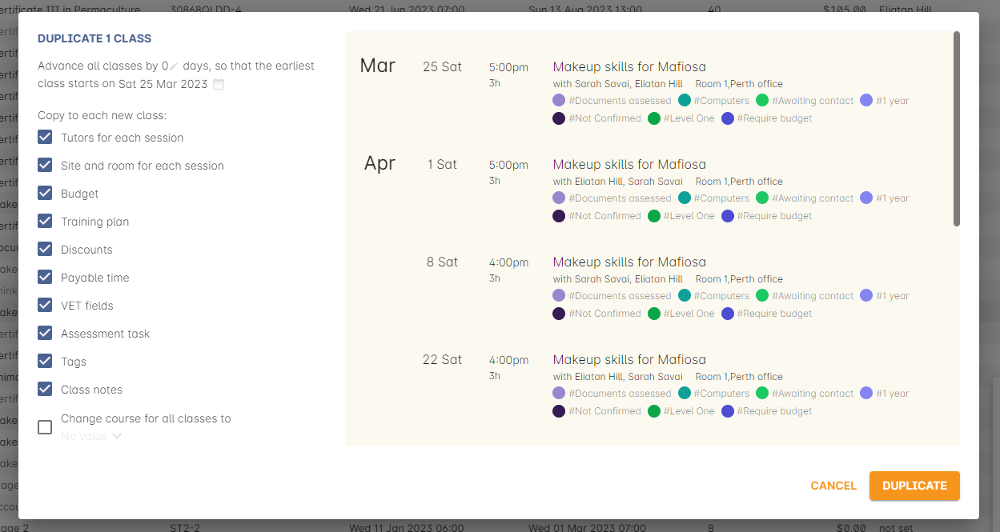
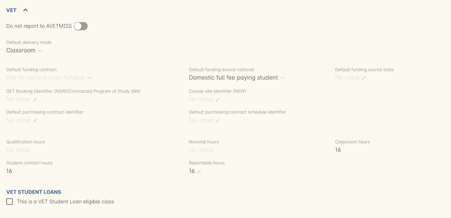
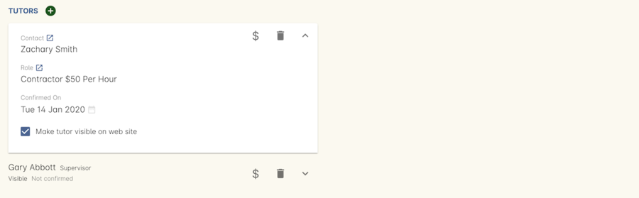
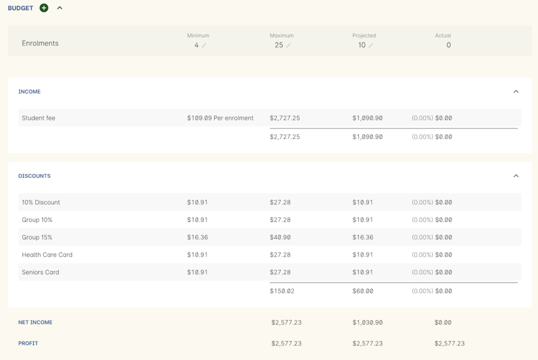
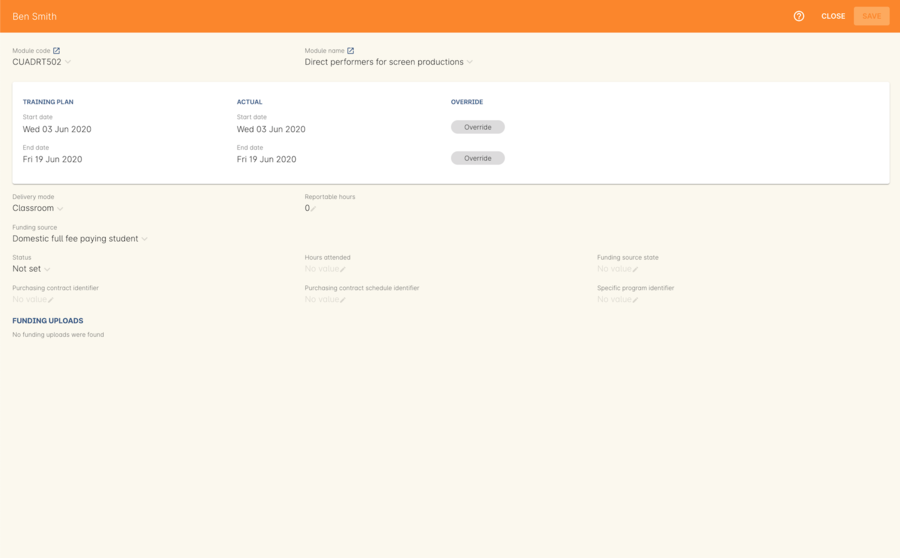
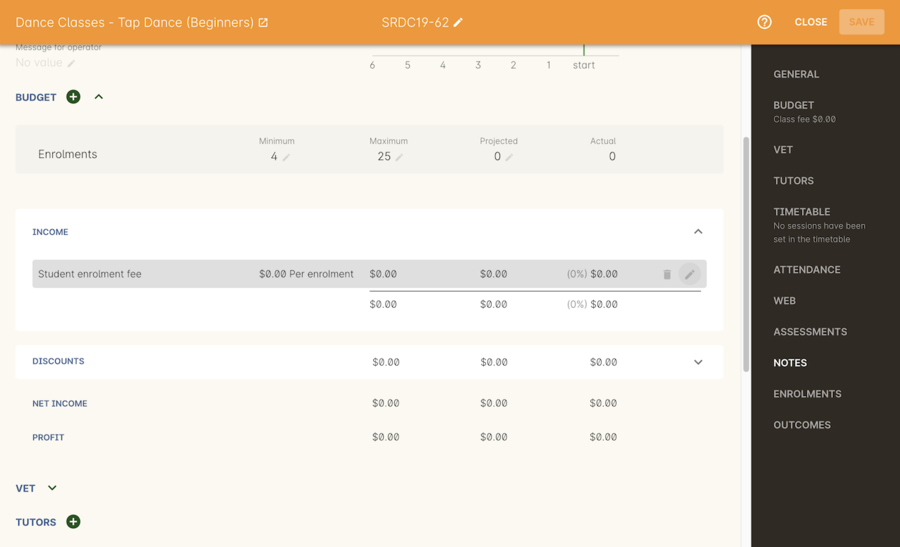

[[classes]]
== Classes

A class is a group of one of more sessions delivered within a course.

image::images/class_list_view.png[title='The full class list view']

[[classes-specialFunctions]]
=== Special Class Functions

On the classes list view you will see a cogwheel icon on the right-hand side of the window. If you highlight one or more classes in the list and then click on the cog wheel, a drop down list will appear offering a range of different options. Some of these functions are only available through the cog wheel, while others are options that you can set in an individual class, but though the cog wheel can set for a group of classes.

Execute script:: This option allows you to execute any script that is listed in the Classes entity.
Send message:: This opens the Send Message window, allowing you to send an SMS or Email to students and/or tutors. Select a template from the list to populate your message, or type one of your own using the simple templates.
Create certificates:: For VET classes, this will create Statements of Attainment or Qualifications for all eligible students.
For all other classes, this option will create a Certificate of Attendance for all enrolled students.
Duplicate x class:: To create another instance of an existing class, the duplicate function will save you the effort of setting all the information again. Need to offer another class in a fortnight? Duplicate the class and move it forward by 14 days. You can also move a whole term of classes forward to the next term in one action. When duplicating a class with a payment plan, the payment plan structure is duplicated across as well.
+
These options are saved separately for each user, so the next time you have to duplicate a class the previous selections you made should be saved and carry over.
+

Cancel class:: If a class is not viable, you can use this cogwheel function to cancel it and create credit notes for all the enrolled students. Students can't enrol in cancelled classes.
Generate tutor pay:: Use this option to create payslips for a selected group of classes.
AVETMISS 8 export:: Exporting AVETMISS from the classes window allows you to export the data for one or more classes for a funding submission. A whole term or year's worth of data can be exported from the Export window.
Bulk edit:: Allows you to make select bulk edits to the selected classes. You can enable enrolments, enable the class as visible online, and add and remove tags in bulk.
Delete record:: Use this option to delete a class record entirely. You can only delete one class at a time. Deleted classes cannot be recovered. You cannot delete classes that are currently live.

[[classes-recordTabs]]
=== Class Record View

[[classes-General]]
==== General

This is a summary section where you can edit the Class Code, apply tags and control any restrictions around the age limits for enrolment, whether the class is visible online and controlling whether enrolment is even allowed or disabled. Disabled classes do not appear available for enrolment.

You can click any of the heading in the right-hand column to be taken to that section of the record instantly.

You have the following options:

Restrictions:: You can set the minimum and maximum ages for enrolment on a per class basis here.
Enrolments Allowed:: If turned on, enrolments will be enabled for this class within onCourse.
Visible Online:: When turned on, enrolments can be taken for this class on your website.
Message for operator:: Any text put here will display as a red box warning in the Checkout when this record is attached to it. This is a good way to let other users in your organisation learn any must-know details for this contact.
Custom fields:: Any custom fields you create for Classes will be displayed in General. You enter the data for these fields here.

[NOTE]
====
Restrictions apply only for enrolment in this particular instance of the class, and will prevent students without a date of birth from enrolling in this class, as well as preventing students who don't meet the age requirements from enrolling.
====

[[classes-Web]]
==== Web

You can add class specific web information to this section to appear on the public website, and in the student and tutor portals for this class.

Most advertising information will come from the course record's marketing section. Content added to the class web section will appear in the class display box with the heading: Important information. *It is recommended that you only use this field for limited content*, like 'Funding available for existing workers' or 'This class is assessment only for RPL/RCC candidates'.

image::images/website_class_description.png[title='Example of content in the class Web section displayed within the class summary']

[[classes-VET]]
==== VET & Training Plan

This section relates to RTOs. Default data for AVETMISS reporting and VET Fee Help funding source information can be set here for the whole class group, and modified on a student by student basis via their enrolment or outcome records as needed. You can also suppress all data related to this class, including its enrolments and outcomes from reporting by choosing the 'Do not report for AVETMISS' switch.

Please note some of these reporting fields are state specific. This is indicated in the field label. The default values of the 'Delivery mode' and 'Funding source national' can be set in the general preferences AVETMISS section.

The Qualification and nominal hours shown here are based on the values set for the qualification and units attached to the parent course. A summary of the classroom hours (from the timetabled sessions) and student contact hours (nominal hours multiplied by the number of students enrolled) is also displayed.

You can override the hours reported for this class by editing the reportable hours field. It will default to reporting the nominal hours, or the classroom hours if no nominal hours have been supplied. The reportable hours field allows you to enter numbers with decimal places, but this value will be rounded to the nearest whole number during the AVETMISS export process, as per the requirements of the standard.

You can also set the class as eligible for VET Student Loans by ticking the checkbox. Learn more about VET Student Loan handling in onCourse in our <<FEEHELP, VET Student Loans & FEEHELP>> chapter.

===== Training Plan

If the parent course of your class is linked to multiple units of competency you can use the class attendance to create a training plan. By default, all outcomes will be set to be delivered on all sessions of the class, meaning the start and end date of each student outcome will default to the start and end date of the class.

The training plan looks the same as attendance, except instead of marking students or tutors, you're marking which outcomes you're planning to teach in each lesson. This is what forms the basis for your student training plan, setting start and end dates for each outcome as per how you plan it in this section.

More information about creating training plans is available in <<rto_training_plans, our RTO chapter>>.

[[classes-Tutor]]
==== Tutor

This section allows you to add one or more current tutors to the class.

Tutors roles must be selected, tutors can be confirmed and tutor pay rates are set by clicking 'Add Pay' when adding a new tutor, or 'Edit Pay' if they're already added. You can also choose if the tutor is to be published as part of the class promotional material online by checking the 'Make tutor visible on web site' checkbox.

[NOTE]
====
If the tutor has an employment end date in the past (set in the Tutor section of their contact record), they will not appear in the search results list. You will need to go to their contact and remove the end date before you can add them to a class.
====

If you show you tutors in your onCourse website, this also allows their associated profile picture, resume/bio and links to other classes they are teaching to be displayed.

Tutor roles are defined in the onCourse Preferences window, under Tutor roles. This is where you can name the roles specific to your organisation and set the default pay rates that apply to a tutor of this role type. More information about this feature can be found in <<payroll>>. You can override the pay rate that applies for this particular instance of the class where needed, while keeping the relationship to the original tutor role name.

Tutors can use their skillsOnCourse portal to confirm their availability to teach the class, or you can manually set the date they confirm in their tutor record.

Tutors must be set per session; you can have multiple tutors assigned to a class and have them teach alternating sessions, or have two or more for an individual session, for example if you have a guest speaker. You do this in the Timetable section.

[[classes-Budgets]]
==== Budget

Class budgets allow users to add additional income, expense and wages lines to assist your program coordinators to determine the profitability of a class. In addition to the income collected from your current enrolments, you can predict the income and expenses you will incur for any projected number of enrolments. You can also set available discounts in the budget.

Click the + button next to the Budgets heading to add a new income, expense or tutor pay line. Click the + button next to discounts (within the budget) to add a discount.

You can also hover your mouse over the Budget section to be shown a rundown of the totals. This works when viewing the record in full screen, or when viewing it in three-column mode.

For more information about the budget section, and tracking expenditure and income for classes, visit <<budgets, the Budgets chapter>>.

==== Assessments

The Assessments section allows you to set assessment records to the class, including the day of release, the due date and the tutors who are assessing them. To learn more about assessments in onCourse visit our <<assesment-whatIs, Assessments>> chapter.

==== Timetable

For more information on the class timetable visit our <<classes-timetable, Class Timetable chapter>>.

[[classes-Attendance]]
==== Attendance

For each session created, and each student enrolled or tutor attached to the class, an attendance record will be created. Both students and tutors can be marked, and you can also add notes to the attendance record. The percentage attendance will be calculated and displayed next to the student name. Tutor attendance is used for payroll calculations.

Click the cross-section of the date and student you want to mark attendance for and the icon will change. You can select only three of the five options using method; Attended (green tick), Absent without reason (a red x) and Not Marked (a grey circle). To mark a single session as partial attendance or absent with reason, you must hover your mouse over the icon, then select the notes icon that appears next to it. From here, you can select any of the five following icons, as well as add a note for the reason. Attendance records with notes will show this icon at all times.

* Attended - accompanied by a green tick
* Absent with reason - accompanied by a grey cross
* Absent without reason - accompanied by a red cross
* Partial attendance- accompanied by a clear tick
* Not marked - accompanied by little icon of person

You can edit a student's or tutor's attendance in bulk by clicking their name in the attendance list. This will show you a dropdown list of options you can select. You will also see a calculation of the percentage the class the student has attended, to monitor the student's attendance requirements.

Sessions that are marked as attended, partially attended (minutes of attendance) or absent with reason will contribute to the student's positive attendance percentage calculation. Sessions that are marked as partially attended (minutes of non-attendance) and absent without reason will contribute to the student's negative attendance calculation. Sessions not yet marked do not contribute to the overall calculation of attendance, nor do sessions marked in advanced (attendance marking for days after today).

image::images/markedattendance.png[title='Students showing different attendance statuses and percentages']

==== Documents

Class specific documents and attachments can be uploaded and cloud-stored in this section to be displayed either publicly, in the student portal or privately hosted for internal use. Drag-and-drop your file into the main window and it will upload for you. Then name it and save it.

If you've already uploaded the document to onCourse, click the + button next to the Documents heading and type in the name you gave the file when you uploaded it, then select it from the drop down list of selections. If you can't find your file, you likely named it differently and should try something else, or it's been set as 'Deleted' and you'll need to reinstate it.

Once the upload is complete, the window will allow you to enter a name for the file, set its access level, apply any tags, write a description and a checkbox that sets whether the document is allowed to be attached to multiple records at the same time. Once finished, click Add and the document will be added to the class.

Access levels can be set as public, private, tutors and enrolled students only and tutors only. You can read more about the specifics of each access level <<documentManagement-accessRights>> section of our manual.

image::images/classes_documents.png[title='A new document being added,with access rights set to Private']

[[classes-Notes]]
==== Notes

This section allows you to make your own internal notes regarding the class.
These are not published to the website.

You can add a new note by clicking the + button next to the Notes heading.
Below this will show you a list of previous notes created.
Notes are only editable if you have the correct access rights set for your user.
Notes will always contain the date and time it was created, along with which user created it.

image::images/notes_section_class.png[title='A note in the Notes section']

[[classes-Enrolments]]
==== Enrolments

The Enrolments section displays a 'Successful and Queued' button that links to the Enrolments window, and also shows the number of successful or completed enrolments. Click the button to be taken to the Enrolments window, where the results should filter out to display successful and completed enrolments for the class. It also shows other buttons that will show you enrolments with other statuses, like Cancelled or Credited enrolments.

You can also create a new enrolment by hitting the + button next to the section heading. This will open up Checkout.

[[classes-Outcomes]]
==== Outcomes

This is a section relevant to RTOs that displays the number of outcomes with any given status associated with this class. Click any of the buttons to open the Outcomes window displaying a list of all outcomes associated with this class, with that status. You can double-click any record to open it at the detail level. For classes in progress, this button will generally read 'In Progress'.

For each unit of competency set in the parent course, the students enrolled will have an outcome record. Outcomes can be set and modified by clicking one of the buttons udner the Outcomes heading, then opening a record by double-clicking.

To learn more about outcomes in onCourse, go to our <<delivery-outcomes, Outcomes>> chapter.

===== Rules for adding outcomes to existing records

There are some validation rules that dictate when an outcome can be added to a particular record.
These rules include:

* You can add non-VET outcomes to an enrolment
* Cannot be created without a related enrolment or prior-learning
* Cannot mix VET and non-VET outcomes in one enrolment
* Cannot remove the last outcome from an enrolment
* Cannot remove an outcome with a related certificate record
* Cannot change an outcome module or status for an outcome with a related certificate
* Can add any VET outcome (with a module) to an enrolment with other VET outcomes

[[classes-update-outcomes]]
===== Marking Outcomes in bulk

You can mark outcomes individually, but it's much easier and faster to update them in bulk.

To update a classes outcomes in bulk, open the class record by double-clicking it, then scroll to the Outcomes section. Click 'In Progress' to open the Outcomes window and show you all the outcomes that do not currently have a set status. Highlight each record you want to edit — you can highlight multiple records by holding down the shift key while selecting records in the list view — then click the cogwheel icon and select bulk edit.

image::images/bulk_edit_outcomes.png[title='The bulk edit view uses the same style view as sharing does. Select the status to update each record too then click Save']

In the view that pops up, select the Status you want to edit each outcome to from the drop down box and then select Save. Each outcome that was highlighted should now display the new status.

[[classes-creatingClasses]]
=== Creating Classes

Before you try to create a class, you need to have already created a course that it can be attatched to.

[TIP]
====
Many colleges develop special codes to assist in identifying classes in groups like categories or regions to make them easier to remember and search on. A simple method is to number or alphabetise the classes.
For example if your course is Dancing For Beginners and the course code is DFB, you may wish to create the class code for the first class of this course as "01".
This will then allow future classes in this same course to be listed in order i.e.. 01, 02, 03. When you duplicate the class the final number will automatically increment.
====

==== How to create new classes

* Open the class list window, click on the + button in the bottom right-hand corner of the screen. A new record will open to the general section.
* All classes must be linked to a course you have already created. Begin setting up your class by typing the course name in the top-left field and select it from the drop down list. Once you have entered the course name you will see that the course code is automatically displayed in the 'Course code' field.
+

* The next available class code—the number that appears after the dash next to the course code—will be automatically assigned, however you can change it to a code of your choice. Your class code must be unique; that is a code not used by any other class already created for that course. Please note that the class code must not have any spaces or hyphens between characters. If you must separate parts of the code, use a full stop with no spaces. The pink coloured field will change from invalid (pink) to valid (white) once you have entered your information correctly.

image::images/new_class_step3.png[title='Once the course is selected,a new class code is automatically added.']

* Complete any relevant fields on the General section, such as if the class has an aged based enrolment restriction or requires a message alert. By default, your class will be set to a status of 'Enrolment allowed'. If needed, change it to another status.
* Save your class by clicking the Save button in the top right of the window. You must save your new class before you can begin to edit any of the budgets or any other part of your new class.
* Your class will automatically have the default minimum and maximum enrolment numbers as per your general preferences. Update these numbers as applicable for this class, and enter the number of your predicted enrolment numbers in the 'Projected' field.
* Go to the Budget section to set the class fee by expanding the Budget section, then clicking 'Income', then selecting the edit icon next to 'Student Fee'. It is important if your college has multiple income accounts to select the correct account for the class during the setup phase. To add new items to the budget, click the + button next to Budget and select whether you want to add an Expense (any associated cost), Income (enrolment fees or extra fees), or Tutor Pay. Details can be found in <<budgets-addingAndEditing>>.

* To set a student fee for the class firstly, select whether to charge GST for the class or N for no GST. Make your selection then either enter your student fee exclusive of tax in the field 'Amount' or enter the total fee including tax in the 'Amount inc tax' field. Which ever field you enter, the value of the other field will be automatically calculated.

[NOTE]
====
IMPORTANT: if you're setting a payment plan instead of an upfront fee, ensure you have set your Timetable first. Follow the steps listed in 'How to create sessions' below.
====

* Now go to the tutor section. This is where you can assign tutors to classes. Click on the + sign next to the 'Tutors' heading and type the tutor's name in the contact field. This is an auto complete field so once you start typing, a selection of tutor's names you have previously entered will be listed. Select the tutor you want from the list and then select a role. Finally, select 'Add Pay' and confirm the tutors pay-rate. This can be edited later by clicking 'Edit Pay'. Repeat these steps to enter an additional tutor or course supervisor.

image::images/add_tutor_classes.png[title='Just type the name of your tutor to pull up a list to choose from']

* Add any class specific information that is required to the web section or notes section.

[[classes-VETdata]]
== Adding RTO and VET data to class records

To assist you in reporting accurate AVETMISS data, some information can be set and collected at the class level. You can always modify information at the individual student or outcome level later if needed. The information you set at the class level is the usual case scenario e.g. the main funding source for this particular group of students.

The VET information can all be found on the VET section - most of these fields are only relevant to RTOs and businesses who report AVETMISS statistics as part of a government funding arrangement. If this doesn't apply to you, you can safely ignore these fields.

. In the "delivery mode" field choose the delivery mode of the selected class from the drop down list. Do the same for the "funding source national" field. The options in the list are set by the AVETMISS standard. Note that this information can be updated per student once you have enrolments.
. Enter your funding source details, either in 'default funding contract', 'default funding source national' or 'default funding source state' (this field is only used by some states, check with your reporting body for the appropriate codes/field for your state)
. There are two NSW only fields here, DET booking identifier (NSW only field) and Course site identifier (NSW only field). If you are in NSW and submitting data to the Training Market, they will supply you with the data required for these fields for each of your contracts.
. Purchasing contract identifier and Purchasing contract scheduler are fields is used by some states. You should check with your reporting body for the appropriate codes for your state, and the circumstances where you are required to supply them.
. Both your nominal hours and classroom hours will be calculated. Nominal hours are calculated based on the hours you set at the unit of competency level. Classroom hours are based on the timetabled hours for the class. The nominal or classroom hours multiplied by the number of students enrolled is used to calculate your student contact hours. Where you have provided them, your reportable hours will default to the nominal hours, or classroom hours if nominal hours haven't been set up. If you wish to report different hours, override the data in the reportable hours field with the numbers of your choice.
+
If you are reporting to Queensland or Victoria it is vital you set the nominal hours for each unit of competency you deliver. The nominal hours are used to calculate the student fee per unit by dividing the class fee by the total nominal hours and multiplying it out again to each unit based on its hours. If you have zero hours, you will always report $0 student fees for that unit.
. There are additional AVETMISS funding fields in the student enrolment record that you can set for each individual you report. These include Study reason, Fee exemption/concession type, Client identifier:
Apprenticeships, Training contract: Apprenticeships and Full time flag (QLD only).

[[classes-Publishing]]
== Publishing classes online

How and where the class is visible and/or available for online enrolment depends of the value of the course status and class status, and in some instances, what the course record is tagged with.

If you have multiple onCourse websites, you will also have a tag group that defines the courses that appear on each of your websites. Courses MUST be tagged with a tag from the website defining tag group (even if that tag is set not to show on the web) for these publishing rules to apply.

If you only have a single onCourse website, courses do not need to be tagged with any tag for these rules to apply, however for the course to be available in your site navigation, it should be tagged with at least one tag from your primary navigation group e.g. subjects.

The combination course and class rules which drive the website visibility are:

.Web availability rules
[cols=",,,,,",options="header",]
|===
|*Course Status* |*Course URL available* |*Class Status* |*Class URL
available* |*Website value* |*Example use*
|Enabled and visible online |Yes |Enrolment disabled |No - 404 not found
|Course is included in the search results but the class is not visible
on the website |For courses where you want students to add themselves to
wait lists before you choose to publish a class to enrol into.

|Enabled and visible online |Yes |Enrolment allowed |Yes |Course is
included in the search results, but the class is hidden from the list
and results views. The class page can be accessed directly via the class
URL but there is no option to enrol. Enrolments can be processed via
admin Checkout only. |Once you have closed online enrolments for the class,
the URL in the enrolment confirmation will still return the class
details.

|Enabled and visible online |Yes |Enrolment allowed and visible online
|Yes |Course and class are included in the search results and online
enrolments are available. |Normal class product available for sale.

|Enabled and visible online |Yes |Cancelled |Either - use cog wheel to
remove or show on web |Course is included in the search results. If the
class is still shown on the web, the enrol now button will be replaced
with the word 'Cancelled'. No enrolments can be taken. |Where classes
have been published in other mediums like print, it is useful to keep
the class on the web to prevent people from trying to enrol via phone
when they can't find the product they want online.

|Enabled |No - 404 not found |Enrolment disabled |No - 404 not found |No
information is available online for the course or class. |For products
you are not currently selling or seeking expressions of interest for.

|Enabled |No - 404 not found |Enrolment allowed |Yes |The course and
class are hidden from search, but the class page can be accessed via the
URL directly. There is no option to enrol online, enrolments can be
processed from admin Checkout only. |Once you have closed online
enrolments, the URL in the enrolment confirmation will still return the
class details, even if you no longer display the course on the web.

|Enabled |No - 404 not found |Enrolment allowed and visible online |Yes
|The course and class are hidden from search, but the class page can be
accessed via the URL directly. Online enrolment is available. |An option
for semi-private classes - you can send the class URL directly to the
people you want to offer enrolment to, but visitors to your website
won't find it via browse or search.

|Enabled |No - 404 not found |Cancelled |Either - use cog wheel to
remove or show on web |The course and class are hidden from search, but
provided the class has not be removed from the website the class URL
will still be available; The enrol now button will be replaced with the
word 'cancelled' and no enrolments can be taken. |For students who
enrolled prior to the class being cancelled, the URL in their enrolment
confirmation will still return a valid web page, showing the class as
cancelled.
|===

For both courses and classes, it is advisable to ensure all the advertising details are correct prior to publishing. Until this is the case, the course status should be 'enabled' and the class status should be 'enrolment allowed'.

The marketing information for most of your programs will be located in the course web section. Only where there is information particular to this instance of the class would you need to add information to the class web section. For example, if each instance of the class required students to bring different materials because they worked on new projects each term, would you publish this information in the class section.

Classes can be published online by selecting the options on the general section 'enrolment allowed' and 'visible online'.

Only current and future classes will show online. Classes that are not self paced, but have no timetable set will not be published, and classes that are complete i.e. the end date has passed, will be automatically removed from your onCourse website. onCourse does not prevent students from enrolling once the class is commenced, but commenced classes are clearly marked on the website.

You can choose to change the class status from 'Enrolment allowed' and 'visible online' back to 'Enrolment allowed' for classes which have commenced, but you no longer wish to allow online enrolment for.

The minimum and maximum places you set in the class are also used on your onCourse website to show students if there are places still available. The website will not show students the maximum number of places, or how many students have already enrolled. This is what the website will display:

* if the class is full: it will read 'class full'
* If the class has been cancelled it will read 'Cancelled'.
If you have published class information in a hard copy brochure, we recommend leaving cancelled classes on the website so perspective students can see that the class they are looking for is not available.
* if there are six or more places available, it will read 'places available'
* if there are between one and five places available, it will give a count of the places available, for example it may read '3 places available'.

Providing an enrolment count when their are less than five places available creates a sense of urgency: The student knows there are only a few places available, so they will hopefully be motivated to enrol as soon as possible, so they don't miss out on joining the class.

=== Showing classes online in bulk

You can put your classes online in bulk from within the Classes window:

* Go to the Classes window
* Highlight the classes in the list view you want to put online
* Click the Cogwheel > select 'Bulk edit...'
* By default, the function will assume you're only wanting to action the changes on the currently selected records. You can change this by clicking the 'found records' button before submitting. This will action on all records in the system.
* A checkbox will appear inside the pop-up. If the checkbox is ticked, the classes will appear online. If it's unticked, those classes will be removed from online.
* Click Submit to finalise the changes.

[[classes-classesWithEnrolments]]
== Working with classes that have enrolments

After you have set up your classes and taken enrolments, there is a range of additional information available to you in the class record.

Under the enrolments section are a number of buttons that are labelled with various enrolment statuses i.e. 'successful and queued' or 'cancelled'. When clicked, this will open the enrolments list view in a new window with all enrolments for this class with the status you clicked displaying.

Within an enrolment record there are number of things you can edit such as the reason for study, or you can add an individual commitment ID or other various AVETMISS details that relate only to this enrolment. You can also review any associated Invoices or Outcomes, RPL credits, attach documents or set any notes.

Only student's marked as Active are currently enrolled in the class and are counted towards the class numbers.
Students marked as credited or cancelled have been removed from the class list, but their name still appears here for historical record keeping purposes.

Keep in mind that the invoice for a particular student may not be in the enrolled student's name. For example, if a company pays for a team of their staff to attend a class, the invoice will be to the company.

There are also fields particular to RTOs who submit AVETMISS data. These include Study reason, Fee exemption/concession type, Client identifier: Apprenticeships, Training contract: Apprenticeships and Full time flag (QLD only). You can set this information for each student as it applies to them.

In addition to the enrolment records, the class window now contains a list of outcomes for each student enrolled. See the RTO Guide for more information about setting and modifying outcomes.

[[classes-markingAttendance]]
== Marking Student and Tutor attendance

Attendance tracking is both useful for calculating tutor wages and also to determine the overall attendance percentage for a student. This is particularly relevant if you are required to meet CRICOS overseas student attendance requirements.

Attendance can be marked inside the onCourse class record, or via the online portal by the class tutor.

For every session you create for a class, a corresponding attendance record will be created. Each session can be marked as Unmarked, Attended or Absent without reason by simply clicking on the icon for the student for the session.

Alternatively, you can mark all students for a session or all sessions for a student by clicking on triangle next to the date or student's name and choosing one of the options.

As you begin to mark attendance for a student, a percentage attended will be calculated and displayed. When attendance reaches 80% or less a yellow notice icon will be displayed. When attendance reaches 70% or less a red warning icon will be displayed. These will assist you in monitoring if students are meeting the course attendance requirements.

You can also mark attendance as Absent with reason and Partial attendance by right clicking on the attendance icon. For both of these attendance types you also need to record a note against the student's record as to why they are absent, and for partial attendance you need to record the time that was attended so the percentage attendance calculation can be recorded. Absent with reason will still be taken into account as an absence for the purposes of determining percentage attendance.

When you run a tutor's payslip, you will have the option to count all scheduled sessions towards their payment, or only those you have marked as attended or partially attended.

A 'Class Attendance' CSV export is available from the class window to export all the session attendance, notes and dates of who marked the session into a format you can open in Excel.

A printed report available from the contact window 'Student Attendance Averages' will calculate the student attendance percentage for each month of the last twelve months. Ongoing student attendance percentage data is also available in the student and tutor portals.
