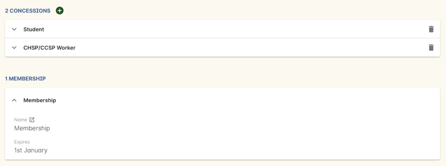
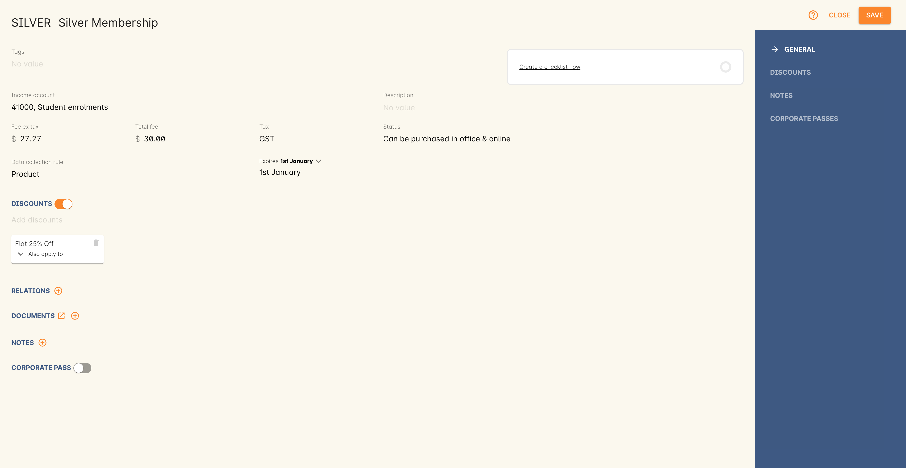
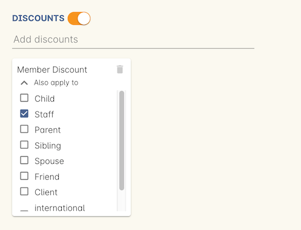
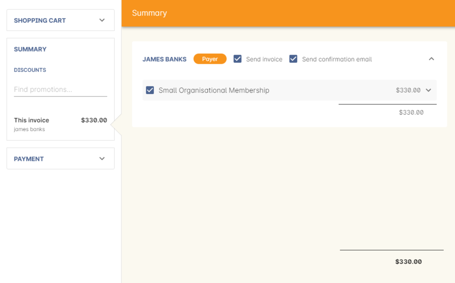
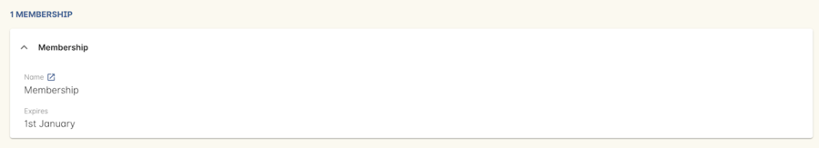
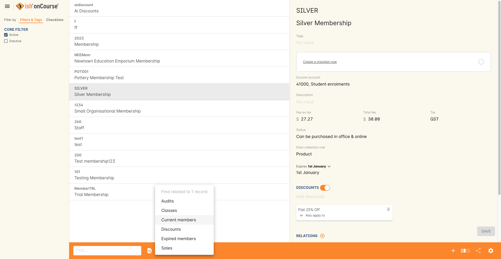

[[concessions]]
== Concessions and Memberships

[[concessions-whatIsAConcession]]
=== What is a concession?

A concession is a way of categorising a student into a group which may be eligible for a discount.
Concessions may be externally defined groups, like High School Students, Senior's or Health Care Card Holders.
You may ask these students to provide details of their membership to a group by providing a card number and expiry date.
You may allow students to add these details to their record on the website during enrolment or via their profile.
Concessions can also be internally defined groups like teaching staff, admin staff and VIP students.
These types of concessions may not have numbers or expiry dates, and can not be added by students on the website, but can still be used to provide discounts when enrolling online.

Concessions, discounts, memberships and promotional codes are a powerful part of onCourse marketing.
For more information on how to apply concessions or memberships to a discount, see link:discounts.html[the
discount chapter]

[[concessions-whatIsAMembership]]
=== What is a membership?

Memberships are products which can be purchased.
Being a member may entitle a student to discounts, and possibly also provide that discount to their related contacts.
For example, you may sell a membership to a company that provides a discount to all of their staff.
Memberships are valid for a fixed period of time e.g. twelve months from purchase, and any discounts associated with the membership will not be available after expiry.
Memberships may also be sold for no cost, for example for members of an external program, or may be sold but have no discount associated with membership, for example annual financial members of a community organisation who have AGM voting rights.

=== Adding a concession to a student record

Admin staff can add a concession record to a student's record at any time, either during the enrolment process or by editing their contact record.

To add a concession, go to the general section of the student record.
Click on the + above the concession panel to add the concession of your choice.
The concession type must have already been defined as per the process described above.

Depending on the settings of the concession type, the number and expiry date fields may be mandatory to complete.
You can add multiple concessions to a student record using this process.

If you add the concession to the student's record during the checkout process, any applicable discount will be applied immediately.

[[concessions-creatingMemberships]]
=== Creating a Membership Product

Membership Products can be found by typing 'Memberships' into the Find Anything search bar in the Dashboard.
A Membership Product needs a name and should have a description so potential purchasers understand the benefits of the membership.

A membership may have a fee to purchase, or could be given away for free.
The membership will have a duration of either a set number of days from purchase, the beginning of the calendar or financial year or be for life.
You can also restrict which Corporate Passes can be used to purchase this membership.

You can choose to make the membership available for purchase online, or only via internal purchase.

At this point, you may choose to link to existing discount policies, or you may prefer to define the discounts that apply to people who hold this membership type later.

An important distinction of membership discounts is that they can also apply across relationships.
For example, a company could purchase a membership and the discount policy for that membership may apply to all staff of that company who enrol.
This is handled when applying the discount to a membership record by clicking the 'Also apply to' drop down box inside the record, clicking the required checkboxes and then clicking Save.

[[concessions-purchasingMemberships]]
=== Purchasing a membership

A membership can be purchased from Checkout, either in conjunction with an enrolment or as a standalone purchase.

If the membership is purchased in conjunction with an enrolment that is eligible for a discount for members, then the discount will be applied at the time of purchase.

Memberships can be purchased by either searching for a membership number or name in the 'Enter course or item' field.
Alternatively you can click on the 'More' button under 'MEMBERSHIPS' on the right hand side of the checkout window; this will only appear once you have clicked on the 'Find course or item' field.

=== Renewing a membership

A contact can re-purchase and renew a membership they already have at any time during their membership period, unless the membership type is set to never expire.

The renewal purchase is the same process as the original membership purchase, in checkout or via your website.

For memberships that expire on a fixed date (Jan 1, July 1), the new membership will expire on the date 12 months after their current membership expiry date.
For example, if I have a membership expiring Jan 1 2018, and I renew my membership in December 2017, the expiry date will be extended to Jan 1 2019.

For memberships with a fixed set of days duration, that count is added to the previous membership expiry date.
For example, if I have a 90 day membership, with 10 days remaining, and I renew my membership today, my new expiry date is 100 days in the future.

If you wish to automatically remind your members of their upcoming membership expiry and encourage them to renew their membership, you may wish to enable the onCourse default script called 'Membership notification renewal' and confirm the wording of it's associated email template (also called 'Membership notification renewal') contains text appropriate for your organisation.
By default script will send the notification 7 days before the membership is due to expire.

[[concessions-redeemingMemberships]]
=== Redeeming a membership discount

For as long as the membership is valid and the classes are taking place during a time that the membership is valid, any applicable discounts will be given automatically when the student enrols.
Discounts will no longer be given if a membership has expired.
Current and expired memberships can be seen in the student contact record.

[[concessions-purchasedMemberships]]
=== How to view details of a Membership

To view the details of a contact's membership, you can click the Membership from within the contact window, under the general section.
A list of the contact’s current memberships will be visible in the bottom left panel of the window.

To open a memberships record simply click on a record in the list, which will expand the record to show its detail.

[[concessions-findRealted]]
=== Using find related to view Purchased Memberships

The find related feature is also available in the Membership Groups window.

You can use this feature to find the following:

* Current/Expired Members - This will show a list of all contacts who are either current members or expired members of this membership.
* Discounts - This will display the various discounts that the membership offers.
* Classes - This will show the classes affected by the chose membership.
* Audits - This will display any captured interactions between the membership product and the onCourse user responsible for them.

[[concessions-Searching]]
=== Searching for students with concessions or memberships

You can search for students with a certain concession or membership by using the our advanced query language in the Contacts window.
For memberships, use:

`productItems.product.name like "Membership"` where the name in quotations in the name of the membership in onCourse.

To search for a certain type of concession, use:

`student.concessions.concessionType.name like "seniors"` where the

In conjunction with other search functions, such as enrolment history and demographic data, this information can provide opportunities for you to find and promote courses to particular groups of students at your college.

