[[contacts]]
== Creating and Modifying Contacts

This chapter looks at the Contacts window in onCourse; how to understand the data in a contact record, create a new contact, and the various types of data that flow from and through these types of records. These records are broken up into various sections, which when viewing the record's edit view, will be displayed in the column on the right of the window - there's a good example of this in the second screenshot on this page. Click any of these heading to be taken directly to that section of the page.

[[contacts-contactTypes]]
=== onCourse contact types

A contact is any person or organisation your business works with in relation to running classes. There are three categories of contact in onCourse:

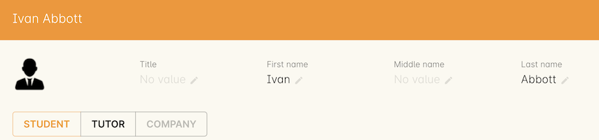

Student:: A person who has or intends on enrolling in your programs. You may need to collect AVETMISS data and will need to keep track of their enrolments, outcomes and payments.
Tutor:: These are the people that facilitate your classes, supervise assessments or assist your instructors. You have the ability to enter their resume or bio details to display on your website. You want to know what classes they have been scheduled to deliver and what payments you have made to them. A tutor can also be a student. If a tutor has an employed end date in the past and is no longer active, then they will be greyed out in the contact list view.
Company:: A business you may need to invoice, who may book their staff into your classes, or you may work with in partnership to deliver classes. Tutors can also be companies.

Contacts can be related to each other, e.g. employer and employee, friends, siblings, spouse, child or parent. You can manage these relationships using Relations.

[[contacts-addingContacts]]
=== Adding a new contact from the list view

. Open the contact window and select the plus (+) button in the bottom right of the window. This will create a new record.

. Select the contact type from the options as described above.

. Enter the contact's name and contact details e.g. address, phone
numbers and email.

. Add any relevant notes to the Notes section by clicking the + button next to the Notes heading and then adding your text.

. Add any relevant attachments to the Documents section by hitting the + button next to the Documents heading and searching for a document already added to the system, or adding a new document from your machine by dragging and dropping it into the window.

. For students, where needed, collect and enter the AVETMISS data, date of birth and concession card information.

. For tutors, where needed, add the resume information.

image::images/tutorNotes.png[title='A Contact with Notes attatched']

[[contacts-addingInQuickEnrol]]
=== Adding a new contact in Checkout

When you look up a student name during the enrolment process, and the name cannot be found (the student is not an existing student) you are given the option to select 'New' from the drop down list.

Selecting new begins the process of creating a new contact record, as part of the enrolment process.

Just like creating a new contact from the list view, you have the opportunity here to collect all the contact details, answer the AVETMISS questions and set their marketing contact preferences. By default, all new contacts created during the checkout process are set to be 'students'. You can also add the tutor option to the contact record where relevant.

[NOTE]
====
Please note that if you do not complete the enrolment process and save the record, the new student you were creating will not be saved either.
====

If you need to add another contact to the checkout process, you can simply just type in the additional contacts name in the 'Enter contact...' field on the left side of the window. This will allow you to look up another existing contact, or to add another 'new' contact to the enrolment. In the example below I have started typing 'Smith' in the 'Enter contact...' field. Additionally, if the added contact has an existing relationship with a related record, those records will appear automatically in the contact list upon clicking on the field for easy adding.

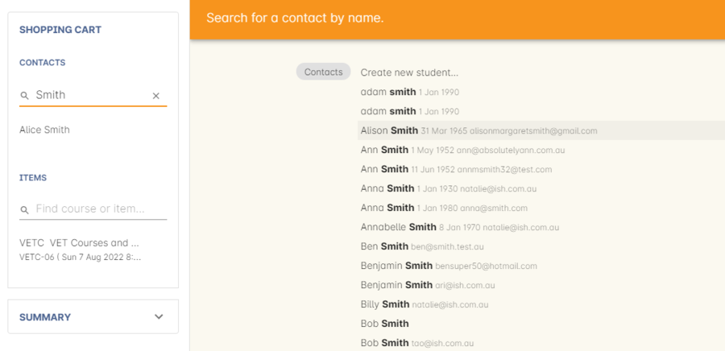

[[contacts-Modifying]]
=== Modifying contact details

In the contact record, or when you are processing an enrolment, you can make changes to any of the details you have previously collected. Just type the new information into the field.

Students and Tutors can also update their personal contact details via the skillsOnCourse Portal. If an existing contact changes their relationship with your college, for example, a past student becomes a tutor, there is no need to create a separate record - simply modify their current record and add in the additional information.

[[contacts-marketing]]
=== Setting up Email, Phone and Mail Preferences

When creating a new contact or amending an existing one, you can also set the preferences for whether the contact wishes to receive marketing communications via email, SMS or via the post. You are also able to flag a contact method as 'undeliverable'. Email sets a preference in the email field, SMS sets a preference in the mobile phone field and Post sets a preference in the street address field.

You will note within the General section of the contact record each method of contact has a cogwheel icon to the left of the entry field. The operator can set the preferences for whether the student wishes to accept marketing material or not.

[NOTE]
====
If there is a contact method (post, SMS or email) showing with no additional information labels underneath the contact field, this means that the client has opted in to receive marketing material.
====

If a client has requested that they not be sent marketing material, by deselecting this option within the cogwheel, the contact method will be labelled as 'no marketing'.

[NOTE]
====
If a client nominates to opt out of receiving marketing material, this does not preclude them from receiving the automatically generated enrolment confirmation and tax invoice emails and SMS messages.
====

[[contacts-membershipsAndConcessions]]
=== Concessions and Memberships

Any concessions or memberships owned by the student will be displayed here.

Concession information includes the concession name, number and expiry date.

Memberships show the memebrships sold to the user, inluding who it was purchased by , when it was purchased, the valid to and from dates, the price and the status.

[[contacts-Relationships]]
=== Relationships between contacts

Relationships between contacts can have relationships with other contacts to assist you with billing, contacts and marketing activities.

For example, a corporate customer may enrol and pay for their staff members to complete training at your college, employer and student details can be connected for traineeship management, parents contact details can be collected for minors, for billing and emergency contact details, and spouse and friend relationships can be captured for use in marketing campaigns e.g. 20% discount when you refer a friend.

==== Adding a relationship

In the contact window, you can add a relationship by clicking the + next the 'Relations' header. This opens a new sheet where you can type in the name of the contact you wish to add and define the relationship type.

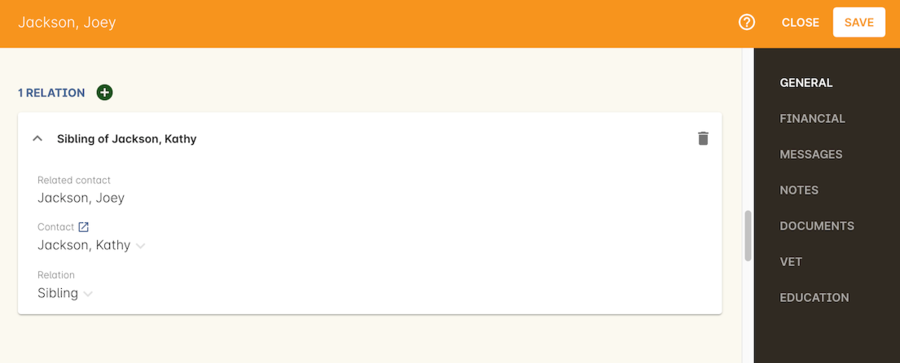

You can also define relationships through the checkout process so that if the enrolment process connects two existing, but unrelated contacts, you can add the new information. When you add a second or subsequent contact to an enrolment, simply go to the relations section of the contact record, hit the + button and search for the contact.

All contacts can have multiple types of relationships with many other contacts. Relationships can also be deleted as needed by using the trash icon next to the relation record in the contact edit view.

==== Adding different types of relationships

To add a type of relationship between contacts, go to the Preferences window and scroll the left-hand column till you see Contact Relation Types. Here you can create different types of relationship like; Parent to Child.

==== Searching across relationship types

If you are in the contact window and want to find someone with a relationship to the contact currently highlighted, simply click on the Find Related icon and select "Contacts related as...", then select a specific contact type, or all related contacts. This will open a new contact window showing the results.

You can find either all records related to a contact via any relationship, or via a specific relationship type. For example, you could find all the students enrolled in 'Craft for Kids' and then find all the contacts related to them as parents.

==== Using relationships in Checkout

When relationships have been defined within contacts, they can be used to build enrolments quickly.

When a contact is added to checkout, the people they have relationships with are shown automatically if you click within the 'Find Contacts' field again. You can add these contacts to the same enrolment by clicking on them.

[[contacts-financial]]
==== Contact's financial records

When a contact is invoiced, or makes a payment, an entry is made in the contact's financial records.
This is visible in the Financial section of the contact record.

Often, a student is invoiced and pays for their own enrolment.
When this occurs, you will see the financial data in the student's Financial section.
When the enrolment is paid for by another person (often termed a 3rd party payment) the financial data will be on the payer's Financial section, and not the student's.

All the financial transactions are shown in creation date order, with a running total that shows the contacts balance at any point in time.
Invoices, credit notes, payments in and payments out, will all show on the Financial section.

You will also note from the following example that each payment line of the financial section will identify if it was an incoming or outgoing payment. E.g.
'Credit card payment in (office)' reflects a payment in.

In the financial section you also have the ability to set some financial defaults that define settings when the conact is invoiced.

*Invoice terms days:* This will be show the system default as defined in your financial preferences, but can be unlocked and set to a value specific to this contact.
For example, your default may be 7 days but some contacts may have 30 day custom terms.

**Tax (override):**By default, all contacts will be charged the tax rate set for the product or class.
However, some contacts may reside overseas and may not be liabile to pay local taxes like GST. In this case, you can choose to override to N for no GST to be applied to any invoice line created for an invoice joined to this contact.
Not this does not affect invoices created in the past - only invoices created after this setting is applied.

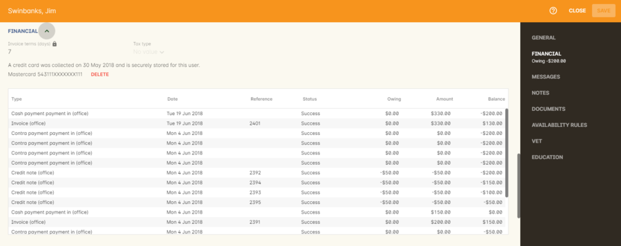

[[contacts-storedCards]]
===== Stored Cards

If you have stored card information for future payments for the contact, it will be displayed here.
You can clear the card details by clicking the delete button.

[[contacts-abandonedCart]]
===== Abandoned Carts
If the contact has any abandoned carts on your website detected by the system, they will be stored here. The user will see them upon returning to your website.

[[contacts-messages]]
==== Contact message history

In the Messages section you can see the contact's entire message history. Almost all messages sent out of onCourse will appear here - only messages sent directly via custom scripts will not.

You can review the content of any message by double-clicking it.

[[contacts-Notes]]
==== Notes section

This section keeps a list of all notes you have relating to the contact. You can add a new note in the 'New note' field at the top of the section. Below this will show you a list of previous notes created, these fields are not editable. Each of these entries has the date and time it was created, along with which user created it.

When creating a new note, to save it, first either click the tick icon in the note card, or click elsewhere on the screen, and the tick will turn green. Once the tick is green you can click Save to save the record.

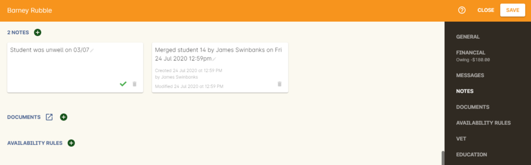

[[contacts-docs]]
==== Contact documents section

Drag and drop any new documents into the window to upload and attach them to the contact. If the document is already uploaded, click the + button and search for it.

All types of documents can be added to the contact record, such as copies of completed assessment activities, permission forms and signed declarations for funding agreements. The onCourse document management system will store and version control these records. You can click the document icon within the panel to view the document.

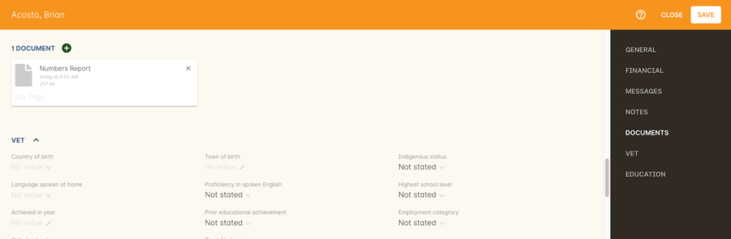

===== Adding Pictures to Contacts

Each contact (student, tutor or company) can have an identifying image attached to their record that is visible as part of their general information.

. To add an image, open a contact record and click on the image place holder.
+
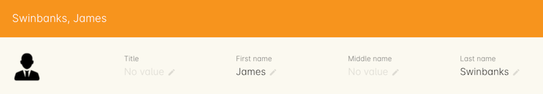
. Select the image from your computer that you would like to use and press ok.
+

====== Gravatar images

Gravatar images will automatically load for contact records if the user has a avatar linked to their email address at https://en.gravatar.com. Gravatar images are overridden with locally uploaded profile photos.

To make sure you have a Gravatar licence enabled within onCourse go the Preferences window and scroll the left column till you see Licences. Click Licences and you should see it listed in the Enabled Features list.

These images will also display in the tutor portal on the class roll for student identification purposes.

image::images/gravatar_portal.png[title='What the tutor sees when marking a roll']

[[contacts-availability]]
==== Availability Rules

You can set different availability rules for contacts, say in the example of when you know a student will be away on holidays.

[[contacts-VET]]
==== Adding VET data to students

Contacts who are marked as students have a section labelled VET. In this section, you can record the answers to the standard AVETMISS student questions regarding their country of birth, prior educational achievement and other required detail. For customers using an onCourse website to take enrolments, these questions are asked of the student at the time of enrolment. Only valid answers can be entered into these fields, with most fields referencing look up data such as the ABS list of countries and languages, or the approved list of AVETMISS responses.

For Victorian and Queensland customers, the field to record the student number is also located in the VET section.

For CRICOS providers, additional fields are available to record the student's passport, visa and health care details. This information is not reported as part of the AVETMISS standard.

Additional information, like the CRICOS student's next of kin, emergency contact or home-stay provider can be captured using the contacts relationships feature.

If your students decline to provide information for one or more of these fields, we will automatically export the approved 'did not respond' code for that question, and ensure that validation errors, like students speaking English as their first language and reporting themselves as speaking it well, are not exported from onCourse to cause problems with your funding providers.

Please note that some student related AVETMISS questions are also located in their enrolment record, where the response is particular to that enrolment event e.g. their traineeship approval number or reason for study response.

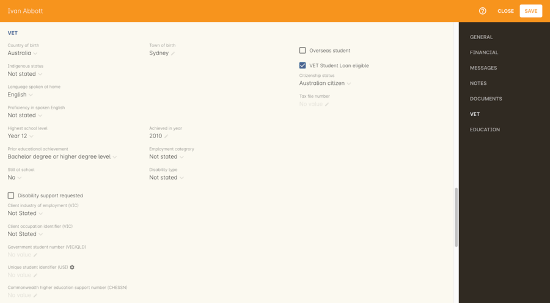

[[contacts-education]]
==== Student's Education history

The history of a students enrolments, outcomes, prior learnings and certifications is available in the Education section.

Enrolments are shown in a sub-list, with the associated invoice, time of enrolment, course details and status. If you click on the '+' symbol next to the Enrolment heading then this will pre-populate checkout with the students contact data. When a student's enrolment has been cancelled and/or credited, the enrolment status will show cancelled or credited.

A complete enrolment history is retained for each student, including classes they have withdrawn from, so you will always have a full picture of their engagement with your college. Enrolments cannot be deleted, but they can be cancelled, a credit note created, and that credit applied towards a new enrolment.

The second list shows a list of any prior learnings that have been added to the record.

The third list component shows the outcomes for all the units linked to all the student's enrolments.
For non-VET enrolments, these will include non-assessable outcomes for their enrolments. You do not need to set anything for these enrolments, even if reporting them via AVETMISS, as an outcome's status of 81 is always exported for unset statuses in these types of outcomes.

VET outcomes will show the national code and unit details and you can double-click on this outcome to make changes or update the status.

[NOTE]
====
When an enrolment is cancelled, the outcomes linked to the enrolment are deleted, except if you have already assigned them a status or used them to create a certificate. In that case these outcomes will be retained on the student's file.
====

The final list component of the enrolment record shows all the certificates (both Statements of Attainment and Qualifications) issued to the student. Unprinted certificates can be edited by double clicking on them, printed certificates can be revoked, but not edited. You can print certificates from the certificate window only.

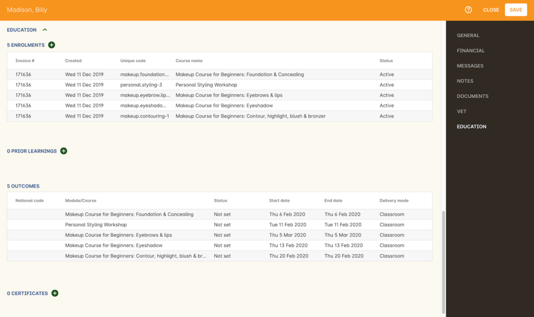

[[contacts-Enrolment]]
==== Education section

This section only appears if the contact is a student.
This allows you to see all the enrolments they are currently enrolled in and have been enrolled in the past.
If they are enrolled into any VET classes you will see information about the status of the modules and qualifications.

==== Custom fields

If you have added custom contact fields to your onCourse general preference, you will see these fields added to the General section of the contact edit view.

You will see all the custom contact fields you have created, and any response the student has provided during the online enrolment process or responses you have manually entered into their record.

If you wish to add additional custom fields to your database, either for Contacts or other record types, refer to the <<generalPrefs-Terms, preferences>> chapter of the manual.

Special needs information can also be added to the student contact record and appears just below the custom record fields. These special needs could be additional information a tutor needs to know as part of the course delivery, such as the student needing access to a hearing loop, or information for dietary preferences and catering.

Student special needs can be printed to provided to a class tutor or coordinator via the class window, clicking Share and then selecting the 'Student special need report'.

[[contacts-AdvancedSearch]]
=== Finding contacts

There are multiple ways you can search for contacts in the onCourse database. The simplest method is to type the contact's name in to the Dashboard search. This will find matching contacts based on the text you have entered. Clicking the results will tatke you to the Contact.

In the contact list view, the filters and tag groups in the left-hand side of the window are also a quick way to find contacts. For example, if you have the core filter 'students currently enrolled' ticked, and select a subject tag, like 'computers' you will see a list of results returned showing all the students who are currently enrolled in a class for a course tagged with a computer tag.

You will see that some tag groups appear multiple times in the window, for example the subject tags (for students enrolled) and the subjects tag (for tutors teaching). You can use these tags on their own, or combination with other filters and queries to create a powerful range of search options.

If you wish to search for contacts based on other criteria, you can do an Advanced Search by typing a query into the search bar at the bottom of the window. These searches require you to type out the query, which can seem difficult at first, but we provide context sensitive search options via a drop down box that appears while you type to help make this much simpler. For more on how to effectively use Advanced Search to build queries, have a read of the <<search-advanced, Advanced Search>> section.

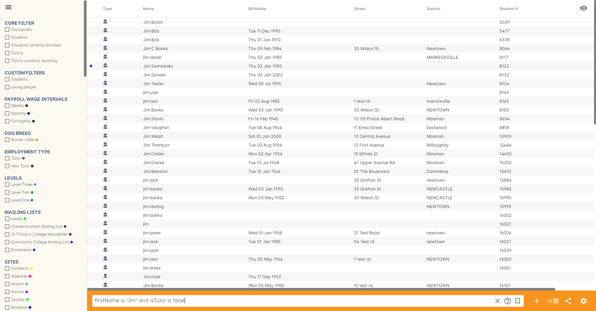

[[contacts-filter]]
==== Creating an advanced search filter

You can save any search query you run in the Advanced Search box by clicking the green bookmark in the right of the search box, then clicking 'Save custom filer'. Give the filter a name and then click the save button to save the filter.

The filter will be available in the same window it was created—i.e. if you create an advanced search in the 'Contacts' window, the filter will only be visible in the Contacts window.

==== Searching for related information

You can also search for information related to contacts by using the find related records icon which is located to the right of the search field.

This option can be useful for finding data related to one of more contact e.g. all the invoices for a company, or all the contacts related to a group of contacts with a particular relationship e.g. all the parents of a group of children.

As you can define the types of contact relationships you wish to collect, this query can be quite powerful. For example, if you know you regularly deliver training to students with additional needs who are supported by agencies, if you have set up this relationship type and made relationship joins between agencies and clients, you can then find all the agents you worked with recently, and send them information about upcoming courses that may interest their clients.

When you run a 'Find related...' search, the results open in a new browser tab, and you can continue to run searches on that returned list of results to further refine your data.

At a glance, for a single contact, be it a tutor, student or company, you can find all their related enrolments, drill down through all their invoices and payments, check the printing or revoked status of each of their certificates or analyse the mailing lists they have subscribed to. For a group of contacts, this search function provides powerful marketing opportunities, and the ability to analyse your student base in a variety of ways.

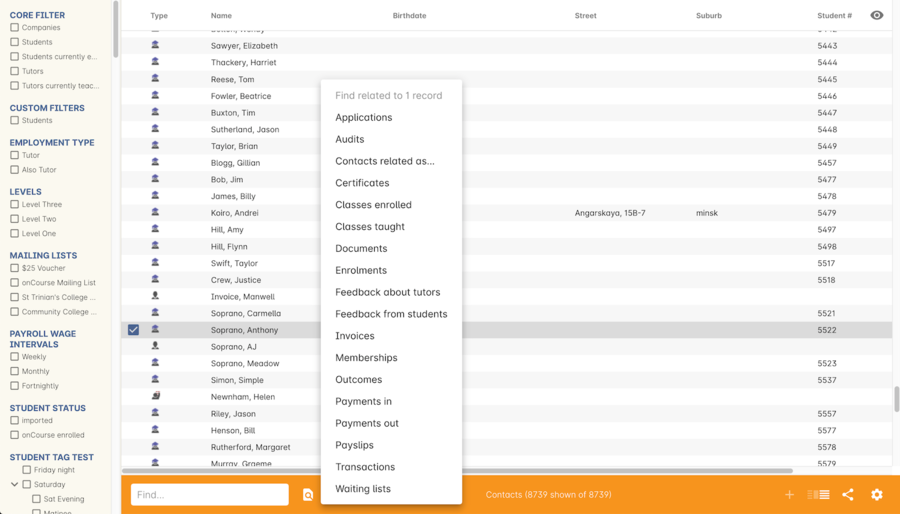

==== Contact insights

If you search for a contact from the global navigation, clicking a contact search result will first open their contact insights panel, instead of the contact record.

You can read up more on this by going to our <<gettingStarted-contactInsights, Contact Insight section>> in the manual.

[[contacts-merge]]
=== Merging contacts

Occasionally you will find two contacts records in onCourse that belong to the same person. This can happen for a variety of reasons, such as a typo in a name, a change of name between enrolments or via an online enrolment where the returning student uses a different email address. When you notice a potential duplicate, it is easy to compare and merge the records.

The merge process allows you to choose the preferred contact details of the student, and then merge together the enrolment, outcome, prior learning and financial history of the two students into a single record.

To merge to contacts, in the contact list view, single click to highlight both records. Go to the cogwheel option in the top right-hand corner and select 'merge 2 selected contacts'.

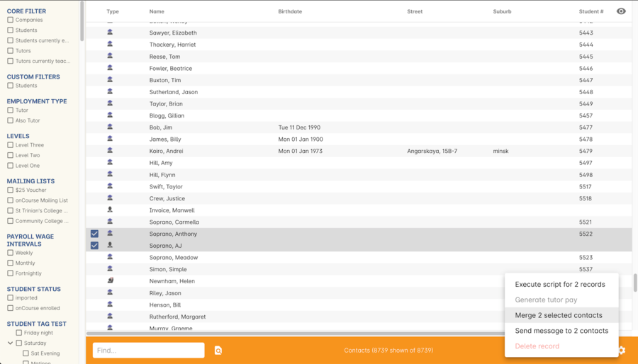

A new merge window will open. In this window differences between the two records will be displayed, and you'll also be shown a predicted match score as a percentage. You can choose which data to retain by selecting either option A or B. Any choices without a selection will be marked with red text prompting you to make a selection. You can also hide the already matching fields by switching the 'Only show differences' switch to on.

Selected options will display themselves with a highlight and a green tick. Any further changes to fields that are blank will need to be completed after the merging process is done.

Once you have confirmed the data choices for the contact is correct and all relevant fields have been selected, the Merge button will highlight. Choose 'Merge' to perform the final merge.
Please note that there is no undo option, so you must be certain before finalising the merge.

When contacts have been merged, a note will be auto-populated into their record saying 'Merged student (student number) by onCourse (user name) on Tue 1 Sep 2015 12:08pm'. You can search contact notes for the words 'merged' or a specific student number if you need to find a contact who has been merged.

onCourse includes special validation to prevent the merging of contacts who both are enrolled in the same class or have different verified USIs. Otherwise, any two contacts can potentially be merged into one. If you have contacts where you have located records in triplicate or more, then you will need to merge two of records at a time until you are satisfied with the one final record.

[[contacts-historicDebtors]]
=== Historic Aged Debtors export

One of the many exports available from the share menu in Contacts is the Historic Aged Debtors export, useful for finding contact who have owed you money over a period of time.

Input the 'as at date' and the export will calculate the owed amounts, per contact, showing you the overall amount of money you’re owed at the 'as at date', broken down by customer.