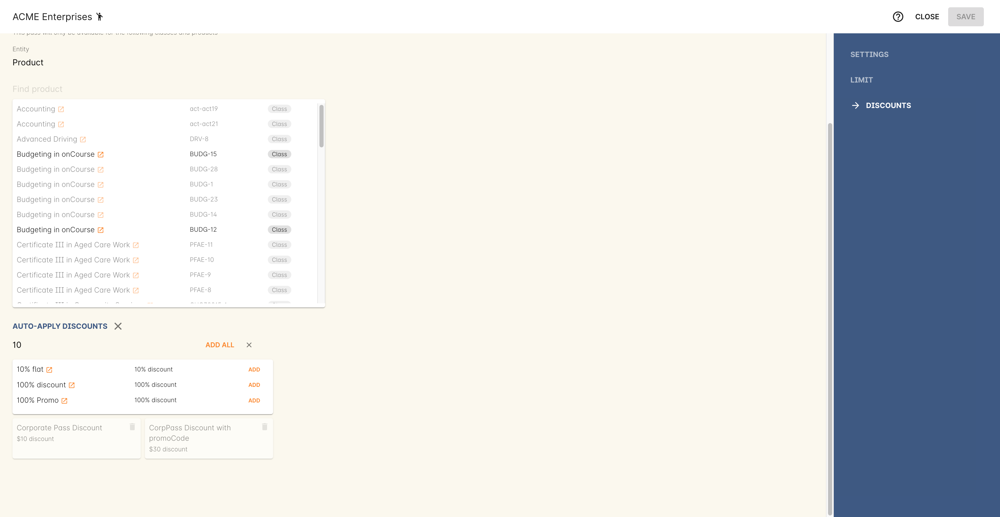
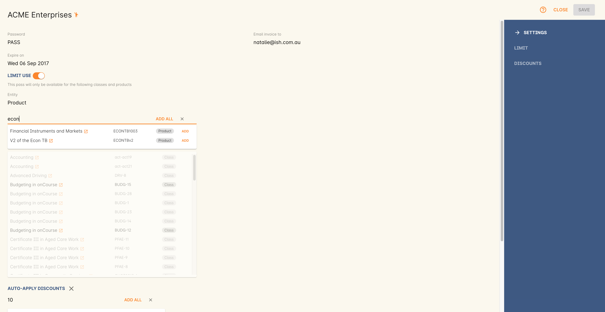
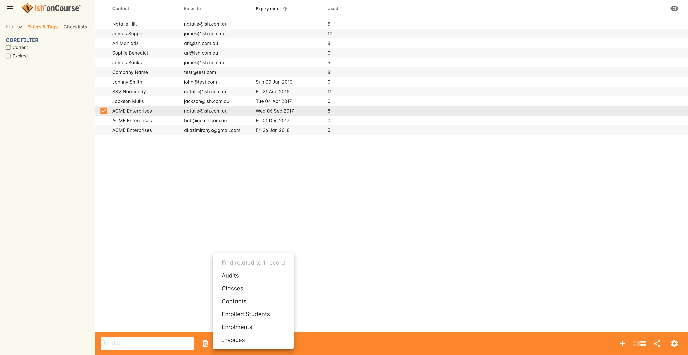
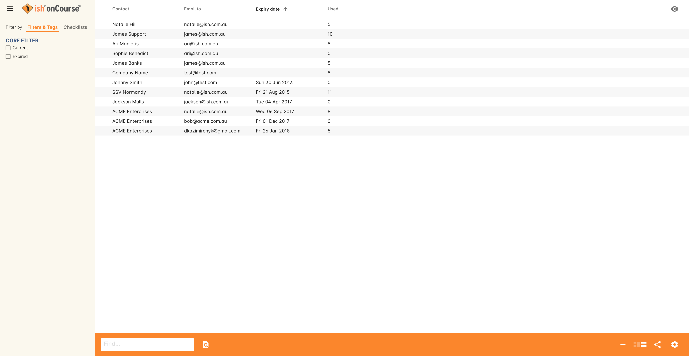
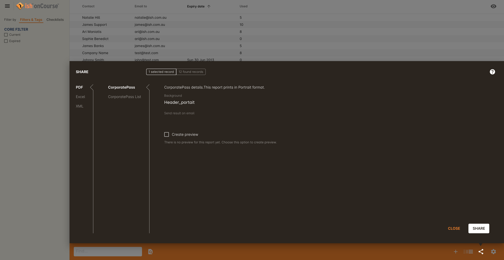

[[corporatePass]]
== Corporate Pass

Corporate Pass is way to allow certain students to enrol online without having to pay up front, allowing a company (usually their employer) to be sent the invoice. A password/code allows the student to bypass upfront payment and allow them to enrol in a set of limited classes or your entire range of classes. You can create as many Corporate Passes as you like for the same customer, and for as many customers as you choose.

There is no requirement to attach classes or courses to Corporate Pass. They are automatically available for use once created.

[TIP]
====
Corporate passes and their associated discounts _can only be used during the online enrolment process_. They aren't designed for use within the onCourse Checkout. If a discount has a promotional code and is available for use with a corporate pass you will get an error message if you try to use the promotional code in Checkout.
====

[[corporatePass-settingUp]]
=== Setting up your Corporate Pass within onCourse

This section will outline how you can set up your Corporate Pass:

. To create a new Corporate Pass, first you need to go to the Corporate Pass window by searching for Corporate Pass on the Dashboard. You can then create a new Corporate Pass by clicking on the + symbol in the bottom right-hand corner of the new window.
. The minimum required information to create a new Corporate Pass is a contact or company name and a password.
The Company or Contact must already exist as a record within onCourse prior to creating the Corporate Pass.
If you create a Corporate Pass with these bare minimum requirements, it will be available to use for any class or product.
+
You can also specify as to which email address the invoices will be sent to, the default is usually the email address of the contact. An expiry date can also be set for a given Corporate Pass, but this is not a required field. If you wish to set invoicing terms for a specific Corporate Pass, you can set this on the Financial tab of the Contact you have set as the company/person to invoice.
+

. If you want to restrict the Corporate Pass to certain classes or products, you can add these in the _Limit_ section by activating the switch, then typing out the name or code of the class you want to add. You can also leave its use unrestricted by leaving the Limit switch inactive. You can:
* Add a single class, will only be valid for the specified class.
* Add all classes for a given course.
* Add a selection of classes from any course.
* Add a single, or selection, of products.

[TIP]
====
If you don't specify any classes within your Corporate Pass, this will mean the Corporate Pass can be used to enrol in any classes that are open for enrolment and published on your website. If you choose to link your Corporate Pass to all current and pending classes, this means it will only work for classes that exist today, not new classes you'll create in the future. This would be a very uncommon use case.
====

[[corporatePass-discounts]]
=== Linking a discount to a Corporate Pass

Instead of having to provide a company or person with a discount code that only they can use to enrol into a class with. You have the ability to link the discount or number of discounts to a Corporate Pass so employers or agents enrolling students can have access to a special price. To link a new discount to a Corporate Pass:

* Open the Corporate Pass record you want to add the discount to
* Type in the name of the Discount you want to add - again this must already be created in onCourse
* Find the right discount from the list and click the Add button. You can add as many as you like.

[NOTE]
====
You can only link an existing discount to a Corporate Pass. If you want to add a new discount to a Corporate Pass you will need to go to the discounts list view and add in the discount you want to link the Corporate Pass too first.
====

[[corporatePass-products]]
=== Linking products to Corporate Passes

You also have the ability to link a product to a Corporate Pass. This feature allows you to link products, memberships and vouchers so that they can be purchased using a Corporate Pass. This is done under the Sales heading, the same as discounts:

* Open the Corporate Pass record you want to add the discount to
* Type in the name of the Product you want to add - this must already be created in onCourse
* Find the right products from the list and click the Add button. You can add as many as you like.

[[corporatePass-findRelated]]
=== Using Find related in the Corporate Pass list view

Just like on a lot of other list views you can use the find related feature in the cog wheel to find related information about a Corporate Pass or number of Corporate Passes.

You can use the find related feature to find the following information about:

* Audits
* Classes
* Contacts
* Enrolled Students
* Enrolments
* Invoices

[[corporatePass-usingOnline]]
=== Using the Corporate Pass to Enrol Online

Once the Corporate Pass has been created and the College notifies the client of the password for the Corporate Pass, the client can then use the Corporate Pass to enrol online.

When the enrolment is confirmed and the Corporate Pass has been validated, this will automatically send an enrolment confirmation email to the student and an invoice for payment to the designated Contact or Company that the Corporate Pass has been issued to.

The process of enrolling online using a Corporate Pass is quite straightforward:

* The client will browse and select the Class or Classes they wish to enrol in, then proceed to the check out to complete the enrolment process.
* Once you proceed to the checkout, the onCourse website will ask you to confirm the contact details of the student as well as the Class or Classes that you wish to enrol in are correct, you can click on the Proceed to Payment button.
* The payment view will you give you two options; pay by Credit Card or pay using a Corporate Pass, simply select payment via Corporate Pass.
* Enter the password for the Corporate Pass and press Submit
+

* The system will then verify whether a valid code has been entered and specify as to whom will be invoiced for this Class Enrolment, you can then confirm you agree to the enrolment conditions and click on confirm enrolment to complete the process.
+

[[corporatePass-usingOnlineDiscounts]]
==== Using a Corporate Pass that is linked to a discount to enrol online with

If a Corporate Pass is linked to a discount then the 'Total' at the top right side of the window will only get reduced or increased when the enrollee has entered the Corporate Pass reference.

A Corporate Pass can also have a negative discount linked to it. This works exactly the same way as if a positive discount is linked one, however instead of the 'Total' getting decreased it gets increased, as shown below. If a Corporate Pass has both a positive and negative discount link to it, the negative discount always takes precedent over the positive one.

[[corporatePass-whenToUse]]
=== When to Use a Corporate Pass

* You may have a large customer with a number of staff to whom you provide training. Without Corporate Pass your choices are to have the staff enrol online with their own credit card, or some corporate credit card, or to process the enrolments by hand in the office in conjunction with your customer's HR department. Instead, Corporate Pass allows you to give the customer's HR department a password or set of passwords. They then hand them out to staff according to their own rules and policies. Staff can then enrol in whichever classes are most suitable to their own availability.
* Perhaps you are using onCourse to track internal training delivery in your company. You might want to assign a price to classes to help with interdepartmental cost allocation. Corporate Pass gives you the ability to create a separate password for each department, allow staff to book their own training, and then perform the back-end accounting you require.
* You deliver vocational training to the staff of several large mining companies. These staff need to be regularly accredited for some part of their job, but they have some flexibility to do their training around their work shifts.
* Students have to complete an audition or interview process to get into your programme of training. Once they are accepted, you would like them to be able to sign up to further training and tie their payments into a monthly billing process you already have in place. Just hand them a password and they can enrol 24 hours a day over the internet.

[[corporatePass-controllingUsage]]
=== Controlling Usage

There are several ways to prevent abuse of a Corporate Pass.

* Each pass can be restricted to one class or a selection of classes, or classes assigned to a specific subject.
* Create as many passes as you want, even for the same customer. That way you can limit each pass in different ways and track its usage.
* Give the pass an expiry date.
* Each pass has a special email address to which an invoice will be sent for each enrolment. Typically this is your customer's HR department or staff manager who will be able to monitor the emails and ensure staff are enrolling in appropriate training. These emails are sent in almost real time, so you typically have plenty of time to review and reject any extraneous enrolments.

[[corporatePass-monitoringUse]]
=== Monitoring the Use of Corporate Passes within onCourse

Once the Corporate Pass has been created, you can monitor the use of it via the Corporate Pass window of the onCourse Client. The list view will give you an idea of how many times a given Corporate Pass has been used. You can also filter the view to only show current entries using the Core Filter function of this window.

To view the details of a given Corporate Pass, simply click on the highlighted record to open this up in edit view. From this view you can update the parameters of the Pass including valid expiry date and or assign different classes to the Corporate Pass.

There are also several onCourse Reports available to help you monitor this aspect of your business. To access these reports simply highlight the records within the Corporate Pass list view, then select the share icon.

