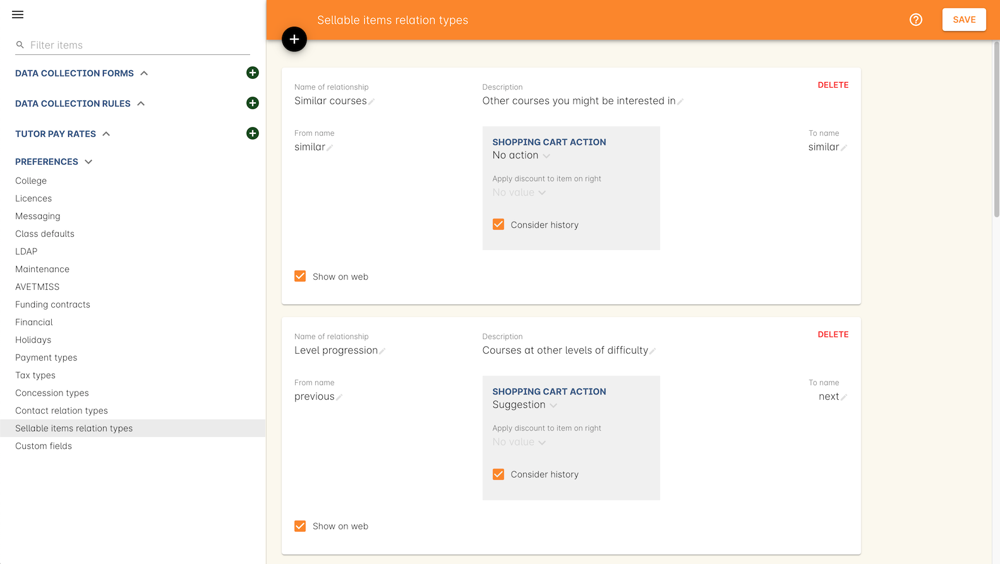
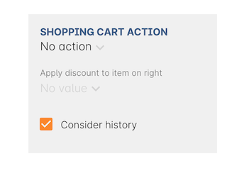
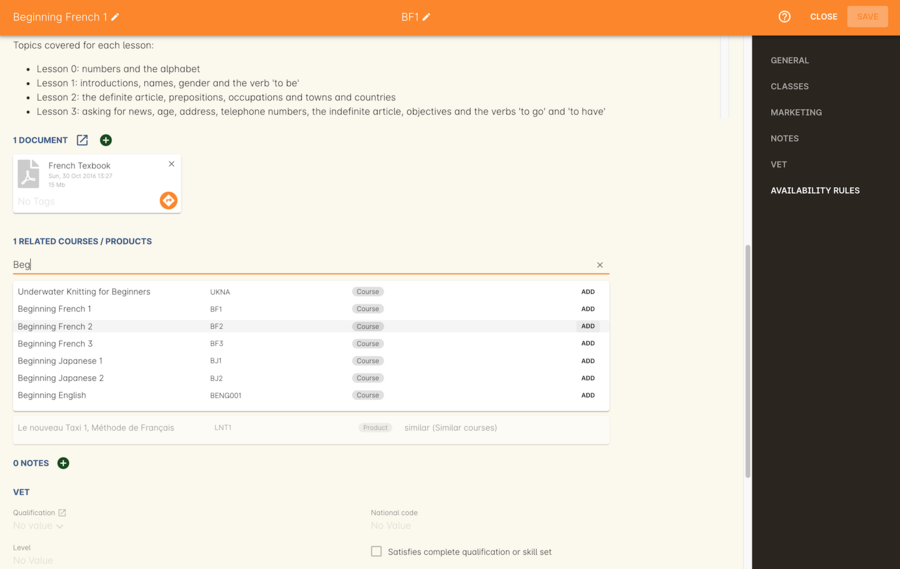
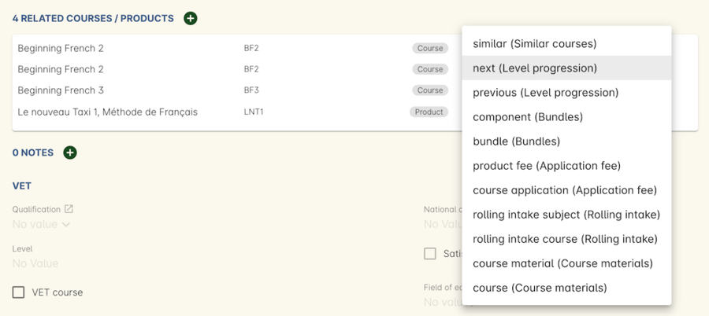

[[courseRelations]]
== Sellable items relationships

Sellable items relationships in onCourse allow you to create powerful new packaging rules between both courses and products. Applying these relationships to course and product records will allow you to market them in specific ways, like as a related course or as a part of a group of courses being sold together alog with some textbooks.

Courses and Products can have multiple relationships with each other of varying types, allowing you to be flexible with your offerings.

[[courseRelations-creating]]
=== Creating new relationships

You can create a new relationship by going to the Preferences window, then clicking 'Sellable items relation types' in the left-hand column.

Give the relationship a name that's unique. You'll also have to name the 'to' and 'from' sides of the relationship e.g. next/previous, component/bundle/ similar/similar etc. The 'to' and 'from' relationships can have the same name e.g. in our 'Similar courses' example you'll notice both the 'to' and 'from' names are the word 'similar'. You must also set a 'cart action', which will define what happens next when someone puts an item associated with this relationship in their cart.

The 'Show on web' checkbox, when active, will show this relationship on the website, while the 'description' is used to explain what you're selling e.g. for similar courses your description might read "Other courses you might be interested in". You can associate an existing discount record with the course relationship using the 'discount' field. The 'Consider history' checkbox will do a history check of the student's prior enrolments in your system to ensure they meet any prerequisite or corequisite requirements for enrolment. e.g. you may have an English level 4 course where students must have completed levels 1, 2 and 3 in order to enrol into level 4, this checkox will check their history to ensure those requirements are met before allowing enrolment.

onCourse also comes with pre-defined default course relationships that can be used to achieve different goals around the marketing and selling of your courses and products. Suggest similar courses or encourage students on to the next level of study i.e. from English 2 to English 3, provided they've finished the prerequisite course. In cases where you may need to apply a fee for enrolment, say in the case of requiring an audition or entry exam, automatically apply a fee product to the enrolment that the student cannot remove.

[[courseRelations-directions]]
==== 'To' and 'From' relationships

The relationships defined in these records are directional, which gives you great flexibility to market your courses and products in any manner you choose. We describe these directional relationships as 'to' and 'from'. However, we allow you to name them anything you like, so you can always ensure they're relevant to what you're trying to achieve.

When you apply the 'to' relationship to a course, the 'from' relationship will be applied to the opposite record e.g you're using the default level progression relationship and applying it to 3 english courses: ENG001, ENG002 and ENG003. The 'to' and 'from' relationships in the level progression course relationship type are named 'next' and 'previous'. This means that if the 'next' type is applied to ENG002 on the ENG001 record, then on ENG002 the relationship type to ENG001 will show as 'previous'. Similarly, when you apply the 'next' type to ENG003 on ENG002, when you open ENG003 the relationship to ENG002 will already display with the 'previous' type set.

How you set the cart actions of the relationship type will determine what happens when a course or product is added to the checkout/cart.

[[courseRelations-cartActions]]
==== Cart actions

The 'cart action' field lets you define what happens if a student adds a course or product with a relationship to their cart. Each choice has a different action. These actions are:

No action::
No extra actions are taken when adding this course/product to the cart

Add and allow removal::
Any related courses/products will also be added to the cart. These can be removed again by the user if they choose not to purchase the additional item/s.

Add but do not allow removal::
The related courses and products will be added to the student's checkout as well as the course/product they initially selected. These items _cannot_ be removed from the cart. This makes things like bundles or automatic audition fees possible.

Suggestion::
Relationships that use the suggestion cart action will show in the checkout as suggested courses. These can be freely added or removed from the cart at any time.

Discounts can be applied to any 'from' relationship, and you can set the discount to be applied in this field.

The 'Consider history' checkbox will check the enrolment and product purchase history of the contact your system to ensure they meet any requirements set by your defined rules. For example, if trying to enrol in a course that has another course with a 'from' relationship and that relationship is set to consider history, then the enrolling student must have a previously existing enrolment record for that course that is not cancelled.

[[courseRelations-addRelation]]
=== Adding relationships to records

Relationships are made between both Courses and Products. To add a new relationship between a course/product, open the record of the course/product you want to link and scroll down to the related courses/products section, click the `+` icon to create a new relationship.

Depending on what type of record you want to link, type the name of the course or product into either the `Find Products` or `Find Courses` fields. Once you'vefound the record you want to link, click `add`, then select a relationship type and direction using the drop-down box that appears.

[[courseRelations-defaultTypes]]
=== Default course relationship types

The following course relationship types are defined in onCourse by default:

[[courseRelations-similar]]
==== Similar courses

This is intended for when two or more courses are similar in nature e.g. language courses, arts courses and other similar courses that you'd like marketed together. The to and from relationships are both defined as 'similar', so in this case the direction of the relationship has no bearing.

[plantuml]
----
@startmindmap
* Beginner French
** Beginner German
** Beginner Japanese
-- Beginner Italian
-- Beginner Chinese
----

[[courseRelations-levels]]
==== Level progression

This should be used to show a suggested path of progression between similar courses e.g. if you have Cooking Level 1, Cooking Level 2 and Cooking level 3, adding a 'from' link between Cooking 2 and Cooking 1 and a 'to' link from Cooking 2 to Cooking 3 will complete the progression. When any of these courses are added to the cart, users will suggested these courses to complete the progression.

[plantuml]
----
@startmindmap
* Cooking 101
** Cooking 102
*** Cooking 103
**** Cooking 104
----

[[courseRelations-bundle]]
==== Bundles

This can be used to bundle together products and courses into a bundle that cannot be sold separately. The 'Add but do not allow removal' cart action means that if the 'from' course/product--called the 'bundle' in the relationship type but you can think of it as the parent record--is added, then any related course or product with the 'component (bundle)' relation type will also be added to the cart for purchase. The additional items cannot be removed from the cart, hence why they are a bundle.

Let's say you want to sell a group of 3 english courses as a bundle with a discount:

[plantuml]
----
@startmindmap
* 3 for $150 English Course Bundle (product)\nand discount applied
** ENG001 Enrolment\nENG002 Enrolment\nENG003 Enrolment
-- ENG001
-- ENG002
-- ENG003
----

[[courseRelations-audition]]
==== Application fee

This is intended for use in situations where you may have an application or audition fee that you need to apply at checkout any time someone enrols. E.G. if your music classes require an audition any time someone enrols and that audition requires a fee, you can make a product called 'audition fee' and then add the 'product fee (Application fee)' relationship between the course and it, the application fee product will be automatically added to checkout when the related course is added. The fee product is not able to be removed.

[plantuml]
----
@startmindmap
* Grade 5 Trumpet (course)
** Class enrolment
** Audition fee (product)
***_ cannot be removed from cart
----

[[courseRelations-rolling]]
==== Rolling intakes

Some colleges want students to be able to join a class at multiple points in the timetable. Let's say you are delivering a course with 16 units over a year. You don't want students to wait till the next January to start, so they can join in any term without completing the previous term. Some students will enter the course in term 1 and continue to term 4, while others will start in term 3, then do 4, 1 and finally term 2.

Set this up with a product as the "rolling intake bundle". (You might also decide to use a course here with a single self-paced class.) Then students will be required to enrol in 4 classes, one from each term. In this way you can create very flexible delivery strategies.

Each class will contain the regular timetable, units, outcomes, training plans, etc. You can choose to put the fees in the parent product or attach fees to each class. The latter will give you better accounting and budget tracking.

[plantuml]
----
@startmindmap
* Certificate IV (product)
** Term 1 (4 units)
***_ Jan-Mar 2020 class
***_ Jan-Mar 2021 class
** Term 2 (4 units)
***_ Apr-Jun 2020 class
***_ Apr-Jun 2021 class
** Term 3 (4 units)
***_ Jul-Sep 2020 class
***_ Jul-Sep 2021 class
** Term 4 (4 units)
***_ Oct-Dec 2020 class
***_ Oct-Dec 2021 class
----

[[courseRelations-materials]]
==== Course materials

This relationship type is inteded to define the relationship between a course and any intended learning materials that might be sold or provided as products. These products will be added to the cart when the course is, but the user may remove them E.G. in case they already have the required materials.

[plantuml]
----
@startmindmap
* Accounting (course)
** Class enrolment
** Scientific Calculator (product)
***_ can be removed from cart
** Accounting 101 Handbook (product)
***_ can be removed from cart
----

