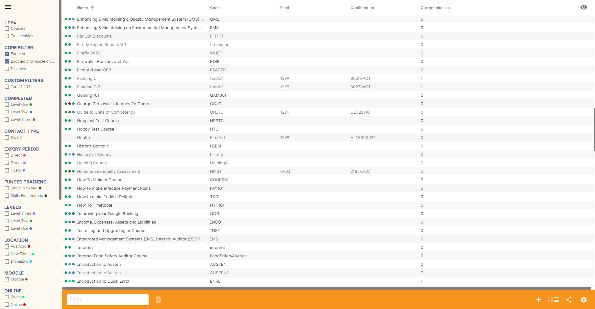
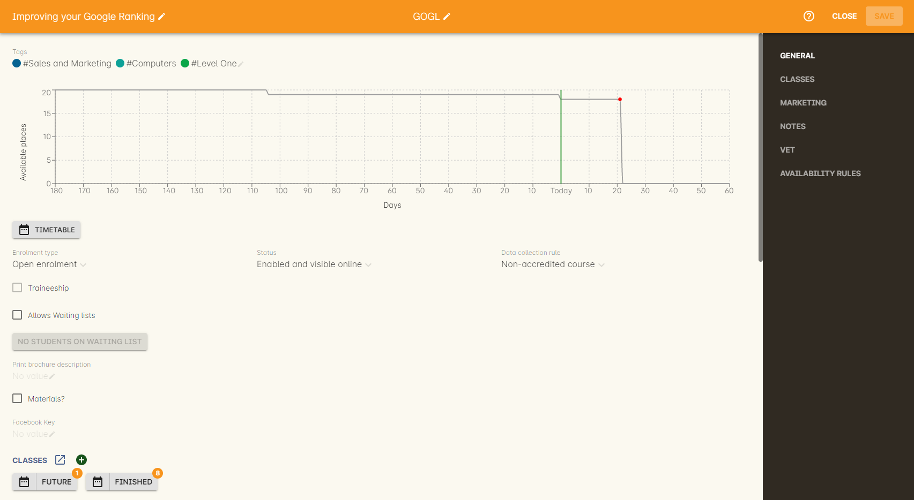
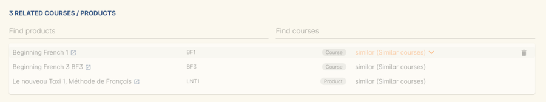
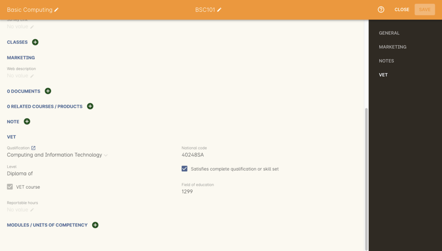
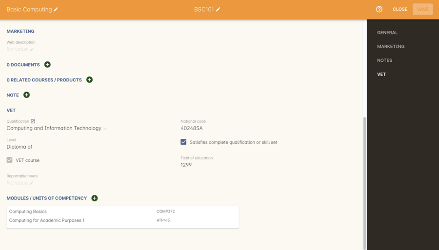

[[courses]]
== Creating Courses

A course is the subject being delivered. They may be accredited or non-accredited, part-time, full time or just one time.

For example, a course might be Jewellery Making for Beginners, a Diploma in Business or MYOB for Professionals. A course can have many classes and each class can run for one or more sessions. Students enrol in classes, but can add themselves to the waiting list for courses.

[[courses-workingWith]]
=== Working with Courses

To access the course records, go to the Dashboard and type Courses into the search, then click the result, 'Courses'. The Courses list view can display both Courses and Traineeship Courses.

==== The course cogwheel

From the list view, the course cogwheel on the right-hand side of the window offers a few different functions.

Duplicate <x> Course:: Lets you duplicate the course. This copies all the marketing and attached record data from a course into a new course with the same name, and a '1' added to the end of the course code. The feature is of particular use when a training package updates and course units need to be adjusted for future enrolments. This does not duplicate classes within the course.
Bulk edit:: Bulk editing tools for Courses allow you to set the enrolment type, course status, data collection rule, and add and remove tags for multiple courses at a time.
Delete record:: Allows you to delete the course record. You cannot delete courses where classes with enrolments exist.

==== Creating a new course

. In the Courses window, click on the + icon in the bottom right-hand corner of the screen. A new course screen will open, focused on the general section.
. Enter a name for your course, and a course code in the relevant fields. Your course code must be unique, that is a code not used by any other course already created. Please note that the course code must not have any spaces between characters. So the course code for 'Dancing for Beginners 1', written using the first letter of each word, must be entered as 'DFB1' and not 'DFB 1'.
+
[TIP]
====
You need only enter the course name and course code to create your courses in onCourse, you can return to the record later more information, like a description for your website or print marketing.
====
+
The code used will also become the course page URL on your website e.g. www.mycollege.com/course/DFB1. You can enter up to 32 characters in this field, so if you wish to create good URLs for SEO purposes, you could make your code longer, for example DanceClassStage1 to create the URL www.mycollege.com/course/DanceClassStage1

. Add course tags. You can add one or more tags to your course record by clicking the Tags field below the Course Name, and entering the tag name. The default tag group used to drive your onCourse website is called 'Subjects'. If you add a tag from this group, your course will be available to users browsing your website. More information is available about <<tagging, in our Tags chapter>>.

. Choose an enrolment type. There are two choices of enrolment type that relate to enrolments processed over the website. Open enrolment means students can enrol and pay directly on the web. This is the default setting. Enrolment by <<applications, Application>> means there is an approval required by your office staff before a student is offered a place and can enrol and pay on the web. Set the enrolment type appropriate to your course. All classes from this course share an enrolment type.

. In the Status field, the Enabled option will be selected by default. This allows you to create classes for this course. If you want to show this course on the web, change it to Enabled and visible online. If you decide to retire this course from your list of offerings you can change this to Course Disabled. Courses that are disabled can still have new classes created for them but appear greyed out in the list view.

. Set data collection rules. You'll need to choose a set of Data Collection Rules from the Data Collection drop down box, to display to students when enrolling online. These are useful for when you need to gather data for a VET course, or for when you simply want to gather some information on your students for future marketing use. You can learn more about Data Collection Rules and how to create your own in
<<dataCollection, our Data Collection>> chapter.

. You can mark this course as a Traineeship by clicking the Traineeship checkbox. If you want students to be able to go on the waiting list for this course check the allows waiting lists box. This box is checked by default.

. Below is the print brochure description box. There are two options for entering descriptions: print brochure description on the general tab, and web description in the Marketing section. Usually, print materials are limited to descriptions of two or three lines, whereas on the web, your space is unlimited. If you do not intend to use onCourse to create a print based brochure, you do not need to enter any information in the print brochure description field. Use the <<importExport_InDesign, InDesign Brochure XML Export>> to get it ready for import into a print design product like Adobe InDesign.

. Next is the marketing section where you can edit the web description field. Text in the web description field will display as the course description on your website, and can be written in rich text format. A guide to using rich text can be found in our link:https://www.ish.com.au/onCourse/doc/web/#richText[web manual]. You can also attach images, files or documents to the web page. To advertise this course online, select Enabled and visible online in the general tab. Visit our section below <<courses-Marketing, on course marketing>>.

. The Notes section can be used to add internal notes about the course that will not be published to the web.

. The Documents section can be used to create a link between any documents that have been uploaded to the onCourse document management system, and the course you are creating. Either click the + button to search for documents already uploaded to your system, or drag-and-drop a file on the window and it will upload and attach to the course.

. Next is Classes. During the course set up stage, there will be no information available in the Classes section. After you schedule some classes you will see them here.

. If you're creating a VET course, you can set either a full qualification package from under the VET heading by clicking the Qualification drop down box and making a selection. You can also add create your own part qualifications in the Modules/Units of Competency section. Read more in <<courses-VET, VET portion>> of this chapter.

. When you have entered your information, click save. You will be returned to the course list page.Notice that the course you have entered is now listed. You can return to edit this course at any time by double clicking on it.

[CAUTION]
.Field Validation
====
You will notice that before entering data, the course and code box is coloured red. Once you have entered valid text the colouring disappears. Should the box remain red, it means that you have not entered the data correctly and need to review your entry. You will not be able to save the record as the save button will be disabled. There will be a warning icon that will provide you with information as to why the data you have entered is not accepted if you hover over it.
====

[[courses-traineeships]]
==== Traineeship Courses

Traineeship Courses are a special type of course. To mark a course as a Traineeship Course, click the 'Traineeship' checkbox at the top of the course edit view when creating your course. You will be required to select a data collection rule and a VET Qualification in the VET section at the bottom of the course edit view.

image::images/course_traineeship.png[title='The Traineeship field already ticked. It cannot be unticked once you've taken an enrolment in a related class.']

==== Editing and Updating Courses

After a course has been created, you can create its <<classes, classes>>. Click on the + next to 'Classes' in the course window to open a new class record. You can also edit a course record simply by opening it and editing the field, then saving it.

[[courses-productrelations]]
===== Creating course and product relationships

onCourse allows you to link courses and products using predefined relationships. You can read more about course and product relationships <<courseRelations, in our relationships chapter>>.

To add a relation to a course:

. Inside the course record, scroll down till you get to the Related Courses/Products section and click the + button next to the section header.
. To select a product to add as a relation, click in the 'Find Products' section then type out the name of the product you want to add. Similarly, to add a Course, type a course name into the 'Find Courses' field. There are no limits to the number of relations you can add.
+
[NOTE]
====
The fields for adding products and adding courses are different. Make sure you're using the right one for what you want to find.
====
+
. Search results will appear and will auto-filter the more you type. Click the 'Add' button to the right of a selection to add it as a relation.
+
. Lastly, make sure you set a relationship direction and type by making a choice from the drop-down box that appears. make sure you do this before saving as the relationship type can't be changed. If you make a mistake you'll need to delete the link and add it again.

[TIP]
====
Any related Courses that you set up must be web visible and open to enrolments in order to display with the original course on the website.
====

[[courses-addingimages]]
==== Adding thumbnail images to /courses pages on your website

You have the ability to add thumbnail images to all your courses. These will appear on your website on any courses list view page, so that's any URL that contains /courses after your domain name e.g. www.acme.com.au/courses or www.acme.com.au/courses/business/computing. More information about it can be found in the
https://www.ish.com.au/onCourse/doc/web/#images_and_attachments[attachments
chapter] of the web manual.

[[courses-viewmodules]]
=== Viewing Qualifications and Units of Competency

You can view all the Qualifications and Modules/Units of Competency (including skill sets) by opening the Qualifications window via the Dashboard. This has been merged with the Unit of Competency window as well, so all of these are able to be viewed and reviewed together in the one place.

You can switch between the three-column view or a list view by selecting the switcher at the bottom of the window.

image::images/quals_listview.png[title='The Qualifications/Units of Competency window in list view mode']

[[courses-Marketing]]
=== Writing course descriptions for the web

The onCourse website is a powerful marketing tool for promoting your products to the public. Your ability to explain your product point of difference and entice students to enrol is determined by the copy you write in your course Marketing tab.

[[courses-SEOtips]]
==== What does a good course description include?

* The first sentence or two of your course description should contain your hook. This is the copy that displays in the course list results and 'reels in' the customer, enticing them to click on the [more...] link.
[TIP]
====
Avoiding using headings in the first paragraph for the same reason - it won't render well in list views or make sense to readers browsing your site.
====
* Think about all the questions potential students ask about this course, and provide answers in the course copy. onCourse already helps answer the 'where and when' questions with google maps embedded, and a full class timetable.
* Break up your copy with headings. It's difficult to scan large blocks of text, so put your rich text skills to good use and separate content with headings like 'What to bring', 'What you will learn', 'What past students say'.
* An image is worth a thousand words. Show, rather than tell, what your students can achieve if they enrol in this course. Learning Thai Cooking? Show them a dish they will cook in class. There are thousands of enticing stock photography images available for purchase online, and the onCourse system makes it easy for you to attach them to a course and upload them to your website.
* Keep the technical language to a minimum. If you are selling vocational training it's easy to fall into using acronyms and terms that only make sense to people within the industry. Your potential students are here to learn - don't scare them off enrolling by assuming they have the same industry knowledge you have.
* Avoid negative language. Your course description is not the place to tell people they can't access refunds if they change their mind after enrolment. Save it for your Terms and Conditions page.

==== What is SEO and why is it important?

SEO stands for Search Engine Optimisation and having a website with 'good' SEO should mean your site appears near the top of the list for searches that are most relevant to your product. A large part of SEO is technical - i.e. can the Google bots that crawl the internet read and understand your website's content? The technical framework that underpins the onCourse web engine does most of this hard work for you, but one thing we can't automate is the creation of your website content.

There are plenty of companies out there who will try to sell you an SEO solution, but the one thing most of them lack is an experienced copy writer who knows your product and your market.

Writing enticing copy is a skill. Making sure this copy hits on appropriate keywords and still reads well is an art.

Keywords are the terms people use when they are searching for your product. If you have an https://adwords.google.com.au[AdWords account with Google], they have an excellent Keyword Planner tool that allows you search for keywords and find related terms people search for, with their relative search frequency.

==== Tips for writing SEO copy

* Your key search term belongs in your course name, which in turn becomes your website page title and heading level content in the results pages. Words appearing in titles and headings are ranked higher than text on the page. For example, the course name 'Learn Microsoft Excel' would be a higher ranking course name for SEO purposes than 'Excel 101'
* The first paragraph of text on the page should reuse your primary keywords and add in your top related keywords, while remaining readable to humans. Say for example you chose the primary keyword Microsoft Office Excel with related keywords MS excel, formulas, spreadsheets, help, online, free, and your generic location. Your first paragraph would read: "Our Canberra CBD courses in Microsoft Office Excel are the solution to learning excel formulas and other spreadsheet functions. MS Excel training will help progress your career in almost any industry. Online classes for Excel are also available, or you can attend classroom tutorials and then access our online Excel course for free."
* If you're selling education, keywords like learn, course, class, training and tutorial belong in every course description you write.
* If you're selling face to face training, make sure you use location based keywords that relate to your training venues in the course copy, don't just rely on the class location to 'sell' to the local market.
* Encouraging people to link back to your content is also a great way to improve your native page ranks.
Consider providing content beyond the sales pitch - some Excel hints and tips may be just the trick to keep visitors returning.

[[courses-VET]]
=== VET Courses

If you are an RTO who offers short accredited programs, or full qualifications, you will appreciate the ease in which you can set up your courses with the right unit and qualification details. This then flows through to recording outcomes, creating transcripts and certifications, and generating AVETMISS compliant data.

[TIP]
====
In this section when we talk about Qualifications we really mean "Qualifications, Accredited Courses or Skillsets". And when we say "Unit of Competency" we also include "Modules". Although the words are different between state and commonwealth accreditation regimes, the processes in onCourse are exactly the same.
====

You must ensure that in the Preferences > AVETMISS section you have the 'show RTO related screens and menus' checkbox option enabled. This makes the VET section in the course and class records and the AVETMISS section in the student record visible for data entry.

In the VET tab of the course record you can select the Qualification and the Units from the built in NTIS data for your chosen course. If your course is VET, but not from a training package or accredited course, you can also flag it VET here and allocate its Field of Education ID. This is something you may need to do as part of your government funding requirements for non accredited courses.

[TIP]
====
Do you deliver state accredited courses? You will find the course listed in onCourse but not the modules that make up the course. This is because they are not publicly available on NTIS. You can add these manually in the Qualifications window in onCourse. Set them up as a Local Skill Set to have them export in a NAT00030A file during AVETMISS 8 export.
====

onCourse does not contain the qualification packaging rules, so it is up to you as the RTO to ensure that you are compliant with your own scope of registration and the requirements of the training packages you are authorised to deliver. You should refer to these requirements when creating your courses and only select those units which are allowed to contribute towards that particular qualification.

Examples of VET Courses are:

* A full Qualification where you know all the units the students will complete in advance i.e. all students will complete the same core and elective units. Students will graduate with a complete Qualification.
* A full Qualification where all students will undertake the core units, but may all select different elective units. Students will graduate with a complete Qualification.
* A short course which has one or more units of competency embedded within it. The units may or may not all contribute to the same Qualification. Students will graduate with a Statement of Attainment.
* A short course where you know which qualification a student will be working towards in advance, but the students in the class will complete a variable number and selection of units. Some may achieve a Statement of Attainment, some may be working towards a full Qualification, and some may simply receive a non-vet Statement of Attendance.
* A course which is not linked to any national or state accredited training packages or accredited courses, but has a vocational learning outcome. Depending on your reporting requirements, these courses may also contribute towards your annual VET delivery.

In onCourse outcomes (records of undertaking and achieving a unit of competency) flow down from the course to the student via an enrolment in a class. If a course has 15 units attached to it, when a student is enrolled in a class for that course, the student will have 15 outcomes created for them - one for each unit. You can always modify the units for the student in their own enrolment, for example if they change to a different elective. What this means is that you can save yourself a lot of data entry work if you set your course up with all the units to begin with.

==== Creating a VET Course

. Follow the instructions to create a new course. Once completed with all the naming and initial settings, scroll the course record to the VET section.
. Enter the National Code. The fields are clairvoyant, so as you type in them, onCourse will search for and list the qualifications in the built in training.gov.au database. Select the qualification by clicking on it. You can also search for qualification by name in Qualification. Omit the words 'Certificate in' or 'Diploma of' in your search. For example, search for the 'Certificate IV in Aged Care' by typing 'Aged Care'.
. You can then add modules and the units in the section titled Modules/Units of Competency. Click the + icon next to the section heading. This will open a search bar.
. Enter the National Code or Title. These fields are also clairvoyant so will populate as you type. To make your selection, click the Add button to right of the selection you want to add. You can choose multiple modules to add. You will then be returned to the course screen where you will see the modules and units listed. To add more units simply click on the + sign and repeat the process. To _delete_ any units, hover your mouse over the unit you'd like to delete and click the trash icon that appears to the right of the selection. When you are done, click save.

image::images/vet_course_tab.png[title='The VET section of the course record, showing a full qualification with selected units']

[[courses-immutableCaution]]
[CAUTION]
.Changing units in a course with enrolments
====
Once a course has a class with an enrolment in it you CANNOT change the units of competency assigned to the course. This is because onCourse has created an immutable relationship with this data - if you changed it at the course level, every student ever enrolled in a class for this course would have their outcomes changed.

However, you can always retire the old course and create a new course to use for future enrolment using the 'duplicate course' option in the list view cogwheel. The new course can have the same name but will have to have a different course code. You may choose to change the code of the old course instead, so the new course can use the existing code, which is advantageous for your SEO. Make sure to set the status of the old course to 'course disabled' and when you are ready, the status of the new course to 'enabled and visible online'.

You may also want to duplicate one of the classes from the old course and assign it to the new course to use the same timetables and teaching schedules.
====

You cannot actually add a Unit of competency to a course if it already has enrolments (see the caution above), you can only cancel the old course and then create a new course with the additional unit of competency you want included. This is because changing the units of competency changes the very nature of the course, but the history of the old course and its previous students need to be retained.

If needed, you can also add units directly to student enrolments. This will not change the course units for new students enrolling, but can be used to correct or update the records of existing students.

If the unit change is substantial, you may want to consider creating a new class against the new course, and transferring all the students from the class linked to the old course to the class linked to the new course. This will remove all the old units from their record (provided outcomes have not yet been set), and with their new enrolment, add all the new units to their record.

[[courses-duplication]]
==== Duplicating a Course

. First go to the "Course" list view and single click to select the old version of the course
. From the cogwheel, select the option 'duplicate course'. This will make another course with the same name and all the same content, with a course code with a 1 on the end.
. Courses can have the same name, but every course has to have a unique code. Because the course code is what forms your URL on the website, it is better for SEO purposes to change the code of the old course to something different before you disable it e.g. BCDCERTV could become oldBCDCERTV. Then you can change the code of the new version of the course from BCDCERTV1 back to BCDCERTV.
. Open the old version of the course and set the status to 'course disabled'.
. Open the new version of the course and make the required changes to the listed units of competency by adding or deleting from the current list on the VET tab. Note you will need to delete all the non-required units, save the record, and then reopen it to add new units.
. When you are ready to save and close the new course, set the course status to 'enabled and visible online'

==== Duplicating a class from an old course to a new course

. Open the class list view and locate a recent class from the old course. Following from the example before, this might be class oldBCDCERTV-90.
. Using the class cogwheel option, duplicate this class, making any changes to the dates as appropriate. This new class will have the code oldBCDCERTV-91 and be linked to the old course.
. Double click on the new class to open it. In the course code field in the top right-hand corner, change the code from the old course to the new course e.g. BCDCERTV. This has now linked the class to the new course.
Save and close.
+
NOTE: You can only change the course a class is linked to before any enrolments are processed into the class.
If a class has enrolments, even if those enrolments are cancelled, you can not change the course code it is linked to.

==== Courses which are complete qualifications or skill sets

When a course has the flag 'Satisfies complete qualification or skill set' checked on the VET tab, this means that if the student successfully completes all of the attached units, they will be eligible for a Qualification or Skill Set Statement of Attainment.

Using the automatic 'create Certificates' options from the class or enrolment cogwheels will look at the value of this flag and determine what type of certification to create.

This flag, for AVETMISS purposes, also signifies the student's intent to complete a qualification. Outcomes linked to a class with this flag checked will be reported linked to the parent qualification, where courses where this isn't selected will be reported as module only enrolments.

This value of this checkbox can be changed as needed after the course has been created, and even after students have enrolled.

[[courses-partialnonvet]]
==== Partial qualifications and Non-VET (non-accredited)

Remember that in onCourse a course is about the product you are selling to your students. Sometimes you may break a program of study e.g. full qualification into lots of short courses for students to buy, complete and over time, to work towards the final outcome of a qualification.

In onCourse, courses don't have to be linked to a qualification or a unit of competency. They can just be a non-accredited course.

If students are working towards a unit of competency that they will complete in another course, you may like to indicate this in the program description that you use for marketing purposes. If the student only completes this course, they will only be eligible for a non-accredited Certificate of Attendance, not a Statement of Attainment.

You can set up this type of program in onCourse by attaching the Qualification that the student will be working towards in the VET tab of the course, but not adding any Units of Competency to the course. You do not have to add the Qualification at all - this is optional, and would not be appropriate if the program of study never led to any formal Qualification outcome.

When students enrol in this course, they will get a dummy outcome (used for reporting purposes in some states) with the name of the course. You can set this dummy outcome to pass (81) or fail (82). Using this outcome, you will then know when the student enrols in the next course (where the units have been attached) that they have successfully completed the part one component.

When you set up the second part of the course, you will add the qualification and the units to the VET tab, so when the student enrols they will get the appropriate units of competency added to their record. Then you are able to record their final outcome result as per the standard list of VET options.

In the example below, a student is working towards a cluster of units from the Certificate I in IT. Only when they have completed the second course, Understanding Computer Basics, are they eligible to be assessed against the unit outcomes. The first course, Computing Basics, has no units attached, and the second course has three units attached.

=== Showing courses online in bulk

You can put your classes online in bulk from within the Courses window:

* Go to the Courses window
* Highlight the courses in the list view you want to put online
* Click the Cogwheel > select 'Bulk edit...'
* By default, the function will assume you're only wanting to action the changes on the currently selected records. You can change this by clicking the 'found records' button before submitting. This will action on all records in the system. * A checkbox will appear inside the pop-up. If the checkbox is ticked, the classes will appear online. If it's unticked, those classes will be removed from online.
* Click Submit to finalise the changes

