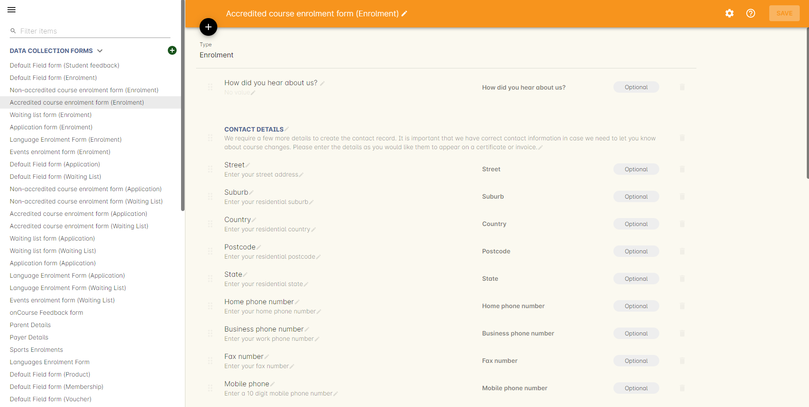
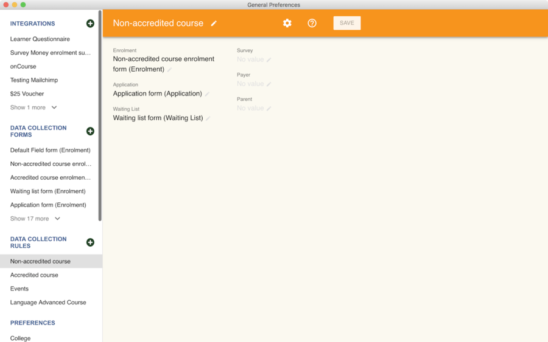
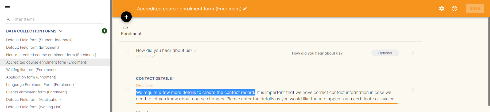
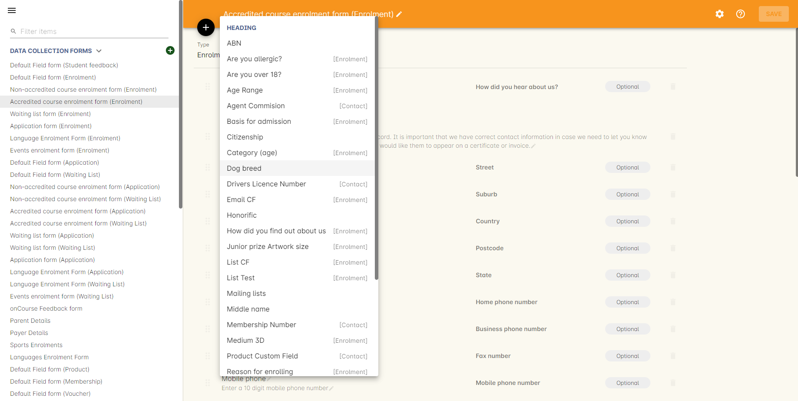
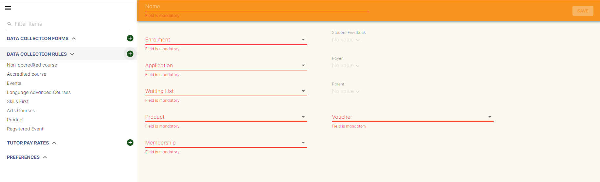

[[dataCollection]]
== Data Collection Forms and Rules

Data collection forms and data collection rules combine to allow you to create a variety of online enrolment, waiting list and application forms for different course types.

Data collection forms are a collection of fields that will be made visible to a user during an online interaction with your business.
Each field can be set as optional or mandatory, and you can define the field label and helper text that applies.

In each form, you can sort and group fields into sections with labels and descriptions, to better explain the data collection process to the end user.

By combining standard onCourse fields with custom fields you have added to your onCourse database, to meet your business specific data collection requirements, a truly customisable data collection experience is available for all types of training organisations.

A data collection rule is the grouping of three data collection forms for the processes of enrolment, waiting list and application into a group with a name.
This rule group can then be applied to courses.

By default, your new onCourse database will contain data collection rules for both accredited (VET) and non-accredited courses, and a default field form for collecting data during product purchases.
Consider these a starting point for guiding you through the basic ideas of creating your own forms and rules.
You can also duplicate data collection forms that you've already made.

For every online enrolment, application or wait list, the first information asked is First Name, Last Name and Email address, to check if the contact already exists in the onCourse database, or determine if they are a new contact.
You can not add or remove these fields to data collection forms as they are always the mandatory first questions asked in all online transactions.

[TIP]
====
You can learn how to create Custom Fields to insert into Data Collection forms at the end of our <<generalPrefs, chapter on General Preferences>>.
====

[[dataCollection-access]]
=== Accessing the default data collection forms and rules

You can locate the data collection forms by going to the Preferences window and selecting 'Data collection forms' from the list on the left-hand panel.

By default, your new onCourse database will contain the following data collection forms:

* *Default field form (Enrolment)* - This form applies to the contact data collection for product sales, memberships and gift voucher purchases.
* *Default field form (Student Feedback)* - This form applies to the student feedback survey's that appear in the Skillsoncourse Portal.
* *Non-accredited course enrolment form* - The form is designed for the collection of data from students enrolling into a general interest course where AVETMISS data reporting is not required.
* *Accredited course enrolment form* - This form is designed to collect contact details plus AVETMISS question responses.
* *Waiting list form* - A form to collect information from a student adding themselves to a course waiting list.
* *Application form* - A form to collect information from a student applying for a course.

The forms are grouped into 'Data collection rules', also available from the left hand panel of the general preferences window.

By default, your onCourse database will contain two data collections rules:

* *Non-accredited course* - These rules contain the non-accredited course enrolment form, and generic application and waiting list form.
* *Accredited course* - These rules contain the accredited course enrolment form, and generic application and waiting list form.

Note that both of these data collection rules use the same form for waiting lists and applications.
If you edit the default form, your changes will apply to both accredited and non-accredited applications or wait list entries.

If you do not want both data collection rules to use the same forms, you can create a new form and adjust the rule groups so the each have their own application form, for example.

[[dataCollection-edit]]
=== Editing data collection forms

You can edit the default data collection forms in onCourse to include your business specific rules.
It is usually best practice to edit the forms included by default, before you start creating additional forms.

==== Mandatory or optional fields

You may wish to start by changing some of the fields from optional to mandatory.
When a field is deemed mandatory, this means the student can not progress further through the form without adding data.
It also means if a student returns to your website to make another application, enrolment or purchase, they will only be asked to complete data for mandatory fields they haven't previously completed.
This assists in making return visits and purchases faster for your customers.

==== Changing field labels and help text

You can change the field label and helper text.
By default, the field label will be the name of the field, but you can change it to make more sense in the context of the form.

For example, you may wish to change the label of the field 'street' to 'address', and the helper text from 'Enter your street address' to 'Enter your mailing address' if this is the data you would prefer to collect (keep in mind, if you are an Australian RTO obliged to report AVETMISS data for your students, you need to collect the student's current residential address for reporting purposes).

The AVETMISS field labels are often phrased as questions, so 'Year School Completed' might be better labelled as 'What year did you complete school?'

In some website designs, the 'Help text' appears within the field before the student supplies their answer.
In other designs, it appears when the field is hovered over.
Consider your help text wording in the context of your website design choices.

==== Ordering and grouping fields under headings

You can adjust the order the fields appear in the form by clicking on the six dot icon next to the field name and dragging and dropping the field in the form.

Fields are grouped under headings.
To edit the heading name or description, click the Edit button to the right of the heading name.

Make your changes to the heading and click done when complete.

Heading descriptions are often used to provide instructions text to students or explain why the data is being collected.

==== Adding and deleting fields on the form

You can add additional onCourse standard contact fields, or your own custom fields to the form by scrolling to the bottom of the form and choosing 'add field'.
Select the field from the drop down list available.
Fields you have already added to this form will not be available to select from the list.

Your newly added field will be added to the bottom of the form you are editing.
You will need to drag the field to the placement you want in the list.

Your custom fields are also available to add to forms.
You should be careful to only add custom fields that make sense for the type of form you are creating, however they are labelled to help with this.
For example, custom fields for contact records can be added to any type of form, but only custom enrolment fields should be added to enrolment forms.

You can delete fields from data collection forms by clicking on the x icon to the right of the field.

New headings and descriptions can also be added to your form, and dragged to the appropriate location, like fields.

[[dataCollection-create]]
=== Creating new data collection forms

Before you add a new form to onCourse, think about how this form will be grouped with other forms into a 'Data collection rule'.
The name you choose for your new form will either need to be specific for the one type of rule it belongs to, or generic to make sense when you apply it to multiple rules.

You also need to consider what process this form will be used for - enrolment, application or waiting list.
It helps to name your form in a way that indicates it's process.

You can add a new form by scrolling to the bottom of all the existing forms and clicking the button 'add new form'.

You will then need to work through the process of adding group headings, fields and setting their label and help text properties.
When creating a new form you should add the headings and fields in the order you want them displayed to the end user, to avoid you having to re-order them.

=== Duplicating data collection forms

You can easily duplicate any data collection form you've made in onCourse from the Cogwheel menu.
Simply hit the Cogwheel icon, select 'Copy', enter a new name for the data collection form, then hit 'Save'.

=== Editing and creating new data collection rules

Data collection rules are a group of six forms, for the enrolment process, wait list, applications, student surveys, payers and parents/guardians.
Only the enrolment, application and wait list forms will be assigned by default.

You can change the names of the rules or forms that have been selected for the rules.

Keep in mind that if your onCourse website is already using data collection rules, any changes you make to the form selection process will take effect immediately, for the courses where that rule collection is applied.

If you are creating a new data collection rule, you will need to add it to a course or courses, before it will be available on the web.

You can create a new rule group by clicking on the button at the bottom of the window 'Add new data rule'.

[[dataCollection-courses]]
=== Adding data collection rules to courses

By default, any existing onCourse courses will have a data collection rule applied to them based on their VET status.
VET courses will have the 'accredited course' rule selected, and non-VET courses will have the 'non-accredited course' rule applied.

You can change the data collection rule for any existing course, and will need to set the data collection rule for any new course you create.

On the general tab of the course, you can select a data collection rule from those available in onCourse.

In the course list view advanced search options, you can search for courses by their data collection rule to allow you to check which course is associated with which rule.

=== Data collection on the web

The field settings you have defined in your data collection forms and rules will drive the questions the students are prompted to answer when they engage with your website, whether that engagement is to add a course to their waiting list, purchase a product, apply for a course or enrol in a class.

What each individual student sees will depend on the combination of items in their shopping cart, and their previous engagement with you.

For example, if a student is an existing contact in your database and is matched on their first name, last name and email address with an existing contact, then they will only be asked to complete fields marked as mandatory in the data collection rules that they haven't completed previously.
They will not be shown the responses to any fields they have supplied before, or fields set to optional that they haven't completed.

==== Your details - contact fields

When a student is enrolling or applying for multiple courses and classes in the online checkout process, they will see the combination of required and mandatory fields based on the data collection rules assigned to all the courses in their shopping cart.

Breaking fields up into clear groups with headings to explain assists in creating a clear and self explanatory user interface in your website.
In the example below, this advice has not been followed.

You should always perform comprehensive user testing of your website application and enrolment settings when adjusting data collection rules so you can confirm the process the student sees is what you envisioned.

==== Summary - enrolment or application specific fields

Custom fields that apply to the enrolment or application are asked in specific relation to the course the student is enrolling in or applying for.

That means that if the student is enrolling or applying for multiple courses where the same data collection rules apply, they may be asked the same questions twice.
The types of questions asked here should be specific to the course e.g. for an event with elective breakout activities, do you want to attend stream 1 or stream 2.

Generic questions about the students preferences or demographic information tend to belong in the contact record, rather than the enrolment or application.

The one place where this is not the case is for funded enrolments or applications, where the student needs to answer questions related to their funding eligibility and declare they are true and accurate at the time of application or enrolment.
It would not be appropriate here to rely upon answers a student may have supplied six months ago in a previous application.

