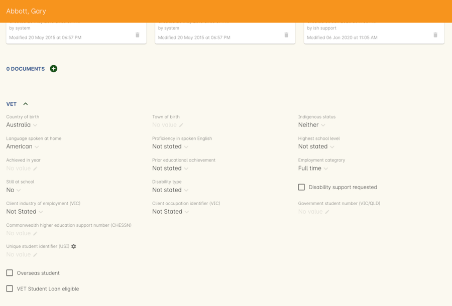
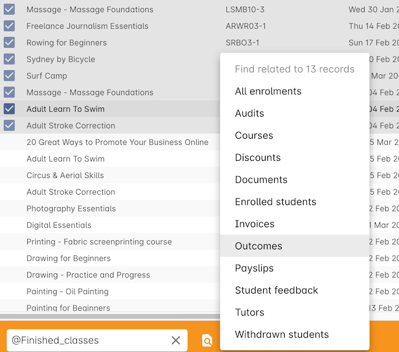
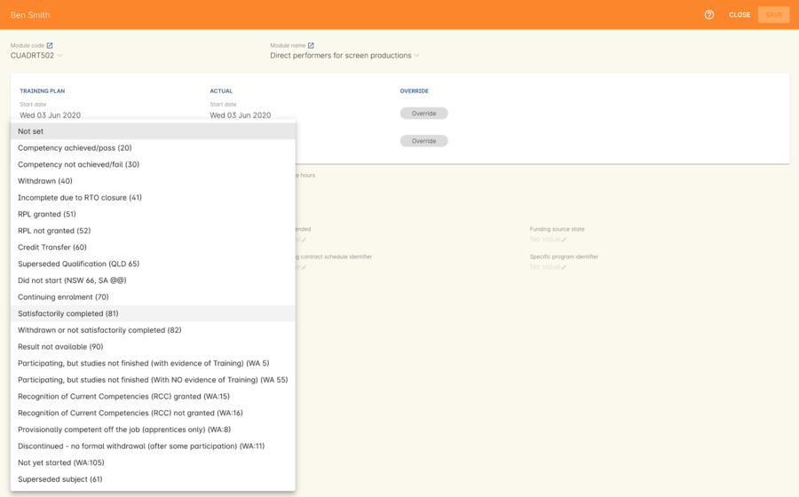
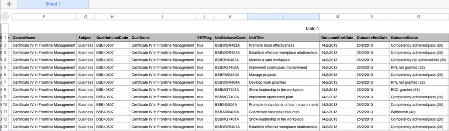
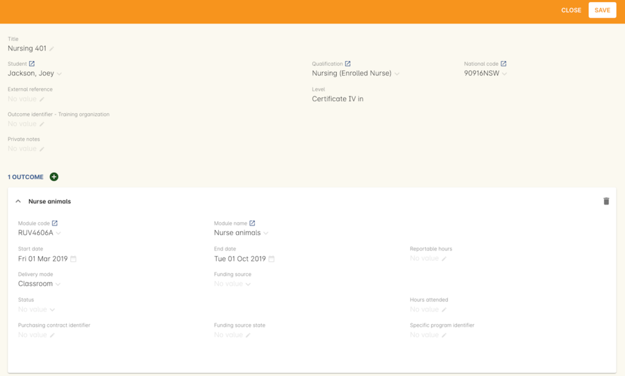
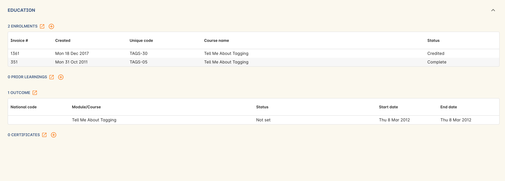
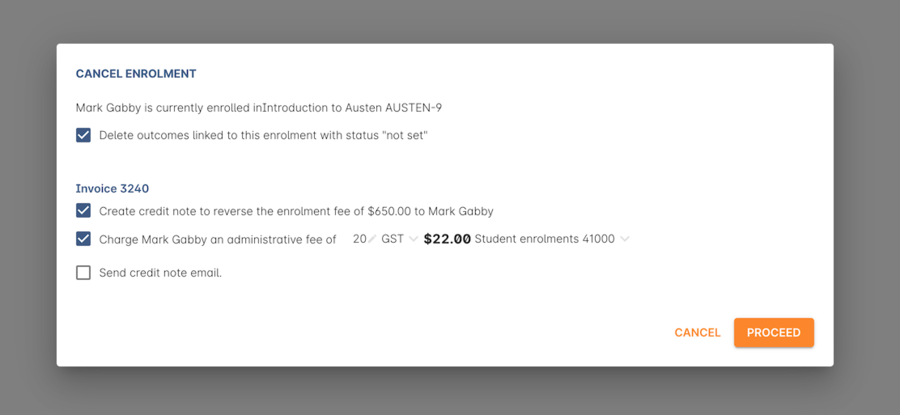

[[delivery]]
== Enrolments and Delivery

=== During Enrolment and Delivery

Right, that's everything you need to take care of before letting students hand over their money to enrol in your courses.
All you need to worry about from this point is what to do while you're delivering training, but before you hit the 'Export' button on the AVETMISS runner to collate all your reporting data there are some things to consider.

[[delivery-enrolment]]
==== Enrolment

For all VET enrolments you are required to validate each student USI against their first name, last name and date of birth with the USI Registry System. If you have an onCourse support plan and have correctly set up your USI Integration in onCourse, onCourse will do this automatically for each USI supplied. For more information on creating and validating USIs, please refer to the <<usi, USI Chapter>>.

Students who are exempt of the USI requirement will need to report the value 'INTOFF' or 'INDIV' in the USI field to demonstrate that they are exempt and show their exemption type. onCourse will assist you with complying with the requirements by automatically exporting 'INTOFF' for students with a residential address in a country outside Australia.

Training Contract Identifier::
This information can be entered on the General tab on the student Enrolment.

Client Identifier - Apprenticeships::
This information can be entered on the General tab on the student Enrolment.

Fee Exemption/Concession Type Identifier::
This is set in the student's Enrolment record on the General Tab.

Purchasing Contract Identifier::
This can be set in the class on the VET tab or in the student's enrolment General tab.

VET in Schools Flag::
This information can be entered on the General tab on the student Enrolment.

Specific funding identifier::
This field is labelled 'specific program identifier' and can be found on the outcome record.

Outcome Identifier - Training Organisation::
This information can be entered on the General tab on the student Enrolment.

Funding Source - State Training Authority::
You can enter this information in the Class VET tab, the general tab in Enrolment or in the individual outcome record on the Class Outcomes Tab or the Enrolment Outcomes tab. Double-click the outcome to see this field.

Client Tuition Fee::
This is the fee you charged the student at the time of enrolment, divided by the total nominal hours in the course, multiplied by the nominal hours of each unit to set a proportional student fee for each unit. To charge a fee, set a class fee in the Class General tab. VET courses are usually GST exempt.

During the enrolment process, you can charge the student the full fee or give them a manual discount if they meet fee exemption criteria. The fee they pay here is what is reported. If you don't usually use onCourse for invoicing and payment records, create a full cash payment for each student on enrolment. Don't worry about the invoices that are automatically created here - they have nothing to do with AVETMISS.

(VIC) Eligibility Exemption indicator::
Exported from the option set the Enrolment record value from the field of the same name.

(VIC) VET FEE-HELP (Income Contingent Loan) Indicator::
Exported from the option set the Enrolment record value from the field of the same name.

(VIC and QLD) Student number - VSN or LUI::
This is entered on the contact record AVETMISS tab in the field labelled Government Student Number (VIC/QLD)

[[rto-attendance]]
==== Marking attendance

You must ensure that tutors are marking student attendance for every class. This can either be done in onCourse itself, within the attendance tab of the applicable class window, or more likely via the SkillsonCourse Portal. Accurately marking attendance means that certain fields will update automatically once a course has completed.

You can learn more about marking attendance in onCourse <<classes-Attendance, here in our Classes>> chapter.

==== Marking outcomes

Tutors should always be marking student outcomes in the SkillsonCourse portal periodically to ensure data is as up to date as possible.

You can also set Outcome statuses in the class record by clicking the 'show all outcomes' button. You can bulk set an outcome status but selecting all the records, clicking the cogwheel and selecting 'bulk edit...'. Or you can set them all one by one, whichever you prefer. You can also set the outcome status in the enrolment record.

If you set an outcome an RPL, RCC or Credit Transfer status, the Delivery Mode Identifier will always export as 90 - NA regardless of what is set in the outcome value.

==== Creating certificates

onCourse will create AQF compliant certificates for your students, but for the purposes of lodging AVETMISS, you don't need to print or issue them. Qualification and skill set completions are reported in the NAT00130 file for all states. If the export flavour is for a funding type that requires it, details of anticipated qualifications e.g. NSW Smart and Skilled or Victoria's Skills First.

The 'awarded on' date determines the date of certificate issue for AVETMISS reporting purposes. By default, this date will be the date the certificate was created in onCourse. If you create certificates early in a calendar year that need to be reported as part of the previous calendar years completions, be sure to back date the 'awarded on' date to the previous year.

More information about certificates, check our <<certification, Certificates>> chapter.

==== Hours Attended

If you need to set the hours attended you can find the field in the Outcome record. Double click the outcome to see this field called 'Reportable Hours'.

[[delivery-outcomes]]
=== Setting and modifying outcomes

When you enrol students into a newly set up VET course and class, outcomes will automatically be created for each of the units of competency you assigned to the course, while other properties: start and end date, reportable hours, delivery mode and funding type are set in the class.

There are multiple places you can access the outcomes and set them, plus modify the details mentioned above for individual students - in the outcomes window, the find related outcomes window and in the certificate window when you are creating a new certificate.

==== What are outcomes?

A student's outcome is the record of their engagement with a Unit of Competency or Module from a training package or accredited course. Outcomes are often reported to government through processes such as AVETMISS and must meet certain validation rules. Primarily, an outcome records if a student has passed or failed their course. The outcomes available for selection are as follows:

* Competency achieved/pass (20)
* Competency not achieved/fail (30)
* Withdrawn (40)
* Recognition of prior learning granted (51)
* Recognition of prior learning not granted (52)
* Recognition of current competency granted (53)
* Recognition of current competency not granted (54)
* Credit transfer (60)
* Did not start (NSW: 66, SA: @@)
* Continuing enrolment (70)
* Non-assessed enrolment - Satisfactorily completed (81) **
* Non-assessed enrolment - Withdrawn or not satisfactorily completed (82)
* Result not available (90) ***

Refer to the NCVER publications, VET Provider Collection Specifications and AVETMISS Data Element Definitions for more information regarding the definitions and use of these outcomes. Additionally:

* You do not need to set the outcome 'Continuing enrolment (70)' for any outcomes. During the AVETMISS export process, if the outcome end date is in the calendar year after the date range of the export, 70 will automatically be exported.

* If you export data for non-VET outcomes, you do not need to set the outcome 'Non-assessed enrolment - Satisfactorily completed (81)'. This will always be exported for unset non-VET outcomes.

* You may not need to set 'Result not available (90)'. During the export process, you can choose to set this outcome for all unset VET outcomes.

==== Finding outcomes

Outcome data is available in the enrolment record, the student record, the class record and via the 'Find related' outcomes option.

Go to the Outcomes window to see all outcomes in your system. The outcomes list view allows you to search and sort on all outcomes, or use the core filter to view outcomes in progress, pre-commencement or completed.

To see outcomes related to a particular record, such as an enrolment record, double-click on the enrolment and navigate to the outcomes section. You can do the same thing in a class to see all outcome records for the students enrolled in that class.

When you look at the education section of a student's contact record, you can see all their outcomes. These outcomes could have been created via enrolments in onCourse or through prior learning record imports.

. Start from the classes window and locate the class, or group of classes you wish to find the outcomes for.
. Highlight the classes, and from the 'Find related' icon in the list view, select 'outcomes'.
+

. A new window will open showing the outcomes list.
From this list you can run further searches or use the filters to search the outcome list for outcomes in progress, pre-commencement or completed.
+

. This same process can be done from the contact, student or the enrolments list view. Outcomes linked to prior learning records (which are available from the contact or student record) will not show any data in the course or code column, as they were not created via an enrolment in onCourse.

==== Setting individual outcomes

To set the outcome, modify the start or end date, or delivery mode, simply open the record you wish to change and enter the data. You can also modify the unit/module the outcome is linked to, change the funding source or change the reportable hours.

If you wish to add additional outcomes to a student's enrolment, open the enrolment record to the outcome tab, and click the plus sign to add an outcome. You may need to do this if a student completes an additional unit by RPL, or if the entire class complete an additional unit to what was originally planned in the course.

There are several dates on display here, with the following meanings:

* Training plan start date - Date of the first session in the class training plan
* Training plan end date - Date of the last session or assessment in the class training plan
* Actual start date - Date of the first session in the class. If this is in the future it will read 'Not yet started'.
* Actual end date - Date of the last session in the class. If this is in the future it will read 'Not yet finished'.
* Overidden start date - Is a locked field that, when the padlock icon is clicked and unlocked, can be manually edited.
* Overidden end date - Is a locked field that, when the padlock icon is clicked and unlocked, can be manually edited.

You can see these definitions in onCourse by hovering your mouse cursor over the headers.

[NOTE]
====
When setting a given Class as Self Paced, the start date and end date for the student outcomes are set as follows:

* Start Date is the date the student enrols in the Class
* End Date is the start date plus the maximum days to complete that has been set for the Class via the General tab.
====

==== Setting outcomes in bulk

You can set outcomes in bulk from the Outcomes window by highlighting the outcome records you want to update, clicking the cogwheel and selecting 'Bulk Edit'. You can choose from a number of fields to update:

* Status
* Funding Source
* Purchasing contract identifier
* Funding source state
* Purchasing contract schedule identifier
* Delivery mode
* Reportable hours

Depending on the field you can either make a selection from the drop down box, or add text into the field, then hit Submit.

To learn about setting outcome dates in bulk by using assessment submissions and marking dates, check out our <<assesment-trainingPlan, assessments chapter>>.

===== Exporting outcome data

All RTOs are obliged to report their training activity data under the AVETMISS standard, as part of their registration obligations. For more information on Total VET Activity Reporting, please refer to the <<AVETMISS, AVETMISS chapter>> of the user handbook.

There may be other occasion when you need to export your outcome data for your own recording keeping purposes.
To that end, onCourse contains some CSV exports you can open in excel that are a little like more user-friendly, readable versions of AVETMISS data.

The 'Class Outcomes CSV' or 'Extended Outcomes CSV' exports in the class window show outcome data, funding sources, and useful information for audit evidence trails like the name of the tutor contact who marked the outcome via the portal.

Another class export called 'Class Attendance CSV' exports an electronic record of the marked class roll, with any comments made for partial attendance or approved absences and the details of the tutor who marked the roll.

[[delivery-rpl]]
==== Importing and adding prior learning

If you are migrating to onCourse from another AVETMISS compliant student management system, or have students who have completed training at another RTO, you can add prior learning data to a student's record that can be used to create Certificate records in onCourse and be exported out as AVETMISS data.

===== Manually adding prior learning records

The education tab of a student record is comprised of four sections - enrolments, prior learning, outcomes and certificates. In onCourse, both enrolments and prior learning can be vocational, and linked to one or more units of competency or be non-vet and linked to no formal study units.

To add prior learning to a student record, click on the + option to the right of the prior learning panel.

Prior learning must have a title - this can be descriptive of the course or training conducted elsewhere.
Optionally, the prior learning record can be linked to a Qualification or Skills Set on the general tab, contain reference to an external system reference number e.g. the course code or enrolment code from the previous system and optional descriptive notes.

On the second tab, outcomes, you can manually add one or more units of competency or accredited modules to the prior learning record. It is important you add start and end dates to the units of competency, and a valid outcome status here if you want to report them for AVETMISS or use the unit to create a certificate. If you are adding units completed at another RTO, you should record the outcome status as 'Credit Transfer'.

If you scan any documents, such as a copy of their Certificate, you can add them to the prior learning record also. You will just need to make sure you save the prior learning record first, before adding documents.

Once the prior learning record has been saved, the outcomes attached to the prior learning will appear in the outcomes section of the student's education record, combined with any outcomes completed by the student via enrolments into onCourse classes.

===== Importing prior learning using AVETMISS files

If you are migrating to onCourse and wish to bring over your student and outcome data, onCourse can import standard AVETMISS files to create student contact records with prior learning data.

There are four built in types of AVETMISS data imports, with different purposes depending if you are importing new data to onCourse, or updating existing onCourse records. If you are importing data into an active onCourse database, please speak with us first to confirm what import option is the best option to avoid creating duplicate student records.

onCourse AVETMISS outcome import:: This option is best for colleges starting a new onCourse database who want to import AVETMISS files from another system, and do not have student records in the onCourse database yet.
You will need NAT00060, NAT00080, NAT00085 and NAT00120 files for this import. This import will create student records in onCourse, and attach prior learning records to those students. If you run this import twice, you will create duplicate student data. This import does not check for matches.

onCourse AVETMISS student import:: This is an alternative import option for colleges new to onCourse to import student contact data only, via the AVETMISS NAT00080 and NAT00085 data. This will create contact records without any learning history.

onCourse AVETMISS outcome update import::
This import option is for colleges who already have student contact records in onCourse and wish to update those records with data from an external source e.g. ARMS data for AMEP students. This import will try to match a student to their existing onCourse record based on a firstName, lastName and DoB match, and will create a new student record if it can't find a match. Note that any student matches found will have their contact data overridden by the data from this import.
+
This import also tries to match importing outcome data to data already recorded in onCourse, and avoid creating duplicate prior learning records if the record doesn't already exist. This import will add additional outcome data to existing prior learning records when it finds multiple outcomes belonging to the same qualification code.
+
You will need NAT00060, NAT00080, NAT00085 and NAT00120 files for this import.

onCourse AVETMISS student update import::
This import updates student contact details in onCourse based on NAT00080 and NAT00085 data files imported from another system. This import will try to match a student to their existing onCourse record based on a firstName, lastName and DoB match, and will create a new student record if it can't find a match.
+
Note that you could potentially update onCourse student records with outdated data using this import option, so use with caution when importing data from a record set older than your onCourse records.

You will need validated NAT00060, NAT00080, NAT00085 and NAT00120 files first. Make sure these files have been validated in the https://avs.ncver.edu.au/avs/[NCVER AVS tool] and are reporting no errors before importing them into onCourse.

To import these files, type Import into the Dashboard, then select the result 'Import...'. Select the onCourse AVETMISS option required. The import process will prompt you to open each of the NAT files listed above from a location on your computer.

Once you have selected all the required files, click on the import button on the bottom of the window.

[[rto-Outcomes]]
=== Understanding how outcomes are attached to enrolments

When a VET course is created, qualifications, accredited courses, skillsets, modules and units of competency are set at the course level.
More information about setting up VET courses is available in the <<courses-VET, Courses chapter>> of our documentation. Classes for the course inherit the units set at the course level. You can see these units by clicking the button under Outcomes in the class record.

When a student enrols in the class, the units of competency attached to the course become the outcomes attached to the student's enrolment. The start and end date of class become the start and end date of the outcomes, unless you choose to define different dates in the training plan. The settings in the class VET section become the default settings for each outcome for that class, but can be changed on an outcome by outcome basis. Within the class level outcomes can be changed or set, but cannot be deleted and new outcomes cannot be added here.

You can see the outcomes that have been assigned to each student in the class in the outcomes section, in the student's record in the enrolment section, and in the enrolment record in the outcomes section.

Via the student's enrolment record, outcomes added in error can be deleted from the enrolment record and additional outcomes can be added. Adding or deleting outcomes needs to be done per enrolment where training and assessment is taking place at your RTO. For outcomes gained in learning outside of onCourse, prior learning records can be imported, or manually added to the student's education section.

Once outcomes are linked to certificates and the certificate is printed and issued, the outcomes become locked in the system and greyed out so they can't be edited. If the certificate is later revoked, the outcomes can be edited again.

==== Cancelling VET enrolments

Sometimes when you cancel a VET enrolment, it is because it was created in error and you want to delete all the outcomes. At other times, often when the training is funded, you want the enrolment cancelled to make another position available in the class, but have the outcomes retained for reporting purposes.

When you cancel an enrolment, by default the checkbox option retains any outcomes that have had a status set, and deletes any outcomes with a status of 'not set'.

If, at this point, no outcomes have had their status set (for example, the student was enrolled into the wrong class) then all outcomes will be deleted. However, if this was a funded enrolment and you wanted to retain all the outcomes to later mark as 'withdrawn' then you can uncheck this option.

If you are cancelling an enrolment where you have already set all the outcomes, e.g. all set to withdrawn already, leaving this option checked will delete nothing.

If you have set outcomes on an enrolment record and want them deleted, and not retained, then you will need to either set them back to 'not set' before cancelling the enrolment, or you can manually delete them from the enrolment record after processing the cancellation.

If you have created a certificate that includes outcomes from the enrolment, they will always be retained on the student's outcome and cannot be deleted manually, even if the certificate has been revoked.

[[rto-OutcomesTracking]]
=== Tracking outcome progression

Using a combination of <<assessment, assessments>> and class <<classes-Attendance, attendance>>, you can more easily track the progression of a students outcomes.

In the outcome record, you'll notice two graphs in the Progression section. One if for attendance, the other is for assessments. Each graph will animate and fill out to show you how far through completion of this outcome the student is based on these attributes.

You’ll need to make sure the following is set up correctly in your Course/Class workflow:

* The course has the correct modules/UoC added to it
* The assessment task records are created in your system
* The correct assessment tasks are added to the class in the Assessment Tasks section of the class edit view
* The class training plan has been set up for the class - this is essential as it’s what ties together all the outcomes, assessments, outcome start and end dates etc for the tracking to work.
* Attendance is marked

[[rto-CSWECourses]]
=== CSWE courses, classes and outcomes

==== Setting up Certificate in Spoken and Written English (CSWE) courses

Some colleges who deliver CSWE courses run open English language programs at different levels, aligned to the levels available in the CSWE program. Students enrol in course that is of an appropriate level and when a class group is formed, the tutor then assess the students and selects appropriate units from the CSWE curriculum for them to work towards. Some students in a class group may be working towards a single unit, while others may be working towards multiple units. Some students may be fee paying, some may be funded under various government programs. Some students may enrol in a class two or three times before attempting assessment against a CSWE unit and some students may not wish to be assessed at all. All of these circumstances combined can make headaches for the English classes coordinator who both wants to make sure the students and tutors needs are met, as well as reporting accurate statistics for funding purposes.

===== Setting up the course

onCourse includes all the available TGA data relating to accredited courses and classes. Unfortunately, TGA isn't able to provide details of accredited course modules, but for both the current and recently expired CSWE, we have built in all the modules to onCourse so you can select those you deliver.

If your college chooses different modules for each class, when you create a CSWE course, simply add the accredited course code to the VET page but leave the module list empty. If you always use the same modules, you can set up your CSWE course like any other VET course, with accredited course detail and modules.

If you do not set any modules in the course, student enrolling in CSWE linked classes will be given a VET-flagged but non accredited outcome, named whatever your course is named. You will override these outcomes later when you have the correct module information for each student.

===== Enrolling students in CSWE classes.

You can enrol students in CSWE classes like you would in any other program. It doesn't matter if you mix AMEP, BACE and fee paying students together - the outcomes you set later on will separate them for AVETMISS purposes.

We realise many students attending CSWE classes may have enrolled in English classes at your college previously. Knowing the student language background, what classes they have attended, and what units they have completed will assist your tutors in selecting the best units for their current enrolment.

Once your students are enrolled and classes are ready to start you can print the Student Details Report from the class window, which will provide the tutors with the information listed above.

===== Setting CSWE outcomes.

Once your tutor has reported back to the college each of the outcomes attempted and/or achieved by each student in the class, you can enter the data into onCourse, ready for your AVETMISS exports.

Go to the enrolment window and search for all the students in the class group you wish to work with by conducting and advanced search on the course code and class code.

The outcome tab of each student's enrolment will show a non-VET outcome. Open it and change it to the first CSWE outcome you wish to record. You can also set the funding source information in this window.

You can also add additional outcomes to the enrolment if a student has attempted more than one module during this class by clicking the plus sign.

If a student chooses not to be assessed against any outcomes, you either leave them with the VET flagged non-accredited outcome or choose a VET outcome and set it to _30 - Competency not achieved/fail_ or if you have documented evidence that they have refused assessment, yet successfully attended the class, you can set a suitable module outcome to _81 - Non-assessed enrolment - Satisfactorily completed_

[[rto-VETDeliveryHours]]
=== VET delivery hours

How and where onCourse records and calculates student contact hours

==== VET data in the class window

On the class window, there is a tab called VET, which contains fields that are useful for RTOs and relate to AVETMISS and other delivery statistics. There are also three AVETMISS specific fields 'Delivery mode', 'Funding source' and 'DET booking ID'.

Delivery Mode:: This refers to how the class is conducted. Most programs are classroom based, and this is the default value. You can also change this at the outcome level if necessary, e.g. if one student completes the program by distance.
Funding Source:: This refers to how the class is funded. These are set selection of national codes. You can also change the funding source at the outcome level, e.g. for AMEP funded students. For more information, visit the NCVER site.
DET Booking ID:: This field is specific to the NSW APL report. Visit Training Market NSW for more information on reporting and lodging your data.

Information about the qualification, accredited course, skillset, modules and units of competency delivered in your class are set at the course level.

===== Nominal hours, classroom hours and Student Contact Hours

The following fields in the class relate to your delivery hours and AVETMISS reporting. This section has been deliberately made complex to assist our clients who are obliged to report AVETMISS for both VET delivery and non-VET delivery.

Qualification Hours::
These are the nominal hours set by NCVER for the qualification. Often, this field is left blank, which is acceptable for AVETMISS. You can also add the nominal hours to the qualification yourself in the Qualification table.

Nominal Hours::
The nominal hours field in the class is the total of the nominal hours of the units of competency assigned to the course. While the nominal hours for each unit are usually set by NCVER, you can override them or add them where they are missing in Module/Unit of Competency record. You can edit these values when you attach units to courses by double clicking on the unit record.

Classroom Hours::
The total hours you have defined as scheduled activity by setting sessions or by defining the minutes per sessions and number of sessions. This is not reported as part of AVETMISS for real VET outcomes - it is for your information only.

Reportable Hours::
These are the hours that will be reported against each enrolment in the NAT00120 file.
They default to the nominal hours of the units attached to the course. If there are no nominal hours set in the unit, i.e. in a non-VET course, the nominal and reportable hours will default to the classroom hours. You can override the reportable hours field to the classroom hours or any other number that you wish to export in its place for non-VET courses only. You can also override the reportable hours in each outcome, if they differ from the unit nominal hours.
+
[NOTE]
====
If you have created a class which has units of competencies assigned and not set nominal hours for these units, your contact hours and reported hours for these outcomes will always be zero.
====
+
Reportable hours based on delivery hours only populate non-VET outcomes.

Student Contact Hours::
This totals the reportable hours in the outcomes attached to the class. This can also be simplified to number of students x total class nominal hours for most cases, but in VET classes, some students may have different units assigned or different reportable hours for their units. SCHs are often used by funding bodies to measure delivery.
If you have not set nominal hours in the units of competency, your student contact hours will calculate to zero. If your classes' course does not have units of competency assigned to it e.g. it is a non-VET course, the student contact hours will by default equal the classroom hours x number of students, unless you override the reportable hours field in the class.

The report Class funding will provide you with summary information, per qualification, per funding code of how many student contact hours you have delivered over the classes selected for the report. This can be used to check at various points during the year, the number of hours you have delivered that compare to your funding targets.

[[rto-coursesByCluster]]
=== Courses by Cluster

==== How to set up qualifications that are delivered by internal clusters where units of competency overlap

Clusters, in this case, refers to an internal grouping of units of competency that a college delivers to break up a qualification into teaching-focused groups of units. Sometimes one unit from a qualification may be delivered across multiple clusters, and a student must successfully complete the assessments in each cluster to achieve competency in the unit. For example the Qualification Certificate IV in Training and Assessment has 12 units in total, but the four Environment units are assessed in each cluster.

The course is delivered in three clusters and each cluster has a fee that applies to it.

==== Creating the Qualification

Create a new course and attach all the units that you deliver as part of the qualification. This is the formal enrolment where you will record the student's completion of outcomes once assessment has been sufficiently completed across your various clusters.

This is the course that you will advertise on your website, so make sure you include the full course description and information about how you deliver the program.

Next, create a class for this course, entering the dates, student fees and venue information. Details on how to create a class is available in our <<classes-creatingClasses, creating Classes>> chapter. Make this class visible online so students can enrol.

You may choose to set up this course as an 'application fee enrolment' and advise the students of the full fee within the course description. You can learn more about enrolments by application in our <<applications, Applications>> chapter.

==== Creating the clusters

The cluster courses that you create are for your scheduling and management purposes only. They will not be advertised online, as you will enrol students in these classes as appropriate.

The clusters that you create are not VET courses - do not attach the qualification or units of competency to these records. You can put details of the units and content covered in the description if you wish.

Set up each course and class with the assigned sites & rooms, tutors and sessions.

==== Enrolments and Payment

As onCourse will invoice students class fees, you can allow students to make full payments or part payments at the time of enrolment.

For example, you could set the full fee on the first class and track students as they make payments towards this total amount. Alternatively, you could set up multiple classes with fees attached, so students are only invoiced for a portion of the course fee each time they are enrolled in a new cluster.

Learn more about payment plans in our <<batchpayments-paymentPlan, Payment Plans>> chapter.

=== Quality Indicator Reporting

All RTOs registered with ASQA must provide an annual summary report to ASQA of their performance against the learner engagement and employer satisfaction quality indicators. You are required to send a survey to every student who undertakes VET training with your college (the Learner Questionnaire), and to every employer with whom you conduct traineeships (the Employer Questionnaire). Read more on ASQA's requirements
http://www.asqa.gov.au/vet-registration/comply-with-your-obligations/quality-indicator-reporting.html[here]. Remember that students and employers don't have to complete these surveys, but you do need to send them out.

You will need to collate the responses and complete ASQA's Quality Indicator annual summary report.

==== Using SurveyMonkey

SurveyMonkey is an online survey tool which can help you remove any paper from the survey process. SurveyMonkey has some pre-existing templates for the Questionnaires so you can get started very quickly. Set up a new account and then add them:

* Log in to https://www.surveymonkey.com[SurveyMonkey]
* While still logged into SurveyMonkey, click on links below
* https://www.surveymonkey.net/user/create-survey?template_id=873&survey_title=Learner%20Questionnaire[Learner
Questionnaire template]
* https://www.surveymonkey.net/user/create-survey?template_id=874&survey_title=Employer%20Questionnaire[Employer
Questionnaire template]

There is no cost for copying these templates, and SurveyMonkey has some cheap or free plans, depending on your usage needs.

==== Other survey tools

You might also want to look at FormStack, Alchemer, Google Forms and wufoo forms as some other survey tools.
While you might need to create the survey yourself, each of these tools has some interesting strengths.

==== Sending survey links

There are two ways to send students a link to your survey automatically.

===== Integrated option

In this option, onCourse sends SurveyMonkey or Alchemer details of each student completing a VET course. The survey tool then sends out an invite to the student, with a link to the questionnaire.

The advantage of this approach is they you can log into your survey tool to see a list of all the students who have not yet responded. There are features there which allow you to send reminders. You'll need a paid account with the survey tool and this option takes a bit more work to set up.

Information on how to link your onCourse to your Survey Provider Account <<externalintegrations, in our External Integration chapter>>.

===== Email link to questionnaire

Alternatively you can just email the student a link to the questionnaire. This will work with any third party tool, but you will not easily be able to generate a list of students who have not completed the questionnaire. Mostly this doesn't matter, because you only have to invite the student to complete, not ensure they respond.

Instructions for getting the https://help.surveymonkey.com/articles/en_US/kb/Web-Link-Collector[SurveyMonkey] link.

Instructions for getting the https://help.alchemer.com/help/share-survey-via-link[Alchmer] link.

These links are then added to an email template that can be sent out to all completed students. The records of the emails will be stored in onCourse, while the Survey results will be stored on the third party tool.

