[[discounts]]
== Discounts

In an ideal world you'd never have to give students a discount. They would all flock to your courses at full price.
But discounts can form an integral part of your marketing strategy. Used well, they allow you to attract students who would not otherwise have enrolled at the full price. Used poorly, they represent income you give away to students who would have happily paid full price. In an ideal world, you will sell to each student at the maximum price they would have paid. This is called 'differential pricing' and one way to achieve it is through well-placed discounts. It allows you to set your full price to be higher than you would normally, and target those individuals who would be discouraged at that price point with special offers.

This approach has several benefits to some types of colleges: it positions you as a premium service, it creates an impression that you are looking after certain special customers and it allows you to discount more deeply for certain demographics knowing that higher income is coming from others. As an example of this approach look at the airline industry: it is very unlikely that the person sitting next to you paid the same for their seat as you did. An airline's economic model is a lot like education; your product is completely perishable. Once the flight takes off or the class starts, those empty seats can never be sold.

[[discounts-Introduction]]
=== Introduction to discounts

What is a discount?::
A discount is an onCourse marketing tool allowing you to sell a class at a reduced price.
How is the value of a discount calculated?::
A discount value may be applied in dollars, percentage or a change the fee to a set amount (where you specify the same fee that will apply for all classes eligible). All discount values are ex GST, meaning GST (if it applies) will be recalculated on the resulting class fee.
 +
For example, if a class fee is $150 (inc GST) and you offer a $50 discount, the fee the student pays will not be $100.
 +
In this instance the class fee is actually $136.36 and the GST is $13.64. When the $50 discount is deducted, the class fee becomes $86.36. GST is now re-calculated on the new class fee to be $8.64 and the total fee payable becomes $95 (inc GST).
 +
If the $50 discount is offered on a class where the fee is $150 (ex GST) then the fee payable will be $100 (ex GST).
 +
In both instances, your college earns $50 less income by providing the discount. In the example with GST, the government also earns $5 less GST income as the sale cost of your product has been reduced.
 +
You can link classes both with and without GST to the same discount policy as the calculation will be determined on each class fee individually.

How is discount eligibility calculated?::

Students::: Discounts may be offered to anyone; students under or over a certain age, students in a certain postcode, students with particular memberships such as corporate members, or students with a concession such as a senior's card. If a student meets the requirement of the discount, it will be offered automatically on enrolment. If a student is eligible for multiple discounts, the best discount available will be offered.

Classes::: Discounts may be offered to a course (and all its classes), a class, all current and pending classes or any combination of the above. If an eligible student is enrolling in an eligible class, the discount will be offered automatically.

Discount validity::: The discount itself may have a valid from or expiry date, or require students to enter a special promotional code. Discounts may automatically apply when the invoice contains multiple enrolments, or when the value of the invoice exceeds a specified value. Discounts are offered automatically when the student(s) in the enrolment process meet the discount requirement.

When is a discount applied?:: Discounts always apply automatically when the discount conditions have been met.
Discounts can be made available for online enrolments, or only for enrolments processed through the office.
+
There are two ways a discount will apply:
+
. *Discounts based on the student or invoice meeting an eligibility criteria -* This means you have defined some restrictions on who is able to receive this discount when they enrol e.g. students with a senior's card. If the student meets this criteria, or this criteria is added during the enrolment process, the discount will apply.
Invoice criteria include the number of enrolments, total invoice value, or the use of a CorporatePass to create the invoice.
. *Discounts using a promotional code -* These discounts are often part of a marketing campaign and are designed to be 'shared' amongst your targeted clients and their friends. They do not usually have additional restrictions attached - whoever can supply the promotional code can access the reduced fee. The promotional code has to be supplied at the time of enrolment to access the discount.

What happens when a student is eligible for multiple discounts?:: When a student is eligible for more than one type of discount, onCourse will automatically apply the discount that gives the student the best possible price. For example, if a student is eligible for a $10 discount and a 10% discount on a $50 enrolment, the $10 discount will be selected by default.
 +
In checkout, you can change the discount applied to a different discount in the Summary section. The student must be eligible for the discount for it to appear in the list to select from. Ineligible discounts won't appear.
 +
Conversely, when one or more negative discounts apply (a surcharge fee for using a corporatePass, for example) the highest fee for the student will be chosen from the discounted,full fees and surcharge fees the student meets the eligibility criteria for.

[[discounts-Creating]]
=== How to create a discount

The Discount window can be found by typing Discount into the search on the Dashboard window. Opening the discount window will show a list view of all current discounts. Historical, or inactive discounts are suppressed by default. You can view these discounts by selecting 'inactive' from the core filters. Double clicking on an item in the list will open the discount edit window.

You can create a new discount by clicking on the + in the bottom-right hand corner of the list view. You can delete a discount by highlighting it, clicking the cogwheel and then clicking 'delete record'.

Discounts which have been used by students cannot be deleted, but they can be made inactive by setting an end date in the past. This will not affect any discounts already processed.

[[discounts-Value]]
==== Defining the discount value

The first section in the discount edit view is the value section. This is where you define the way the discount is calculated.

The name of the discount will appear on the website, on invoices and in finance reports so it is important to choose a name that clearly identifies the discount.

===== Value types and value

A *discount percent* allows you to define a percentage amount that will be taken off the class enrolment fee. A *discount dollar* lets you fix a dollar amount that will be taken off the class enrolment fee (note, the classes attached to the discount may have a variety of fees, so a discount dollar will be better for some classes than others). *Override fee* lets you set a new fee for all the classes linked to the discount.

At this point, you can also select if the discount will have any minimum or maximum caps or rounding applied to the nearest dollar, 50 cents or 10 cents.

The discount value set here can optionally be overridden at the class level, to assign varying class fees sharing the same discount name, as well as in the checkout itself when the discount is applied. This option may be especially useful for funded programs like Smart & Skilled. For example, a number of courses and classes can share the discount ‘First Qualification rate' but each class can have its own discounted price. In the class record edit view, double-click on the discount in the class budget section to edit the value for that class.

===== Accounting

Discounts can be set to post to a COS (Cost of Sale) account, or not. If a discount posts to a COS account, this means the full class fee is sent to income, and a corresponding expense is charged for the discount value. This type of discount is best used for discounts that are promotional in nature, and need to be tracked as a business expense. The COS account can be selected from the drop down list. One default COS account exists in onCourse called 'Discounts Given', but you can create additional COS accounts in the Account settings if you wish to segment your COS options further.

Discounts which are not linked to a COS account reduce the income value posted to the general ledger. This is the preferred method for recording discount types which are about recognising different fee structures that may exist for different types of students, like overseas CRICOS students vs onshore students, and government funded students.

The default forecast take-up can be set here, or set individually in the classes you have linked the discount to. This is a prediction that will assist you in your income budgeting, based on the percentage of students you expect to utilise this discount for each class, and therefore the potential cost of providing this discount to your business.

===== Require Promotional Code

A discount which requires a promotional code needs the code defined here; activate the switch and then set a promotional code. This promotional code has to be entered, and any other restrictions you may have set for the discount has to be met, in order for it to apply. This can be used online or in the office.

Setting a valid to or from date is optional. Many types of discounts don't require a date until you decide to retire the discount by editing it to set a date in the past. You can also set days here that are relative to the starting date of the class, allowing you to create a range of early bird discounts that automatically cut in and out based on how far out from commencement the class is.

===== Web

A discount which is 'available via online enrolment' means students enrolling using your onCourse website have access to this discount. If it's unticked only students who are enrolled via the office in Checkout have access to the discount. You may have chosen to stop a concession card type being added online, but can make the discount still available online for existing students with the concession type on record.

From the checkbox option 'Hide discounted price on web' you can choose if this discount displays in your online marketing, or just comes as a 'surprise' during the check out process. How a discount displays on the web is based on if it is available to all students, in which case the normal fee is crossed out, and the new fee displayed, or to a subset of students, in which case the fee is displayed in brackets next to the primary fee.
Restricting a discount to a subset of students is done on the next tab 'Students'.

The public description field contains any additional information you wish to provide to potential students about who and how this discount can be accessed and is displayed on the website.

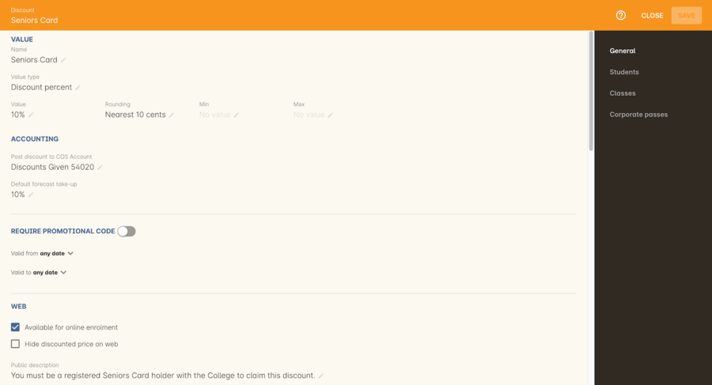

[[discounts-Student]]
==== Defining the eligible students

The second section on the discount edit window allows you to define who can access the discount.

Some types of discount may be available to anyone, meaning any person who enrols will automatically have the discount applied. They may also have to supply a promotional code, or enrol within a fixed period depending on what you set in the first section.

More often, discounts are restricted to people who meet certain criteria. A discount may require the student to meet multiple criteria. For example, in the Senior's Discount window below, the student needs to provide a Senior's Card, but you may also include one that proves they must be over a certain age as well. For this to work effectively, you would need to ensure that the date of birth field was set to mandatory for website enrolments, otherwise clients just providing the details of their seniors card would not be sufficient to access the discount.

You can limit the discount to students who have previously enrolled in the same course or students with a certain membership status.

To link concessions or memberships to the discount record, they need to already be set up in your onCourse records.
See <<concessions, the concessions and memberships chapter>> for more information about how to create a concession or membership.

[[discounts-Classes]]
==== Defining the eligible classes

The classes section of the discount window is where you define which classes can access this discount during enrolment.

To attach a discount to a class, click the + button next to the Classes heading.

You can search for class names, class codes, class tags by starting the search with a hashtag (#) or even use our advanced query language to add a particular selection of classes, or all classes (see the screen shot just below). You can read more about our <<search-advanced, advanced query language here>>.

For example, to add all your current classes you could use the following query, then click 'Add All':

[EXAMPLE]
====
isActive is true
====

Using the checkbox option '*Add this discount when creating or duplicating classes*' will automatically add this discount to every new class you create from now on. This can be useful to select for a global discount that applies to all your classes.

Once you have added classes, you can also use the garbage icon to delete classes from the list. The icon is hidden until you hover your mouse over a class in this section. The delete option works on one class at a time.

At the bottom of this window are some *additional enrolment requirements* which relate to the multiple purchase style discounts, e.g. purchase two enrolments from the list above to activate this discount, or spend at least $1,000 in one transaction to access this discount. If you add multi purchase discount options, the discount will apply to each of the eligible classes in the list. These can be left empty if you don't need them.

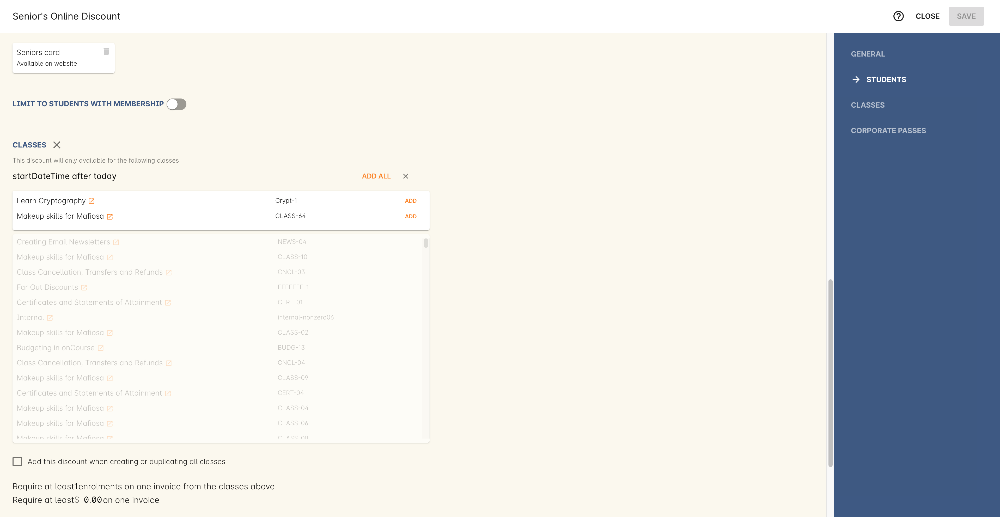

[[discounts-corporatePasses]]
==== Linking a Corporate Pass to a discount

To make a discount available to a certain Corporate Pass, switch on the *Limit with Corporate Pass* button, then type in the name of the Corporate Pass contact and click 'Add'.

A discount strategy may only apply when a Corporate Pass is used in the purchasing process. Corporate Pass can only be used during online transactions, so make sure this discount is available via online enrolment in the general section.

A Corporate Pass discount could be used to offer a special enrolment price to the employees of the companies you regularly work with.

Alternatively, a negative discount could be used for enrolments processed with some types of Corporate Passes to surcharge online enrolments processed via external agents or vendors.

During the online enrolment process, a surcharge style discount will always apply, even if there is a discount also available to the user. For example, if you surcharge Corporate Pass users 5%, but offer a 10% discount to people using the code TENFREE, the Corporate Pass holder surcharge will override the discount.

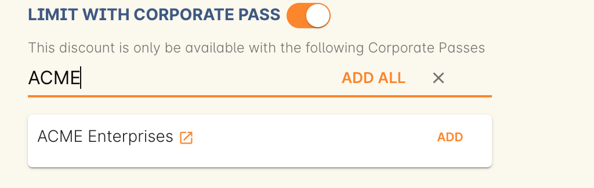

[[discounts-classlevel]]
=== Overriding a discount at the class level

A discount scheme may allow for a 15% discount across a range of classes. If, for one of these classes, you want the discount to be 20% instead, you can override the discount at the class level. Open a class that has the discount linked to it, go to the Budget section, go into Discounts then double-click on the discount line.

When you first view the override screen, you will see the discount scheme converted from a percentage (if it was one), to a dollar value.

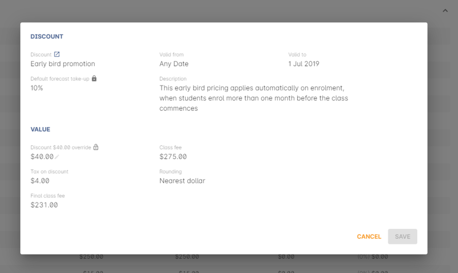

To override the discount, click on the unlock icon next to the dollar value and enter a new value. When a discount has the lock icon next to it, you can see it is locked to the discount scheme. When it has been manually overridden, this icon changes to be unlocked.

You will see in the examples that when the discount is manually overridden, the GST calculation also changes. This is because the GST value must be charged on the class fee, and as the discount changes, the class fee changes.

On occasion, to meet the rules of your discount scheme e.g. round to the nearest whole dollar, a rounding figure may also be calculated to bring your total to the value you desire.

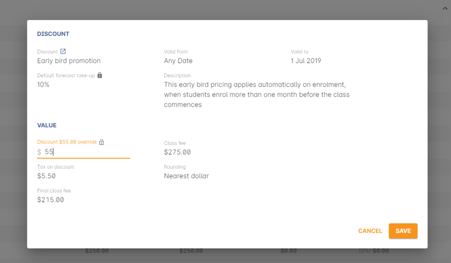

[[discounts-smartandskilled]]
==== Example of how to create custom discounts for Smart and Skilled fees

Under Smart and Skilled, you may have five or more price points available. The fee a student is charged depends on them meeting various eligibility criteria.

onCourse provides a range of tools for setting up the various fees using discount strategies, and then ensuring all students are automatically charged the right fee based on their eligibility.

In onCourse, we recommend you set the most common fee type as the class fee for all your Smart and Skilled classes.
You can then create various types of discounts that either increase or decrease this fee to reflect the other student fee rates that may apply.

In this example, we assume most students enrolling at the college are eligible for the 'First Qualification' pricing, so the college will set these fees as the standard class fee for each class in the budget section. This will be the fee that applies to students enrolling by default, unless another fee type is selected.

In this example, the college offers three Smart and Skilled courses with the following prices:

Certificate III in Early Childhood Education and Care::

* Full Fee: $6540
* First Qual: $1590
* Second Qual: $1910
* Traineeship: $1000
* Concession: $240

Certificate III in Community Services::

* Full Fee: $5340
* First Qual: $1440
* Second Qual: $1730
* Traineeship: $1000
* Concession: $240

Certificate III in Permaculture::

* Full Fee: $6080
* First Qual: $870
* Second Qual: $1040
* Concession: $160

===== Steps to creating the discounts

To begin, create a range of Concession types in your onCourse preferences for each of the other student fee types. Call them something like 'S&S full fee', 'S&S 1st qual', 'S&S 2nd qual', 'S&S trainee', 'S&S concession'. These concession types will be added to the student as their eligibility is assessed, and then used to determine their fee type.

Because these discounts are really an indication of a class fee pricing scheme, rather than a promotional style discount, it is advised from a financial perspective to create each of these discount types as NOT being posted to a discount COS, so the income value of the class will instead be reduced (or increased) as necessary.

Think of each fee that isn't the First Qual rate as an offset of that value. The Full Fee and Second Qual rates require negative discounts (or surcharges) while the Traineeship and Concession fees require discounts. Each type of price will require its own discount strategy. This will allow you to report, for each class, on how many students enrolled at each price point using the standard discount reports.

A discount type called S&S Full Fee could be created that applies to all smart and skilled classes with a discount dollar value of -$3900, and that applies to students with the concession type S&S full fee on their record. This amount will make the Full Fee price for Certificate III in Community Services correct, but the other two classes will need the fee further increased.

After saving the discount type, open the Certificate III in Early Childhood Education and Care class, double-click on the S&S Full fee discount in the budget section, and override the -$3900 fee to -$4950 to bring the total to $6540. Similarly, the S&S Full Fee for Certificate III in Permaculture discount would be overridden to -$5210.

Repeat these steps for each of the discount types for S&S Second Qual, S&S Traineeships and S&S Concession fees.

For the Full Fee to apply during the enrolment process, the student will need to have the concession type 'S&S full fee' attached to their contact record. This will then automatically select the right price for the class they are enrolling into.

=== Negative Discounts

Along with being able to create discounts that can help reduce the fee of an enrolment or product. You can also create negative discounts (i.e. a surcharge for companies booking now, paying later) in both discount schemes and manual discounts. This means the increased fee is part of the enrolment invoice line, so the full fee charged will be reversed should the enrolment be cancelled.

Creating a negative discount works just the same way as when you create positive discount with the only difference being is you would make the 'Discount value' a negative value.

Discounts with a negative value always supersede discounts of a positive value, so if a student is simultaneously eligible for a discount, and a surcharge on enrolment, only the surcharge will be applied.

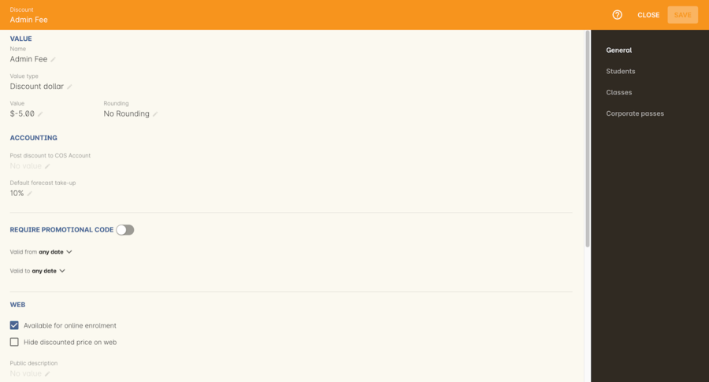

[[discounts-Accessing]]
=== Accessing discounts during enrolment

Depending on the discount settings, discounts can be made available to students enrolling through the web and office, or just for students enrolling through the office.

==== Accessing discounts through checkout

If the student and their chosen class meet the requirements of the discount, it will be applied by default on enrolment. If the student is eligible for multiple discount types, the discount that provides the lowest cost to the student will be applied.

The reverse is true for negative discounts - if a student is eligible for multiple surcharges, then the highest cost to the student will be applied.

During the enrolment process, discounts that require a promotional code can have the code entered on the Summary screen. Again, any eligible classes will have their fee reduced.

You can also manually adjust the class fee as necessary by unlocking the price and overriding it to a price of your choice. You must have a discount selected in order to do this.

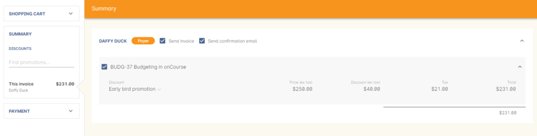

==== Accessing negative discounts through checkout

If you have attached a negative discount to a class then the total fee is increased by the amount of the surcharge.
In the example below enrolling Jenny Smith in the class Woodwork (WDWK-41) incurs a surcharge to pay an admin fee.
This fee could be charged because you are trying to encourage students to enrol online rather than taking up a staff member's time on the phone to manually enrol them through checkout.

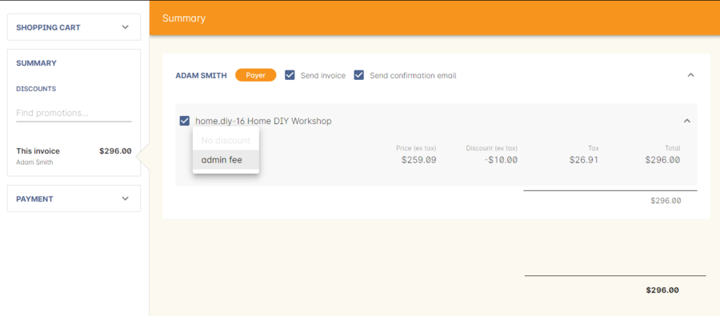

[NOTE]
====
If a class has two discounts, one negative and one positive, the negative discount always takes precedence over a positive one. This is the case for the class below which has a negative for -$5 and a positive discount for $6.82, and as you can see by default the negative discount gets applied.
====

==== Accessing promotional code discounts in onCourse through checkout

During the enrolment process, if a student supplies a promotional code this needs to be entered in the field 'Find promotions' in the Summary section of Checkout.

Any applicable classes and students in the enrolment process will have their enrolment fee's updated to meet the promotional code conditions.

==== Membership discounts during checkout

If a student holds a valid membership, is related to a contact with a membership where discounts apply, or purchases a membership during the enrolment process, the best applicable discount will automatically apply.

For example, if you have created a discount policy for members and friends to access two different class prices - members with a 30% discount and friends of members with a 10% discount, members who are friends with other members will always be given the higher of the two discounts.

Memberships can be purchased during the checkout process, with these memberships providing discount benefits immediately providing the class being enrolled in is taking place while the membership is valid.

To purchase a membership, click on the 'Find course or item...' field in the checkout shopping cart and either start typing the membership code or select the option 'MEMBERSHIPS' on the right side of the window. Look up the membership by name and make any changes as necessary to the membership start date, end date and cost.
Continue with the enrolment process as usual.

If a student already has a membership purchased, you can see the details of that membership in their contact record.

If your discount policy so allows, and a student is related to a contact who holds a membership, you will not see a membership recorded in the relation's record. You can see the details of their relationships, however.

For example, memberships are often sold to corporate partners. In onCourse, these contacts are 'companies', and companies cannot enrol in classes as they are not real people. Employees of companies can enrol, so you may like to set up the discount policy, so the discount applies to member and their employees.

If an employee of the membership enrols, and the relationship is noted in their contact record (you can add this during the enrolment process) the membership discount will automatically apply.

==== Accessing discounts on the web

If you wish, discount rates and fees can be displayed inline with the class fee on the website.

When users hover over the discounted fee, they can see who is eligible to apply for it. Discounts which calculate to the same fee will be displayed once, with a dual label on the website. E.g. if both seniors and students are eligible for a 10% discount, and have separate discount policies set up, the website will show one fee and the hover will show both discount names. This makes the class fee display neater, especially for colleges who have a large variety of discount policies.

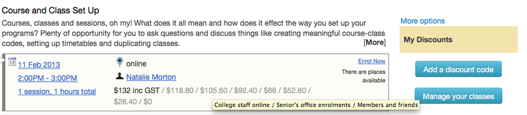

When a student is completing the enrolment process, by default they will be charged the full fee. If you allow the entry of the concession card details via the website, they can then select the option during enrolment to select a concession card type and enter the appropriate details you require.

While concession card numbers and validity can't be checked by the website enrolment process, all students must confirm that their claim to access the concession is valid and that their details may be checked. You should ensure your enrolment policy and procedures includes information about how additional charges will be levied if students can not produce their concession card on request.

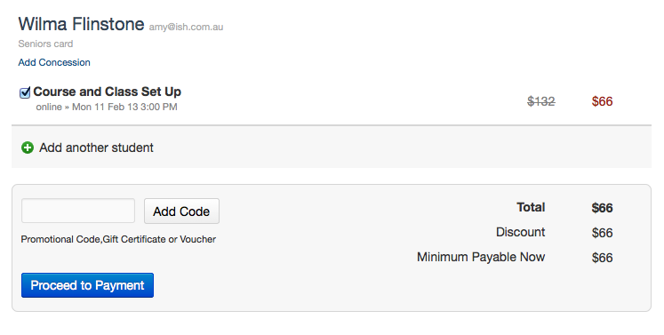

==== Promotional codes on the web

Promotional codes, gift certificates or voucher codes can also be added during the payment process.
Codes added at this time will also apply the discount to any applicable students and classes in the enrolment selection.

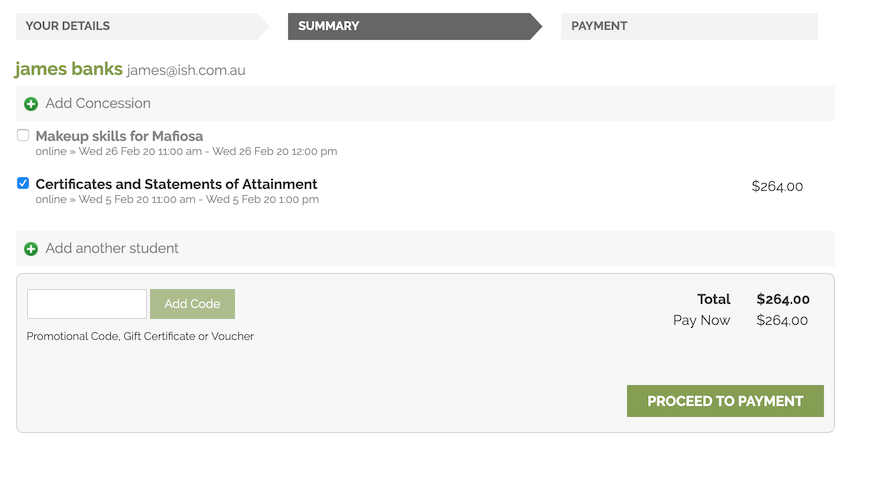

==== Membership discounts for online enrolments

If a student holds a membership which entitles them to a discount, or is related to a member which entitles them to a discount, this discount will be automatically applied during the online enrolment process.

Relationships cannot be added during the online enrolment process, so for the discount to apply, the relationship already needs to have been recorded in the student's onCourse record.

[[discounts-Strategies]]
=== Creating effective discount strategies

The first consideration in creating a discount is how will you use it to help you bring in additional enrolments that you would have otherwise not received.

Consider low income discounts. These are the discounts you think of when you imagine children, seniors, disability card holders or unemployed discounts - people who may have limited disposable income and for whom the cost of the full course is a deterrent for enrolling. These are discounts which can be given either as a percentage of the course fee, or as a fixed dollar figure. If you decide to give a percentage discount you can also set the minimum and maximum dollar discount which can be given. So you might to decide to give 10% off for seniors but cap it at $50 so that $800 course doesn't start to be discounted too heavily for you. Or a 2% discount which gives at least $5 off that $100 course, so it doesn't appear too stingy.

Another option is to offer early enrolment discounts, as by encouraging people to enrol and pay well before class start dates makes resource management easier on the college. You could also provide last minute style discounts, to encourage the spare seats to be filled or to get a not quite viable class over the line. These discounts could be automatically given to all enrolling students, or be restricted to students who can provide the matching promotional code.

For these type of discounts you would set a start and end date, where other types of discounts continue indefinitely. onCourse gives you the choice.

Other types of discounts may be a 'buy one get one free' style of discounts. These types of discount apply when the invoice being created during the enrolment process meets certain criteria, such as containing 3 enrolments from the list of specified class.

When considering who can access the discount, you might want to restrict it to all students who have enrolled in the past, are over a certain age, live in a particular suburb or who have certain type of concession card or membership. You aren't locking it to the students who currently fit the requirement: any student who later is entered into the system with the right age, suburb, concession or membership type will be able to obtain that discount.

Finally, you are able to set the list of classes which may receive the discount. This might be every class you run, just your computer courses, or just one course you choose. This gives you flexibility to offer discounts where you think they will be appropriate, useful and affordable. You may be able to offer lower discounts to outsourced courses given your margins, or it may not be helpful to offer seniors discounts to pre-natal sessions.

With all this flexibility, you can offer discounts to your students in exactly the way you choose.
For instance:

* all students under 25 receive 10% off all courses - these are often people with lower disposable income and discounts are a useful way to attract them
* all students who attended a course last term automatically get 20% off selected courses this term
* all students with a senior's card receive a $20 discount off any of the daytime arts and craft classes
* all students purchasing more than $500 worth of enrolments in a single transaction automatically receive a 5% discount

Generally, concessions apply on a long term basis and are based on your college's fees and charges policy. Concessions are automatically applied to fees on enrolment if a student meets the conditions you have set. If you wish to give a special deal to a certain group of people for a limited time only, it is more suitable to create a promotion.

Promotions (Promotional Codes) are another type of discount with a string attached. The student must know a particular word or code in order to obtain the discount. You might decide to perform a letterbox drop in a particular area with postcard sized teasers for your new dance classes. They explain that the recipient can get a 15% discount by going to the website and typing in 'WALTZ'. When they do this, the website alters and shows the courses with fees crossed out and the discounted price alongside in red. The idea is to:

* create the feeling of an offer targeted to a particular group of people, so the recipient feels special.
* track the effectiveness of your letterbox drop
* use an expiry date to create urgency
* micro-market: use different strategies for different demographics

You might distribute your promotional codes by using:

* targeted printed material
* an email mail out to existing or potential students
* SMS
* an alliance with a club or user group - such as a deal with a local RSL that gives their members a discount through a code in their newsletter

Remember, the point of promotional codes is not to keep the code secret and prevent recipients telling their friends about it. The effectiveness of your marketing is greatly enhanced by potential students telling as many people as possible about this great deal they can get by typing in a 'secret code'.

Long term, analysing the percentage take up estimations vs the actual use of the discount on a per class, or per enrolment period will assist you in determining if the strategies you are employing are effective at encouraging new or repeat enrolments.

[[discounts-Financial]]
=== Financial aspects of discounts

Discounts play a part in the budget of onCourse, and the process of determining if a class will be financially viable based on the student fee's collected. As a business, you may also like to include predictive information about the expected take up of a discount. Discounts in onCourse are charged to a cost of sale account, rather than considered a straight reduction to income collected, as a discount is considered as a cost of doing business.

==== Discounts in the class budget

You can see a summary of all the discounts attached to a class within the Budget section of the class, by expanding the Discounts line.

In each discount you create, you can define a 'Default forecast take-up'. What this means is that across all the classes this discount applies to, you expect, say, 5% of all students to use this discount on enrolment.

You can further refine this forecast on a class by class basis in the class budget. Double-click on the discount line in the budget, unlock the default forecast and set a new forecast of your choice.

Based on your enrolment maximum, projected and actual, all three columns will update, with the actual column showing you also the percentage of students enrolled using the discount.

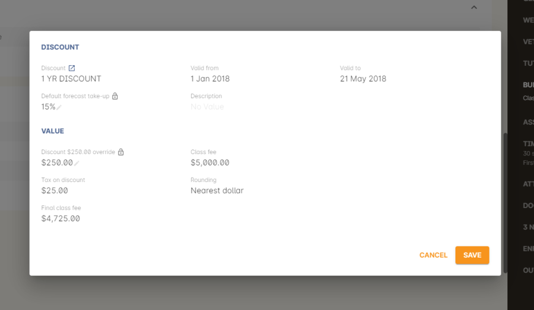

Using the garbage icon, you can delete discounts from classes in the budget. This will prevent future students from enrolling and accessing this discount. It will not remove the discount given to existing students.

When the discount line has been deleted from the budget you will not see the total value of the discounts given itemised. Any budget printed report will still contain the detail of how many of these discounts you have given, and the class total incomes will still be correct. If you add the discount back via the classes section in the discount, the discount and value of any discounts applied will be visible again.

==== Accounts and discounts

There are two ways discounts can be set up to behave in your chart of accounts.

. The discount can post an expense to your chosen COS (Cost of Sale) expense account. This makes it easy to track how much discount has been offered, showing income and expenses separately on your profit and loss statement. If you choose this option, the amount of the discount will be posted to your COS account and as a negative income at the time the invoice is created.
. Alternatively the discount can simply reduce the income value. This means that your income shows only the net amout charged.

In the onCourse chart of accounts, a default account called 'Discounts Given' is used to record all the COS discounts. You can add additional COS accounts as needed.

==== Understanding GST and rounding in discounts

GST is an Australian Goods and Services Tax, currently set to a flat rate of 10% for all applications of the tax. GST often doesn't apply to enrolments in vocational classes, but does apply for enrolments in leisure classes.
When GST applies to a class, it is important to understand that any discount applied to the class fee will cause the GST to be recalculated.

The reason behind this is that GST must be 10% of the product cost you charge to the customer. If the ex GST cost of the product sold drops from $300 to $200 due to a discount, then the GST charged must also drop from $30 to $20.

If you have discount policies that apply to groups of classes, including both GST inc and GST ex fees, you will notice that the resulting fee payable by the student is different, even if a fixed discount amount is given.

To put it another way, if you have a GST free class costing $300 which has a $100 discount, the student will be charged a straight $200. A $100 reduction in the fees payable by the student has been applied.

However, if you have a GST inclusive class costing $300 which has a $100 discount, the student will end up paying a GST inclusive fee of $190. The student has been given an effective discount of $110, instead of $100. Why do students paying GST now get a 'better' discount? Because they are now liable to pay less GST.

In a class fee of $300 incl GST, $272.73 is the fee income. The remaining $27.27 is not your income - it is GST you are collecting on behalf of the government and holding only until the time you reimburse it to them. In onCourse, GST is always posted to a liability account, never to your income account. onCourse budgets always exclude GST from any profitability calculations.

As the $100 discount is actually being given on a $272.73 class fee, reducing it to $172.73, the GST now must be recalculated on the new fee. The GST of $17.27 (instead of the previous GST of $27.27 on the standard fee) now brings the total fee payable back to $190.

Obviously, the different end values of the discounts are most obvious when comparing the same GST exclusive and GST inclusive total fees side by side. If, instead like in the first example, your GST inclusive class of $300 was a total cost of $330, while your GST free class was just $300, the $100 discount would result in total fees of $220 and $200 respectively. The GST paying student still pays 10% more for their class than the GST free student does, instead of the unexpected 5% less when the discounted GST inc/GST free classes have the same starting fee.

Rounding is apply to the final price after GST is added on. For example if you have a class that costs $115 and there is a15% discount being applied along with being rounded to the nearest $1, then $115 will be divided by 1.1 to take away GST which equals $104.54. Then you would apply the 15% on to that which will be $104.54 x 0.85 = $88.86. Then you have to add the GST back on, so $88.86 x 1.1 = $97.75. Finally you would round this amount to the nearest dollar, so the final cost would be $98.

===== Discount offset from class start date

When you are creating discount schemes, the flexibility of start date offsets can allow you create a range of standard price options.

====== Early Bird Pricing

Creating this price scheme requires three discounts to be created for the same group of classes, each with their own price restriction settings. As one price scheme cuts out, the new price scheme automatically cuts in.

* Enrol 30 days or greater prior to the start date and receive 10% off
* Enrol between 29 days and 14 days prior to the start date and receive 5% off
* Enrol 13 day prior to the start date, or after the start date and pay the full fee

====== Variable pricing depending on when student join an 10 week class

For example a children's tutoring program that allows continuous intake.

* Enrol any time prior to the start date and pay 100% of the class fee
* Enrol 7 days after the start date and receive a 10% discount
* Enrol 14 days after the start date and receive a 20% discount
* Enrol 21 days after the start date and receive a 30% discount etc

[[discounts-exampleCampaigns]]
=== Example discount campaigns

Some examples of possible campaigns are outlined below:

. Select Discounts from the dashboard by searching or using your favourites
. Select + button from the bottom right of the window
. In the new window, enter a name for this concession e.g. Seniors Card Discount
. To set a 10% discount, select the Discount Percent under Value Type and type 10 into the discount value field.
. You can also set a minimum and maximum amount for the concession e.g. min $1 and max $10 and set the discount to round to the whole dollar, nearest 10c or nearest 50c.
. Ensure the option 'available for online enrolment' is ticked, if you want this discount to be available to Seniors enrolling online. If it is unticked, the discount will only be available to Seniors enrolling via the office.
. Setting a valid from and valid to date is optional. If you want to make the discount apply at all times, leave these fields blank.
. Move to the 'students' section. In this example, you might select 'with the following concession type(s) and add concession types you have previously defined asAged Pensioner concession or Seniors card concession. You may also choose to add, or use instead the parameter Age over 60. This will require the student to supply a valid date of birth as well / instead of a concession card to access the discount.
. If you would like students to see the discounted fee that may be eligible for when browsing the web, ensure you have not ticked 'Hide discounted price on web'. This will suppress the display of the price on your onCourse website.
. The last section allows you to assign this discount to certain available classes. You can add or remove classes by searching for the by name, courseClass code, or using a search query. Try 'isActive is true' to add all your currently active classes.

In this example we will create a last minute discount for our previously enrolled students.

. Create a code for your promotion. This will be what students enter on your website to access the promotional discount (or can be entered by your enrolment staff with phone, mail or in person enrolments). An example code might be VIPSTUDENT.
. Name and describe your promotion and decide if it is to be available to students enrolling online and through the office, or only to students enrolling through the office.
. Set the amount and valid to and from dates. In this example we have limited the date to a one week range. It is usual for a promotion to run for a set period of time, but you could leave these fields blank to always allow this discount to apply.
. This promotion is for re-enrolling students, so we can set it to students who have enrolled within 60 days.
. Select your eligible classes. Generally promotions are limited to a few select programs, such as those which already are over the minimum required, or dance classes or those which are starting in the next two weeks. So lets try using 'startDatetime < [date]', where [date] is the date two weeks from today. Use the date picker.
+
Don't forget, promotional codes only work if you market them. You can always email or SMS special promotions to your students to get them out there quickly. With most promotions you would not want to set a qualifier, like enrolled within x days, as you want as many people as possible to 'use' the special code to enrol in your classes, and hope the students you market the promotion to assist you in your marketing efforts by passing the deal on to their friends.

In this example we will create a membership students can buy to entitle them to a 100% discount for any of our computer classes for the next six months.

. Open the membership window and create the membership for purchase. Set a cost for purchase and the duration of the membership in days.
. Open the discount window and create the discount policy for computer club members. The discount is for 100%. Decide if you want this discount available to students who hold this membership and enrol online, or only via the office.
. Leaving the option 'Hide discounted price on web' unticked is a good choice for this discount, as seeing the $0 enrolment fee online available will also encourage other students to purchase this membership for the benefits it provides.
. Go to the students section of the discount window and select the option 'Limit to students with Membership' and add the new membership you just set up be searching for its name.  In this instance we will choose to apply this discount only to the student who purchased it.
. Go to the classes section on the discount window and add all your currently active classes.
. Save and close the record. The membership is now ready for purchase, and the discount policy as defined will be applied.

In this example we will create a concession based discount for college staff, entitling them to 50% off all classes. The concession type 'staff' cannot be self selected on the website.

. Create a new concession type in Preferences > Concession Types called 'Staff' and de-select the option 'Allow students to self-select on the website'. This is because we only want college staff to determine who is a staff member (and entitled to the discount). This concession will not require a concession card number or expiry date either.
. Ensure all college staff whom you want to access this discount have student/tutor records in onCourse, and have the concession type 'staff' added to their record.
. Create a new discount called 'College staff' and leave the option 'Available via online enrolment' selected. This will let staff self enrol and access the discount online. Set the value to 50%, and a maximum value if desired.
. Tick the 'Limit to students with Concessions' switch, then apply the discount to students with the following concession types - Staff. Ensure the option is ticked 'Hide discounted price on web'. This way the general public visiting the website will not be privy to the discount available to staff members.
. On the classes section, add all the applicable classes for this discount.
. When college staff enrol online, the discount will be applied automatically during the checkout process. They will not see the details of this 'hidden' discount until they have been matched as a staff member using their first name, last name and email address on record.

In this example, we will offer a $10 discount to students who enrol in two or more classes for themselves, or with a friend from the list of available classes.

. Open the discount window and create a new discount called 'Buy two and save $10'. In the discount value, set the discount dollar to $5 (if your classes have GST included in their fee, to achieve a $10 discount over two enrolments, you can set the discount value as $5.45, and set the rounding to nearest dollar)
. In the students section, make sure 'restrict this discount to certain students' is unchecked.
. In the classes section, add your classes to which the discount applies. Lets try a tag this time, so type # and then select a tag from the list.
. In the bottom of the panel, enter the option 'Require at least [2] enrolments on one invoice from the classes above.Save and close the record.
+
Setting this discount at 2 requires at least two enrolments to trigger the discount. If there are three enrolments eligible in one enrolment process, then the discount applied will be $15.
. When a checkout process is created that includes at least two enrolments from this list, each eligible enrolment added will have the $5 discount applied. If you remove enrolments from the window, and the set of enrolments are no longer eligible, the discount will be automatically removed from all enrolments.

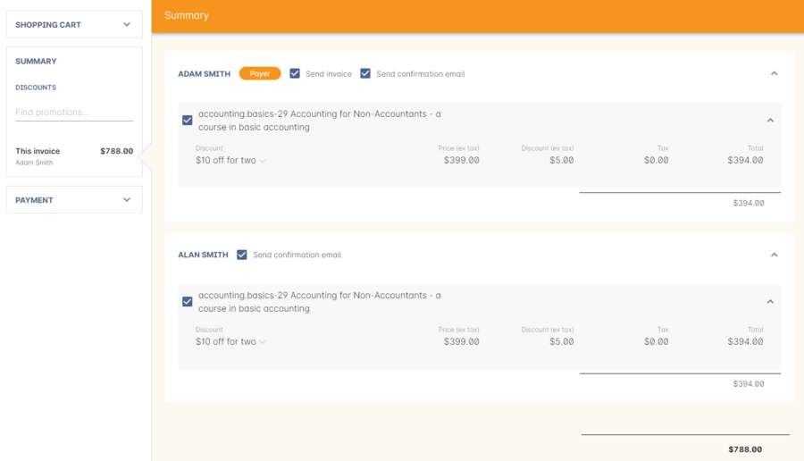

[[discounts-Reporting]]
=== Reporting on discount use

The Discounts by Class pdf report is available from the Classes list view by clicking the Share icon > PDF. This report shows you for each class selected, how many enrolments you have processed at full fee and any applicable discount, and the total value of any discounts applied.

As discounts are all posted to the Cost of Sale account, Discounts Given. Transaction reports for this account can also be printed for the date range of your choice.

Transaction reports can be printed either from the Transaction window, or the Account window. If you choose the account window, you can choose to print all the transactions for just one, a group of, or all accounts.

In the example below, a date range query has been run and a Transaction Detail report printed for just the Discounts Given account. This report shows the movements both in and out of the account in the time frame.

In this account, the debits are the discounts given and the credits occur when an enrolment is cancelled and refunded which had a discount. The balance of this account sits on the debit side of the ledger. Each detail line is linked to the invoice number and invoice payer which can be followed up in onCourse as needed.

There is a report that can be print from the discount window called ‘Discount take up summary'. This report shows during the date range specified, and for each discount chosen, how many enrolments for each class have used that particular discount. This report is for marketing purposes, so show you the take-up success of a particular discount during a campaign date range.

