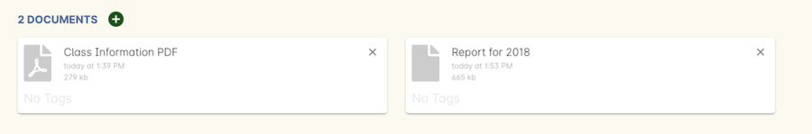
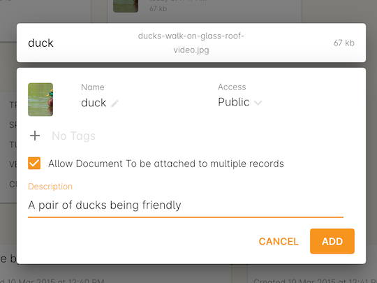
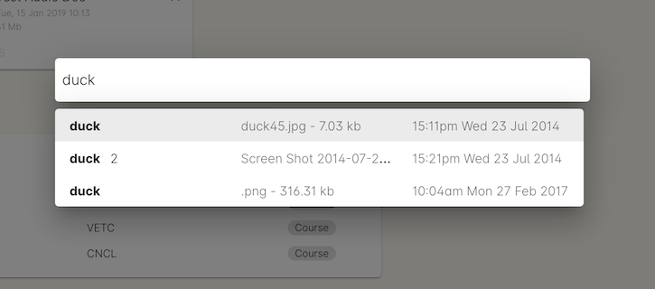
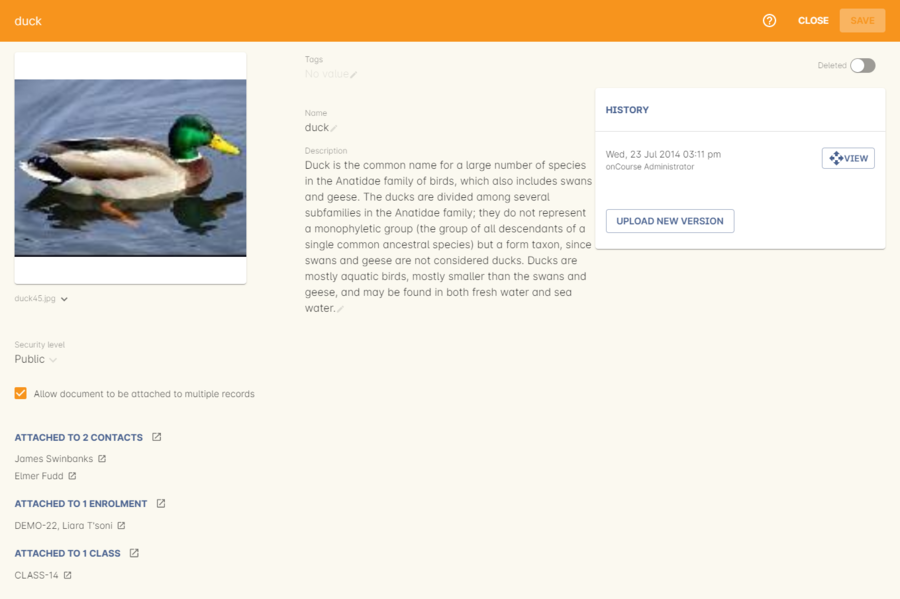

[[documentManagement]]
== Document Management

onCourse provides an effortless way to manage your documents. Documents can be uploaded to onCourse and linked to Courses, Classes, Enrolments, Contacts, Tutors, Students, Sites and Rooms. Because all documents are version controlled you will never lose any historic information, making RTO compliance easy.

Document management in onCourse can be used for lots of purposes:

* Displaying images and other content on your website
* Storing compliance documentation such as tutor resumes and qualifications
* Maintaining a history of assessment and other enrolment related compliance
* Distributing information to tutors through the skillOnCourse portal
* Distributing assessments and course material to students

[[documentManagement-Adding]]
=== Adding new documents

You can add new documents directly in the edit view from many places in onCourse. For example below you can see a Course "Accounting" to which we want to add a picture of a duck.

We can do this in two different ways:

* Drag-and-drop the file from your desktop into the window
* Browse your system by clicking the plus symbol next to the Documents header

==== Drag and Drop

If the document is one you haven't yet uploaded to your onCourse system, you can add it and attach it to the current record by simply dragging and dropping the file from anywhere on your computer on to the browser tab. The file will be uploaded and associated with the currently viewed record, you can name it and select a privacy setting, and then save it.

==== Browsing the system

While viewing the record you wish to attach the document to, click the + button next to Documents. You will now be given a choice to find an existing document or upload a new file.  Let's say we want to upload that duck picture from your computer. Click on the 'Browse' button to find the file on your machine or, if you've already uploaded the file, type the name you gave it when yous saved it.

image::images/documentManagement/attach_document.png[title='Attaching a new file']

Once a file has been added or selected it will take you to another window. If the file is new you can start entering additional information. If the file was already uploaded, then you can only view this information. You have to go to the document record in the Documents window to edit these details.

There are a number of fields when adding a new document, they are:

* Name - Allows you to change the name of the document.
* Access - This drop down box allows you to choose what access rights you want to give to the document.
For more information please refer to the Access rights section of this chapter.
* Description - You have the ability to write a short description about this document.

Adding a tag to this document can be done by clicking where it says 'No Tags' underneath the main file image.

You can also choose whether duck is allowed to be attached to other records. If you select this option it will appear in the clairvoyance name lookup when you are trying to attach an existing document to another record.

For attachments like contact profile pictures, you may choose not to allow them to be attached to other records.

[[documentManagement-Attaching]]
=== Attaching existing documents

If you wish to attach an existing document (one which has previously been uploaded in onCourse) to a record, you will click + in the attachment list and the sheet below will open. To find an existing document, named duck, to course ABC you would start typing the name duck in the clairvoyance field on the left side of the sheet. A list will then appear with all existing documents in onCourse that contain the word duck in them. If there aren't any documents that are already stored in onCourse with the name duck, then no results will be returned.

Once you have found and selected the correct document a new window will appear that allows you to define the relationship between the course Accounting and the document 'duck'. You'll see the following information:

* The name of the document, duck, will appear at the top of the window.
To open the document, click the icon or image to the left of the name.
* Below this there will be a short description about the document (if added).
* You will see any tags attached to this document.
* The access rights of the document will also be displayed on the right sided of the page, in this case the document has been give public access, for more information on this please refer to the Access rights section of this chapter.

[[documentManagement-Editing]]
=== Editing an existing document

Once documents have been stored in onCourse you can edit their properties in the Document list view. To access the list view, search for 'Documents' in the search on the dashboard. The list view shows you a summary of the document, including the information icon (black speech bubble with a white i), the document type icon, the document name, the Web viability (i.e. Access) and the document size.

image::images/documentManagement/document_list_view.png[title='Document list view in 3 column mode']

To view the document by double clicking on the row. You can view or edit a document's settings by double clicking on information icon.

There are a number of fields in the general tab, they are:

* Name - Allows you to change the name of the document.
* Access - This drop down box allows you to choose what access rights you want to give to the document. For more information please refer to the Access rights section of this chapter.
* Description - You have the ability to write a short description about this document.

You also have the ability to add tags and view the 1 record that is linked to duck by clicking on the open related record icon next to the text 'Currently attached to 12 records'. The check box below lets you know whether this document has been allowed to be able to be attached to multiple records. This option can't be changed when editing an existing document if it is already attached to more than one record.

By clicking on the 'History' tab you have the ability to view previous versions of the document 'duck' and view either the records linked to them or open a previous version of duck. You also have the ability to upload a new version of duck by clicking on the 'Upload new version' button at the bottom left side of the sheet. More information on this can be found on this in the next section, Version Control.

You can also 'undelete' the image by making sure the 'is Deleted' switch is disabled.

image::images/documentManagement/edit_attachment_history.png[title='Version history of the document']

[[documentManagement-Versioning]]
=== Version Control

onCourse keeps a history of all files you upload, allowing you to link records to specific older versions and review the history of your documents at any time. This makes it easy for you to comply with ASQA auditing requirements as well as ensuring you never lose an important document again.

Upload a new version of the document from the edit view shown in the previous section. You will be given the opportunity to find the file you wish to upload and replace the existing document. In this scenario you are trying to upload a new version of the document duck, you are then shown the following options:

* Below this will be the total number of classes and enrolments that will be attached to the new version of duck.
* Description of this change - you can write a short description explaining the reason or differences of this change.
* You can also use the open related record icons to find out more information about the records linked to the versions of this document
* When uploading a new version of a document it is good practice to make a short note describing the change between the previous version and this version. This 'description of change' is available in the document history version list.

Once you have finished with the above information you can save the changes made by clicking the 'Ok' button at the bottom right hand side of the page.

[[documentManagement-specialDocuments]]
=== Special documents

Some parts of onCourse have special handling of documents. At the moment the only publicly visible example of this is the contact picture. If you open a contact record (company, tutor, student) in edit view double-click on the image at the top left, you can add your own photo of that person. A file dialog will appear and you will be able to choose a photo to add. It will be automatically resized to a thumbnail size before being stored.

[[documentManagement-accessRights]]
=== Access rights

Each document can have one of several levels of access:

* Public - This gives everyone access to the document and will appear on your onCourse public website, as part of the sales and marketing material. When you open this document from inside onCourse, you can send the URL link for these documents to other users and they will open the attachment in a browser.
* Private - This means this document will not replicate to the website or the skillsOnCourse portal. It will only be available to administrative users of the onCourse software. While a private document will open in a browser should you click on the link inside onCourse, this URL contains an access key ID and an expiry period. Should you send this URL to another person, they will receive an 'access denied' message if they try to open it. A private document can only be viewed via the link to it inside the onCourse application.
* Tutors and enrolled students - Both Tutors and enrolled students of the related course or class can view this document in their skillsOnCourse portals.
* Tutors only - This means only the tutors of the related course or class can view this document in their skillsOnCourse portal.
+
Both 'tutor only' and 'tutor and enrolled student' documents opened from inside the onCourse application will load into a browser with URL containing an access key ID and an expiry period. Should you send this URL to another person, they will receive an 'access denied' message if they try to open it.
+
You can send the class tutor or an enrolled student a link to the document inside the portal to allow them to access it e.g. https://www.skillsoncourse.com.au/portal/resources to access all their resources, or https://www.skillsoncourse.com.au/portal/class/5040367 to access the resources attached to a specific class, where 5040367 is the class id in the onCourse web database.

[[documentManagement-deleted]]
=== Handling deleted documents

To delete a document, highlight the record in the Documents list view, click the cogwheel and select 'delete record'

However, for auditing purposes, documents uploaded to onCourse are never deleted, rather they are disabled and locked from use.

If you ever need to recover a deleted document for whatever reason, simply go to the documents list in onCourse and click the 'Deleted' filter to see deleted documents. Find the document record, click to open it and then make sure the 'Deleted' switch is off, then click save.

image::images/documentManagement/deleted_document.png[title='The 'Deleted' switch for this document is on. Turn it off and save to recover the document.']
