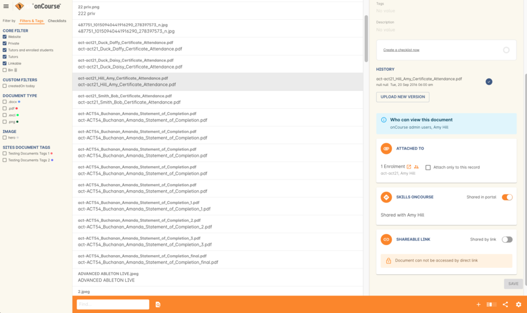
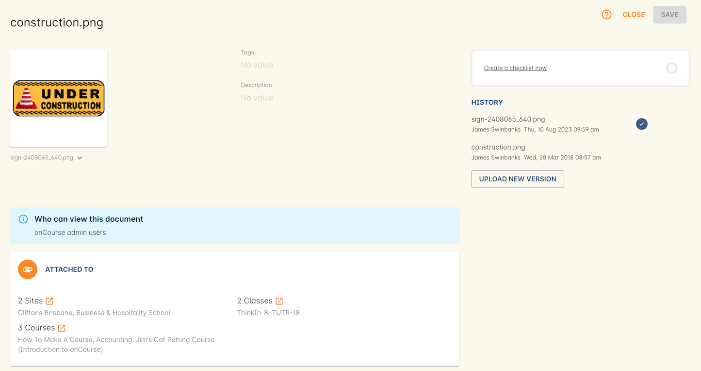

[[documentManagement]]
== Document Management

onCourse provides an effortless way to manage your documents. Documents can be uploaded to onCourse and linked to Courses, Classes, Enrolments, Contacts, Tutors, Students, Sites and Rooms. Because all documents are version controlled you will never lose any historic information, making RTO compliance easy.

Document management in onCourse can be used for lots of purposes:

* Displaying images and other content on your website
* Storing compliance documentation such as tutor resumes and qualifications
* Maintaining a history of assessment and other enrolment related compliance
* Distributing information to tutors through the skillOnCourse portal
* Distributing assessments and course material to students

[[documentManagement-Adding]]
=== Adding new documents

You can add new documents directly in the edit view from many places in onCourse, in two different ways:

* Drag-and-drop the file from your desktop into the window
* Browse your system by clicking the plus symbol next to the Documents header

image::images/documentManagement/adding_attachments.png[title='Adding an document in the edit view of a class']

==== Drag and drop

If the document is one you haven't yet uploaded to your onCourse system, you can add it and attach it to the current record simultaneously by simply dragging and dropping the file from anywhere on your computer on to the browser tab. The file will be uploaded and associated with the currently viewed record, you can name it and select a privacy setting, and then save it.

==== Browse

While viewing the record you wish to attach the document to, click the + button next to Documents. You will now be given a choice to find an existing document or upload a new file.  Click on the 'Browse' button to find the file on your machine or, if you've already uploaded the file, type the name you gave it when yous saved it.

Once a file has been added or selected it will take you to another window. If the file is new you can start entering additional information like a name, description, tags and setting <<documentManagement-accessRights, permissions>>. If the file was already uploaded, then you can only view this information. You have to go to the document record in the Documents window to edit these details.

[[documentManagement-Attaching]]
=== Attaching existing documents

If you wish to attach an existing document (one which has previously been uploaded in onCourse) to a record, simply go to that record and click the + button next to the Documents heading, then search for the name given to the document when it was uploaded, and select it from the list of results.

When attaching a document to a record you'll be able to set its permissions, as well as any tags and give it a description. For a closer look at how permissions work, <<documentManagement-accessRights, click here>>.

[[documentManagement-Editing]]
=== Editing an existing document

Once documents have been stored in onCourse you can edit their properties in the Document list view. The list view shows you a summary of the document, including a preview, tags, the name, document permissions and document history.

View the document by double clicking on the record.

[[documentManagement-EditingView]]
==== Document record view

There are a number of fields and settings in the document record. You need to give the document a name in onCourse (this is not the filename), a description, set who can view it and where they can view it. You can also see the document's history.

You can also delete or undelete a document by using the 'Deleted' switch.

image::images/documentManagement/edit_attachment_history.png[title='Version history of the document']

[[documentManagement-Versioning]]
=== History

onCourse keeps a history of all files you upload, letting you view older versions of files as well as seeing who uploaded them and when. You can upload a new version of a file by clicking the `upload new version` button.

[[documentManagement-specialDocuments]]
=== Contact pictures

Some parts of onCourse have special handling of documents. At the moment the only publicly visible example of this is the contact picture. If you open a contact record (company, tutor, student) in edit view double-click on the image at the top left, you can add your own photo of that person. A file dialog will appear and you will be able to choose a photo to add. It will be automatically resized to a thumbnail size before being stored.

[[documentManagement-accessRights]]
=== Access rights

Each document has multiple settings that wil tell the system who can view it and where they can view it. You can see more information at a glance about who can see a document, and where, by looking in the blue 'Who can view this document?' box. This will change dynamically based on your selections in the boxes below.

Attached To::
Here you'll see a list of the records that this document is attached to, which will also affect where the document displays both in onCourse and elsewhere, depending on permissions e.g. if a document is attached to a Course but both the Shared in portal and Shared by link switches are off, then the document will only appear in the course record of onCourse. If the Shared by link switch is on, then the file is considered public and will also display on the relevant Course page on your website.

Skills onCourse::
This box has a switch called 'Shared in portal' which, when active, allows the document to be viewed within the portal. There are also two checkboxes, 'Show to tutors' and 'Show to students'. Show to tutors is always on when 'Shared in portal' is selected and can only be deactivated if the 'Show to Students' checkbox is ticked. If a document is attached to a class, contact, on enrolment and this is switched on, then the document will be visible in the portal to all tutors and students associated with the class, contact or enrolment the document is attached to.

You can send the class tutor or an enrolled student a link to the document inside the portal to allow them to access it e.g. https://www.skillsoncourse.com.au/portal/resources to access all their resources, or https://www.skillsoncourse.com.au/portal/class/5040367 to access the resources attached to a specific class, where 5040367 is the class id in the onCourse web database.

Shareable Link::
This is the most 'public' permission, allowing anyone with the link to see this file when it's active, as well as anyone associated with the records it's attached to. If the document isn't attached to any records, then only users with the link will be able to see it. Click 'Copy Link' to copy it to the clipboard for linking in a message or email.

All documents, when opened in onCourse, will open with a link, however only documents that have 'Shareable Link' permissions activated can be shared in this manner. If you share a link to a document without this permission the user will get an 'access denied' error.

The below example shows that this record is attached to 7 sites records, 1 asessment record, 3 contact records and 1 course. The shared in portal switch is on with both tutors and students checkboxes checked, but the shareable link is not active. As shown in the 'Who can view this document' box, you can see that this means only onCourse admin users and some students and tutors, specifically those contacts the document is attached to and in the portal for any tutor or student associated with the course '20 Great Ways to Promote Your Businesss Online'. The document will not appear on the Course's website page unless the shareable link is active.

[[documentManagement-deleted]]
=== Handling deleted documents

To delete a document, highlight the record in the Documents list view, click the cogwheel and select 'delete record'

However, for auditing purposes, documents uploaded to onCourse are never deleted, rather they are disabled and locked from use.

If you ever need to recover a deleted document for whatever reason, simply go to the documents list in onCourse and click the 'Deleted' filter to see deleted documents. Find the document record, click to open it and then make sure the 'Deleted' switch is off, then click save.

