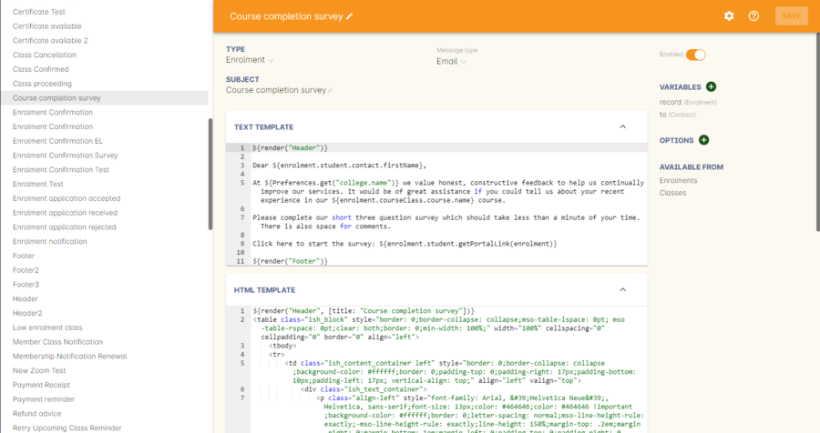
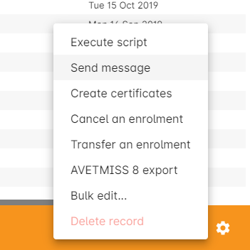

[[emailTemplates]]
== Message Templates

[[emailTemplates-emailTemplates]]
=== Message Templates

The best way to define a message template is that it is a predefined and pre-constructed message that are sent out manually or automatically when on an event has occurred. An event that sends a message is defined by <<scripts, scripts>>. An example would be that a student has just enrolled into a class via the website or through the office, so the 'send enrolment script' will email the 'Enrolment Confirmation' template to the enrolling student.

Inside the message template, fields like $\{enrolment.student.contact.firstName} in the template will insert the relevant data from onCourse into the message.

onCourse makes it easy to access and update your templated messages by keeping them in the one place, in the Automation window under Message Templates. You can use the templates as they are or you can personalise them to your specific needs and requirements. You can also create additional templates, and where necessary, accompanying scripts, specific to your business requirements.

onCourse default templates include both a plain text and HTML version of the template. If make changes to the template wording you should change both versions of the template for consistency. The receiver's mail client preferences will determine if they receive the plain or HTML version of the message.

The content of the plain text and HTML templates should be the same, the HTML template just includes additional information for the styling of the message so it renders inside email clients.

Be careful when changing the names of the message templates. If the template is used by a script, you will need to change the reference to the template name in the script also.

The default templates included in onCourse are listed in the sections below.

==== Editing an existing message template

. Go to the Automation window and click the Message Templates heading to expand the section.
. Double click on a message from list to open it in edit view. The top half of the window is the plain text version of the message, the lower half the HTML version.
. You can add and remove text from this message. Any text that appears inside a field reference $\{like.this} is drawing data from the onCourse database. Modify these fields with care.
. Make your change to both the plain text and HTML version of the message then save and close.

==== Message headers and footers

The default message template list includes a header and footer template, which contains both a plain text and HTML layout.

These templates are used inside every other default message template.

If you look at the template text you'll see that most of the data used to create these templates is drawn from the AVETMISS preferences tab settings. Even if you don't report AVETMISS you should complete these fields so the data used in your templates is correct.

The HTML version of the header and footer can insert your businesses logo and use your style guide colour scheme with some minor adjustments. If you do not have a web designer available you can contact ish to request custom changes to these, and other templates.

[[emailTemplates-newtemplates]]
==== Creating new templates

New templates can be created at your convenience. Click on the + next to the Message Template heading in the left-hand column to create a new template.

If your organisation has the appropriate IT skills in house, you can create your own custom templates or you can request an ish developer create them for you. The development of custom templates is quoted on request.

==== Writing Groovy in message templates

The templates are written in a programming language called Groovy which is a Java based language that can run inside the onCourse application. An overview of the language can be found at http://groovy.codehaus.org.

The onCourse API documentation, explaining the database structure is available http://www.ish.com.au/s/onCourse/doc/latest/api/[on the onCourse support page]

===== Examples of Groovy in the templates

Both onCourse message templates and scripts are written in Groovy. onCourse templates are created using the
http://groovy.codehaus.org/Groovy+Templates[GStringTemplateEngine], storing the template files within the onCourse database.

The key to creating a successful template is to ensure you begin with the most appropriate onCourse entity for the task. This will make the process of locating and joining other data from the database straightforward.

If your template is to send information to a student in relation to a particular enrolment, then the enrolment entity would be the correct starting point, rather than the student or the contact.

The entity name you select as the starting point of the template determines the path you use to join to attributes of other onCourse entities. For example if you were starting with the entity enrolment and wanted to insert the student's first name, you would join the enrolment to the student, then the contact as below:

[source,groovy-template]
----
${enrolment.student.contact.firstName}
----

However if you wanted to show the same information from a template linked to the invoice entity you would join via the enrolment, as the invoice is linked directly to the payer contact, who might be a different person to the student. This example would give me the first name of the student enrolled in the class linked to an invoiceLine on an invoice.

....
${invoice.invoiceLine.enrolment.student.contact.firstName}
....

Where this join would give you the name of the invoice payer contact.

....
${invoice.contact.firstName}
....

For some fields you may wish to add formatting, such as showing a date in a particular style. The first example shows a short date format and the second shows a date time and long date format. This page outlines all the
https://docs.oracle.com/javase/tutorial/i18n/format/simpleDateFormat.html[Java
Simple Date formats] available.

[source,groovy-template]
----
${invoice.createdOn.format("d/M/yy")}
${enrolment.courseClass.startDateTime.format("h:mm a EEEE d MMMM yyyy zzzz")}
----

The results you wish to display may be the result of a calculation of field values. This example subtracts one field from another.

[source,groovy-template]
----
Total Paid ${invoice.totalIncTax.subtract(invoice.amountOwing)}
----

Inside a template you may wish to include some content that is displayed based on the property of an attribute from the joined object. A simple example of this is only displaying a label and value if the value is not null in the database, like the optional customer reference field.

[source,groovy-template]
----
<% if (invoice.customerReference) { %>
Your reference: ${invoice.customerReference}
<% } %>
----

A more complex example is this condition which switches the content of the enrolment confirmation based on whether the class is self paced or has sessions.

[source,groovy-template]
----
<% if (enrolment.courseClass.startDateTime == null) { %>
Start: On enrolment
Expected duration: ${enrolment.courseClass.expectedHours ?: "not specified"} hours
<% } else { %>
Start: ${enrolment.courseClass.startDateTime.format("h:mm a EEEE d MMMM yyyy zzzz")}
End: ${enrolment.courseClass.endDateTime.format("h:mm a EEEE d MMMM yyyy zzzz")}
<% } %>
----

You can also create a loop inside a template to iterate through a list of joined entities. To list the invoice lines joined to an invoice you would start with the entity invoice and for each invoice line display the Title, PriceTotalIncTax and Description. More examples of collections can be found on http://groovy.codehaus.org/Collections[the Groovy website.]

[source,groovy-template]
----
 <% invoice.invoiceLines.each { %>
${it.title}    ${it.priceTotalIncTax}
${it.description}
<% } %>
----

To display an image in a message template you can first of all add the image to the onCourse document management system then add the following syntax to the message templates html body:

[source,groovy-template]
----
${image "imagename"}
----

[[emailTemplates-portallinks]]
===== Adding links to portal pages in the templates

Inside message templates, you may wish to include direct links to parts of the student portal, for example to allow students to access their class resources without having to log in using the format

[source,groovy-template]
----
portalLink(target, timeout)
----

This format creates a signed URL that is accessible until a certain date. If no date or time is defined, the URL will be accessible for 7 days. A timeout can be definded as an absolute date (format is 'yyyy-MM-dd') or as a number, which is a relative date from the day the email is sent e.g. 14.

Records that are linking to objects, such as specific class pages are written without speechmarks, where links to portal URL pages are defined as strings by writing them inside speech marks.

If a student click on a signed link, it will limit them to accessing that page within the portal. For example, if you include a standard unsubscribe link in your emails like:

[source,groovy-template]
----
To remove yourself from the waiting list and unsubscribe to these notices,
please visit ${waitingList.student.getPortalLink("subscriptions")}
----

and the user clicks on the menu item in the portal to access their outcome results, they will be returned to the login screen. In this way, the security of the portal is maintained, and the documents or timed links sent can't easily be distributed to others or expose potentially confidential information.

If sending from a message template linked to an enrolment, example options available include:

[source,groovy-template]
----
${enrolment.student.portalLink(courseClass)} -> link to class page
${enrolment.student.getPortalLink(enrolment)}  -> link to class page
${enrolment.student.getPortalLink(invoice)}  -> link to one invoice
${enrolment.student.getPortalLink(document)}  -> link to one document
${enrolment.student.getPortalLink("USI")}  -> link to USI portal page
${enrolment.student.getPortalLink("timetable")}  -> link to the timetable portal page
${enrolment.student.getPortalLink("results")}  -> link to results portal page
${enrolment.student.getPortalLink("subscriptions")}  -> link to the subscriptions portal page
----

==== Sending a manual message using a template

While many emails may be sent automatically based on their associated <<scripts, scripts>>, message templates may also be sent manually, or new templated created just to send manual messages. This allows you to resend important information like a Tax Invoice that may have been misplaced by the student or filtered as junk mail. The send option will use the contacts current email address, so this tool can also be used to resend messages that bounced due to an incorrectly entered email.

Message templates can be sent using the appropriate cogwheel option 'send message'. The custom messages available are those linked to the same entity. For example, in the Course Completion survey script screenshot above you can see it is linked to the entity called Enrolment. This makes the template available in the enrolment window cogwheel list.

You can send a message template from the following list views:

* Enrolment
* Contact
* Class
* Voucher
* Waiting List
* Invoice
* Application
* Payment In
* Payment Out

You can select one or more contacts from the list of records before selecting the cogwheel tool to send the message.

==== Default templates

The default plain and html text templates in onCourse cannot be edited, and are marked with a padlock icon.
