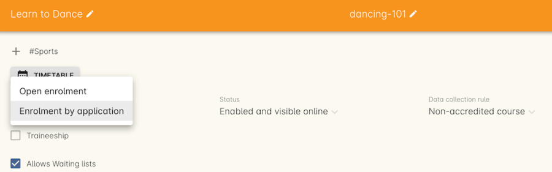
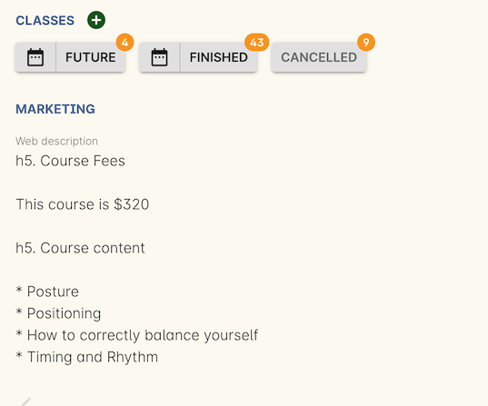
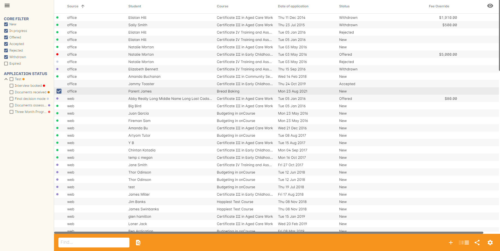
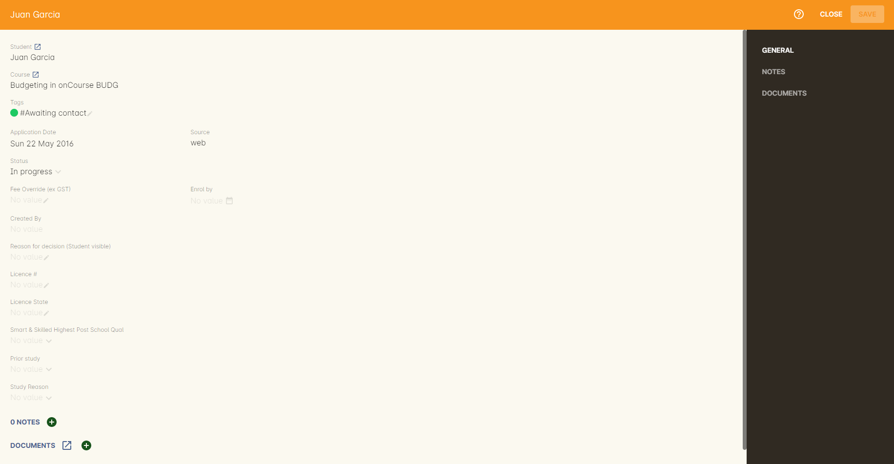
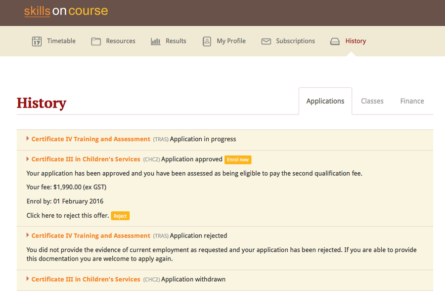

[[applications]]
== Applications

[[applications-Overview]]
=== An overview of applications and enrolments

The Enrolment by Application function allows you to add an approval process between the student requesting a place in a class and the enrolment and payment taking place and to optionally provide the student with an individualised enrolment fee offer.

There are many reasons a course may require applications rather than allow direct enrolment.

A course may have certain pre-requisites that need to be assessed as being met, such as the student supplying evidence of completing the Certificate IV or equivalent workplace experience before enrolling in a Diploma course.

Another course may have competitive entry requirements, such as an audition, where students are competing to be offered a place in a limited enrolment class.

Some language programs may require the student to be assessed to determine which program level is the right option for their current spoken and written skills, prior to their enrolment.

Various government funded programs, like NSW Smart and Skilled, require the student to meet a suite of eligibility criteria to be accepted into the program at one of the multiple price points available.

CRICOS approved training organisations may use the application process to assess and offer a enrolment opportunity to an overseas student which they can then use to obtain the student visa they require to study in Australia.

Even from a marketing perspective, enrolment by application may be used for certain prestige courses to indicate that entry is not available to just anyone who can pay the course fees.

==== Setting the course to Enrol by Application

By default, all current and new courses in onCourse are set to 'Open Enrolment', in the enrolment type option located on the course record. When a course is changed to 'Enrolment by application' that will change your website to show any of the courses classes 'Enrol now' buttons as 'Apply now' and suppress the display of the class fee.

We recommend you add descriptive text to the Marketing section's web description fee explaining the course fee structure for these courses. As the class won't show a fee during the application process, as no fee applies until enrolment, it is important you indicate to the student prior to their application what fee they may need to pay if their application is approved.

===== Implications for classes and Checkout

When setting the enrolment fee for a class belonging to an enrolment by application course, we suggest you set the highest applicable fee. If the student is eligible for a discounted fee, their individual fee, defined in the application will be charged.

All fee override amounts set in the application are GST exclusive. An additional charge for GST will be applied on enrolment if the class fee is set to have GST.

Enrolments into classes marked as 'Enrolment by application' can still be processed directly in Checkout, without the need for an approved student application. It is only the online enrolment process that requires the additional step.

[[enrolmentByApplication-General]]
=== Navigating the application window

An application is created in onCourse when a student applies online or a manual application is created though the onCourse admin interface.

An application contains the student details, the course they are applying for, and any additional information you may wish to collect during the application process such as copies of certificates or portfolios.

All applications have a status that indicates where in the approval process they are up to.

Applications can be accessed by going to the Dashboard and typing 'Applications' into the Find Anything search bar, then clicking the search results.

By default the window will open into a standard list view showing a summary table of all the application records.

On the left-hand panel of the list view window are the application status filters. By default, all except 'expired' will be ticked when you open the window. You can check and uncheck these as needed to change the displayed list of applications.

In the bottom-right hand corner of the list view are the fullscreen edit, add, view mode, share (print) & cogwheel buttons.

The cogwheel option can be used to open in bulk related records to the applications, such as the student records or course records, or used to send messages to applicants. It can also be used to delete an application record. You may only delete applications that have a status of 'New'.

Double clicking on an application record in the list view opens the edit view. The application has three sections: general, notes and documents.

The general section contains fields that may be completed during the application or application assessment process. The notes section allows you add additional notes or documents to the record.

[[enrolmentbyApplication-create]]
=== Creating applications

To create a new application in onCourse, click on the plus button in the bottom right-hand corner of the application list view window.

To create a new application you need to enter the name of a student who already has a contact record in onCourse, and the name of a course that is set to 'Enrolment by application'. You cannot create an application for an open enrolment course.

You do not need to add any additional information at this point, however you can optionally add additional notes or attach documents on the Notes section, or assign a tag to the record. Once complete, save and close the record, which you will then see displayed in the list view.

By default, all applications will be created with a 'new' status. New applications mean those that have been received but not yet assessed.

The date of the application and the source (office or web) will be automatically set for all new applications. These fields cannot be edited.

If applications can be made online, we suggest you enable the script 'send application received notification' and customise the email template 'enrolment application received'. The script will send the template email to the student, which should advise them what to do next, and also an email to the default office admin address, so you can schedule your own internal follow-up process to assess the application.'

Once you have begun the communication with the student regarding their application, you should change its status to 'in progress' to differentiate from applications that have been made but had no follow up yet.
Changing an application status to 'in progress' does not trigger any scripts or email communications by default.

[[enrolmentbyApplication-approvereject]]
=== Approving and rejecting applications

The Status field indicates what stage the application is at in the approval process. You set these manually as you progress each application through to enrolment. The status types are:

New:: This is a new application that has yet to be evaluated.
Offered:: This application has been offered a position. Setting this status actually changes the course's 'Apply Now' button to 'Enrol Now', allowing the student to finalise the enrolment process.
Rejected:: This is given to applications where that are being rejected.
Withdrawn:: This is for when the student would like to withdraw their application.
In Progress:: This is for any application you are currently considering.
Expired:: This is when an application was initially offered but not accepted by the student before the 'enrol by' date.

When an application has its status changed in onCourse, this affects what actions are available to the student. For example, only a student with an application of status type 'offered' can proceed with an online enrolment in a class from the course.

Note that an 'offered' application for a course allows the student to enrol online in any published class from that course. This can be a useful option for courses that have a day and evening class option, or for courses that have classes starting every month.

[[applicationbyEnrolment-feeoverride]]
==== Fee override and enrol by date

For an approved application, you can optionally add a 'fee override' and an 'enrol by' date.

If you don't provide a fee override, the student can enrol at any of the standard or eligible discount rates you have set up for the classes of that course.

If you do provide a fee override, this is the only fee option available to the student when they enrol online, for all classes of the course. Using the fee override instead of the normal class discount options is most useful for government funded classes where a complicated metric determines the student enrolment fee on a student by student basis.

The enrol by date can put a cap on when the student has to decide to go ahead with the enrolment, possibly before the next class commences, or an earlier day, so you can offer the position to another student. This date is not required if the approval to enrol can be used at any time.

[[enrolmentbyApplication-reasonfordecision]]
==== Reason for decision

When you are choosing to reject an application, you may wish to make your reason for the decision known to the student. In that case, provide some text in the 'Reason for decision (student visible)' field in the application.

As part of your application assessment process, you may determine that the student is not eligible to complete the course they applied for. For example, a student may have applied for a Certificate III level English course and your assessment process has determined they are at Certificate I level. You can choose to either reject the Certificate III application and create a new application for the Certificate I or just change the original application to the Certificate I and explain why in the reason field.

==== Custom fields

Any fields below the 'reason for decision' box that aren't a part of Notes or Documents are custom fields that have been added in General Preferences.

[[enrolmentbyApplication-studentoffer]]
==== When the student has an offer

Once the student has received their application offer they can choose to reject it, which then marks the application as 'Withdrawn' in onCourse. You can also mark an application as withdrawn at any time if the student notifies you they don't want to proceed.

If the student proceeds to enrolment after receiving an 'offered' application notice, then the application status will change to 'accepted'. You cannot change this status once it has been set.

If you set an Enrol by date in an offered application and the student fails to enrol by this time, the status will be automatically set to 'expired'.You can reset the Enrol by date to automatically set it back to 'offered'.

===== Sending application emails

When an application is created online or via the office, a script called 'send application received notification' can be enabled to send the 'Enrolment application received' email.

If you have enabled the standard 'send application decision' script and customised your 'application accepted' and 'application rejected' templates, the information will be automatically sent to the students when you change the application status and save the record.

If you don't want to send these emails automatically, but would still like to send them out manually, you can disable the script and use the cogwheel option to send the received, approved or rejected email instead.

[[applications-Web]]
=== Applications on the web

Courses set to 'Enrolment by application' need one or more classes enabled to display on the web to allow students to apply.

The usual 'Enrol now' button will say 'Apply now' and any information about the class fee will be suppressed. We suggest you add information to the course or class description about the fees that will be applicable if the student's application is successful.

==== Applying online

A student can apply online for a course, or courses as well as purchasing other enrolments or products in the shopping cart. As per the usual checkout process, the contact details you have set to request on enrolment must be supplied.

There is no payment required if the student is only completing an online application.

At the end of the checkout process, the student will be sent an 'enrolment application received' notification, instructing them what to do next.

In the Automation window, under Scripts, a default script called 'send application received notification' is disabled by default. If you plan on using online applications, you need to make sure this script is enabled.

The email that is sent to the student can also be found in Automation, under Message Templates and is called 'Enrolment application received'. You must customise this template by inserting a location for the next stage of the application process, or replace it with some text to the effect of 'We will be in contact to request additional documentation'.

==== Enrolling after application approval

Once a student's application documents have been received, you have determined the appropriate fee for the student and set the fee override, and changed the application status to success, a script called 'send application decision' (disabled in onCourse by default, please enable if you wish to use it) will send the email template 'enrolment application accepted'.

Within this template, is a special URL containing a unique student ID that will open the course page ready for the student to select their class, enrol, and pay their enrolment fee. If the student has been provided a special fee override, that is the price they will see listed for each class on the course page. Otherwise, they will now see the default class fee.

The application approval process is for a course. Once a student is approved, they can then enrol in any class from that course, but can only use their application approval to enrol in one class from the course.

Alternatively, if the student returns to the public website, locates the course and clicks 'Apply now' after they have an approved application, they will be able to proceed directly to the enrolment and payment process. This only occurs if the student uses the same first name, last name and email address they used for their approved application.

If during the enrolment and payment process, they wish to 'add a friend', then the friend will go through the application process. Only students with applications statuses of 'offered' can proceed to online enrolment and payment.

==== Application records in the portal

Students can also see the history of their applications in the skillsOnCourse portal by going to History and selecting the tab Applications. You can send the link to students
https://www.skillsoncourse.com.au/portal/history to take them directly to this page after login.

The History shows all current applications where the assessment is in progress, offered applications, as well as any rejected or withdrawn applications.

Applications with a status of offered can be rejected in the portal by the student, which will change their status in onCourse to 'withdrawn', or the student can proceed to enrol and pay for their application from within the portal. This will redirect them to the normal online enrolment process.

=== Bulk adding or removing tags

You can add or remove tags in bulk from application records by, in the list view, highlighting the records you wish to change, clicking the cogwheel and selecting either 'add tags' or 'remove tags'. Select the tag and click 'Make Changes'.