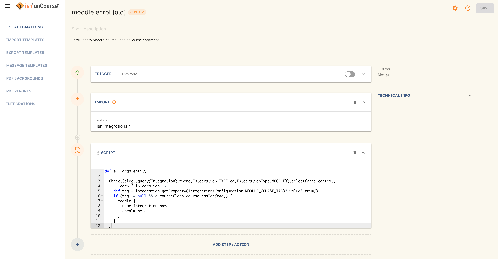
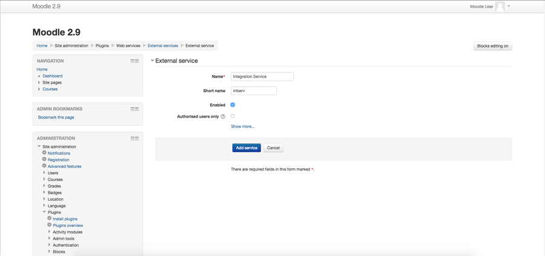
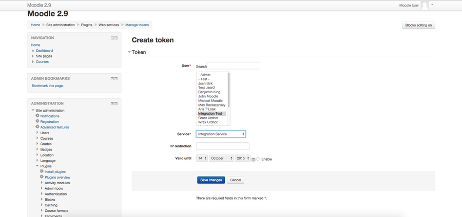
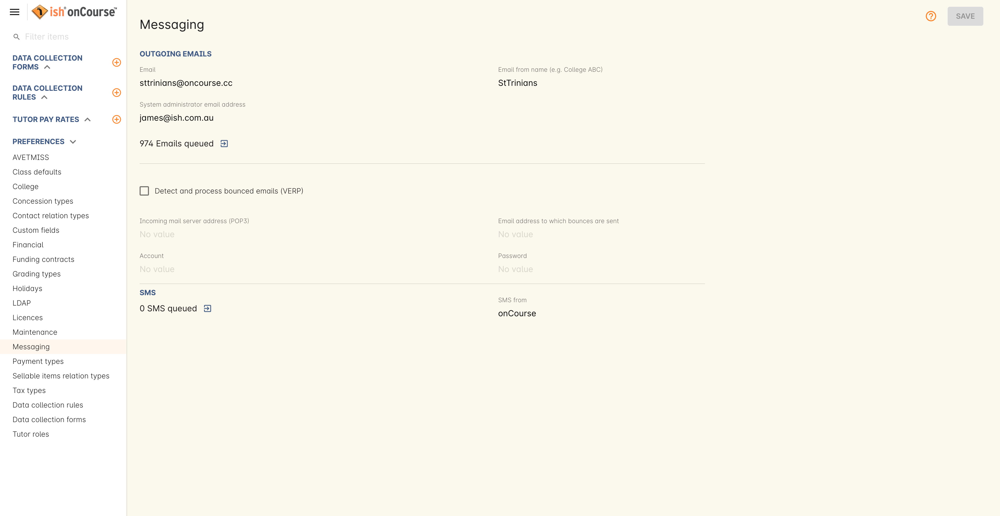
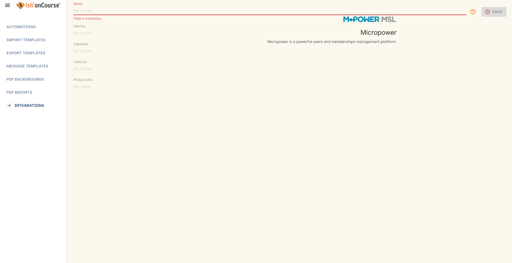
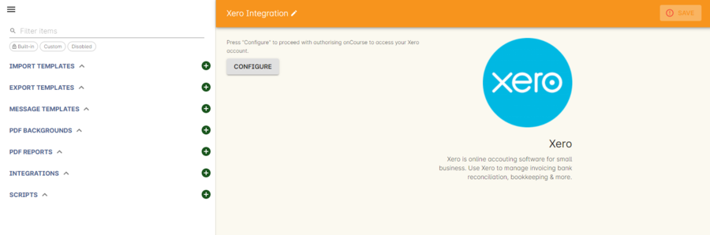

[[externalintegrations]]
== External Integrations

onCourse allows you to create integration points with a number of popular commercial tools. These integrations allow you to create your own links to external services and products you have purchased, and define with a corresponding script how onCourse utilises these services.

You can find all the current built in integrations by going to the Automation window. Then click on the '+' button next to the heading 'Integrations' to see all the integrations, as shown below.

image::images/integration_prefs.png[title='Integration preferences window']

[[externalintegrations-moodle]]
=== Moodle

Moodle is a free, open-source PHP web application for producing modular internet-based courses that supports a modern social constructionist pedagogy.

Add a https://demo.cloud.oncourse.cc/automation/integrations/new/moodle[Moodle integration] in onCourse automation.

Base URL:: The URL of your Moodle instance. This must include the 'http://' or 'https://' protocol at the beginning of the URL.
Username & Password:: The username and password used to access your Moodle instance
Service Name:: The name of your integration inside Moodle.
Only activate for enrolments in courses tagged with:: This defines which tag the script should look for when executing. All courses tagged with this tag will be included.

[IMPORTANT]
====
For this to work, courses to be integrated with Moodle are required to have a specific user-created tag associated with them that must be created separately in the Tags screen. <<tagging-creatingTags, You can see how to do that here>>. The bottom field 'Only activate for enrolments in courses tagged with' is where the name of this tag is defined, so you must make sure the name you put in here matches the name of the tag you created precisely.
====

image::images/moodle_prefs.png[title='Moodle integration preferences']

Once these preferences have been defined you will need to enable the 'moodle enrol' script to automatic the process. The Moodle script can be found by going to Automation, doubling clicking on 'moodle enrol' under Scripts, clicking on the checkbox 'Enabled' and saving the script.

==== Set up Moodle

Enable the integration in Moodle:

. Create a user in `Site administration -> Users -> Accounts -> Add a new user`
+

. Assign user to a role in `Site administration -> Users -> Permissions -> Assign system roles`
. Add a service in `Site administration -> Plugins -> Web services -> External services` and give it a name.
+

. Once the Service is created, click on `Add functions`
+
image::images/Moodle_4.1_Functions_screen.png[title='Functions page']
. Add following functions: `core_user_create_users, core_user_get_users, core_course_get_courses, enrol_manual_enrol_users`
+
image::images/Moodle_4.2_Add_Functions.png[title='Adding the functions to the service']
. Generate a token in `Site administration -> Plugins -> Web services -> Manage tokens`
+
image::images/Moodle_5.1_Token_screen.png[title='Manage tokens page']
. Then select the created user and service.
+

. The last step is to create a course, you can do this by going to `Site administration -> Courses -> Manage courses and categories`.

The ID should be the same as course code in onCourse for the default integration script to work, although you can customise this in different ways.

[[externalintegrations-mailchimp]]
=== Mailchimp

Mailchimp is an online email marketing solution to manage contacts, send emails and track results.

. Log into mailchimp and obtain an https://mailchimp.com/help/about-api-keys[API key] for your account. Go to `Account -> Extras -> API keys -> Create a key`
. In MailChimp, find your https://mailchimp.com/help/find-audience-id/[Audience Id]. Go to `Audience dashboard -> Manage Audience -> Settings -> Audience name and campaign defaults`, and find the unique Audience ID number for the list you want to subscribe your enrolling students to.
. Add a https://demo.cloud.oncourse.cc/automation/integrations/new/mailchimp[new Mailchimp integration] in onCourse.
+
image::images/mailchimp_prefs.png[title='Mailchimp integration for a Mailing List integration']
+
. Click the 'Add' button below the mailchimp icon. The name of the integration must be 'Enrolment'. Insert your API key and Audience ID from MailChimp, then save and close this window.

Once the integration has been defined you will need to enable a mailchimp script to automate data flowing between the systems. Scripts can be found by going to the Automation window. Sample scripts are provided to enrol students on enrolment and to update marketing material settings in onCourse when they unsubscribe in mailchimp.

There are five mailchimp scripts for use with the mailchimp integration available in onCourse:

mailchimp subscribe:: for onCourse mailing list subscription: This type of integration triggers when you manually attach a Mailing List tag, with the same name as the integration, to an onCourse contact. You can create multiple mailing list tag groups in onCourse that integrate with multiple mailchimp lists by first creating that tag in the Mailing List tag group, and then creating an integration with the same name. TIP: it's best if the mailchimp audience, mailing list tag and integration all share the same name, so you can more easily follow the movement of data.

If your onCourse plan allows script editing, there are some additional lines that you can add to this script to both force Mailchimp to ignore its opt-in email setting and not send one, as well as adding a Mailchimp tag of the same tag name to the contact in Mailchimp.

To disable email opt-in, add the following line within the script block:

====
optIn false
====

To tag a contact on subscription, add the following line:

====
tags record.taggedContact.tags
====

mailchimp unsubscribe:: onCourse mailing list unsubscription: This type of integration triggers when you manually remove a mailing list tag from a contact and will set the contact as Unsubscribed from the audience in Mailchimp. This script should be enabled whenever the script 'mailchimp subscribe' is enabled.
mailchimp subscribe on enrolment:: This type of integration triggers when a contact enrols via onCourse or the web. You can only have one of these types of integrations to subscribe all enrolling students to a single mailchimp list. Your onCourse integration must be named "Enrolment" for this to work.
mailchimp pull subscribe:: This script will pull unsubscriber information back from mailchimp into onCourse, and based on email address, will mark the contact's record as 'email marketing unavailable'.
mailchimp subscribe on attribute changing:: Allows you to subscribe or unsubscribe a user in mailchimp whenever their 'email marketing' checkbox is changed.

image::images/mailchimp_script.png[title='Mailchimp mailing list subscribe script']

[[externalintegrations-surveymonkey]]
=== SurveyMonkey

SurveyMonkey allows you to create and publish online surveys in minutes, and view the results graphically in real time. SurveyMonkey provides free online questionnaire and survey software.

To add a SurveyMonkey integration you will need to click on the 'Add' button below the SurveyMonkey icon. You will then see a number of fields that are needed to enable the integration. The 'Name' field is what ever you want to call this integration.

image::images/surveymonkey_prefs.png[title='SurveyMonkey integration preferences']

Once these preferences have been defined you will need to enable at least one of the SurveyMonkey scripts to automate the process. These scripts can be found by going to Automation and looking under Scripts, double-clicking on either 'SurveyMonkey send invite on enrolment', 'SurveyMonkey send invite on enrolment completion', or 'VET Course completion survey' clicking on the checkbox 'Enabled' and saving the script.

image::images/surveymonkey_script.png[title='SurveyMonkey scripts']

==== Access Tokens and Creating a developer account

Survey Monkey introduced access tokens as a means of integration in January 2017. All integrations created after that date will need to use access tokens. API Keys will not be used after this time. Existing integrations using an API key will continue to use the API key. To create an access token, you set up a developer account in SurveyMonkey and add onCourse as an App.

. Log into the https://developer.surveymonkey.com[SurveyMonkey developer portal]
. Go to `My Apps` and add a new app.
. In the App record, go to `Settings -> Scopes` activate the following three Scopes:
* Create/Modify Collectors
* View Collectors
* View Surveys
+
image::images/surveymonkeyScopes.png[title='The required scopes in SurveyMonkey']
. Go to `Credentials -> Access Token`. The Access token is the long string of numbers and letters. Copy this and paste it into the 'OAuth token' field within the https://demo.cloud.oncourse.cc/automation/integrations/new/surveymonkey[SurveyMonkey Integration] you're setting up in onCourse.
+
image::images/surveymonkeyCredientials.png[title='SurveyMonkey Access Token Location']
+
. The Survey Name you need to enter in onCourse is the name listed in the 'Title' field on Survey Monkey, in the example below it's simply called 'Test'. This can be found by logging into your https://www.surveymonkey.com[SurveyMonkey account] and go to 'My Surveys'.
+

Survey Monkey uses the term 'Collectors' to describe ways you can send out your survey and collect responses.

Set up your collector and name it 'onCourse', as this is the default collector name the app looks for. If there is no Collector by this name, then the first Collector in the list is selected. We highly recommend naming the Collector 'onCourse'.

If you haven't used SurveyMonkey before you will need to verify the collectors email address. Click on `Survey name -> 'Collect Responses' tab -> Survey name under 'NICKNAME'` and continue until the email is sent.

image::images/survey_collector.png[title='A view of some Collectors,one has yet to be configured']

The 'Sender email address' that survey responses are sent to is the same one you should have stored in the field 'Email from address' in the Messaging tab of the onCourse preferences window.

[[externalintegrations-surveygizmo]]
=== Alchemer

Alchemer is a powerful survey tool designed to make even the most advanced survey projects fun, easy and affordable.

To add an Alchemer integration you will need to click on the 'Add' button below the Alchemer icon. You will then see a number of fields that are needed to enable the integration.

image::images/surveygizmo_prefs.png[title='Alchemer integration preferences']

Once these preferences have been defined you will need to enable at least one of the Alchemer scripts to automatic the process. These scripts can be found by going to Automation, double-clicking on either 'Alchemer send invite on enrolment' or 'Alchemer send invite on enrolment completion', clicking on the checkbox 'Enabled' and saving the script.

image::images/surveygizmo_script.png[title='Alchemer scripts']

Below is the information that is needed to enable the integration that can be found in Alchemer.

. The User and Password is the same one you use to log into your account at SurveyGizmo
. The Survey ID is taken from survey URL address, so in the example below the Survey ID is 6386477. Please visit
https://help.alchemer.com/help/how-to-find-ids[here] for more information.

image::images/SurveyGizmo_Survey_ID.png[title='Where to find the Alchemer Survey ID']

[[externalintegrations-cloudassess]]
=== Cloud Assess

Cloud Assess is an online service for managing the assessment process. It can be used for VET and non-VET enrolments, and can be used by tutors to help manage classroom based assessments as well as online assessments.

When you create an account with Cloud Assess ask for the different user names and keys shown in the image. Then enable the script "cloudassess course enrolment create" in order to automatically push enrolments in onCourse into Cloud Assess. This script assumes that you'll create a course in Cloud Assess with the same course code as the course in onCourse. If there is no matching course in Cloud Assess then the script will do nothing.
Of course, you can modify the script to suit your own specific needs. Remember that the name of the integration here must match the name given within the script.

image::images/cloudaccess_prefs.png[title='Cloud Access integration preferences']

Once these preferences have been defined you will need to enable the Cloud Access script to automate the process.
This script can be found by going to Automation, double clicking on 'cloudassess course enrolment create' then click on the 'Enabled' check box and save.

image::images/cloudaccess_script.png[title='Cloud Access script']

[[externalintegrations-canvas]]
=== Canvas

Canvas is an open-source learning management system for delivering training to students. This integration allows you to automatically make enrolments, classes and students using information you've already entered into onCourse.

image::images/canvas_integration.png[title='Canvas Integration window']

To use the onCourse integration with Canvas, you will first need to have set up a https://community.canvaslms.com/t5/Admin-Guide/How-do-I-add-a-developer-key-for-an-account/ta-p/259[developer key in Canvas itself].

You will also need to have the relevant courses and classes set up in Canvas. Canvas uses slightly different terminology here; courses are still 'courses', but classes are known as 'sections'. You'll need to ensure that every course and class you want captured by the integration is duplicated in both Canvas and onCourse. However, if you cannot set up every class, in the Canvas script there is a value that, when set to true, can create new sections (classes) if one does not exist for the equivalent course in onCourse.

When setting up a course in Canvas, it must use the same course code as the equivalent class in onCourse. Similarly with classes, all sections in Canvas must use the same code as the equivalent class in onCourse. E.G. if you set up a course with the code CWC101, and it has one class (that you don't edit the code of), then the course code would be CWC101 and the section/class code would be CWC101-1.

Once every course and class is created in both systems, create a tag in onCourse. The tag must be set to Courses, and it must be called 'Canvas'. You must set this tag on each course that's to be included in the integration.

As soon as you've got your developer key, you can continue with the integration in onCourse:

. in onCourse, go to Automation
. Click the green + button next to the Integrations header in the left-hand column of the window that opens
. Find the Canvas integrations and select 'Add'
. Enter the URL of your Canvas instance. This will look like following -
https://my_canvas_instance.instructure.edu.au/ - where 'my_canvas_instance' would be personalised with the name you gave it during initial set up. You also need to enter your client id, the client secret from your developer key, and set the athentication provider id. Set this to 'true' if users should be authenticating via Canvas.

The account ID is the id number that corresponds with the account you wish to enrol students into. You can find this by logging into Canvas, then navigating to the left-hand menu bar. Select Admin > then select your account.
This will open an accounts page. The account ID will be listed in the site's URL e.g. if the URL is
https://my_canvas_instance.instructure.edu.au/accounts/36 then you would enter 36 as the account ID, and only that number. You don't enter the URL. Once you've completed filling in the expected fields in onCourse, a button labelled 'Configure' will appear. Click this and a pop-up window will appear, asking you to log in to Canvas and authorise onCourse to integrate with your account.
. Lastly, you'll need to turn on the integration script. You can do this by going to Automation, and enabling the 'Canvas Enrol' script. Make sure you hit the Save button before closing the window.

[[externalintegrations-micropower]]
=== Micropower

This integration allows for a connection between a Micropower (MPower MSL) based system and onCourse. To use this integration, you'll need to have your own Micropower instance. Each field in the integration window should map directly to a similarly named field in your Micropower system. Copy the data each field from your Micropower system into the corresponding field within onCourse, and ensure you activate the Micropower integration script in the Scripts section of the Automation window.

[[externalintegrations-USI]]
=== USI

This integration connects your onCourse system to the USI Agency so that onCourse can automatically verify a student's USI number. This section will detail how you can activate this integration. If you wish to learn more about the basics of how the USI functions in onCourse, you can read more in our dedicated <<usi, USI chapter>> here.

Follow the below steps to activate the integration:

. https://www.usi.gov.au/training-organisations/set-access-usi-registry-system[Request access] to the USI System Registry. This is only required if you've never registered with the USI Agency before.
. Register a MyGovID. Please note that myGovID is not the same MyGov.
+
[IMPORTANT]
====
When you create a MyGovID, it is for you as an individual, not for the organisation.
====
+
. Link your RTO to your myGovID with the https://authorisationmanager.gov.au/[Relationship Authorisation Manager]. Once logged in, choose the "Link your business" option. The business you link must use the same ABN as is set in your Preferences -> College section.
. Log into onCourse and go to the Automation window, then scroll the left-hand column until you see the Integrations header. Click the + button next to the header, then select 'Add' under the USI integration listing. This will create a new USI integration.
. In the new Integration screen you'll see two numbers; a Digital Software Provider number and a Software ID number, as well as some text with an embedded link. The Software ID number will be unique to your system.
Make a note of these two numbers. Click the link, and it will take you back to the Relationship Authorisation Manager.
+
[NOTE]
====
DO NOT use the Software ID from the image above as it is only an example and will not work.
====
+
. Click on the "Entity name" which is your RTO.
. In the top menu, click on 'Manage Notifications', then click 'Add Notification'.
. In the 'Digital Service Provider ABN' field, enter the following Digital Software Provider number '74073212736', and then click the magnifying glass icon. You will see the company ISH GROUP PTY LTD. Confirm this.
. Enter the Software ID from the USI Integration window in onCourse and confirm.
. The entry you just added should now display as "Active". It should look like the screenshot below.

image::images/usi-active-status-ram.png[title='At the end of the process']

[[externalintegrations-tcsi]]
=== VET Student Loans

This integration feeds data from onCourse directly into TCSI. If you are authorised by the Commonwealth Government Department of Human Services to provide VET Student Loans to your students, you will need to enable the Integration for the purpose of reporting this data to the government.

image::images/tcsi_integration.png[title='TCSI Integration']

==== Link your organisation to the TCSI service

. Go to https://proda.humanservices.gov.au/[PRODA] and register for your own personal account.
. Select “Organisations” at top right of the screen.
. Select your RTO organisation. If it is not there, click on “Register New Organisation” or "Join an Organisation". You will already need to be linked to that organisation through the Australian Business Register (ABR). Contact PRODA Support for help.
. Expand the “Service Provider” dropdown, and click “Add Service Provider”.
. Select “Tertiary Collection of Student Information” and click the “Add Service Provider” button.
. Select “Services” located in the top right of the screen then click the TCSI Support tile under “Available Services”. Follow the onscreen prompts. This step prompts PRODA to check the provider’s ABN against the list of education providers approved to deliver higher education or VSL.

==== Register onCourse with TCSI

. Log into https://proda.humanservices.gov.au/[PRODA]
. Select “Organisations” located in the top right of the screen.
. Select your organisation from the list of organisations.
. Expand the “B2B Device” dropdown, and click “Register new B2B Device”.
. Enter "onCourse" as the device name and click “Register Device”.
. Device Activation Code, Device Name and PRODA RA (Organisation) number will display. Record these details.

==== Create onCourse integration

. Log into onCourse create a new https://demo.cloud.oncourse.cc/automation/integrations/new/tsci[VET Student Loan integration]
. Name the integration and enter the Device Name, Organisation ID (PRODA RA) and Device Activation Code into the fields provided.
. Save the integration.

[[externalintegrations-googleclassrooms]]
=== Google Classroom

Google Classroom is mission control for your classes. As a free service for teachers and students, you can create classes, distribute assignments, send feedback, and see everything in one place.

image::images/google_integration.png[title='Google Classroom Integration window']

To create a new Google Classrooms integration you'll require a Google client id, and a client secret.
Once you have both of these from Google, Follow the next steps:

. in onCourse, go to Automation > Integrations and click the green + button next to the Integrations heading
. Scroll down and click 'Add' in the Google Classrooms integration
. Enter a name for the integration at the top of the window
. Enter your Client ID and Client secret
. Click 'Get Activation Code' to get your activation code

[[externalintegrations-talentLMS]]
=== TalentLMS

TalentLMS is a cloud-based learning management system that provides an online tool to deliver your course materials.

Enter your TalentLMS URL into 'Base url' and your TalentLMS API key into 'API key'. Once you save the integration a new script block will be available for use. The standard script looks just like this:

[source,groovy]
----
talentLMS {
    action 'enrol'
    course record.courseClass.course.code
    student record.student
}
----

By default, the course in TalentLMS should be named with the onCourse course code for this integration to work. Of course, you can modify this script to use any value, for example the course-class code or even the unit of competency code.

When creating new students in TalentLMS, they will be created with their email address as the login, type "Learner-Type" and a random password. Students can reset their password in TalentLMS. By default TalentLMS will typically send a welcome email.

[[externalintegrations-learnDash]]
=== LearnDash

LearnDash is a learning management system plugin for Wordpress websites only. It can provide an online space for you to deliver your course materials to students.

For this integration to work, you must have installed on your Wordpress site the 'Application Password' Wordpress plugin, then adjust the .htaccess config file (see the following link https://github.com/WordPress/application-passwords/wiki/Basic-Authorization-Header----Missing for exact instructions).

After this is set up, generate a password for the admin user; this is the user whose information you will enter in the integration window. Go to the integration window and enter your site URL in to the 'Base url' field, the user login for the admin user into the 'User login' field, and the password you created into the 'User password' field, and click Save.

Then, go to the Automation window and look under Scripts for the script called 'LearnDash course enrolment' and enable it, then click Save. The standard script will look like:

[source,groovy]
----
learndash {
    action 'enrol'
    course record.courseClass.course.code
    student record.student
}
----

onCourse needs to match against the course slug in LearnDash. By default, it uses the onCourse Course Code to do this, but you can alter this to something else if you wish. In its default configuration, you need ensure that the Course Code in onCourse and the course slug in LearnDash match.

Once all this is completed, this integration will create enrolments in LearnDash as they are created in onCourse.

[[externalintegrations-xero]]
=== Xero

Xero is an accounting solution which includes payroll capability.

Our Xero Integration requires you first configure it to connect with Xero. Give the integration a name and then click the 'Connect to Xero' button to be taken to the Xero login dashboard. You'll need to be a Xero admin user in order to complete this step and connect the apps. You will be told you have connected to the Xero organisation.

Once you have done this, you'll be returned to the integration window where you'll be able to save the integration. Once saved, the final step is to activate either one, or both, of the available scripts in the Automation > Scripts window.

In Xero, it's very important that you aren't using the account type 'Bank', as the integration cannot work with this account type. The integration and scripts will only work with accounts of type 'Asset'.

If you ever need to delete the integration, simply select it from your Integrations list, click the cogwheel in the top-right and then click the 'Delete integration' icon. The integration will be deleted. You can also disconnect your integration but not delete it by clicking the 'Disconnect from Xero' button while your integration is still active.

The available scripts are:

==== Xero manual journal

onCourse can create daily journal records in Xero with trial balance movements. Create the integration and then enable the Xero Journal script. It is important you set up your accounts in Xero and onCourse carefully so that the account codes in onCourse match those in Xero. You can have additional accounts in Xero which don't exist in onCourse, but all your onCourse accounts must be created in Xero.

Additionally, you cannot use https://central.xero.com/s/article/Locked-and-system-accounts-in-your-chart-of-accounts#Systemaccounts[Xero locked accounts] in onCourse. So you cannot map onCourse trade debtors to Xero "Accounts Receivable". Instead you'll need to create a separate Xero asset account like "onCourse debtors".

==== Xero payroll

With the default Xero payroll script, onCourse will create a pay record in Xero as you mark pay in onCourse as "approved". Once pay is successfully uploaded to Xero, those records will be marked as "Paid/Exported" and locked in onCourse.

If the tutor doesn't exist as a Xero employee, the script will first try to find that tutor in Xero by name, email and date of birth. If they are not found, a new employee will be created in Xero. An email will be sent to you (make sure your account has a valid email address) with details of what to do next, including setting up a pay calendar, super account and pay template in Xero.

Finally, you can make changes in Xero and submit the payrun for payment, super and ATO submission. Note that any changes you make in Xero will not flow back to onCourse.
