[[externalintegrations]]
== External Integrations

[[externalintegrations-integrationsPrefs]]
=== Integration Preferences

onCourse allows you to create integration points with a number of popular commercial tools.
These integrations allow you to create your own links to external services and products you have purchased, and define with a corresponding script how onCourse utilises these services.

You can find all the current built in integrations by going to the Automation window.
Then click on the '+' button next to the heading 'Integrations' to see all the integrations, as shown below.

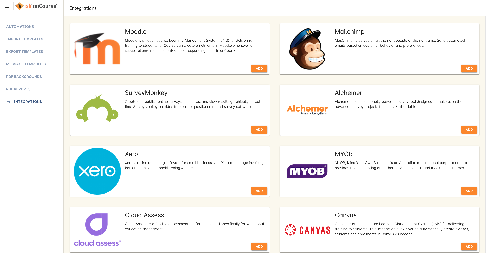

[[externalintegrations-moodle]]
==== Moodle

Moodle is a free, open-source PHP web application for producing modular internet-based courses that supports a modern social constructionist pedagogy.

To add a Moodle integration you will need to click on the 'Add' button below the Moodle icon.
You will then see a number of fields that are needed to enable the integration.
Each field _must_ be filled out, or else the integration scripts will fail.

* *Base URL* - The URL of your Moodle instance.
This must include the 'http://' or 'https://' protocol at the beginning of the URL.
* *Username & Password* - The username and password used to access your Moodle instance
* *Service Name* - The name of your integration inside Moodle
* *Only activate for enrolments in courses tagged with* - This defines which tag the script should look for when executing.
All courses tagged with this tag will be included in the integration

*IMPORTANT:* For this to work, courses to be integrated with Moodle are required to have a specific user-created tag associated with them that must be created separately in the Preferences > Tags screen.
link:#tagging-creatingTags[You can see how to do that here].
The bottom field 'Only activate for enrolments in courses tagged with' is where the name of this tag is defined, so you must make sure the name you put in here matches the name of the tag you created precisely.

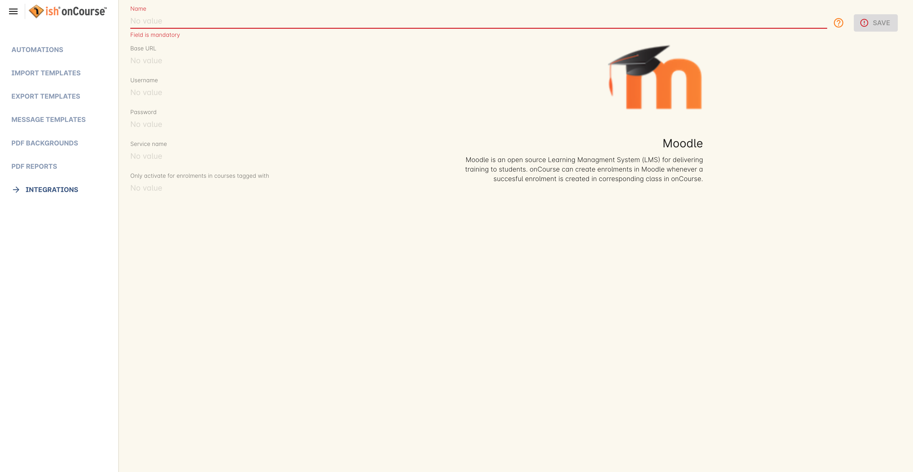

Once these preferences have been defined you will need to enable the 'moodle enrol' script to automatic the process.
The Moodle script can be found by going to Automation, doubling clicking on 'moodle enrol' under Scripts, clicking on the checkbox 'Enabled' and saving the script.

image:images/moodle_script.png[ Moodle enrol script,scaledwidth=70.0%]

===== Where to find the preferences in Moodle

Below are the steps that are needed to be done to enable the Moodle integration.

. The Base URL is the site url (e.g. http://localhost:8888/moodle29/).
. To create a user go to Site administration -> Users -> Accounts -> Add a new user
+
image:images/Moodle_1._Create_user.png[ Creating a user,scaledwidth=70.0%]
. To assign user to a role go to Site administration -> Users ->
Permissions -> Assign system roles
. To add a service go to Site administration -> Plugins -> Web services
-> External services.
When you are on the page click on 'Add' and fill in the Service Name and Short Name, then click on 'Add service'
+

+
When you are on this page click on 'Add' and fill in the Service Name and Short Name, then click on 'Add service'
+
image:images/Moodle_3.2_Create_Service.png[ Adding the service,scaledwidth=70.0%]
. Once the Service is created click on 'Add functions'
+

+
Add following functions: core_user_create_users, core_user_get_users, core_course_get_courses, enrol_manual_enrol_users
+
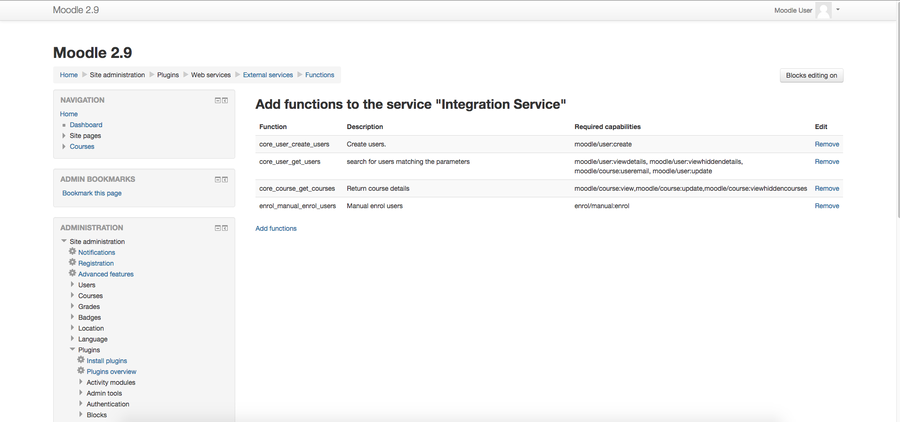
. The next step is to generate the token, you can do this by going to Site administration -> Plugins -> Web services -> Manage tokens then click on 'Add'.
+

+
Then select the created user and service, and if needed Enable and Set 'Valid Until' date
+
image:images/Moodle_5.2_Create_token.png[ Create token page,scaledwidth=70.0%]
. The last step is to create a course, you can do this by going to Site administration -> Courses -> Manage courses and categories, then Create new course.
The ID should be the same as course code in onCourse.

[[externalintegrations-mailchimp]]
==== MailChimp

MailChimp is an online email marketing solution to manage contacts, send emails and track results.

There are three types MailChimp integrations available in onCourse:

. *mailchimp subscribe* for onCourse mailing list subscription: This type of integration triggers when you manually attach a Mailing List tag an onCourse contact.
You can create multiple mailing list tag groups in onCourse that integrate with multiple MailChimp lists.
. *mailchimp unsubscribe* onCourse mailing list unsubscription: This type of integration triggers when you manually remove a mailing list tag from a contact.
This script should be enabled the script 'mailchimp subscribe'.
. *mailchimp subscribe on enrolment*: This type of integration triggers when a contact enrols via onCourse or the web.
You can only have one of these types of integrations to subscribe all enrolling students to a single MailChimp list.
Your onCourse integration must be named "Enrolment" for this to work.

===== Creating an onCourse mailing list integration

The name of your onCourse mailing list tag and MailChimp integration must be the same for this to work.
This integration will only add new subscribers to your mailing list to MailChimp, once enabled.

. Log into MailChimp and obtain an API key for your account at
https://mailchimp.com/help/about-api-keys/.
Go to Account > Extras > API keys > Create a key (under Your API Keys header)
. In MailChimp, find your the Audience Id at
https://mailchimp.com/help/find-audience-id/ Go to the Audience page > Settings, and scroll to find the unique List ID field
. In onCourse, go to Tags.
Find the Tag Group named 'Mailing Lists', and double-click to open the Tag's window.
. To create a new mailing list, click the green plus in the bottom left hand corner.
Name your tag, then click 'Save'
. To add the MailChimp integration, go to Automation and click on the '+' button next to the heading integrations.
. Click the 'Add' button below the MailChimp icon.
_The name of the integration must be the same as the name of the onCourse mailing list_.
Insert your API key and Audience (List) ID from MailChimp, then save and close this window.
+
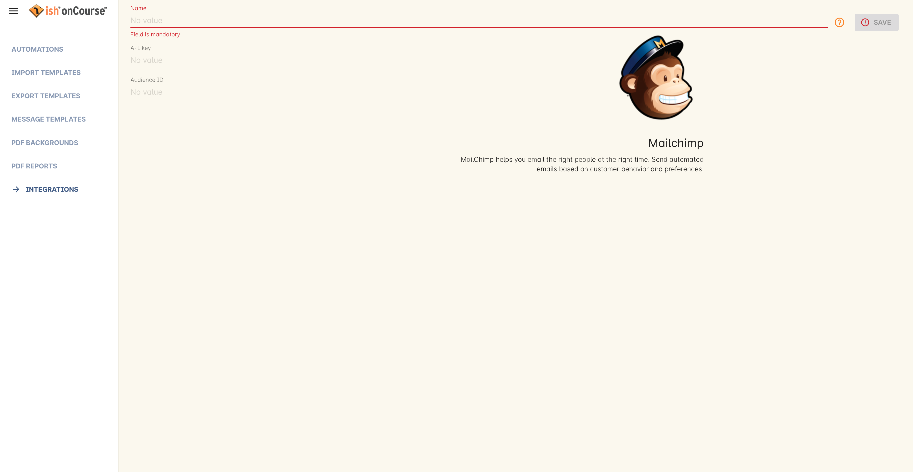
. Once the integration has been defined you will need to enable the MailChimp scripts to automate the process.
These scripts can be found in the Automation window.
. Double click on the script called 'mailchimp subscribe', click on the checkbox 'Enabled' and save the script.
. You should also enable the 'mailchimp unsubscribe', click on the checkbox 'Enabled' and save the script.
Please note that if contacts unsubscribe to the MailChimp list directly, they will not be unsubscribed in the onCourse mailing list (they can unsubscribe to onCourse mailing lists via the portal, which does update MailChimp), but either way, they will not receive further emails from you via MailChimp.
. To test this script is working as required, you can manually subscribe some contacts to your onCourse mailing list and check that they have been added to the correct MailChimp list.
To manually subscribe some contacts, open the contact window, highlight some records and right click on the mailing list name in the left hand part of the window.
Select the option 'add this tag to xx highlighted records'.
You can also tag an individual contact by opening their record and adding the tag manually.
. If you wish to add additional mailing list integrations, you can repeat steps 1 to 6 as needed, adding multiple mailing list integrations to onCourse.
Once the scripts are enabled, you do not need to repeat steps 7 to 9 again.

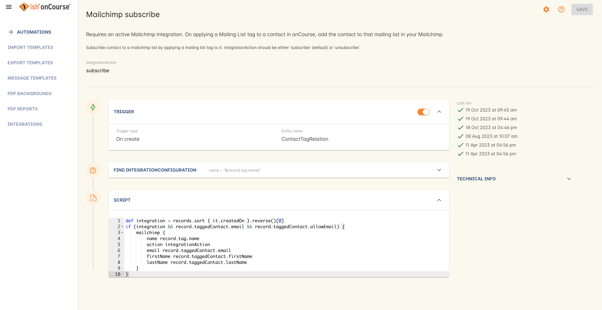

====== Creating an 'on enrolment' integration

This type of integration with MailChimp automatically subscribes on enrolment all contacts who have the permission 'accept email marketing material' on their contact record.
You can only have on integration of this type in onCourse.

. Log into MailChimp and obtain an API key for your account at
http://kb.mailchimp.com/accounts/management/about-api-keys.
Go to Account > Extras > API keys > Create a key
. In MailChimp, find your the List Id at
http://kb.mailchimp.com/lists/managing-subscribers/find-your-list-id Go to the Lists page > Settings, and scroll to find the unique List ID field you want to subscribe your enrolling students to.
. To add the MailChimp integration, go to Automation and click on the '+' button next to the heading integrations.
. Click the 'Add' button below the MailChimp icon.
The name of the integration must be 'Enrolment'.
Insert your API key and List and Id from MailChimp, then save and close this window.
. Once the integration has been defined you will need to enable the MailChimp script to automate the process.
This scripts can be found by going to the Automation window, under Scripts
. Double click on the script called 'mailchimp subscribe on enrolment', click on the checkbox 'Enabled' and save the script.
+
Note that there is no corresponding unsubscribe script for this integration - students can unsubscribe from this list directly via MailChimp after receiving an email from you.

[[externalintegrations-surveymonkey]]
==== SurveyMonkey

SurveyMonkey allows you to create and publish online surveys in minutes, and view the results graphically in real time.
SurveyMonkey provides free online questionnaire and survey software.

To add a SurveyMonkey integration you will need to click on the 'Add' button below the SurveyMonkey icon.
You will then see a number of fields that are needed to enable the integration.
The 'Name' field is what ever you want to call this integration.

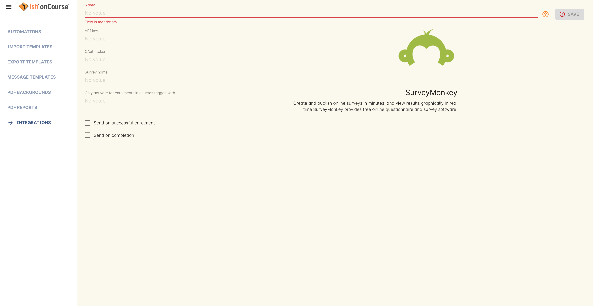

Once these preferences have been defined you will need to enable at least one of the SurveyMonkey scripts to automate the process.
These scripts can be found by going to Automation, doubling clicking on either 'SurveyMonkey send invite on enrolment', 'SurveyMonkey send invite on enrolment completion', or 'VET Course completion survey' clicking on the checkbox 'Enabled' and saving the script.

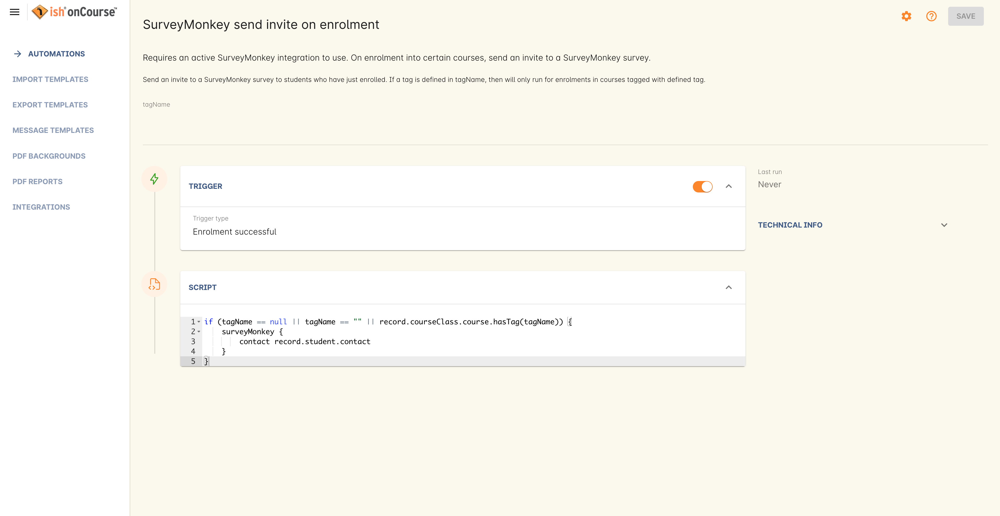

===== Access Tokens and Creating a developer account

Survey Monkey introduced access tokens as a means of integration in January 2017. All integrations created after that date will need to use access tokens.
API Keys will not be used after this time.
Existing integrations using an API key will continue to use the API key.
To create an access token, you set up a developer account in SurveyMonkey and add onCourse as an App.

. Go to SurveyMonkey.com and login using your regular login.
If you do not have a login for SurveyMonkey you will need to create one.
. Once logged in, got to the URL https://developer.surveymonkey.com.
This will bring you to the developers area to set up your integration.
. In the Developers area, go to My Apps.
If you already have an App, make sure it's not disabled or expired.
If you don't already have an app, or if yours is currently expired/disabled, click on 'Add a New App'.
SurveyMonkey Developer site Add New App Feature
. This will open new window asking you to add an App.
You can choose the name of App i.e. 'onCourse'
. In the App record, go to Settings, scroll down to the section called Scopes and activate the following three Scopes:
* Create/Modify Collectors
* View Collectors
* View Surveys
+
Without these Scopes being activated, the integration will fail to work.
+

. Once you've activated the required Scopes, scroll up to the Credentials section and locate the 'Access Token' field.
The Access token is the large string of numbers and letters in the field.
Copy all the text in this field and paste it into the 'OAuth token' field within the Integration you're setting up in onCourse, found in the Automations window.
+
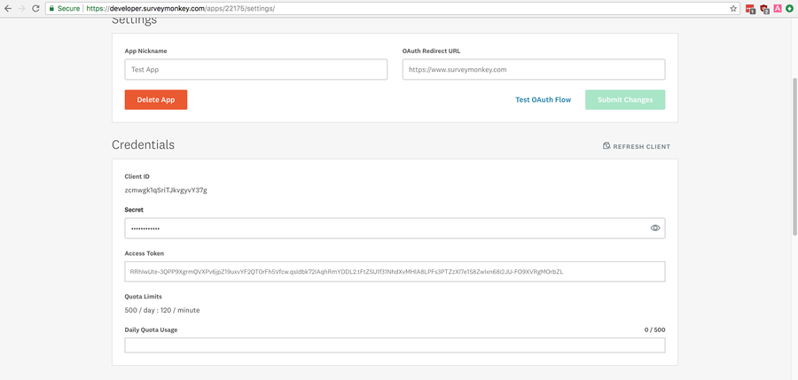

The Survey Name you need to enter in onCourse is the name listed in the 'Title' field on Survey Monkey, in the example below it's simply called 'Test'.
This can be found by logging into your account in
https://www.surveymonkey.com then clicking on the top menu option 'My Surveys'

image:images/SurveyMonkey_name.png[ All your surveys inSurveyMonkey will be listed in 'My Surveys',scaledwidth=80.0%]

Survey Monkey uses the term 'Collectors' to describe ways you can send out your survey and collect responses.
https://help.surveymonkey.com/articles/en_US/kb/How-to-collect-responses[You
can read more about Collectors here].

Set up your collector and name it 'onCourse', as this is the default collector name the app looks for.
If there is no Collector by this name, then the first Collector in the list is selected.
We highly recommend naming the Collector 'onCourse'.

If you haven't used SurveyMonkey before you will need to verify the collectors email address.
This is done by clicking on the name of the Survey followed by on the tab 'Collect Responses' and then on the Survey name under the heading 'NICKNAME' and continuing until this email gets sent.

The 'Sender email address' that survey responses are sent to is the same one that you should have stored in the field 'Email from address' in the Messaging tab of the onCourse preferences window.

image:images/Preferences_messaging.png[ Messaging tab of the Preferences window,scaledwidth=70.0%]

[[externalintegrations-surveygizmo]]
==== SurveyGizmo

SurveyGizmo is a powerful survey tool designed to make even the most advanced survey projects fun, easy and affordable.

To add a SurveyGizmo integration you will need to click on the 'Add' button below the SurveyGizmo icon.
You will then see a number of fields that are needed to enable the integration.

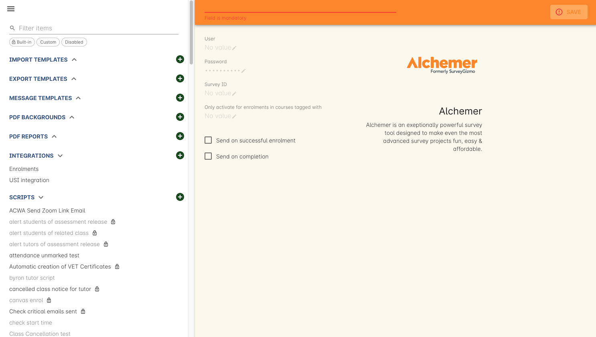

Once these preferences have been defined you will need to enable at least one of the SurveyGizmo scripts to automatic the process.
These scripts can be found by going to Automation, doubling clicking on either 'SurveyGizmo send invite on enrolment' or 'SurveyGizmo send invite on enrolment completion', clicking on the checkbox 'Enabled' and saving the script.

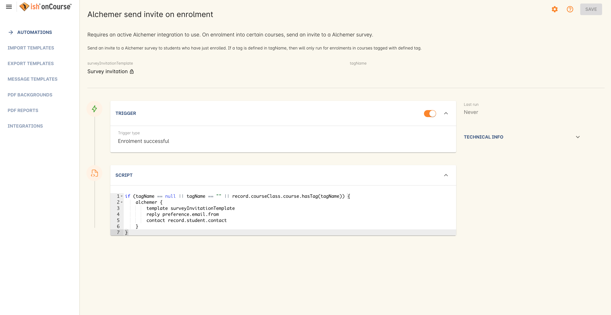

===== Where to find the preferences in SurveyGizmo

Below is the information that is needed to enable the integration that can be found in SurveyGizmo.

. The User and Password is the same one you use to log into your account at SurveyGizmo
. The Survey ID is taken from survey address, so in the example below the Survey ID is 2290616. Please visit
http://help.surveygizmo.com/help/article/link/how-to-find-ids[here] for more information.
+
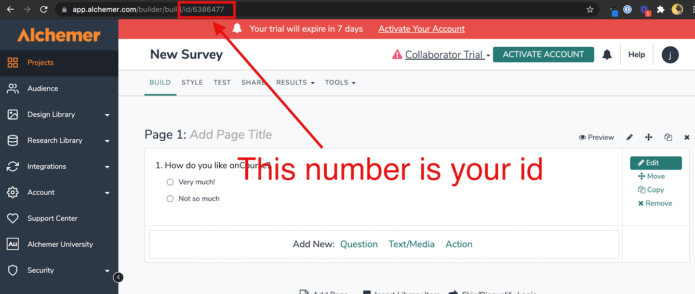

[[externalintegrations-cloudassess]]
==== Cloud Assess

Cloud Assess is an online service for managing the assessment process.
It can be used for VET and non-VET enrolments, and can be used by tutors to help manage classroom based assessments as well as online assessments.

When you create an account with Cloud Assess ask for the different user names and keys shown in the image.
Then enable the script "cloudassess course enrolment create" in order to automatically push enrolments in onCourse into Cloud Assess.
This script assumes that you'll create a course in Cloud Assess with the same course code as the course in onCourse.
If there is no matching course in Cloud Assess then the script will do nothing.
Of course you can modify the script to suit your own specific needs.
Remember that the name of the integration here must match the name given within the script.

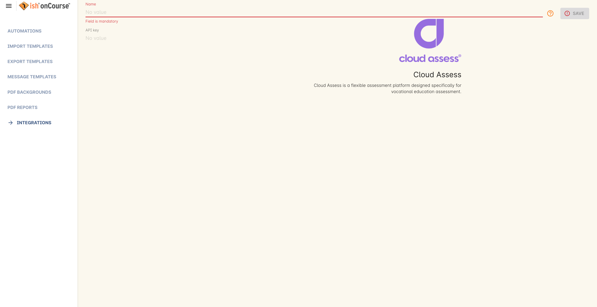

Once these preferences have been defined you will need to enable the Cloud Access script to automate the process.
This script can be found by going to Automation, double clicking on 'cloudassess course enrolment create' then click on the 'Enabled' check box and save.

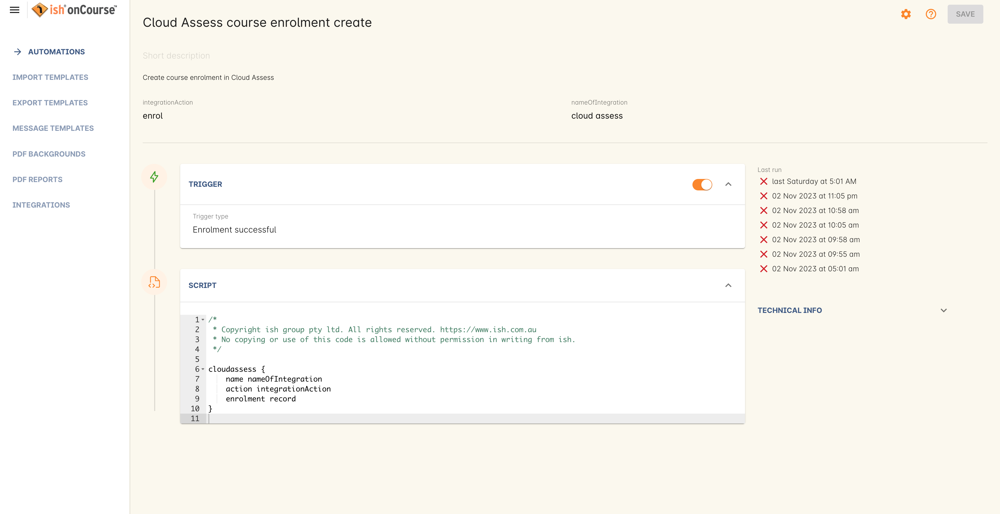

[[externalintegrations-canvas]]
==== Canvas

Canvas is an open-source learning management system for delivering training to students.
This integration allows you to automatically make enrolments, classes and students using information you've already entered into onCourse.
There is quite a bit of setup work for this integration, so ensure you are following the instructions precisely.

It's recommended that before you begin this integration, you get in touch with us via Support first.

image:images/canvas_integration.png[ Canvas Integration window,scaledwidth=100.0%]

To use the onCourse integration with Canvas, you will first need to have set up a developer key in Canvas itself.
You can find instructions on how to do this here -
https://community.canvaslms.com/docs/DOC-12657-4214441833

You can find some more developer-oriented information about Canvas developer keys here -
https://canvas.instructure.com/doc/api/file.developer_keys.html.

You will also need to have the relevant courses and classes set up in Canvas.
Canvas uses slightly different terminology here; courses are still 'courses', but classes are known as 'sections'.
You'll need to ensure that every course and class you want captured by the integration is duplicated in both Canvas and onCourse.
However if you cannot set up every class, in the Canvas script there is a value that, when set to true, can create new sections (classes) if one does not exist for the equivalent course in onCourse.

When setting up a course in Canvas, it must use the same course code as the equivalent class in onCourse.
Similarly with classes, all sections in Canvas must use the same code as the equivalent class in onCourse.
E.G. if you set up a course with the code CWC101, and it has one class (that you don't edit the code of), then the course code would be CWC101 and the section/class code would be CWC101-1.

Once every course and class is created in both systems, create a tag in onCourse.
The tag must be set to Courses, and it must be called 'Canvas'.
You must set this tag on each course that's to be included in the integration.

As soon as you've got your developer key, you can continue with the integration in onCourse:

. in onCourse, go to Automation
. Click the green + button next to the Integrations header in the left-hand column of the window that opens
. Find the Canvas integrations and select 'Add'
. Enter the URL of your Canvas instance.
This will look like following -
https://my_canvas_instance.instructure.edu.au/ - where 'my_canvas_instance' would be personalised with the name you gave it during initial set up.
You also need to enter your client id, and the client secret from your developer key.
+
The account ID is the id number that corresponds with the account you wish to enrol students into.
You can find this by logging into Canvas, then navigating to the left-hand menu bar.
Select Admin > then select your account.
This will open an accounts page.
The account ID will be listed in the site's URL e.g. if the URL is
https://my_canvas_instance.instructure.edu.au/accounts/36 then you would enter 36 as the account ID, and only that number.
You don't enter the URL.
. Once you've completed filling in the expected fields in onCourse, a button labelled 'Configure' will appear.
Click this and a pop-up window will appear, asking you to log in to Canvas and authorise onCourse to integrate with your account.

Canvas login window.
This window can appear differently depending on the user

Lastly, you'll need to turn on the integration script.
You can do this by going to Automation, and enabling the 'Canvas Enrol' script.
Make sure you hit the Save button before closing the window.

[[externalintegrations-micropower]]
==== Micropower

This integration allows for a connection between a Micropower (MPower MSL) based system and onCourse.
To use this integration, you'll need to have your own Micropower instance.
Each field in the integration window should map directly to a similarly named field in your Micropower system.
Copy each field from your Micropower system into the corresponding field within onCourse, and ensure you activate the Micropower integration script in the Scripts section of the Automation window.

image:images/mpower.png[ Micropower Integration window,scaledwidth=100.0%]

[[externalintegrations-USI]]
==== USI

This integration connects your onCourse system to the USI Agency so that onCourse can automatically verify a student's USI number.
This section will detail how you can activate this integration.
If you wish to learn more about the basics of how the USI functions in onCourse, you can read more in our dedicated link:uniqueStudentIdentifier.html[USI chapter]
here.

image:images/usi_integration.png[ USI Agency Integration window,scaledwidth=100.0%]

Follow the below steps to activate the integration:

. Go to this link to request access to the USI System Registry -
https://www.usi.gov.au/training-organisations/set-access-usi-registry-system.
This is only required if you've never registered with the USI Agency before.
. Register a MyGovID. Please note that myGovID is not the same MyGov.
**IMPORTANT:**When you create a MyGovID, it is for you as an individual, not for the organisation.
. Link your RTO to your myGovID with the Relationship Authorisation Manager - https://authorisationmanager.gov.au/.
Once logged in, choose the "Link your business" option.
The business you link must use the same ABN as is set in your Preferences > College section.
. Log into onCourse and go to the Automation window, then scroll the left hand column until you see the Integrations header.
Click the +
button next to he header, then select 'Add' under the USI integration listing.
This will create a new USI integration.
. In the new Integration screen you'll see two numbers; a Digital Software Provider number and a Software ID number, as well as some text with an embedded link.
The Software ID number will be unique to your system.
Make a note of these two numbers.
Click the link and it will take you back to the Relationship Authorisation Manager.
+
[NOTE]
====
DO NOT use the Software ID from the image above as it is only an example and will not work.
====

. Click on the "Entity name" which is your RTO.
. In the top menu, click on 'Manage Notifications', then click 'Add Notification'.
. In the 'Digital Service Provider ABN' field, enter the following Digital Software Provider number '74073212736', and then click the magnifying glass icon.
You will see the company ISH GROUP PTY LTD.
Confirm this.
. Enter the Software ID from the USI Integration window in onCourse and confirm.
. The entry you just added should now diplay as "Active".
It should look like the screenshot below.

==== VET Student Loans

This integration feeds data from onCourse directly into the HEIMS data collection system (sometimes called TCSI).

==== Google Classroom

Google Classroom is mission control for your classes.
As a free service for teachers and students, you can create classes, distribute assignments, send feedback, and see everything in one place.
Instant.
Paperless.
Easy.

image:images/google_integration.png[ Google Classroom Integration window,scaledwidth=100.0%]

To create a new Google Classrooms integration you'll require a Google client id, and a client secret.
Once you have both of these from Google, Follow the next steps:

. in onCourse, go to Automation > Integrations and click the green +
button next to the Integrations heading
. Scroll down and click 'Add' in the Google Classrooms integration
. Enter a name for the integration at the top of the window
. Enter your Client ID and Client secret
. Click 'Get Activation Code' to get your activation code

==== Zoom Integration

This integration is a little different from others in that we haven't formalised it within the onCourse application.
We have, however, built a framework and process around sending Zoom Session links to students when they enrol in classes with Zoom Session ID's associated with them.
We do this through a combination of scripting, message templates and custom fields.
This guide will step you through the process in setting this up in your system.

This is a relatively simple version of this integration that doesn't involve using passwords, or alerting tutors etc.
This focuses solely on emailing students an email containing a specialised link that gives them access to their online class.
For anything more advanced, please get in touch with us at support.

You'll need to know the Zoom Meeting ID's for each class before students enrol for this integration to work.
Here's how to set it up:

. You'll first need to create a custom field.
Go to Preferences > Custom Fields and click the + button at the top of the window in the panel on the right.
. Enter the name "ZoomID" without quotes.
Record type is 'CourseClass'.
The custom field key must be unique, so enter something like "zoomIDkey".
Click Save.
. Now we'll need to create the message template.
Go to Automation > Message Templates and click the + button next to the Message Templates heading in the left column.
. Enter the name 'Zoom Link Email'.
Choose the type 'CourseClass', and choose message type 'Email'.
Enter a unique keycode, eg "zoom.link.email".
Next we'll need to add both the text and html versions of the email.
In the links below there is an example text and html template, feel free to copy and paste them in.
You can also edit this text to read how you'd like, although be careful not to erase any of the code used when editing.
+
*Text* -
https://gist.github.com/swinbanks/70225365d1dd9352fa4548855a07f799
+
*HTML* -
https://gist.github.com/swinbanks/7176c1bfcd6fff645ead80f0cea074ee
. In the Message Template, click the + button next to Options > select 'Text' > Enter the name 'subjectTxt' (enter it using that exact capitalisation) and then, below the field that is created, enter 'Zoom Invitation'.
. Click the 'Enable' swtich then click Save.
. Next, add the Zoom Meeting ID for each zoom session to the ZoomID field in each class.
How you manage this is up to you, but you should only do the final few steps once you are certain this is complete.
If you get this step wrong, then students could be emailed incorrect links, or not get link emails at all.
. Now we need to add the script.
Still in Automation, go to Scripts and click the + button next to the heading to create a new script.
. Give it the name 'Send Enrolment with Zoom'.
It will replace your current default 'send enrolment' script, so once we're done creating it we'll need to activate it, and then disable the old one.
Set the trigger type to 'On create and edit' and enter the entity name as 'Enrolment'.
+
Next, hit the black + button just next to the name of the new script, and select 'Script'.
Copy and paste the script from the following link into this field.
+
*Script* -
https://gist.github.com/swinbanks/2059bbaedb84f9c47fe4e3a29fc4aab6
. After pasting the script, click the 'Enable' switch and then click Save.
Then, scroll to your active 'send enrolment' script and disable it, then click Save.
You only want one enrolment script active at a time.
That should be all you need to do to activate this integration.
You can run a test enrolment through the system to ensure you get each email as expected.
You can also send the Zoom Link email to an enrolment any time you like by highlighting the enrolment/s, going to the cogwheel and clicking 'Send Message'.
Select the Zoom Link template and you'll see a preview on the right, then clicking 'Send'.

