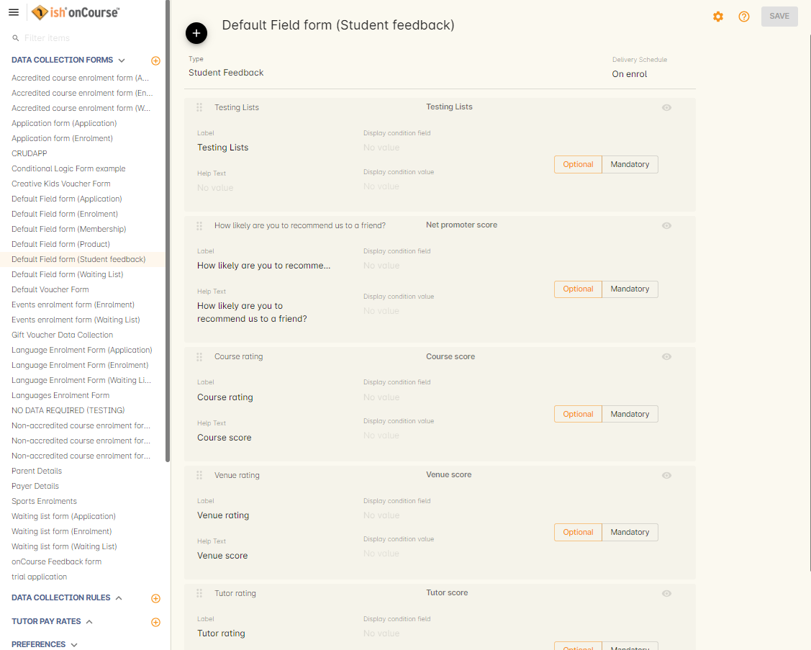
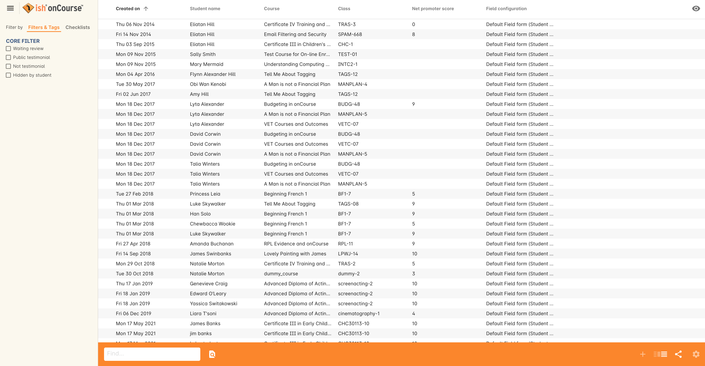

[[feedback]]
== Feedback and Surveys

=== Class completion surveys in onCourse

The onCourse student feedback and survey tool is designed to capture some simple data that can be used to track the rating of your courses, venues and tutors over time, by rating them out of five.
In addition, the students can complete a Net Promoter Score (rating out of 10) where they indicate how likely they are to recommend you to a friend and provide free-form text feedback you can use to improve your services or publish to the website as a testimonial.
You can also add additional questions of your own using custom fields, or delete any of the default questions should they be unwanted.

These Surveys can be set to display at set points through out a Course, or triggered 'on demand' via a custom script.
The students complete their survey response in the SkillsOnCourse portal, and tutors are able to see a feedback summary in their portal also.
More detailed views and reports regarding survey completion are available to admin users of the onCourse application.

image:images/feedback/feedback_positive.png[ Completed student survey,scaledwidth=70.0%]

=== How to Edit/Remove Survey Questions

To edit, remove, or add survey questions:

* in onCourse go to the Preferences window

* In the left hand panel, under 'Data Collection Forms', you'll find a form called *Default Field Form (Student Feedback)*

From here you can edit any of the Fields to say whatever you like.

Keep in mind that the 'Comment' block is only a free standing text block and should not be edited (however it can be deleted), while all other blocks ask for a Star Rating.

=== How to Add Custom Survey Questions

You can add your own custom questions to the survey by using the Custom Fields section.
These questions will not use the same format as the default questions and don't display the Stars to respond with, instead adding a free text field for users to type their answers in, or a drop down menu with pre-entered answers you can set when creating the field.
To add a question:

* in onCourse go to the Preferences window
* Scroll the left-hand panel to the bottom and click *Custom Fields*
* Hit the *(+)* button to add a new field and set the Record Type as 'Survey'

The beginning of creating a new Custom Field for a survey

* Name the field the question you wish to ask i.e. Rate the relevance of the provided course materials
* If you wish to have pre-prepared answers for students to choose from, enter these answers into the Default Value field and separate them with a semi-colon (;)
* The custom key you choose must be unique.
Make the Custom Key something short and simple to reference later and enter it here.

=== Requesting Feedback from Students

You can now request feedback from students at different points during a course:

* *On Enrolment* - This will make the survey available to students upon enrolment into a course.
The survey should be included in the 'enrolment confirmation' email sent by the default enrolment confirmation script.
* *On Start* - This will make the survey available from midnight the day the class begins
* *Midway* - This will make the survey available from midnight closest to the middle between the start and end dates
* *At Completion* - This will make the survey available from the moment the last session of the class is completed
* *On Demand* - This setting will require a custom script to define the time's at which this survey will be sent to student's to fill out.

There are two default scripts and associated templates available as standard to communicate survey completion requests to students.
These can be modified as required to suit your business requirements.
More information about onCourse customising scripts can be found in
link:scripts.html[the Scripts chapter].

'Send Certificate created notification' and 'Send class completion survey' both send a loginless link using the parameter $\{enrolment.student.getPortalLink(enrolment)}.
This link has a default time-to-live of 7 days, meaning that if the user clicks the link in the email within 7 days of it being sent, they can complete the feedback survey without logging in.
You can extend the time to live by adding an additional parameter e.g. $\{enrolment.student.getPortalLink(enrolment, 30)} means the link lasts for 30 days before login is required.

By default the scripts trigger the day after the final class session, allowing you to collect feedback as soon as practical after the event is over, however if you change this setting within the form, it will send at the corrected time.

=== Completing the survey - Student Portal View

When the student clicks on the survey link in a email, they are taken directly to the class page where they can see their attendance results and click on the feedback link to complete the survey.
By default the feedback link shows as five unfilled stars if the student has not yet provided a response.

When the student clicks on the Feedback stars, the Survey element expands.
The response to the first question displayed 'How likely are you to recommend us to a friend', also known as a Net Promoter Score, determines the text that appears in the free text field.
If the student provides an NPS of 7 or less, then the field text is 'Please tell us how we could have improved your experience'.
If the NPS is greater than 7, the label switches to 'What did you most enjoy about your experience'.

The responses in the >7 range are most likely to be those useful for marketing testimonial data, while responses in the =< 7 range will become quality improvement opportunities.
Best practice recommends you close the loop for Net Promoter Scores of 6 or less, and actively follow up with the customers who provide negative feedback, using it as an opportunity to turn a detractor into a promoter.

If a student has not been sent a link to the survey, they will see a link to complete a survey for their last completed class when they first log in to the portal.
This link is will display in a dashboard element.
Clicking this link will take them to the same page as clicking the direct link from an email.

=== Viewing survey results - Tutor Portal View

When tutors log in to their skillsOnCourse portal they can see the feedback results from their class, with the results showing the average responses for the starred ratings.
There is no student identifying data displayed to the tutors, in relation to student feedback.

=== Viewing survey results - onCourse, exports and print reports

Feedback received can be viewed within onCourse by typing 'Feedback' into the Find Anything search on the Dashboard.
The search result will say 'Student Feedback'.

The advanced search will allow you to build complex searches on survey results, i.e. search for net promoter scores over 8, or venues with a score under three.

You can export the results into spreadsheet or business intelligence programs using the Student Feedback CSV export.

Using the find related function from within the Feedback list view, you can jump to related records associated with the class feedback.
In others list views, such as classes, courses, tutors, sites you can use the find related function to view all the feedback for that record.

There are three reports currently available from the class list view for feedback called 'Course Completion Survey', 'Course Completion Survey Summary' and 'Course Completion Survey Tutor'.
Examples and instructions on how to print these reports can be found in link:#reports[???]

=== Editing and approving feedback for online testimonial use

By default, all new feedback responses will be classified as 'Waiting review' so you can then review the comment and mark it as 'not testimonial' i.e. it is feedback you will use for quality improvement processes or set it to 'public testimonial' to use the feedback in your marketing materials.

When a testimonial is set to 'public testimonial' the comment made by the student is copied into the testimonial field, so you can edit it as needed to remove any spelling or grammatical errors or remove personally identifying data they may have inadvertently included.

Only feedback set to 'Public testimonial' status will be included in the testimonials visible within the course description on your website.

[NOTE]
====
The website takes a random selection of three testimonials each time the course page is refreshed.
====

=== Student Testimonials in web marketing copy

Testimonials set to 'Public testimonial' status will automatically be included in the course marketing copy on your onCourse website.
If more than one testimonial exists for the course, the testimonials will auto scroll or can be scrolled through by the website visitors.
This content is visible on the course page only - it is not shown in the course list views or on class pages.

