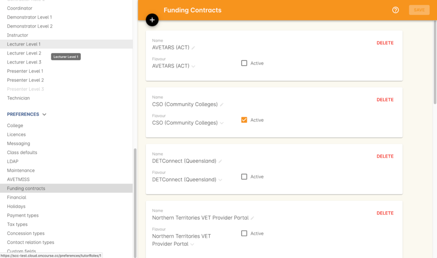
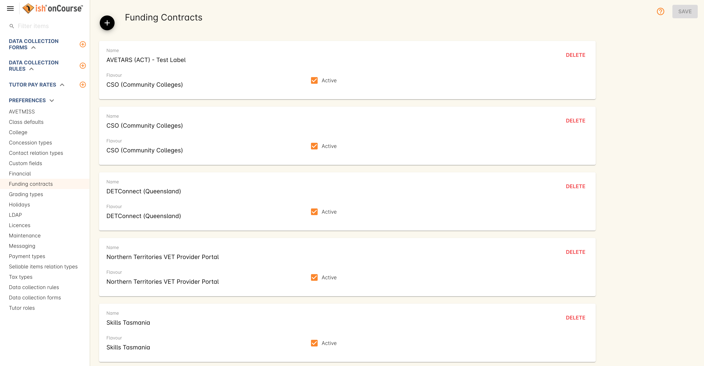

[[fundingContract]]
== Funding Contracts

[[fundingContracts-whatIs]]
=== What are Funding Contracts?

Funding Contract allows you to connect additional funding to an enrolment.
Whether this is from a state funding source or private agreement, funding contract allows you to create a default payer and payment that will be used to fund all or part of an enrolment.
It allows you to easily locate a report on one or more funding contract types to your funding agency.

Funding contracts encompass state funding sources linked to Smart and Skilled or CSO, but also allows you to set up custom funding contracts.
The funding contract can also be linked to the AVEMTISS Reporting type required for that contract.

[[DefaultFundingContracts]]
=== Default Funding Contracts

onCourse has created default templates for the State based funding contracts, and integrated them with your AVETMISS reporting options.
On higher level subscriptions, you are able to create custom funding contracts for any source of funding that supports the student enrolment, such as grants, department co-payment or even private contracts with large organisation.

All subscribers have access to the make the default funding contracts active.
Default funding contracts are available for the major state funding sources.

[[fundingContracts-enable]]
==== Funding Contracts and AVETMISS exporting

Many Funding Sources have their own reporting requirements, and for State Training Authorities, this is often a modified version of the AVEMTISS standard.

AVETMISS reporting is discussed in detail in our <<AVETMISSreporting, AVETMISS Reporting>> chapter.

State funding contracts often have their own reporting requirements.
You should contact the relevant department for your state to learn more about their specific requirements.

==== Funding Contract List View

To view the funding contract list view, go to the Preferences window, then scroll the left-hand panel until you see Funding Contracts.

==== Activating a default funding contract

To activate a default funding contract, open the funding contract list view and then double click on the funding contract you wish to activate . Tick the box 'Active' to active the contract and then save.

==== Adding the default Funding Contract to a class

Once a Funding Contract is active, you can add it as a default funding type to the class.
If you add the funding contract at the class level all new enrolments in the class will have the funding contract added to their enrolment, but any existing enrolments will need to have their changes confirmed.
A pop up will ask you if you want to change any associated enrolments.
You can remove the Funding Contract from individual enrolments if needed, for example, if a fee for service student joins a class that which is funded under CSO.

The funding contract drop down on the class will only let you select from active contracts.

If you tick 'Assign the same value to the VET Fields' when you duplicate a class, the funding contract will be duplicated to the new class.

Changing the funding contract on a class will not change the funding contract applied to any enrolments already processed.
It will only apply to enrolments created after the change is made.

The default funding contract setting for all new classes is 'Fee for service (non-funded).' By default these enrolments will export using the AVETMISS standard flavour.

http://www.ish.com.au/s/onCourse/doc/latest/manual/courses.html[More
instructions on how to create a course]

http://www.ish.com.au/s/onCourse/doc/latest/manual/classes.html[More
instruction on how to create classes]

==== Adding or Editing the Funding Contract on an Enrolment

Once a Funding Contract is active, you can add to an enrolment on the General Tab of the enrolment record.
An enrolment will have the Funding Contract that was active on the class record at the time the student was enrolled.

The Funding Contract drop down on the enrolment will only let you select active contracts.

http://www.ish.com.au/s/onCourse/doc/latest/manual/processingEnrolments.html[More
instruction on how to enrol students]

==== Searching for Funding Contracts

In the enrolments and classes list view, you can use a search query to find any records with the associated funding contract.
For enrolments you'd use: 'relatedFundingSource.flavour is ' and then select a flavour drom the drop down list that will appear when entering this into the search.

=== Creating custom Funding Contracts

If your subscription allows you to create a custom Funding Contract, you can create them in the Funding Contract section in the General Preferences window.

You may use this feature to create different contracts for specific program types, for funding streams within state funding, or for additional funding sources outside the normal state contracts, such as grants or commercial agreements.

To create a new contract, click on the "+" button to create a new record.

You will need to name the funding contract appropriately.
It's a good idea to include the type of funding or source.

If there is a reporting requirement you can select the AVETMISS Flavour appropriate to the funding type.
If there is no specific flavour you should select NCVER (AVETMISS Standard) as the AVETMISS Flavour.

Lastly, you need to ensure the Active box is checked, otherwise the funding contract won't be available for selection in the application.

Click save to complete the new contract.

