[[generalPrefs-Terms]]
== Preferences

The Preferences screen is where you set up the basic administration functions of onCourse, providing the area for initial set up. Any changes made to any parameters on this screen need to be saved by hitting the 'Save' button in the top right or the window.

It's also where your Data Collection Forms, Data Collection Rules, and Tutor Pay Roles are defined. You can learn more about those specific functions by viewing the <<dataCollection, Data Collection chapter>> or the <<payroll, Payroll chapter>>.

Click on the (?) in the window header to open the onCourse manual, or to view the audit trail. The audit trail allows you to view a record of changes to records in your system at any one time.

You can find specific sub-sections within this window by using the Filter items search at the top of the left-hand column.

College::
The college preferences allows you to input your organisations name, ABN and website URL.
Licences::
The licences preferences are an important part as it displays what kind of features your organisation have available (depending on which support plan you have)
Messaging::
The messaging preferences allows you to set preferences for mail.
Class Defaults::
These preferences allow you to set the defaults for minimum and maximum number of places, the delivery mode and funding source of a Class.
LDAP::
Stands for Light Directory Access Protocol and allows users to be authenticated by either LDAP or AD (Active Directory). If you don't know what this is, then you definitely don't need it.
Maintenance::
The maintenance preferences allows you to set backup preferences and change whether you would like automatic logout on or not.
AVETMISS::
Stands for the Australian Vocational Education and Training Management Information Statistical Standard which is the national reporting standard for Australian Registered Training Organisations, it is essential that these fields are all filled out fully and correctly as it is a major part of AVETMISS reporting.
Financial::
The Financial preferences is where you set such things as what currency and local tax that is being used, amongst what default accounts to use.
Funding Contracts::
onCourse has created default templates for the state-based funding contracts, and integrated them with your AVETMISS reporting options. You are able to create custom funding contracts for any source of funding that supports the student enrolment, and enable/disable default funding contracts.
Grading types::
This is where you can create or edit the grading types used for scoring assessment submissions.
Holidays::
These preferences allow you to add Holidays (unavailabilities) for your whole business timetable and scheduling availability.
Payment types::
The payment types preferences allows you to define what payment methods you want to use.
Tax types::
The Tax types preferences allows you to define the Tax options you can use.
Concession types::
This is where you can define what concession types your students are able to use.
Contact relation types::
The contact relation types preferences allows you to define what relationships you want to be able to link contacts together with.
Sellable items relation types::
The types of relationships you can set between courses and products.
Custom fields::
This is where you can add any new custom fields you want to appear in contacts records, along with the option to add them to the online Enrolment, Waiting List and Application questions.

[[generalPrefs-setting]]
=== Setting your General Preferences

To access the Preferences window in onCourse, from the Dashboard type 'Preferences' into the dashboard search bar.

[[generalPrefs-college]]
==== College

Once you're in the Preferences window, click on the College option to see the College preferences.

[TIP]
====
Entry fields coloured red are the only places that need information entered in order to activate onCourse. Not coloured fields do not require any data to be entered; they are optional, and the onCourse system will run smoothly if they are not filled in. The red will go away once you have entered your information correctly and pressed enter. If the box does not change from red then you will need to review your information and try entering again.
====

. On the Services tab, Enter the College Name e.g. Rosewood College. This is a required field and you will not be able to proceed with the set up process without first entering a college name.
. To the right enter the ABN e.g 18 123 456 789
. Now enter the College Website URL e.g. rosewoodcollege.com.au
. The default server timezone will be set to Australia/Sydney. If you are in another timezone, please set it accordingly. This will affect when your automated scripts will run, as the cron time set for various scripts are referencing your server time zone.

[[generalPrefs-licences]]
==== Licences

The licences preferences tab shows you what onCourse features are enabled or are inactive. Features available here will match the level of onCourse plan your college is on. If there are features in onCourse you'd like access to but currently do not, get in touch with us to ask about upgrading your plan.

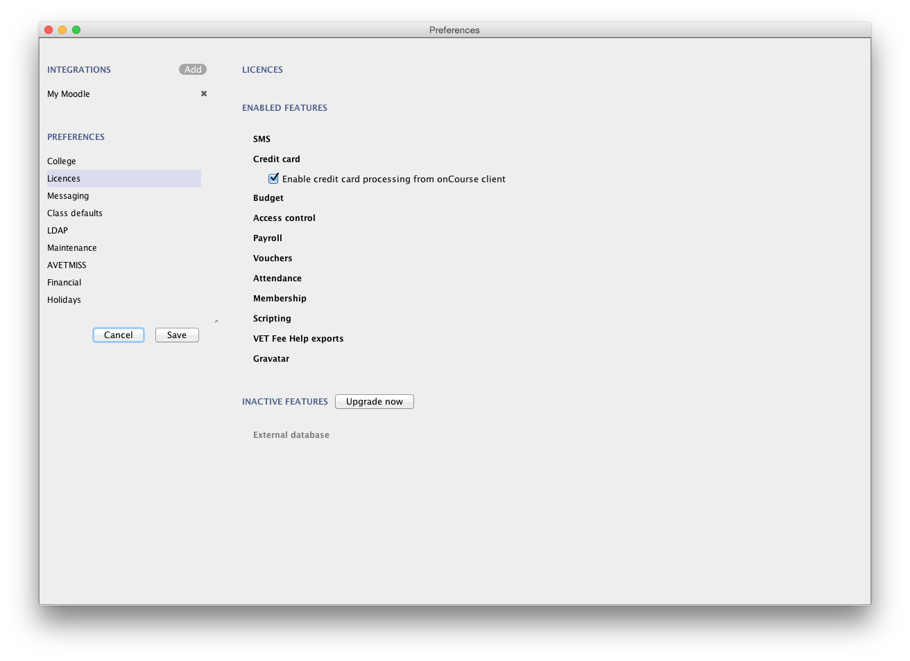

[[generalPrefs-merchantId]]
===== Linking your credit card merchant ID

In order to use the onCourse integrated credit card gateway you need to contact ish with your merchant details from your bank. ish will be able to then link your account to onCourse and provide a quick way to take payments both in the office, and your onCourse powered website.

* You'll need to determine with your bank/acquirer whether your new or existing merchant account supports and has “auth” transaction types enabled.
* Contact ish on 02 9550 5501 or email sales@ish.com.au if you have any further questions or need assistance with this process.

[[generalPrefs-messaging]]
==== Messaging

onCourse makes it easy to send emails and SMS to the students and teachers that are listed on your contacts list. In order to do this you first need to configure the onCourse message settings.

. In the 'Email from name' field enter the address from which you want contacts to see that emails are sent from. i.e. info@rosewoodcollege.com.au
. The System Administrator Email Address is the address that undeliverable mail and bounces will go to (if you don't use VERP). You will need a valid email account that will be accepted by that mail server. You should contact your mail administrator to verify that these details are correct.
. Underneath is the emails queued notification. This field will notify you of how many emails are in the queue waiting to be sent. Say you are sending out a bulk email to prospective students to remind them of the start date of the new term, the number in this field will tell you how many emails have yet to be sent, i.e. how many remain in the queue.

Emails that are unable to be sent due to mail configuration errors will stay in the mail queue rather than be marked as failed on the sending attempt.
You cannot enter any data into this field.

===== Handing bounced emails (VERP)

VERP - Variable Envelope Return Paths is a feature which automatically handles bounced emails from onCourse. When this is enabled, emails are sent out with a special From address that looks like "bounces+124673@rosewoodcollege.com.au".

The Reply-To address is set normally with the standard from address you have defined in "Email from address", so a user can reply without any problems. The number after the plus sign is used to identify the Contact in onCourse to whom this email was originally sent: this is important because emails could be forwarded several times in remote mail systems, and the bounce may not come from the address you expect.

This "plus addressing" notation is a standard internet protocol and most mail servers support it. You simply define the base email account (e.g. "bounces@rosewoodcollege.com.au") and the mail server will ignore the part after the plus.

. If you wish to activate this function then tick the option, detect and process bounced emails.
. Enter the incoming mail server address (POP3) then enter the email address to where the bounced emails are sent e.g. bounces@rosewoodcollege.com.au.
. Enter the account name followed by the account password. This will be used to retrieve mail from that account by POP.

//image::images/messaging_tab.png[title='The "Messaging" preferences']

The SMS box enables you to send texts. You may want to text students a reminder for the new term start date or for a change of venue or contact tutors about their hours or pay.

[CAUTION]
====
Make sure to use a short text name in the 'SMS From' field. Do not use a phone number.
====

You can send bulk texts direct from the onCourse program. What you enter into the SMS from field is what the receivers of your SMS messages will see as the sender details. Make sure this is text-only. Phone numbers entered into this field are commonly rejected by the SMS provider platform.

[[generalPrefs-classdefaults]]
==== Class Defaults

The Class Defaults tab allows the user to set the defaults for minimum and maximum places in a given Class, as well as the delivery mode and funding source.

Note that these defaults can be manually overridden at the individual Class level.

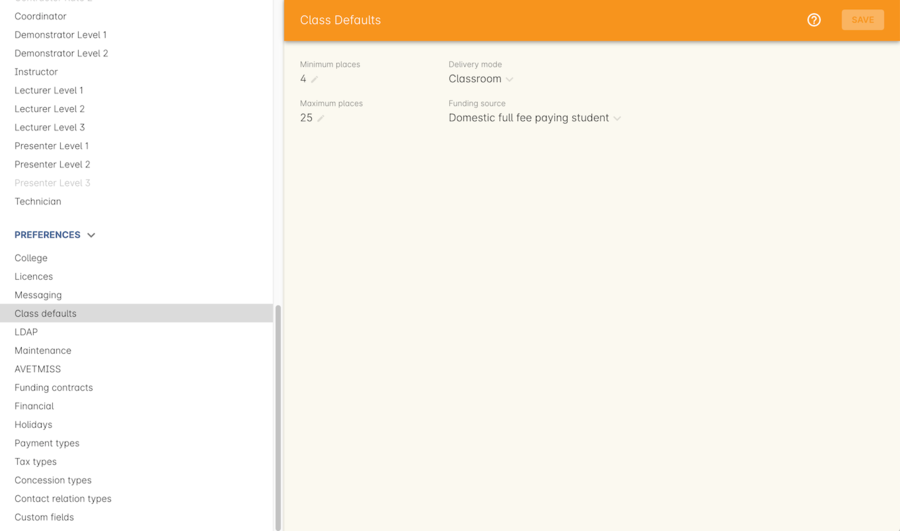

[[generalPrefs-ldap]]
==== LDAP

LDAP - stands for Light Directory Access Protocol and allows users to be authenticated by either LDAP or AD (Active Directory), tying your onCourse user accounts and log ins to the account and login details your staff use to access other IT resources on your network. This is a feature that is enabled as part of a purchased onCourse support plan. Contact us if you need help setting this up, it's generally something for your sysadmin.

[[generalPrefs-maintenance]]
==== Maintenance

The maintenance screen controls your system's automatic logout feature. You can set, in minutes, how much inactivity is allowed before the current user is logged out of the system. They will need to re-enter their username and password to gain access to the system again.

[[generalPrefs-avetmiss]]
==== AVETMISS

The AVETMISS screen is where you record your organisation's details that will be used for all AVETMISS report lodgements. If you are not an RTO you can uncheck Show RTO related screens and menus to hide windows in onCourse that aren't relevant to your organisation. You should still enter your organisation address and contact details in this window, even if you aren't an RTO as onCourse uses them to populate data in templated email messages.

. Enter your legal training organisation name
. Set your AVETMISS jurisdiction
. In the Identifier field enter your NTIS RTO id in the field
. Select a type of RTO from the Type drop down box
. Enter your organisations Address, Suburb, State and postcode in the appropriate fields.
. Optional contact details: Here you have the option to enter a contact name, a fax number, email address, telephone number, Full certificate signatory name, Queensland RTO id and Fee Help provider code.
. Set 'Only show offered Qualifications and Modules' checkbox (explained below)

[NOTE]
====
The Queensland RTO id is a code that all Queensland RTOs have to use when reporting their AVETMISS data, this is different from their training.gov RTO code.
====

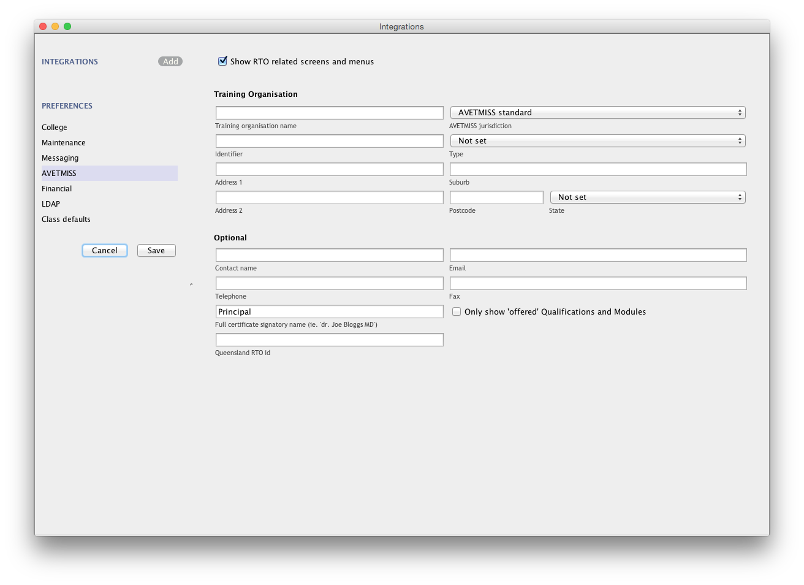

You can also choose to limit your staff to creating courses only from pre-approved units and qualifications that you mark within onCourse as 'offered'. This assists you in ensuring your AQTF requirements of only delivering current approved courses on your scope.

To use this feature, first flag those you are approved to deliver in the qualifications and module/units windows respectively, then come back to this window and check 'Only show 'offered' qualifications and modules'. We do not recommend checking this option as part of your initial setup as it will lock you out of all the embedded units.

If later, after building your courses and setting the units and qualifications on your scope as 'offered', you choose to come back here and select this option. This means for future courses created, the user will only be able to select from the units you have already marked 'as offered' during the course building process.

You can still make changes to any individual student's enrolment outcomes to add any unit from training.gov.au, even if you have this preference selected. You may need to access units not on your scope during a credit transfer process.

On this tab you can also set the signatory name and post-nominals. This name will print on the signature line for all onCourse certificate reports. If you leave it blank, the word 'Principal' will print.

[[generalPrefs-financial]]
==== Financial

Navigate here by going to the Preferences window, then scrolling the left-hand column till you see Financial, and clicking it.

The field at the top of the financial preferences called 'Invoice remittance instructions' allows you to define what instructions you want to provide to the payer on the Tax Invoice report. For reference, it uses the code $F\{pref.college.paymentInfo} in message templates.

Default accounts have been pre-selected, but you can make any changes necessary or edit the accounts to add or disable options.

Select the currency you wish to use and the default invoice terms in days.

If your college usually takes payment at the time of enrolment, then we suggest you leave the option 'Checkout payments default to $0' unchecked. If you usually invoice clients for payment, then select this option so you do not always have to override Checkout options.

You can also set up your default for your nominated Pre Paid Fees account, as well as determining whether the deferred income is transferred from your Pre Paid Fees Liability Account to your Income Account evenly across all Sessions of the Class. Or alternatively you can nominate to transfer all funds across after the completion of the first session of the Class. Refer to the chapter on <<accounting, Accounting chapter>> for more information about deferred income.

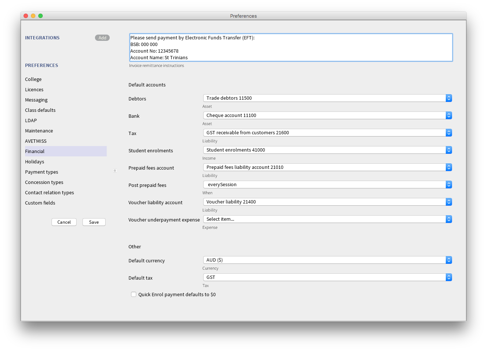

[[generalPrefs-fundingContractsPrefs]]
==== Funding Contracts

Funding Contracts is where you can set the Funding Contracts available for selection in your application. You can choose from the selection included with the application as well as creating your own (if you have either a standard or enterprise licence agreement). To ensure a funding contract is selectable within the application, make sure its 'Active' check box is checked.

if you have a Standard or Enterprise licence for onCourse, you can create your own funding contracts in this window. To create a new funding contract, click the black + button at the top of the window. This will create a new, blank record where you'll need to add a name, select the flavour (the rules used for AVETMISS reporting) and then check the Active check box to enable it.

Any funding contract within this menu with the Active check box disabled will not appear for use in the application.

You can learn more about <<fundingContract>>.

image::images/fundingcontracts_prefs.png[title='Funding Contracts in the General Preferences window']

[[generalPrefs-grading]]
==== Grading types

This feature ties in directly with assessment submissions and is where you can create, or edit, your own scoring models. You can learn more about grading types by going to our <<assessment-gradingTypes, Assessments chapter>>.

[[generalPrefs-holidays]]
==== Holidays

The holidays preferences tab is where you would add information about your business holidays. To add a new holiday simply click on the 'Add new holiday' button.

This feature is used to notify onCourse users when trying to schedule a class on a day/s that the business is closed. Below is an example of what the warning will look like.

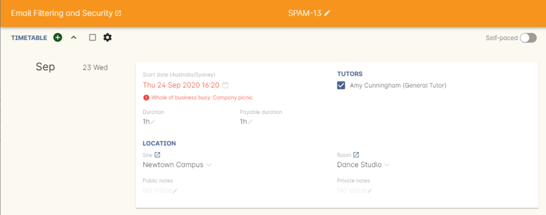

Every holiday has the following preferences:

* Description - This is displayed in the warning message shown to users to make sure its relevant.
* All day - this checkbox allows you to choose whether the holiday created is an all day event.
* Start - the date the holiday starts.
* End - the date the holiday ends.
* Repeat every - how often this holiday is repeated. The options you have here are:
** hour
** day
** week
** month
** year
** None
* End repeat - as long as you don't select 'None' in the 'Repeat every' dropdown box this dropdown option will appear. This option allows you to choose how many times the holiday is repeated before it stops. The options you have here are:
** Never
** After
** On date
* On date - this date field will only appear if you choose the option 'On date' in the 'End repeat' dropdown box. This option allows you to choose the date the holiday expires.

If a holiday is repeated, the next date/s will show in the 'Next' box.

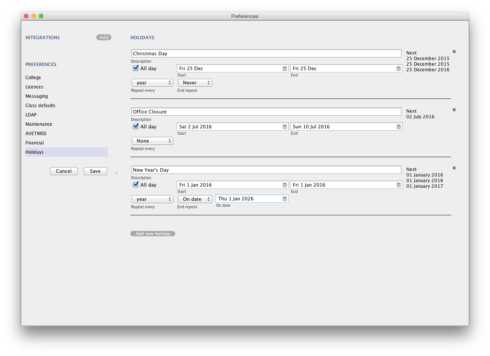

[[generalPrefs-paymentTypes]]
==== Payment Types

Navigate here by going to the Preferences window, scrolling the left-hand column till you see Payment Types, then clicking it.

You can create a new payment method by clicking on the '+' button at the top of the window. In this section there are several areas you have to define, these are:

* Name - this is what you want to call the payment method
* Active - this is whether you want the payment method to be active and used. You can mark payment types you do not accept e.g. cheque as inactive
* Banked Automatically - whether the money is banked into your chosen account automatically on receipt, such as credit cards and EFTPOS transactions, or needs to be manually banked as a part of a banking process
* Reconcilable - this is if this payment method should create records to reconcile
* Type - There are two types which have special meaning in onCourse - Credit card and Cheque, because additional information is collected at the time of payment in additional fields. All other payment methods should be of type Other.
* Undeposited Funds Account - this is the account that any unbanked payments of this method are deposited into
* Account - you can select which bank account the funds are deposited to on banking. By default, all payment methods are deposited into a single bank account, known as the deposited funds account.

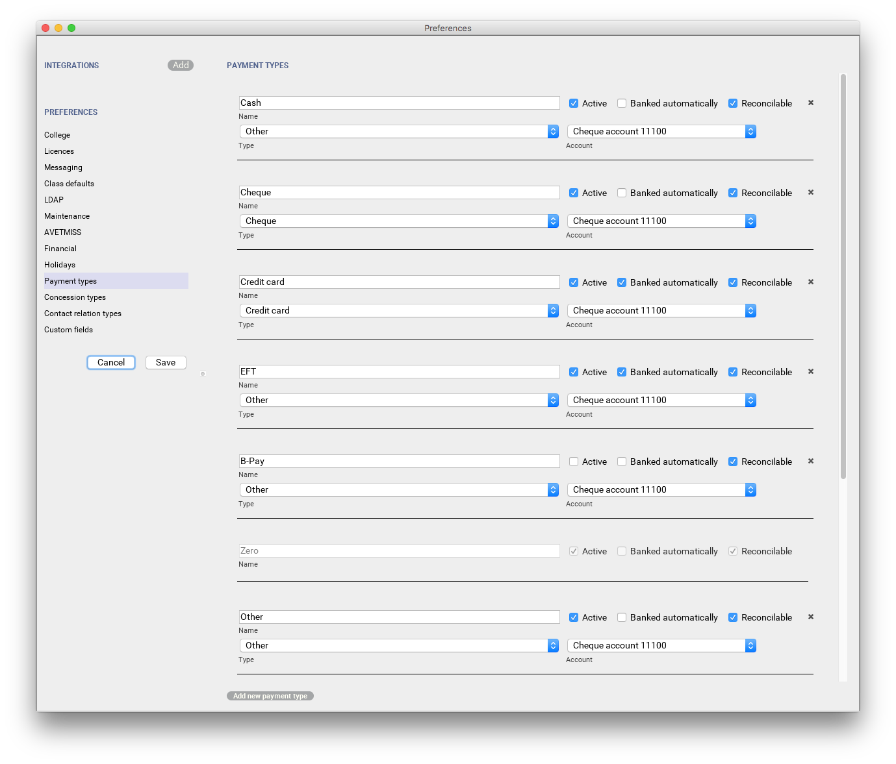

Some of the payment methods can't be edited, as noted by the greyed out fields. You can't edit them as they are internal payment methods with special meaning in onCourse and can't be changed. You will also see that if you try and edit the payment method 'Credit card' you can't change the 'Type' because this always has to be set as "Credit card'.

image::images/voucher_edit.png[title='Voucher payment type']

[[generalPrefs-taxTypes]]
==== Tax Types

Navigate here by going to the Preferences window, scrolling the left-hand column till you see Tax Types, then clicking it

You can create a new Tax Types by clicking on the '+' button at the bottom of the window. In this window there are several areas you have to define, these are:

* Tax code - this is what you see when trying to assign this tax type to a class, product, etc.
* Rate - this is the percentage that this tax type adds.
* GST - tick this checkbox if this tax type includes GST.
* Payable account - this is the account where the money gets paid to.
* Receivable account - this is the account where the money gets received.
* Description - this describes what the tax type is.

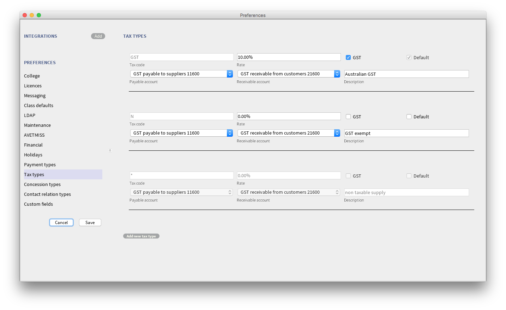

[[generalPrefs-concessionTypes]]
==== Concession Types

Navigate here by going to the Preferences window, scrolling the left-hand column till you see Concession Types.

Some concession types may be available for your students to add to their own record during the online enrolment process, for example a Senior's Card. Other types you may want to restrict to only allowing the concession to be added to the student record via the onCourse client, for example College Staff.

If you require an expiry date on the concession type, any discounts that apply to that concession type will not be available if the student's concession is expired.

You may also choose to make entering a card number mandatory. Please note onCourse is not able to validate the authenticity of card numbers due. This is an open test field (string type) and will accept letters and numbers. This field is useful for ensuring that only card holders self identify - you can use this data to conduct random spot checks if required.

Note that when you allow concessions to be added on the website, users must confirm they hold a current and valid concession. As we cannot perform validation against so many external systems, the application for concession online is an honor system. Over the years, our customers have reported very low abuse of this method, as in the education market clients generally attend classes face to face. Well written enrolment policies ensure that if a client cannot present in person the concession type they have claimed, then they will be billed for the full course fee.

Create a new concession by clicking the (+) button at the top of the window.

. Name your concession type. This name that the students or admin staff will use to identify this concession type when adding it to a student record.
. Choose if you want it to be available for self selection on the web. If you select this option, students can add this concession type to their record either during enrolment or via their student portal.
. Select if the concession requires a concession type number or an expiry date by checking the checkboxes. This makes supplying this information mandatory to save the concession record against the student's file.

Once you have created the concession type, go to the <<discounts, discounts chapter>> to define who can use it and how it can be used.

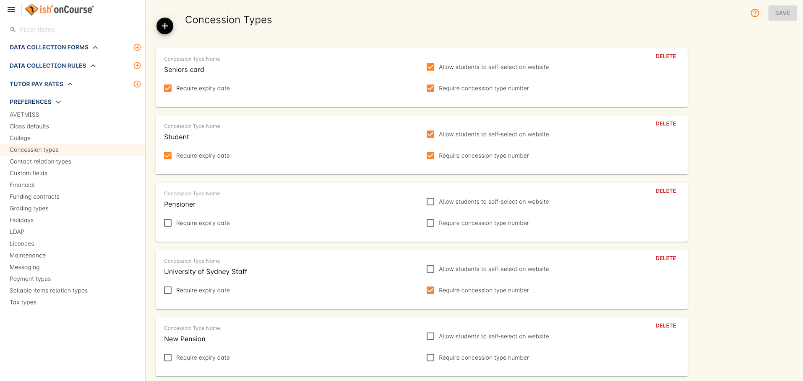

[[generalPrefs-contactRelationTypes]]
==== Contact Relation Types

Navigate here by going to the Preferences window, scrolling the left-hand column till you see Contact Relation Types.

To add or edit relationships, click on the (+) button at the top of the Contact Relation types window.

You can define how you relate contacts to each other via contact relation types. Some types are already defined by default, but you can edit or delete them as needed.

A special, non-editable relationship for 'Parent or Guardian' and 'Child' is used to collect the emergency contact details for minors enrolling via the web.

A relationship has two sides i.e. parent and child. Some times both sides will have the same name e.g. partner and partner. Relationships can be used to link contacts together for payment and enrolment purposes e.g. when an employer pays for their staff member, and also for marketing e.g. to define the HR Managers at companies you deliver training to, so you can promote up coming courses.

For each type of relationship you define you have the option of allowing the first type of contact to access the training record of the secondary type of contact via the SkillsOnCourse portal.

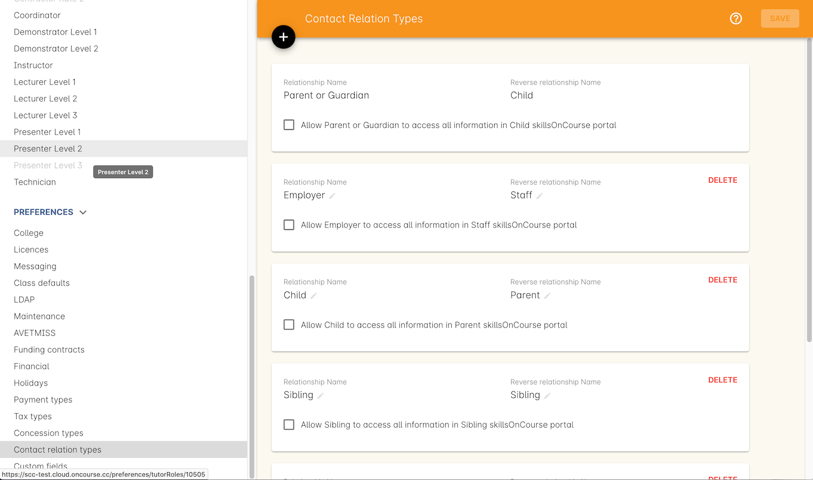

[[generalPrefs-customFields]]
==== Custom Field Types

Navigate here by going to the Preferences window, scrolling the left-hand column till you see Custom Fields. Click on the Custom Fields option in the left-hand panel.

To add a new custom field, click on the '+' button to the top of the window.

Custom fields are available for the following record types: Contact, Course, Enrolment, Application, Waiting List and Survey.
You can rearrange how the custom fields you create are ordered on this page by clicking on the grouped dots icon to the left of a custom field, then dragging it up or down to change the order.

Before you add a custom field to the database, consider how and when it will be used and which would be the best record type (entity) to link the custom field to.

For example, information you would only ask the student once that will stay near to the same over time belongs in the contact record, like the person's Driver's Licence, or alternate email address. Information that is specific to a particular enrolment or application process belongs in those records, for example, meal selection for a conference or application data collected for approval for a funded program.

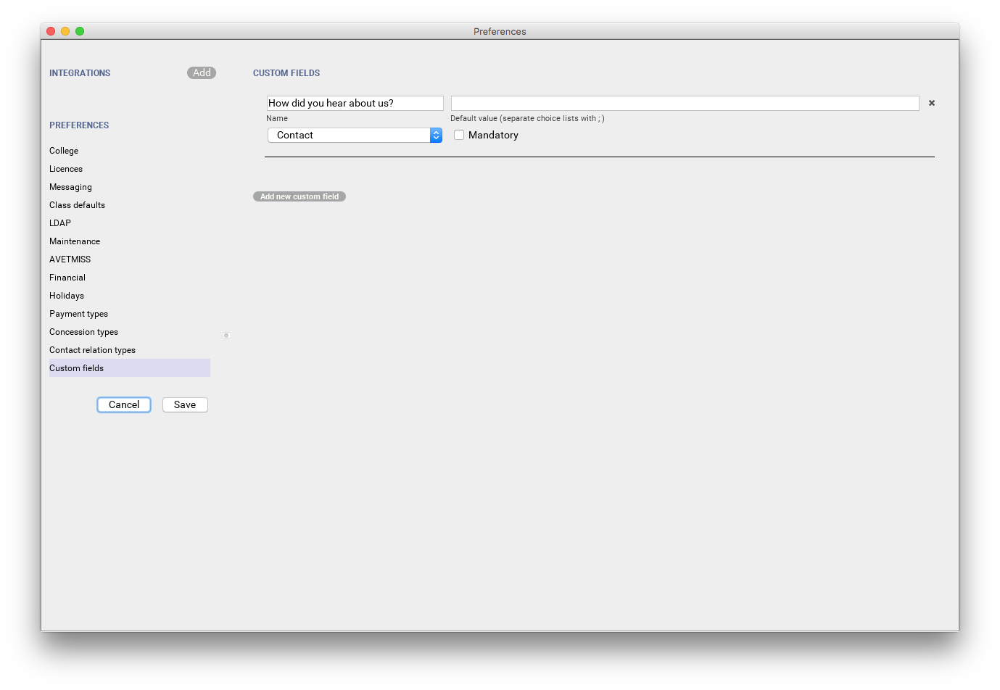

All custom fields are searchable. This allows you to create fields for, and record information, that is particular to your business. Custom fields can be made mandatory, but that means every contact in your database needs to complete the field before the record can be saved. Often the better choice is to make the completion mandatory on the form or forms where it applies. You can add as many additional fields as you need to, and they will display in the records in the order they have been added.

Each custom field has a key which is the code that is used to reference the custom field in exports and reports. For example, the custom field in the image below with key 'over18' can be referenced as a field in email template as

[source]
----
Is the student over 18? - ${contact.over18}
----

The same custom field can easily be added to exports using its key also:

[source]
----
"Is student over 18?"  :  contact.over18?.value
----

Custom fields can be of a number of data types: a checkbox, Date/Time, Date, Email, List, Long Text, Money, Map, Text or URL.

For example if you wanted to create a drop down list of options to choose from, use a list type. For some types, like Lists, this will add another field called 'Options', where you can set the options that can be chosen from the list. You can also add an 'Other' field which also gives the student the option to add text.

Where the custom field type is a boolean, they will always default to 'not null'. Text field can be empty unless set as mandatory.

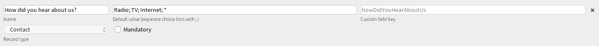

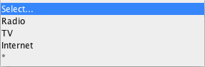

Custom fields added to contact, enrolments, applications, waiting lists or courses will appear on the record itself. Custom fields added to surveys will appear in Student Feedback.

[NOTE]
====
Any custom fields created will be added to the list of questions that can be added to the online enrolment process, waiting list and student feedback surveys. More information about this can be found <<dataCollection, here>>.
====

To delete a custom field, click the delete button. A pop-up will appear, and you'll need to type out the name of the custom field exactly in order to confirm its deletion. Deleting a custom field also deletes all the data contained within it, and cannot be reversed, so be absolutely sure you want to delete it before you do so.

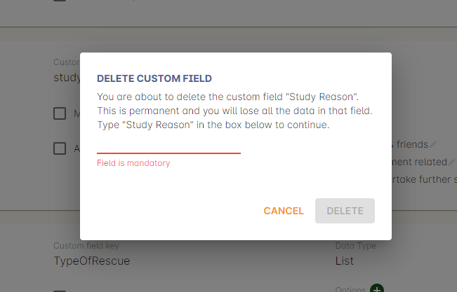
