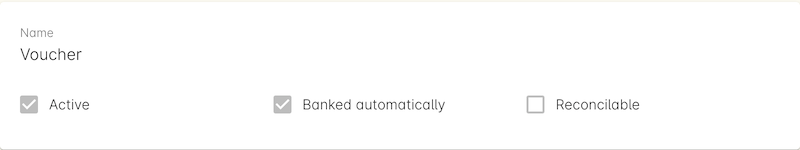

[[generalPrefs]]
== General Preferences

When you begin onCourse with a new database the setup process should
commence with you setting your general preferences.

[TIP]
====
You can save your changes as you work through the preferences sections
by clicking save This will also close the window, but you can open it
again from the Preferences window
====

[[generalPrefs-Terms]]
=== General Preferences Terms and Definitions

The Preferences screen is where you set up the basic administration
functions of onCourse. Starting here provides the initial set up for
onCourse. Any changes made to any parameters on this screen need to be
saved by hitting the 'Save' button in the top right or the window. It's
also where your Data Collection Forms, Data Collection Rules, and Tutor
Pay Roles are defined. You can learn more about those specific functions
by viewing the link:dataCollection.html[Data Collection chapter here],
or the link:payroll.html[Payroll chapter here].

Click on the (?) in the window header to open the onCourse manual, or to
view the audit trail. The audit trail allows you to view a record of
changes to records in your system at any one time.

You can find specific sub-sections within this window by using the
Filter items search at the top of the left-hand column.

College::
  The college preferences allows you to input your organisations name,
  ABN and website URL.
Licences::
  The licences preferences are an important part as it displays what
  kind of features your organisation have available (depending on which
  support plan you have)
Messaging::
  The messaging preferences allows you to set preferences for mail.
Class Defaults::
  These preferences allow you to set the defaults for minimum and
  maximum number of places, the delivery mode and funding source of a
  Class.
LDAP::
  Stands for Light Directory Access Protocol and allows users to be
  authenticated by either LDAP or AD (Active Directory). If you don't
  know what this is, then you definitely don't need it.
Maintenance::
  The maintenance preferences allows you to set backup preferences and
  change whether you would like automatic logout on or not.
AVETMISS::
  Stands for the Australian Vocational Education and Training Management
  Information Statistical Standard which is the national reporting
  standard for Australian Registered Training Organisations, it is
  essential that these fields are all filled out fully and correctly as
  it is a major part of AVETMISS reporting.
Financial::
  The Financial preferences is where you set such things as what
  currency and local tax that is being used, amongst what default
  accounts to use.
Holidays::
  These preferences allow you to add Holidays (unavailabilities) for
  your whole business timetable and scheduling availability.
Payment types::
  The payment types preferences allows you to define what payment
  methods you want to use.
Tax types::
  The Tax types preferences allows you to define the Tax options you can
  use.
Concession types::
  This is where you can define what concession types your students are
  able to use.
Contact relation types::
  The contact relation types preferences allows you to define what
  relationships you want to be able to link contacts together with.
Custom fields::
  This is where you can add any new custom fields you want to appear in
  contacts records, along with the option to add them to the online
  Enrolment, Waiting List and Mailing List questions.

[[generalPrefs-setting]]
=== Setting your General Preferences

To access the Preferences window in onCourse, from the Dashboard type
'Preferences' into the Find Anything search bar.

[[generalPrefs-college]]
==== College

Once your in the Preferences window then click on the College option to
see the College preferences.

[TIP]
====
Entry fields coloured pink are the only places that need information
entered in order to activate onCourse. Fields coloured white do not
require any data to be entered, they are optional and the onCourse
system will run smoothly if they are not filled in. The pink coloured
box will change to white once you have entered your information
correctly and pressed enter. If the box does not change to white then
you will need to review your information and try entering again.
====

. On the Services tab, Enter the College Namee.g. Rosewood College This
is a required field and you will not be able to proceed with the set up
process without first entering a college name.
. To the right enter the ABN e.g 18 123 456 789
. Now enter the College Website URL e.g. rosewoodcollege.com.au
. The default server timezone will be set to Sydney Australia. If you
are in another timezone, please set it accordingly. This will effect
when your automated scripts will run, as the cron time set for various
scripts are referencing your server time zone.

The "College" preferences

[[generalPrefs-licences]]
==== Licences

The licences preferences tab shows you what features are enabled and
inactive. You need to purchase an onCourse support contract to enable
these additional features. onCourse is still fully functional as an
enrolment system without these services. If you have purchased an
onCourse support agreement we will enable the services for your plan.

image:images/licences_tab.png[ The "Licences" preferences
,scaledwidth=100.0%]

[[generalPrefs-merchantId]]
===== Linking your credit card merchant ID

In order to use the onCourse integrated credit card gateway you need to
contact ish with your merchant details from your bank. ish will be able
to then link your account to onCourse and provide a quick way to take
payments both in the office and your onCourse powered website.

* Visit this page
http://www.ish.com.au/oncourse/documentation/administrator-guide/internet-merchant-number-guide[here]
to learn how to request your merchant/terminal ID from your bank to
allow internet payments and see specific banking details for different
Australian banks.
* Contact ish on 02 9550 5501 or email sales@ish.com.au if you have any
further questions or need assistance with this process.

[[generalPrefs-messaging]]
==== Messaging

onCourse makes it easy to send emails and SMS to the students and
teachers that are listed on your contacts list. In order to do this you
first need to configure the email settings.

. It is important to configure an outbound mail server in order for
email from onCourse to be delivered. This includes enrolment
confirmations, invoices and other outbound messages. Enter the host name
or IP address of the mail server in Outgoing Mail Server Address SMTP.
Optionally you can add authentication settings if your mail server
requires it.
. In the Email from address enter the address from which you want
contacts to see that emails are sent from. i.e..
info@rosewoodcollege.com.au
. The System Administrator Email Address is the address that
undeliverable mail and bounces will go to (if you don't use VERP). You
will need a valid email account that will be accepted by that mail
server. You should contact your mail administrator to verify that these
details are correct.
. Underneath is the emails queued notification. This field will notify
you of how many emails are in the queue waiting to be sent. Say you are
sending out a bulk email to prospective students to remind them of the
start date of the new term, the number in this field will tell you how
many emails have yet to be sent, i.e.. how many remain in the queue.
Emails that are unable to be sent due to mail configuration errors will
stay in the mail queue rather than be marked as failed on the sending
attempt. You can not enter any data into this field.

===== Handing bounced emails (VERP)

VERP - Variable Envelope Return Paths is a feature which automatically
handles bounced emails from onCourse. When this is enabled, emails are
sent out with a special From address that looks like
"bounces+124673@rosewoodcollege.com.au". The Reply-To address is set
normally with the standard from address you have defined in "Email from
address", so a user can reply without any problems. The number after the
plus sign is used to identify the Contact in onCourse to whom this email
was originally sent: this is important because emails could be forwarded
several times in remote mail systems and the bounce may not come from
the address you expect.

This "plus addressing" notation is a standard internet protocol and most
mail servers support it. You simply define the base email account (e.g.
"bounces@rosewoodcollege.com.au") and the mail server will ignore the
part after the plus.

. If you wish to activate this function then tick the option, detect and
process bounced emails.
. Enter the incoming mail server address (POP3) then enter the email
address to where the bounced emails are sent e.g.
bounces@rosewoodcollege.com.au.
. Enter the account name followed by the account password. This will be
used to retrieve mail from that account by POP.

image:images/messaging_tab.png[ The "Messaging" preferences
,scaledwidth=100.0%]

The SMS box enables you to send texts. You may want to text students a
reminder for the new term start date or for a change of venue or contact
tutors about their hours or pay. You can send bulk texts direct from the
onCourse program. What you enter into the SMS from field is what the
receivers of your SMS messages will see as the sender details. Put in a
mobile number for people to reply to or, if you do not have an inbound
SMS number, you can put the name of your organisation. (e.g. 'Rosewood')

[CAUTION]
====
Only use a mobile number in this field if you have an inbound mobile
account intended for this purpose. If you use the name of your business
it will be clear to the receiver of your SMS who the message came from,
but they will be unable to press 'reply' on their mobile phone to send
you a response.
====

[[generalPrefs-classdefaults]]
==== Class Defaults

The Class Defaults tab allows the user to set the defaults for minimum
and maximum places in a given Class, as well as the delivery mode and
funding source.

Note that these defaults can be manually overridden at the individual
Class level.

[[generalPrefs-ldap]]
==== LDAP

LDAP - stands for Light Directory Access Protocol and allows users to be
authenticated by either LDAP or AD (Active Directory), tying your
onCourse user accounts and log ins to the account and logins your staff
use to access other IT resources on your network. This is a feature that
is enabled as part of a purchased onCourse support plan. Contact us if
you need help on setting this up. The "LDAP" preferences

[[generalPrefs-maintenance]]
==== Maintenance

The maintenance screen controls how often and where your data is backed
up. This feature is recommended for users who are not connecting
onCourse to an external server such as MySQL or SQL Server, as these
external servers have their own daily scheduled backup routines.

With the amount of information you will eventually have stored on your
onCourse program, the backing up of this data is essential. onCourse is
designed to enable you to schedule when and where the back ups take
place. You can also set onCourse to have an automatic logout. This means
that if onCourse is left open on the computer but no one is using it,
after a specified amount of time it will automatically logout and save
any recently entered data.

Prior to setting up your backup schedule, you need to determine which
folder location you are going to save these backup files to. It is
important to ensure that you save the backups on a different drive to
the one where you have installed your onCourse server, that way if your
hardware / drives do fail, your backup files are safe. You also need to
ensure that you create the folders that you have specified in the file
path, otherwise the backup files that are created will not be able to be
found.

[CAUTION]
====
Running an onCourse back up to a location on your server is not the only
step you need to take to secure your data. You should also make sure
that the backup file is saved to an offsite location on a regular basis
in case of hardware of other physical failure of your computer.
====

An example file extension for a Mac could be as follows:

/Users/Shared/

[Note: the Mac file path uses the Unix system of a forward slash to
separate directory and file components and make sure you have a forward
slash at the front of the file path].

An example file extension for Windows could be as follows:

C:\onCourse\backups\

[Note: the Windows backup directory uses a back slash to separate
directory and file components. It is also recommended that you do not
save your backups to your Program File folder within Windows as this is
not designed for data files].

. Navigate to the Preferences window and scroll the left-hand column
till you see 'Maintenance'
. Automatic Logout: This field is mandatory and allows no more than 360
minutes (6 hours). Place an amount of minutes e.g.; 15 to set the amount
of time onCourse can be left idle before it shuts itself down and saves
all recently made changes and additions.
. Server backup directory: type the Windows or Mac path to the folder
you wish to backup to as per the examples above.
. Backup time: choose the time you want to run a backup. We recommend a
time when the least amount of network traffic is occurring but with
enough time to complete the backup before the next work day starts.
. Maximum backups kept: choose how many backups you want to keep before
deleting the oldest ones.
. Next backup number: this is appended to the name of the backup file
and is automatically incremented on each backup. For example,
onCourseBackup_00001.zip
. Click "Save". Note that changes to the backup schedule may not take
effect until you restart onCourse server.

image:images/maintenance_tab.png[ The "Maintenance" preferences
,scaledwidth=100.0%]

[[generalPrefs-avetmiss]]
==== AVETMISS

The AVETMISS screen is where you record your organisation's details that
will be used for all AVETMISS report lodgements. If you are not an RTO
you can uncheck Show RTO related screens and menus to hide windows in
onCourse that aren't relevant to your organisation. You should still
enter your organisation address and contact details in this window, even
if you aren't an RTO as onCourse uses them to populate data in templated
email messages.

. Enter your legal training organisation name and from the drop down
menu typeselect by the type of training organisation.
. In the Identifier field enter your NTIS RTO id in the field.
. Enter your organisations Address, Suburb, State and postcode in the
appropriate fields.
. Optional contact details: Here you have the option to enter a contact
name, a fax number, email address, telephone number, Full certificate
signatory name and Queensland RTO id.

[NOTE]
====
The Queensland RTO id is a code that all Queensland RTOs have to use
when reporting their AVETMISS data, this is different from their
training.gov RTO code.
====

image:images/AVETMISS_tab.png[ The "AVETMISS" preferences
,scaledwidth=100.0%]

You can also choose to limit your staff to creating courses only from
pre-approved units and qualifications that you mark within onCourse as
'offered'. This assists you in ensuring your AQTF requirements of only
delivering current approved courses on your scope. To use this feature,
first flag those you are approved to deliver in the qualifications and
module/units table, then come back to this window and check Show only
'offered' qualifications and modules. We do not recommend checking this
option as part of your initial setup as it will lock you out of all the
embedded units.

If later, after building your courses and setting the units and
qualifications on your scope as 'offered', you choose to come back here
and select this option. This means for future courses created, the user
will only be able to select from the units you have already marked 'as
offered' during the course building process. You will need to restart
your onCourse server for this change to take effect.

You can still make changes to any individual student's enrolment
outcomes to add any unit from training.gov.au, even if you have this
preference selected. You may need to access units not on your scope
during a credit transfer process.

On this tab you can also set the signatory name and post-nominals. This
name will print on the signature line for all onCourse certificate
reports. If you leave it blank, the word 'Principal' will print.

==== Funding Contracts

Funding Contracts is where you can set the Funding Contracts available
for selection in your application. You can choose from the selection
included with the application as well as creating your own (if you have
either a standard or enterprise licence agreement). To ensure a funding
contract is selectable within the application, make sure its 'Active'
check box is checked.

if you have a Standard or Enterprise licence for onCourse, you can
create your own funding contracts in this window. To create a new
funding contract, click the black + button at the top of the window.
This will create a new, blank record where you'll need to add a name,
select the flavour (the rules used for AVETMISS reporting) and then
check the Active check box to enable it.

Any funding contract within this menu with the Active check box disabled
will not appear for use in the application.

You can learn more about how Funding Contracts are used in onCourse
link:fundingContract.xml[here, in our Funding Contracts chapter].

image:images/fundingcontracts_prefs.png[Funding Contracts in the General
Preferences window,scaledwidth=100.0%]

[[generalPrefs-financial]]
==== Financial

Navigate here by going to the Preferences window, then scrolling the
left-hand column till you see Financial, and clicking it.

Select the currency you wish to use and any local tax (e.g. GST) which
may apply.

Default accounts have been selected. Make any changes necessary or edit
the accounts to add or disable options.

If your college usually takes payment at the time of enrolment, then we
suggest you leave the option 'Quick enrol payments default to $0'
unchecked. If you usually invoice clients for payment, then select this
option so you do not always have to override Quick Enrol.

You can also set up your default for your nominated Pre Paid Fees
account, as well as determining whether the deferred income is
transferred from your Pre Paid Fees Liability Account to your Income
Account evenly across all Sessions of the Class. Or alternatively you
can nominate to transfer all funds across after the completion of the
first session of the Class. Refer to the chapter on
link:accounting.html[Accounting] for more information about deferred
income.

There is also a field at the top on the Financial preferences called
'Invoice remittance instructions' that allow you to define what
instructions you want to provide to the payer on the bottom left side of
a Tax Invoice report using the code $F\{pref.college.paymentInfo}.

image:images/FinancialPreferences.png[ The "Financial" Preferences
,scaledwidth=100.0%]

[[generalPrefs-holidays]]
==== Holidays

The holidays preferences tab is where you would add information about
your business holidays. To add a new holiday simply click on the 'Add
new holiday' button.

This feature is used to notify onCourse users when trying to schedule a
class on a day/s that the business is closed. Below is an example of
what the warning will look like.

Every holiday has the following preferences:

* Holiday Description - here is where you can name what you want the
holiday is called when appearing in error messages.
* All day - this checkbox allows you to choose whether the holiday
created is an all day event.
* Start - the date the holiday starts.
* End - the date the holiday ends.
* Repeat every - how often this holiday is repeated. The options you
have here are:
** hour
** day
** week
** month
** year
** None
* End repeat - as long as you don't select 'None' in the 'Repeat every'
dropdown box this dropdown option will appear. This option allows you to
choose how many times the holiday is repeated before it stops. The
options you have here are:
** Never
** After
** On date
* On date - this date field will only appear if you choose the option
'On date' in the 'End repeat' dropdown box. This option allows you to
choose the date the holiday expires.

image:images/holidays_tab.png[ The "Holidays" Preferences
,scaledwidth=100.0%]

[[generalPrefs-paymentTypes]]
==== Payment Types

Navigate here by going to the Preferences window, scrolling the
left-hand column till you see Payment Types, then clicking it.

You can create a new payment method by clicking on the 'Add new payment
type' button at the bottom of the window. In this window there are
several areas you have to define, these are:

* Name - this is what you want to call the payment method
* Undeposited Funds Account - this is the account that any unbanked
payments of this method are deposited into
* Account - you can select which bank account the funds are deposited to
on banking. By default, all payment methods are deposited into a single
bank account, known as the deposited funds account.
* Type - There are two types which have special meaning in onCourse -
Credit card and Cheque, because additional information is collected at
the time of payment in additional fields. All other payment methods
should be of type Other.
* Active - this is whether you want the payment method to be active and
used. You can mark payment types you do not accept e.g. cheque as
inactive.
* Banked Automatically - whether the money is banked into your chosen
account automatically on receipt, such as credit cards and EFTPOS
transactions, or needs to be manually banked as a part of a banking
process
* Reconcilable - this is if this payment method should create records to
reconcile

image:images/PaymentTypesPreferences.png[ The "Payment types"
Preferences ,scaledwidth=100.0%]

Some of the payment methods can't be edited and when you try and do this
all the fields will be greyed out, as seen below when you try and edit
the payment method 'Voucher'. The reason you can't edit them is because
they are internal payment methods with special meaning in onCourse and
can't be changed. You will also see that if you try and edit the payment
method 'Credit card' you can't change the 'Type' because this always has
to be set as "Credit card'.

[[generalPrefs-taxTypes]]
==== Tax Types

Navigate here by going to the Preferences window, scrolling the
left-hand column till you see Tax Types, then clicking it

You can create a new Tax Types by clicking on the 'Add new tax type'
button at the bottom of the window. In this window there are several
areas you have to define, these are:

* Tax code - this is what you see when trying to assign this tax type to
a class, product, etc.
* Rate - this is the percentage that this tax type adds.
* GST - tick this checkbox if this tax type includes GST.
* Default - tick this checkbox to make this tax type the default.
* Payable account - this is the account where the money gets paid to.
* Receivable account - this is the account where the money gets
received.
* Description - this describes what the tax type is.

image:images/PaymentTaxPreferences.png[ The "Tax types" Preferences
,scaledwidth=100.0%]

[[generalPrefs-concessionTypes]]
==== Concession Types

Navigate here by going to the Preferences window, scrolling the
left-hand column till you see Concession Types.

Some concession types may be available for your students to add to their
own record during the online enrolment process, for example a Senior's
Card. Other types you may want to restrict to only allowing the
concession to be added to the student record via the onCourse client,
for example College Staff.

If you require an expiry date on the concession type, any discounts that
apply to that concession type will not be available if the student's
concession is expired.

You may also choose to make entering a card number mandatory. Please
note onCourse is not able to validate the authenticity of card numbers
due. This is an open test field (string type) and will accept letters
and numbers. This field is useful for ensuring that only card holders
self identify - you can use this data to conduct random spot checks if
required.

Note that when you allow concessions to be added on the website, users
must confirm they hold a current and valid concession. As we can not
perform validation against so many external systems, the application for
concession online is an honor system. Over the years, our customers have
reported very low abuse of this method, as in the education market
clients generally attend classes face to face. Well written enrolment
policies ensure that if a client can not present in person the
concession type they have claimed, then they will be billed for the full
course fee.

. Go to Preferences -> Concession types
. Click the add button ( Add new concession type)
. Name your concession type. This name that the students or admin staff
will use to identify this concession type when adding it to a student
record.
. Choose if you want it to be available for self selection on the web.
If you select this option, students can add this concession type to
their record either during enrolment or via their student portal.
. Select if it the concession requires a number or an expiry date. This
makes supplying this information mandatory to save the concession record
against the student's file.

Once you have created the concession type, go to
link:discounts.html[discounts] to define who can use it and how it can
be used.

image:images/ConcessionTypesPreferences.png[ The "Concession types"
Preferences ,scaledwidth=100.0%]

[[generalPrefs-contactRelationTypes]]
==== Contact Relation Types

Navigate here by going to the Preferences window, scrolling the
left-hand column till you see Contact Relation Types.

You can define how you relate contacts to each other via contact
relation types. Some types are already defined by default, but you can
edit or delete them as needed.

A special, non-editable relationship for 'Parent or Guardian' and
'Child' is used to collect the emergency contact details for minors
enrolling via the web.

A relationship has two sides i.e. parent and child. Some times both
sides will have the same name e.g. partner and partner. Relationships
can be used to link contacts together for payment and enrolment purposes
e.g. when an employer pays for their staff member, and also for
marketing e.g. to define the HR Managers at companies you deliver
training to, so you can promote up coming courses.

For each type of relationship you define you have the option of allowing
the first type of contact to access the training record of the secondary
type of contact via the SkillsOnCourse portal.

To add or edit relationships, go to Preferences -> Contact Relationship
Types and click on the button 'Add new contact relation type'.

image:images/ContactRelationTypesPreferences.png[ The "Contact relation
types" Preferences ,scaledwidth=100.0%]

[[generalPrefs-customFields]]
==== Custom Field Types

Navigate here by going to the Preferences window, scrolling the
left-hand column till you see Custom Fields.

Click on the Custom Fields option in the left hand panel. To add a new
custom field click on the 'Add new custom field' button.

Custom fields are available for the following record types: Contact,
Course, Enrolment, Application, Waiting List and Survey. You can
rearrange how the custom fields you create are ordered on this page by
clicking on the grouped dots icon to the left of a custom field, then
dragging it up or down to change the order.

Before you add a custom field to the database, consider how and when it
will be used and which would be the best record type (entity) to link
the custom field to.

For example, information you would only ask the student once that will
stay near to the same over time belongs in the contact record, like the
person's Driver's Licence, or alternate email address. Information that
is specific to a particular enrolment or application process belongs in
those records, for example, meal selection for a conference or
application data collected for approval for a funded program.

image:images/CustomFieldsPreferences.png[ The "Custom fields"
Preferences ,scaledwidth=100.0%]

All custom fields are searchable. This allows you to create fields for,
and record information, that is particular to your business. Custom
fields can be made mandatory, but that means every contact in your
database needs to complete the field before the record can be saved.
Often the better choice is to make the completion mandatory on the form
or forms where it applies. You can add as many additional fields as you
need to, and they will display in the records in the order they have
been added.

Each custom field has a key which is the code that is used to reference
the custom field in exports and reports. For example, the custom field
in the image below with key 'howDidYouHearAboutUs' can be referenced as
a field in email template as

[source,groovy]
----
Thanks for letting us know that ${contact.howDidYouHearAboutUs} was how you heard about us!
----

The same custom field can easily be added to exports using it's key
also:

[source,groovy]
----
"How Did You Hear About Us?"  :  contact.howDidYouHearAboutUs?.value
----

Custom fields can be free text fields, have a list of pre-defined
choices in a drop down list or have a single set default values. If you
want to set a list of predefined choices, separate each item in the list
with a semicolon. If you want to include a free choice option at the end
of your list, make the final option a star character. e.g. Radio; TV;
Internet; *

image:images/NewCustomField.png[ Creating a new custom field
,scaledwidth=100.0%]

If you include an asterisk (*) in the list as per the example above,
then your users will also have the option to type in free text as a
response and then selecting the response when it's added to the drop
down list. You can also log into your onCourse CMS to make these custom
fields, show or be a mandatory question as part of the online enrolment,
waitlist or mailing list process.

image:images/CFDropDownOptions.png[ Clicking on the custom field drop
down options in the contact record ,scaledwidth=100.0%]

Custom fields added to contact records will appear in the bottom of the
'general' section of each contacts record. Custom fields added to
enrolments, applications, waiting lists or courses will appear on the
record itself. Custom fields added to surveys will appear in Student
Feedback.

[NOTE]
====
Any custom fields created will be added to the list of questions that
can be added to the online enrolment process, waiting list and student
feedback surveys. More information about this can be
foundlink:dataCollection.html[here.]
====

To delete a custom field, click the delete button. A pop-up will appear
and you'll need to type out the name of the custom field exactly in
order to confirm it's deletion. Deleting a custom field also deletes all
of the data contained within it, and cannot be reversed, so be
absolutely sure you want to delete it before you do so.

image:images/delete_custom_field.png[ For the user to delete this cutom
field they must type out Study Reason exactly, then hit Delete
,scaledwidth=100.0%]
