[[gettingStarted]]
== Getting Started

[[gettingStarted-gettingAround]]
=== Welcome to ish onCourse

Welcome to ish onCourse.

To help you use onCourse comfortably, this section will demonstrate the various windows, lists, records and other icons you'll see. onCourse is designed to be flexible and easy to use, and you can have it set up to help you complete your tasks.

onCourse is customisable, so you can tweak the windows and layout for your own use. onCourse will open using the last layout used as your preference the next time you open it.

[[gettingStarted-homeScreen]]
=== The onCourse Dashboard

The dashboard is the opening window of onCourse; it is the first thing you will see on your screen after you successfully login. The dashboard is made up of a three-column view window with a collapsible, global navigation quick access column containing two sub-tabs on the left (Favourites & Latest Activity) Enrolments & Revenue in the middle, and onCourse news on the right. There is also a logout button, a button to change your visual themes and, in some cases, and an Upgrade to onCourse Pro button for anyone using the free version of the software.

Columns can be resized by hovering your mouse over one of the cut-off lines, then clicking and dragging either left or right to decrease or increase the size of the column. You can also resize the window by hovering your mouse over the bottom-right corner, or the left or bottom edges of the window, then clicking and dragging to resize it.

The global navigation column can be collapsed by clicking the `x` in the top-left.

[[gettingStarted-globalNav]]
==== Global Navigation

This is the left most column that appears on the dashboard. This column can also be accessed in numerous other windows in onCourse, allowing you to quickly access any part of the application in just a few clicks. Click the burger icon in the top left to display the column if it's hidden. Click the `x` to collapse it.

image::images/global_nav_column.png[title='The global navigation column in the Classes window']

[[gettingStarted-favs]]
==== Favorites

Favourites is the best way to gain one-click access to almost all the different areas of the application.

Initially, `Favorites` will only show Checkout (Quick Enrol), however if you click the `All` button it will change to show all the available windows and any on-demand scripts you have available. If you hover your mouse, you'll see a heart icon appear next to it. Click it to add that window to your Favorites window, and click it again to remove it. Click 'Save' to save your changes.

Checkout (Quick Enrol) will _always_ appear in Favourites.

==== Latest Activity

This section will save and then display a history of the most recent records you've interacted with and their list views, including during previous logins, acting as a quick way to revisit screens you were just using. You can click any of the displayed windows or records to go directly to it.

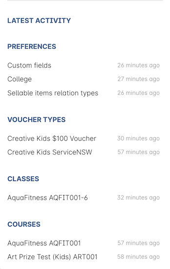

==== Automation Status

This section shows you whether your most recent automation tasks were successful in executing or not.

Hover your mouse over a tick or cross icon to learn the time of execution (or failure), or click the ellipsis (...) to see the audit logs for that script.

==== On Demand Scripts

On Demands Scripts appear only for admin users, and can be triggered manually from here. They will appear here when three conditions are met:

. The script is set as on demand
. The script has no related entity
. The script is enabled

You can learn more about <<scripts>> in general.

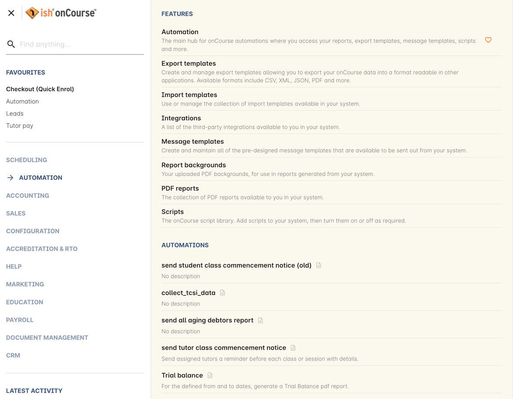

==== Find anything

At the top of the Dashboard, you'll find a powerful search box called Find Anything. Here you can find all manner of data in onCourse and have it accessible at your finger tips with only a few keystrokes. Simply type in what you're looking for, be it a contact's last name, a course code or even an invoice number and the search results should populate as you type, filling out with any matching result.

The results should in order of newest to oldest record.

Feel free to experiment with what you can search for, it covers _a lot_ of data!

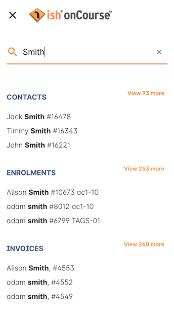

==== Enrolments & Revenue

This column will give you a simple, graphical representation of your recent enrolments and revenue from the past four weeks in an easy-to-read graph. As well as the visual graph, you'll also see the raw numbers of enrolments and revenue, as well as a breakdown of the number of courses you have set up in the system.

The course breakdown will show you the last courses enrolled in, the courses with the highest number of people on a waiting list, the number of courses open for enrolment, and a detailed look at the number of courses currently classed as in development, cancelled, commenced and completed.

==== onCourse News

This section shows the latest posts in the onCourse blog, and will also be updated with news about everything onCourse.

==== Themes & Log Out

In the top-right of the Dashboard there are two new icons, Themes and Log Out. Log Out is self-explanatory, click this to log yourself out of the system and return to the main login page.

Themes will allow you to select a visual theme for the application from those that are currently available, Light, Dark & Monochrome. This setting is saved for each user, so if multiple users use onCourse on the same computer, it will remember their preferred setting.

The current available themes are:

Light:: the standard orange & tan theme you see throughout most of the screenshots in this manual.
Dark:: A dark background with light fonts
Monochrome:: A light theme that's mostly while backgrounds with dark text
High Contrast:: Similar to Monochrome except makes more use of darker titles and some backgrounds.

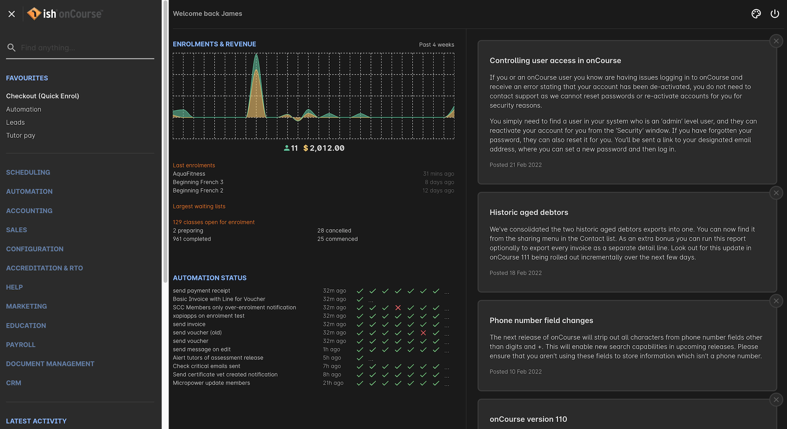

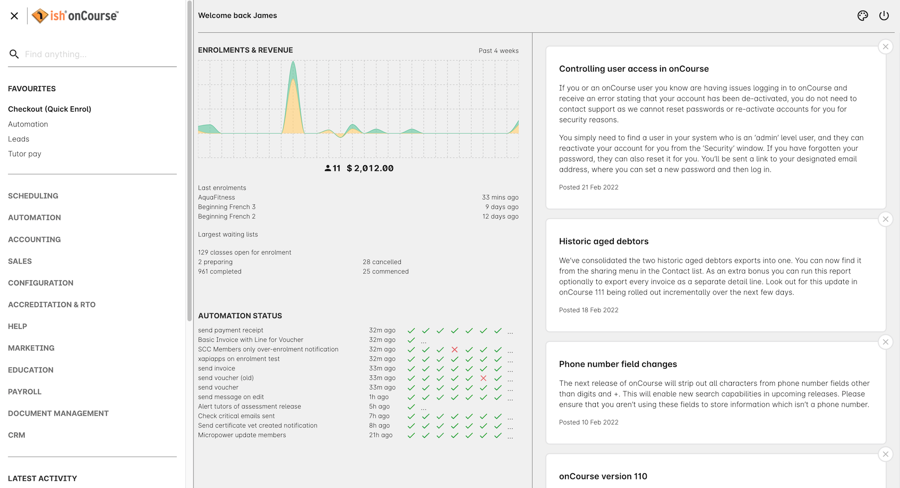

[[gettingStarted-listView]]
=== List View

onCourse's list views appear when you open a window. For example, if you click on `Classes` on the home screen a list view will be opened showing a list of the current classes in onCourse.

By default this list is filtered to hide classes that are completed or cancelled. You can change this using the core filters on the left.

List views will display columns relevant to the window you've opened. Select a record by clicking on it, or select multiple records by holding shift (or cmd on Mac) and clicking on each.

Add new records by clicking the `+` button.

Column size can be adjusted by clicking and dragging the edges of a column from side to side. You can also customise the columns that appear by clicking the 'eye' icon and selecting your preferred columns.

Filters can be applied in the left-side column. Learn more about creating filters using tags in our <<tagging, Tagging chapter>>.

You can sort columns by clicking their header. You can sort by multiple columns by holding down the shift key and clicking each column. The sort will prioritise based on the order of the columns you click. List views offer a two-column and three-column view.

The three-column view will give you a detailed look at a specific record, while the two-column view will give you a better overview of more data.

Advanced Search will let you find records using a combination of conditions. You can learn more about <<search-advanced>>.

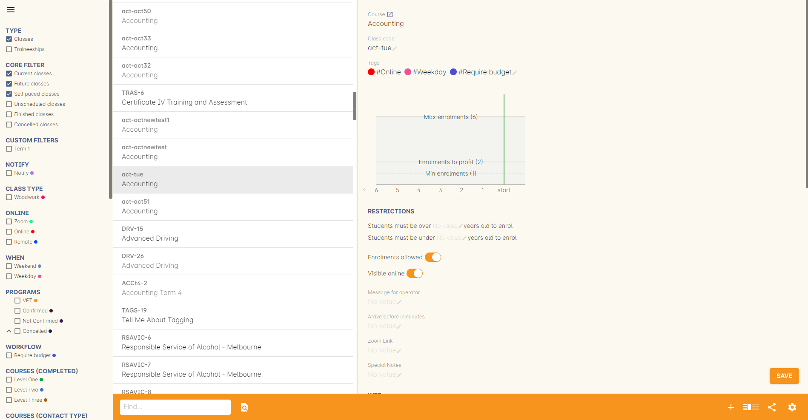

Within the two-column view you can customise the columns visible to you by clicking the eye icon that appears, and then selecting the columns you want to be visible.

[[gettingStarted-helpIcon]]
==== Help icon

This circular question mark icon can be found all throughout onCourse, and when clicked, will give you the choice of opening up the user manual to the relevant location, or to view the <<advancedSetup-Help, audit logs>>.

image::images/find_in_manual.png[title='The help icon']

[[gettingStarted-listViewSearch]]
==== Searching in List Views

Advanced and simple searches are also available from the list view, and all record printing or exporting happens from the list view. You can learn more about <<search, Searching here>>.

[[gettingStarted-addRemoveListView]]
==== Adding and removing records in List View

The list view is also where you can add and delete records. On most list views, you will see a plus `+` to create records. Click on the plus symbol to create a new record and fill out the fields and options fulfill the criteria needed for that particular record.

To delete a record, highlight the record you want to remove, click on the cogwheel, and select 'Delete record'.

Some records in onCourse cannot be deleted because they have formed relationships with other onCourse records, and it doesn't make sense to be allowed to delete half of a record relationship. E.G. if you try to delete a class with one or more enrolments in it (even if those enrolments have been cancelled), you will get a message like the one below. In this instance, you would need to cancel the class instead of deleting it.

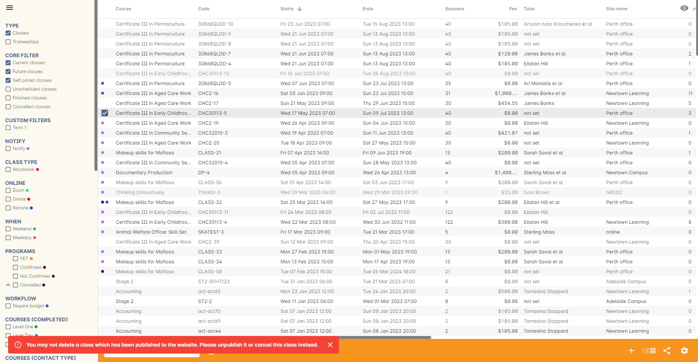

However, if you tried to delete a class without any enrolments, you will see a message like the one below. Once you select 'delete' the record will be permanently removed from the database.

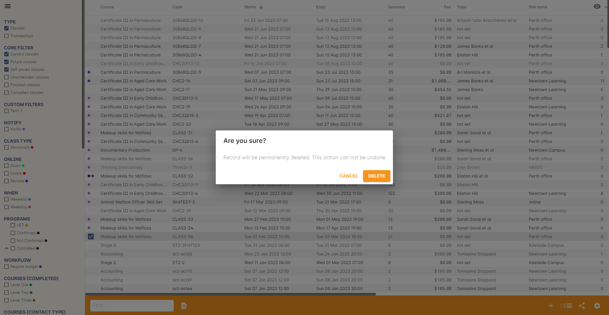

[[gettingStarted-PrintListView]]
==== Printing and Exporting from the list view

You can print a report or export (CSV/XML/json/text or any other format) from any list view by selecting the records you'd like to include, then hitting the Share button. You can then select the type of output you want. If you choose PDF you can also select a background.

Learn more about <<reports>> and <<importExport-Export>>.

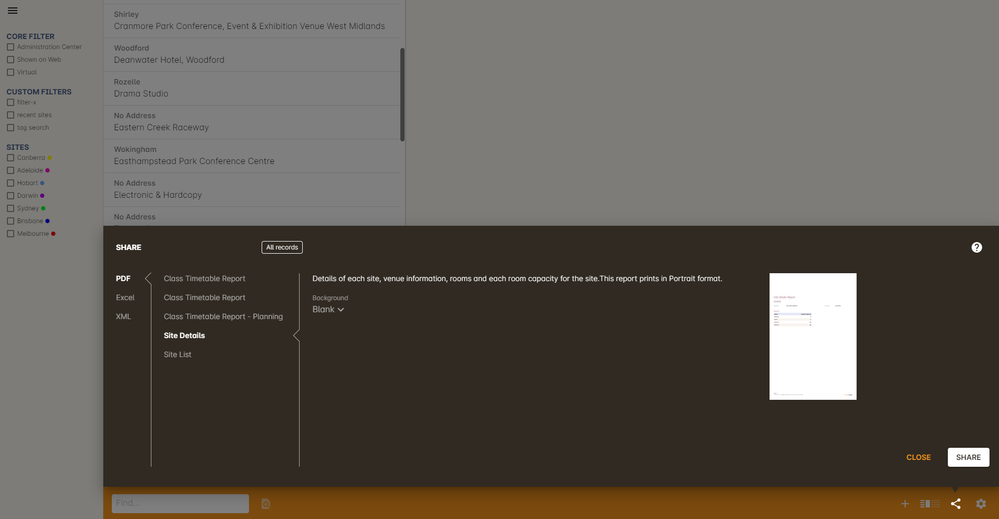

[[gettingStarted-cogwheel]]
=== Cogwheel special functions

The cogwheel is a powerful and very useful tool in onCourse, as it can execute a range of complex tasks on groups of records that would otherwise take a while to achieve manually.

The cogwheel appears on most screens in onCourse, and the options that appear under it will largely be contextual to the screen you're viewing. You can manually execute scripts, duplicate classes and courses, send messages to contacts, add or remove classes from your website and a lot more.

To use the cogwheel, highlight a record on the window you're viewing, then click the cogwheel icon to see your options.

[[gettingStarted-recordView]]
=== Record detail view

The onCourse record view appears once you open (double-click) on a record in a list view. It is how you edit things like contacts, courses, classes etc and contains tab groups. Depending on the records you're viewing, the information displayed and how its shown can vary a lot.

To see a record view, go to a window like `classes` and double-click on a record in the list view. The screenshot below shows you what to expect in a typical class record view, remembering this varies depending on what kind of window you are in. All windows are laid out similarly in onCourse, with sections to group related data and navigate inside the record.

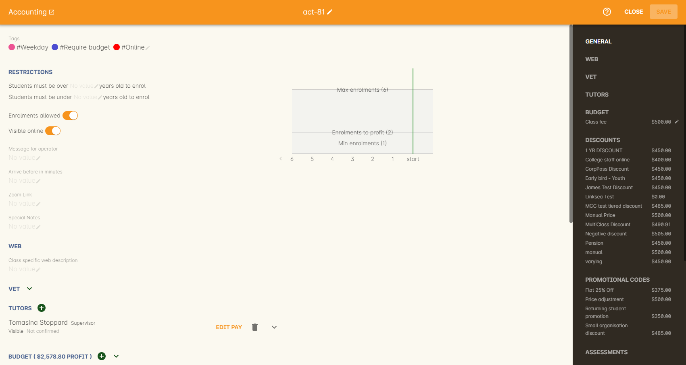

But the class record view alone is not enough to get an idea of how these sections work, throughout this documentation, there are detailed explanations of what each record view section means, for example see the <<classes, classes chapter>> to learn about class record view sections in detail, or see <<tutors, the tutors chapter>> to learn about tutor record view sections.

When you make changes to a record, you can click the Save button to save your changes. If you click `Close` or try to navigate away from the page while you have unsaved changes, you'll be prompted whether you want to discard your changes. Click `Discard Changes` to close the window and delete the unsaved changes, or click `Cancel` and then click `Save` to save your changes.

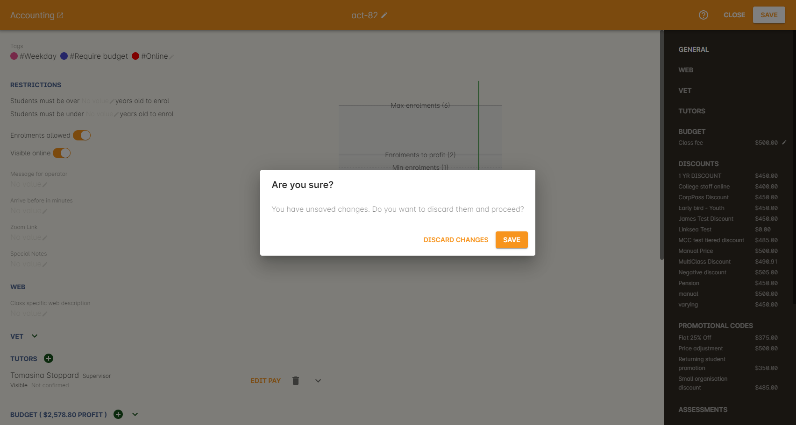

[[gettingStarted-editTextRecords]]
==== Editing Text Fields

Numerous text fields in onCourse, like the description fields you find in Classes or Courses for example, power what displays on your ish website. These rich text fields are versatile in that they will let you select one of three markup varieties to work with; rich text (based on Markdown), legacy (textile-based rich text markup used by onCourse in the past) and advanced (html), for when you just want onCourse to get out of your way and let you type things out in HTML.

The Rich Text mode has a built-in visual editor that makes it very easy for all users to enter content. You can use the Write view to enter pure markup, or use Preview to see the correct formatting while you type.

You can learn more about the different types of markup modes, particularly rich text and legacy modes, in our <<richText, Markup>> chapter.

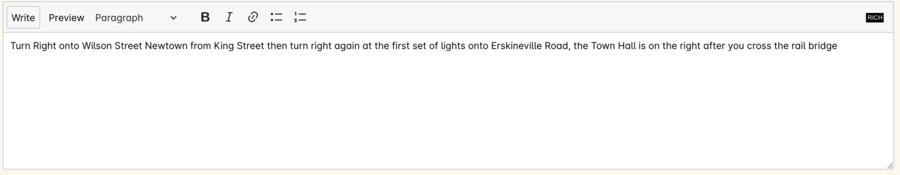

IMPORTANT:
====
Currently this expanded selection of edit modes is only available in the Sites window. It will be added to other windows in a future release.
====

[[gettingStarted-openRelatedRecords]]
=== Open related records

The open related records icon will appear in various windows throughout onCourse and it does a couple of things, depending on where you find it.

When next to a field, clicking it will take you to the related record. Like in the example below, the icon next to the Invoice to field shows that it will take you to Brandon Benitez's contact record.

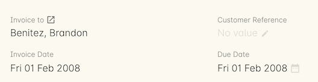

When you see this icon next to a section heading, it will take you directly to that window in onCourse, but without filters applied.

=== Mandatory fields

If you try to save a record that contains an empty field that has been set as mandatory, the Save button will appear with an exclamation mark in it, and when clicked, will scroll you to the field in question so you can enter the data before moving on.

You will not be able to save and continue before adding valid data to the field.

=== Offcourse Error

If you try to navigate to a page in onCourse that doesn't exist, you'll see the below error window. Click the Dashboard link to go back to the dashboard.

[[advancedSetup-Help]]
=== Audit Logging

Audit logs are created when a record is created, edited or deleted. When a script fails or an email key collision occurs, an audit log record is also created. You can find the Audio Logs window by typing 'Audit Logs' into the search on the Dashboard, or by clicking the question mark icon on a window in onCourse, then clicking 'View audit trail'.

The Audit Log list view window displays all entities edited or created by each onCourse user and the date and time of that action.

The advanced search function in Audit logs allows you to search for a particular type of log e.g. script failure or log from a particular user.

Double clicking on the audit log for a script failure or email key collision will provide additional information in 'message' field in the edit view. Edit, create or delete logs do not show any additional information in the edit view.

You can also access the audit logs for a particular record by using the 'find related' feature from any list view. For example, you can select a class and find the related audit logs for that one particular class, or from the user account record, all audit logs for one particular user.

Audit logs will, by default, stay in your system for 12 months.

image::images/audit_log_list_view.png[title='The list view of the audit logs']