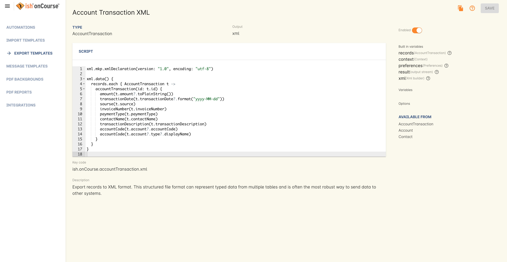
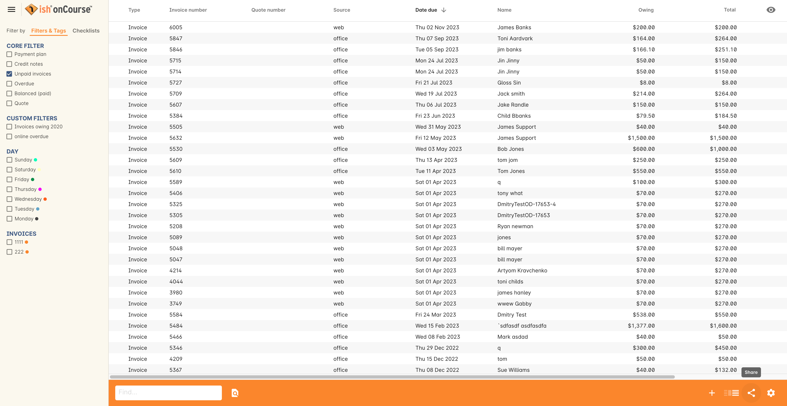
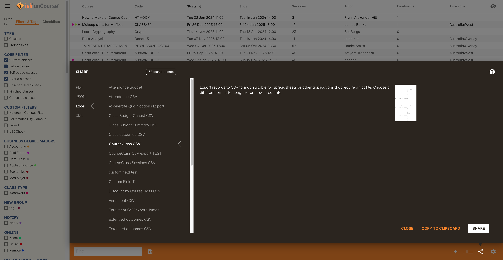
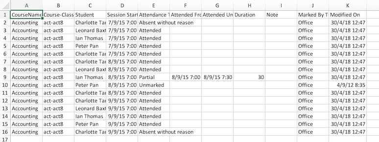
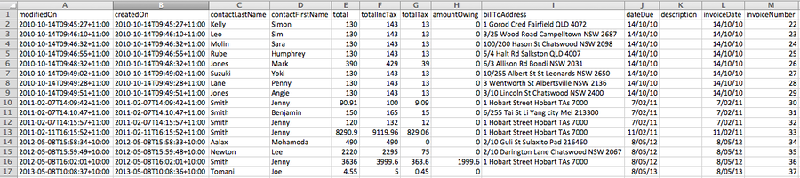
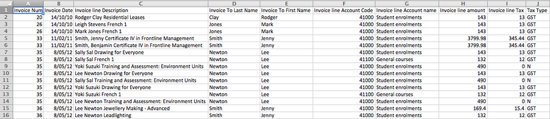
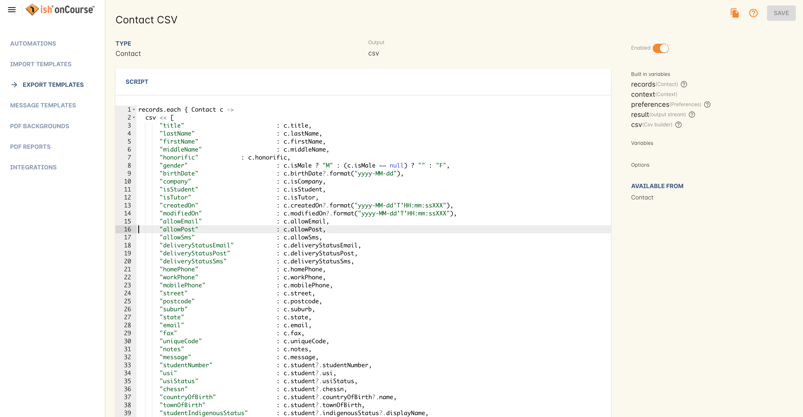

[[importExport]]
== Importing and exporting

onCourse offers you a variety of ways to get data into and out of the system. The onCourse DSL (Domain Specific Language) that outlines the database objects and enumerations is available at https://www.ish.com.au/onCourse/doc/latest/dsl/

This chapter is recommended for Intermediate to Advanced users of onCourse who have a good general understanding of structured data and the onCourse schema.

You can find Exports within the `Automation` section of onCourse.

[[importExport-Export]]
=== Export Templates

==== onCourse Export files

The list of exports available to you will include those supplied as part of the default onCourse application configuration and any additional custom exports you have created or have commissioned ish to create on your behalf.

Generally, export files that end with CSV (comma separated files) are designed to be opened, viewed and edited in a plain text editor or spreadsheet application. These are flat files containing columns and rows of data. Export files that end with XML (eXtensible Markup Language) are designed to be imported into other software applications and represent a relational data structure.

Each export displayed in this list has a Name, Type, Output, Key Code, Variables, Options, and an Available From section.

The Name is a descriptor of the export and usually includes information about the export format type.

The Type (formerly Entity) is the object in the database that the export is joined to, and will indicate which list view you will be able to find this export.

The Output is the requested file extension of the export and the types of Variables that become available to you.

The Key Code is a unique identifier for the export and when supplied by ish as part of the default onCourse application will begin with 'ish'. When the export is custom, the key should begin with an identifying acronym for the organisation.

Variables are values that are set when you run an automation (a script, import, print report or export). This value is then used to change the behavior of an automation without directly editing the code itself. A variable can be a date, a word or checkbox. For example; perhaps you would like to write a script to check what classes will start between now and a specific date. You can add a date variable to this script so you can change specified date when the script is executed.

Like variables, Options are values that are used to change the behavior of an automation. However, an option's value is set while editing/creating a script. For example; imagine you'd like to change the message template that is sent to students by a script. An option could be created and inserted into the script so that user can set the template without having to go into the code to change anything themselves.

You can double-click on the export record in the list to see the structure of the export file, what fields are included and what formatting is applied.

The Filters search panel in the left-hand column can help you find specific exports you're looking for by simply typing the name of the export.

[[importExport-howtoExport]]
==== How to Export

Like print reports, the list of available exports in the list view are those exports linked to the entity, or list view, you are viewing.

Each list view in onCourse has the ability to export data in a variety of formats. To export, you can either highlight the records you wish to export and click on the Share icon, or just click the Share icon without selecting records. In the Share menu, select 'Excel'.

Next select the export name. Finally, you can choose whether to include only your selected records, or all records. Lastly, hit `Share`.

[[export-clipboard]]
===== Copy to Clipboard export

You can copy selected rows of data to your computer's clipboard in the format of one of your system's CSV exports. This is useful for when you're compiling spreadsheets in excel, creating an email or word processing document. Copy items to the clipboard by doing the following:

. Highlight the records you want to copy to the clipboard
. Click the Share button
. Select 'Excel' then click 'Copy to Clipboard'
. You can then change focus to the program you want to copy the data to, and use the paste function to paste the data.

[[importExport-examplesExport]]
==== Examples of default exports and their uses

Begin by opening the `Classes` window and running a query or otherwise selecting the range of classes you wish to export for the brochure.

From the share options, select 'InDesign Brochure XML export' and save the resulting file to a location on your computer. This default layout includes the information from the course general section 'Print brochure description' and combines it with the class summary information including location, cost, start date and time and tutor. The information is grouped by the Subject tag hierarchy.

The XML file is designed to be imported into a publishing product such as Adobe InDesign and then customised however you wish with the addition of styles and images. The XML tags in the onCourse export can be mapped to styles in InDesign, allowing the data to be imported and dropped into a brochure layout as many times as needed during the production cycle process. The XML file created by onCourse is not designed to be opened or edited in a product like Word - it is designed for import into a specialist layout and design software tools. If you do not have software that can work with these files installed on your machine, you should be able to email the file to your design staff for them to work with directly.

The class list includes a number of CSV exports, some with specific purposes. The 'CourseClass CSV export' is a generic export that includes most of the class fields.

. Highlight the Class records you wish to export within the Class window.
. Click the share icon in the bottom right-hand corner of the list window
. You then have the following export options to select from the drop down menu:

CourseClass CSV export:: Standard export of Class information
+

Class Budget Summary CSV export:: Provides a Class per line summary of budgeted income and expenses against projected and actual costs.
+

Class Outcomes CSV export:: Report for student outcome results for date range so Colleges can conduct their own reporting and easily identify students with outcomes that are not set.
+

Extended Outcomes CSV:: A report to show data like the AVETMISS NAT00120, but in a human readable format
+

CourseClass Sessions CSV:: Export for class session information including enrolments, room allocation, seats available and tutors assigned
+

Attendance CSV:: Export for class session attendance showing who marked the roll (online or via the office) and when the attendance was last modified information
+

[TIP]
====
When exporting the above class exports, the resulting CSV output file will have the same name in all instances: it will be labelled as 'CourseClassExport<dateTime>.csv', with the date and time of the export being appended to the end of the file name. You can then re-label these export files to whatever you need.
====

onCourse enables users to export not only the invoice information, with each invoice reflected as one line within the resulting output file, but also export the invoice line detail.

. Highlight the invoice records you wish to export information for from within the Invoice window.
. Select the share icon
. You can then export either the invoices as a standard Invoice CSV (one line per invoice) or alternatively you can export the invoice line detail.

The following excerpts of the exported information as shown within excel, provides a comparison between the kind of information that each export generates within the resulting output file.

[TIP]
====
When exporting the above two invoice exports, the resulting CSV output file will have the same name in all instances, it will be labelled as 'Invoice CSV export<dateTime>.csv', with the date and time of the export being appended to the end of the file name. You can then re-label these export files to whatever you need.
====

[[importExport-otherExports]]
=== Other export types and options

==== AVETMISS export

To export your AVETMISS you can either go to export directly via the 'Export AVETMISS 8' window, or via the Export AVETMISS 8 cogwheel function in the classes or enrolments windows. We recommend the Export AVETMISS 8 window for ease of use.

For more information about how the onCourse data collection and various AVETMISS export options work, see <<AVETMISS>>.

image::images/exports/export_avetmiss.png[]

[[importExport_InDesign]]
==== Exporting to Adobe InDesign

onCourse already comes with a template for exporting to Adobe InDesign.

. Open the class list view
. Use the searching feature to find the classes you want in your brochure. This might be one or a thousand classes.
. Click the Share icon, select and select "XML". Select "InDesign Brochure XML Export" then click `Share`. Export this data and save it to disk somewhere. It will be an XML file, ready for InDesign.

Now fire up Adobe InDesign and import this file.

. [.menuchoice]#File > Import XML#
. Choose your XML file which you just exported from onCourse.
. Ticking "Link" will keep the InDesign document linked to your source XML so that changes to the XML flow through
. The structure of the data will now appear in the left column. You can drag any element into a text box in your layout and have the text automatically flow through.
. Use the "map tags to style..." menu item to map the tags against your paragraph and character style sheets. Once this is done you can save the mapping so that next time you create this document with fresh data all the styles are linked quickly and simply.

If you now spend a bit of time tidying up your stylesheets (both character styles and paragraph styles) in InDesign you can set up the whole process to be almost completely automated. Next time you export from onCourse, the data will flow right into InDesign complete with all the formatting you need. Just paginate your brochure, place in some pictures and you are done.

If you need to customise your export further, you can do this yourself if you have the skills in house, or engage ish to make the changes for you.

==== OLGR CSV Export

onCourse has an export that allows you to export student data into OLGR for the state of NSW. To do this:

. Open the `Classes` window and locate the RSA class you want to create the file for
. Single click on the chosen class
. Click the Find related icon and select 'enrolled students'. This will open the students from this class in a new contact window
. With the contact window at the front of your onCourse view, click the Share icon > Excel
. Choose the option 'NSW OLGR CSV export' and click `Share`.
. Open the CSV file in excel and use your current process to upload the data into OLGR

[[importExport-MYOB]]
==== Exporting to MYOB

If your organisation utilizes MYOB as the key financial system, you can generate an export that is specifically designed for importing data directly into MYOB. There are 2 different pathways within the onCourse Client to access and generate the financial data export for MYOB.

===== Generating a MYOB Export via the Financial Summary Extract Menu

NOTE: You must be an admin user to access this export script.

The steps involved in running this export are as follows:

. Type 'MYOB' into the find anything search, or click on 'All' in the left navigation column, and select 'MYOB export'
+

. Set the 'from' and 'to' date range for the next MYOB Export
+

+
[NOTE]
====
The benefit of utilizing the Summary Extract path when exporting financial data, is that onCourse enables you to set the date range for the data that is to be exported. As well as remembering the date up to when the last data export was run.
====

. Click on the `Run Script` button to run the export. Note that the resulting file will be generated as a CSV file.
+

===== Generating a MYOB Export via the Transaction Window

Unlike the approach of generating the MYOB Export via the Summary Extract menu of onCourse, by running the export via the Transactions window, you can define exactly which transactions you wish to export to the resulting text file. The steps involved in running this export via the Transactions window are as follows:

. Filter and highlight the transaction records you wish to export within the Transaction window
. Click the Share button, then select 'Excel'.
. Select the 'Account Transaction MYOB export' export
. Click `Share`. The resulting file will be generated as a CSV file.
+

[[importExport-customisingExports]]
=== Customising export templates

There are a range of options for creating custom exports in onCourse. What you choose depends on your familiarity with database structures, queries and the Groovy language.

. Copy an existing export to make a new export file, and then make changes to the copy
. Create a new export from scratch
. Create a standalone export that is run manually, or an export that is triggered by a script to pass it certain pre-defined parameters
. Engage ish or Groovy developer of your choice to create a custom export for your business

onCourse exports are powered by a groovy based scripting language. These scripts run on the server and call the same groovy DSL that you'll find in the scripting chapter and available here: https://www.ish.com.au/onCourse/doc/latest/dsl/. You can use the full power and expression of the groovy language, and have access the entire onCourse schema. In short, you access the data to export from the variable "records" and just return from the script the formatted text to export.

There is a built-in CSV toolkit, so exporting to CSV is the simplest export type to create or edit without a great deal of prior experience. By default the delimiter is a comma, but you can define a different delimiter like a tab as per the example below:

[source,groovy]
----
csv.delimiter = '\t'

records.each { AccountTransaction t ->
    csv << [
            "Date"          : t.transactionDate?.format("D/M/Y"),
            "Memo"          : t.transactionDescription,
            "Account Number": t.account.accountCode,
            "Debit Amount"  : t.amount.compareTo(Money.ZERO) > 1 ? t.amount.toPlainString() : Money.ZERO.toPlainString(),
            "Credit Amount" : t.amount.compareTo(Money.ZERO) > 1 ? Money.ZERO.toPlainString() : t.amount.toPlainString()
    ]
}
----

[[importExport-creatingNewExport]]
==== Creating a new export

The simplest place to start with a new export is by finding an already existing export that's similar to what you want to make and click the Save as new export template button to create a copy of the export. Give it a unique key code, then hit Save and you'll be taken to your copied export, where you'll be able to start editing the code.

Default ish exports cannot be edited, they must be copied first.

For example, if I wanted a new export for Tutor data that started from the Contact entity, I'd choose the default 'Contact CSV export' as my starting point.

. Go to the `Automation` window, find the export 'Contact CSV export' under Export Templates and click it to open it.
. Click the Save as new export template button in the top right, you'll be prompted to give your new export a new key code. This must be unique, but you can make it up. Once you've entered a key, then click Save. You'll be shown your new, editable export. Make sure you give it a memorable name, as this is what displays when you run it.
+

The first part of the export code...

[source,groovy]
----
records.each { Contact c ->
csv << [
----

means that in this file, the letter 'c' will be used as shorthand for the 'Contact' object and the export will create a CSV file. For your export to work correctly, do not modify this header information.

Go to the DSL documentation for the entity so you can see the fields, or instance methods names and values. For the contact entity, this information is available at https://www.ish.com.au/onCourse/doc/dsl/#Contact

Each row that follows defines the column name in the CSV export and where that data comes from in onCourse, and how it is formatted. You can add additional rows to the export, or delete or re-order rows. Note that each row ends with the comma delimiter "," except the last row in the export file. For example, the contact export ends with the resume field value, so there is no comma after this row.
+
[source,groovy]
----
            "workingWithChildrenCheckDate"  : c.tutor?.wwChildrenCheckedOn?.format("yyyy-MM-dd"),
            "workingWithChildrenCheckRef"    : c.tutor?.wwChildrenRef,
            "workingWithChildrenCheckExpiry"    : c.tutor?.wwChildrenExpiry?.format("yyyy-MM-dd"),
            "tutorResume"                    : c.tutor?.resume
        ]
}
----

You can also see above that the export file ends with the bracket closure characters "]" and "}". It is important you don't remove these.

[[importExport-exportJoins]]
===== Joins

If you want to access data from other objects than the entity defined in the export, you need to add joins to the export and structure your query in a way that matches the onCourse DSL and schema. For example, in the contact CSV file, some of the fields are from the student or tutor object. These joins are represented by the full stop character. For example, the Working With Children Check Reference number is part of the tutor object, so the join from the contact to the tutor is 'c.tutor.wwChildrenRef' which means the same as 'contact.tutor.wwChildrenRef'.

[source,groovy]
----
            "workingWithChildrenCheckRef"    : c.tutor?.wwChildrenRef,

----

In this example, the addition of the `?` character is a safe-navigation operator to avoid the export throwing a null pointer exception. Null pointer exceptions occur when the export cannot follow the join you have defined because it doesn't exist (i.e. not every contact selected for export will be a tutor, so if there is a non-tutor contact included, adding the safe-navigation operator just means the export will skip past this field for that record.)

[[importExport-customFieldsExports]]
===== Custom Fields in Exports
If you have custom fields you wish to include in your export, you can use the custom field keycode to add these fields. You won't find these fields defined in the onCourse DSL documentation as they are custom to your database. This is why you should make your key's relevant and memorable.

For example, if you have a contact custom field with the keycode 'howDidYouHearAboutUs' you could add it your export as follows:

[source,groovy]
----
"How Did You Hear About Us?"  :  c.howDidYouHearAboutUs?.value
----

Refer to the <<generalPrefs-customFields>> for more information about creating custom fields in onCourse.

[[importExport-testingExports]]
===== Creating and testing your export in onCourse

When you are ready to test your new export in onCourse:

. Go to any of the windows listed under the Available From section
. Select a record from the window and hit the Share button.
. Choose the output type from the left most column, and then select the export, then click Share.

If you attempt to run the export and instead of generating the expected output, it shows an error in the window, then you need to adjust your export code to resolve the error, save the changes and try again. This may be a process you repeat a few times if you are new to creating and editing export files.

When your export runs successfully, check the output is formatted as expected, and make adjustments to your export as needed.

NOTE: When opening CSV files in a spreadsheet application like Excel, Excel may reformat some of your data based on its own rules. For example, data it thinks are numbers will often be reformatted, so the leading zeros from mobile phones numbers may be stripped . You should run your formatting checks in a text editor like Sublime or Notepad.

[[importExport-Import]]
=== Importing

Using the onCourse Groovy scripting engine, powerful import process can be created in onCourse for either once off events or a regular data transfer between onCourse and a third party software service.

For once off type data imports, you may like to read our chapter on
<<migrating, migrating to onCourse>>.

For regular data transfers, you may like to read our chapter on <<externalintegrations>>.

Custom import processes and integration scripts can also be created on request. Please send your request to support@ish.com.au for a proposal.

==== Standard Imports available

onCourse AVETMISS outcome import:: Using data from an import set of NAT00120, NAT00060, NAT00080 and NAT00085 file, create _new_ students in onCourse with their existing AVETMISS file student number. Import their contact record into onCourse and update their record with their outcomes in the onCourse prior learning record.
+
The prior learning records are grouped by qualification, where the qualification data is supplied in the NAT00120. This import is most commonly used during system migration to import data from another AVETMISS reporting tool into onCourse. Running this import on the same data set twice will create duplicate records for each student.

onCourse AVETMISS outcome update import:: Using data from an import set of NAT00120, NAT00060, NAT00080 and NAT00085 files, _update_ existing students in onCourse with prior learning data. This process does not create new contact records, only adds prior learning data to existing contacts.

onCourse AVETMISS student import:: Using a data from an import set of NAT00080 & NAT000085 files, create new student contact records in onCourse. Running this import on the same data set twice will create duplicate records for each student.
onCourse AVETMISS student update import:: Using a data from an import set of NAT00080 & NAT000085 files, update existing student contact records in onCourse. This process does not create new contact records, only adds prior learning data to existing contacts.

onCourse contact CSV import:: Import contact data from CSV file to create new contacts, students, tutors and/or companies in the database. Running this import on the same data set twice will create duplicate records for each student.

onCourse paymentIn CSV import:: Using CSV data, import paymentIn information in order to automatically match paymentIn records with invoices.

onCourse Contact Update Subscriptions CSV import:: Search for contacts based on the provided email address and update their marketing permissions in bulk.

onCourse custom field types import:: allows the creation of custom fields in bulk by attaching a .txt file with data in json format (cannot be a .json file, must be .txt).

[[importExport-payentIn]]
==== Payment In Import file set up

Please see below for the import file specification. You will need to ensure that each line in the CSV relates to an invoice, or the import will fail. To make sure this is the case, please deleted any lines in the spreadsheet that appear after the last invoice record.

.Payment In Import file format
[width="99%",cols="16%,14%,14%,14%,14%,14%,14%",options="header",]
|===
|*payment.invoice* |*payment.dateBanked* |*payment.amount*
|*paymentIn.paymentMethod.name* |*payment.chequeBank*
|*payment.chequeBranch* |*payment.chequeDrawer*
|the onCourse invoice numbers |date the payment was banked here, in date
format DD/MM/YYYY |the payment amount as numbers. Do not use dollar
symbols or commas |the payment type. the name must be the same as the
payment type in your onCourse database |if payment was by cheque, the
bank issuing the cheque |if the payment method was by cheque, the name
of the branch issuing the cheque |if the payment method was by cheque,
the name of the drawer on the cheque

|12045 |31/10/2017 |1295.50 |other | | |

|12892 |30/10/2017 |1000 |Cheque |Commonwealth Bank |Bendigo |A J
Spencer
|===

[[importExport-updateSubscriptions]]
==== Contact Update Subscriptions CSV import

This import will allow you to update, in bulk, the email, post and sms subscription preferences of a contact record, as identified by its email address. Below is an example of how your CSV file should be laid out. When you format your CSV, be sure to allow the table headers otherwise the import will fail.

.Contact Subscription Update CSV format
[width="100%",cols="25%,25%,25%,25%",options="header",]
|===
|email |allowEmail |allowPost |allowSms
|alice@email.com.au |TRUE |TRUE |FALSE
|bob@email.com.au |TRUE |FALSE |FALSE
|charlie@email.com.au |FALSE |FALSE |FALSE
|===

[[importExport-customFieldTypes]]
==== Custom field types import

This allows you to create custom field types in bulk. The schema to use for this import should be formatted like so:

[source,json]
----
  {
      "name" : "custom field name",
      "isMandatory": 1,
      "choices": [
                    {"label":"label 1", "value":"1"},
                    {"label":"label 2", "value":"2"}
                    ],
      "fieldKey": "ishFieldKey",
      "entityIdentifier": "Enrolment"
  }
]
----

Name:: The name of the custom field
isMandatory:: Denotes whether the field is mandatory or not
choices:: These are the list selections that will appear in the drop-down box. You can set both a label and a value.
fieldKey:: the unique key given to the new custom field. This must be unique.
entityIdentifier:: The name of the entity i.e. Enrolment, Contact, CourseClass etc.