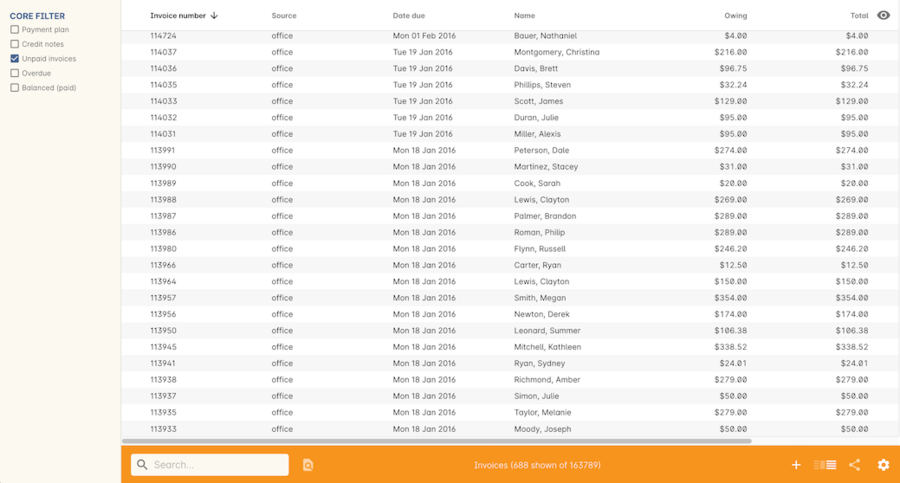
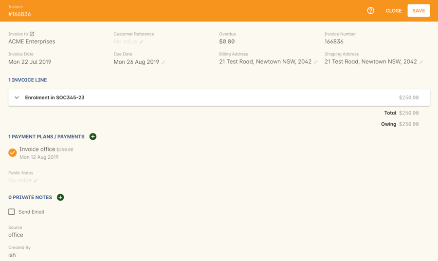
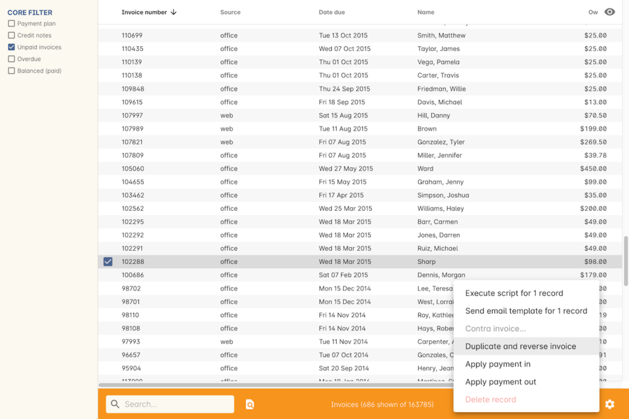

[[invoice]]
== Invoices

[[invoice-general]]
=== About invoices

Every time you create a purchase through Checkout, an invoice will be automatically created for you. Each item purchased will create an invoice line, so multiple students enrolling in multiple classes each can be recorded on a single invoice.

An invoice is assigned to a debtor, so an employer requesting two students enrolling in three classes each can be issued a single invoice through one Checkout process. Whereas two individual students each enrolling and paying for their classes themselves would be enrolled through two Checkout processes, to create two invoices - one for each student.

During the Checkout process you can see the draft details the invoice you are creating, and add additional information like a customer's purchase order number or notes.

Invoice lines automatically created by Checkout may include purchases of enrolments, products, vouchers or memberships.

Full or partial payment against an invoice may be taken at the time of creation through Checkout, or at a later date. A due date for the invoice can be manually set in Checkout, during the Payment step.

These invoices are then visible within the Invoice list view. Like all other lists you can sort, search, export and print from this view.

The invoice list view can be opened by selecting Invoices from the global navigation. Use the core filters to whittle down the results, and search queries to further refine your results.

[NOTE]
====
The 'Overdue' column will show the total unpaid component of the invoice that is due prior to tomorrow e.g. amounts due today, and in the past, which are unpaid are considered overdue.
This updates daily, not in real time.
====
[[invoice-Terms]]
==== Invoice Terms

By default, an invoice created by onCourse will have a due date of today i.e. their day of creation.

If you wish to set a different default term for all your invoices, then you can set a 'default invoice terms (days)' in the Preferences window, in the Financial section. This is a good choice for organisations who do not usually take payment upfront during the enrolment process. These terms can also be set on a per class basis, in the class budget. You can learn more about <<classes-Budgets, class budgets here>>.

However, if most of your enrolling students require invoices with a due date of 'today', and some corporate contacts require invoices with due date terms, you can also set invoice terms per contact.

In the contact record, open the Financial tab and unlock the default invoice terms. Replace the value with the customer specific terms.

All future invoices created for this customer, including invoices created for enrolments processed over the website using a corporatePass, will have a due date set according to the custom terms.

image::images/invoiceTerms.png[title='Financial terms in the contact. This contact has 7 days to pay their invoices by default.']

[[invoice-create]]
==== Creating a manual invoice

While you will usually create an invoice through using Checkout, it is sometimes useful to create an invoice without an associated product or enrolment. You can easily do that by opening the list of invoices and pressing the plus icon at the top right.

Invoices created manually can have an invoice date in the past or the future, although the default setting is today. Invoices created with a date in the past can be created prior to the financial period finalised date. They can only be created for unlocked periods. If you create a invoice in the past (or future) the general ledger transaction lines will be created for that date. You cannot pay an invoice though that has a creation date in the future, as it doesn't yet exist with an outstanding balance.

Remember to associate each invoice line with the correct income account code. Once you save the invoice you will not be able to change this code.

Each invoice line can have a discount applied by selecting one from the drop-down box that appears. Only valid discounts can be selected, and they can only be set during invoice creation. They cannot be edited after the invoice has been saved.

By default, invoices are ticked to 'send email'. This sends the standard invoice email template to the debtor contact when you save the record.

[[invoice-linking]]
===== Link invoice lines to class budgets

When creating invoice lines you may optionally link each line to a class. This will treat the income with the same general ledger pre-paid fees and income deferral plan as invoices created by enrolling in the class. This also adds the total of that invoice line to the class budget and can be very useful when invoicing a company for an entire classroom delivery without recording individual enrolments or need to include additional income such as funding in a classes budget.

Type the course name or code, and select the class code from the drop down list to join a manual invoice line to a class budget.

image::images/invoice_lines.png[title='Linking invoice lines to a class in the Assign to Budget section']

[[invoice-editInvoices]]
==== Editing Invoices with Credit Notes

Invoices cannot be deleted or edited once created - only the invoice due date and payment plan information can be changed. Although this may seem like an inconvenience, immutable invoices are extremely important to ensure a robust audit trail and to guarantee the integrity of the general ledger transactions.

If you need to modify an invoice you should instead create a credit note. A credit note is an invoice where the invoice lines have negative dollar values. Remember if you are cancelling an enrolment or a class there are easier ways to do that from the class and enrolment list views.

A credit note is an invoice with a negative total and is shown alongside invoices in the same list view. The owing amounts on an invoice and a credit note are not automatically zeroed against each other, however you can cancel them out by using the cog wheel option 'contra invoice'.

[[invoice-apply-payment-in]]
==== Applying a Payment In via Cogwheel

You can apply a payment in for a specific invoice from the Invoice list view by:

. highlighting a single invoice
. clicking the cogwheel
. selecting 'Apply payment in'.

This will open the Checkout screen with the contact field pre-filled and, provided the selected invoice is due on or prior to the current date, the highlighted invoice will be ticked within 'Payment' under 'Pay previous owing'. If more than one invoice is owing, you can apply the single payment across multiple invoices by selecting them by clicking on 'Pay previoud owing', then selecting them in the Payment section of the checkout.

The total payment amount will be auto-calculated to the balance of the selected invoice, but this can be edited in the Payment window.

[[invoice-paymentPlans]]
==== Invoice payment plans

Invoices have payment plans. You can learn more about payment plans in our <<batchpayments-paymentPlan, Payment Plans section>>.

Using payment plans you can set the amount of the up front deposit and a series of dates for payment of the remainder in instalments. By default, invoices have a due date of the day they are created. Sometimes you will want to allow students to pay for training over a longer period of time.

Then click on the '+' symbol next to the Payment Plans/Payments heading inside the invoice record to add a planned payment date. You can add as many as you like, provided the total of the payment plans adds up to the total invoice amount.

NOTE: The payment plan total MUST add up to the invoice total amount, NOT the owing amount.

image::images/invoice_add_payment_plans.png[title='Manually adding payment plan lines to an invoice']

Once this has been done you can then start editing these payment plan lines starting with the dates you want the payments to be due. Click on one of the payment due date fields in the table and changing it to a date that you want the payment to be due by. Then do the same for the other payment due date fields until they are all setup correctly, then click `Save`.

image::images/invoice_edit_payment_due_lines.png[title='Editing the date for each of the payment due lines']

Then lastly change the amounts that are due on each of these dates from $0 to your chosen amount.
This is also done by double clicking on the relevant field in the table and editing the fee amount.

image::images/invoice_adding_payment_plans.png[title='Invoice with manually added payment due dates and amounts']

The 'Overdue' column in the Invoices list view will show the total unpaid component of the invoice that is due prior to tomorrow.

You can edit the payment plan amounts and due dates at any time, for example if you grant the student an extension to the payment plan.

[[invoice-duplicating]]
==== Duplicating and reversing invoices

This feature is mostly used to create a credit note when you have cancelled the enrolment, but retained the invoice by mistake. These types of enrolments will have the status 'cancelled' rather than 'credited'.

Alternatively, you might use this option to 'fix' the fee due post enrolment, if the student was charged the wrong fee during the enrolment process and you don't want to reverse the enrolment entirely. In this case, you would create a reversed invoice for part of the course fee.

You can also use this process to reverse a credit note that shouldn't have been created.
The reversal of a credit note will be an invoice.

Remember, you can't edit or delete 'mistakes' in onCourse invoices, but every invoice or credit note can be corrected by creating an equal and opposite reversal action. This tool is your shortcut to fixing those sorts of mistakes.

This feature can only be used on one invoice at a time. To duplicate and reverse an invoice:

. Open the invoice list view and single click on the invoice you want to fully or partially reverse.
. Click on the cogwheel and select the option 'Duplicate and reverse invoice'.
. A new invoice window will open. This will be a duplicate of the original invoice, in reverse. e.g. all the original dollar values will now have negative sign in front of them.
+

. You can edit the value of every field of the new invoice/credit note, including changing the value the reversal is for, to make it more or less than the original invoice value.
. Note that each invoice line from the original invoice will be reversed. You can delete invoice lines from this credit note you do not want to reverse e.g. if there were two enrolments on the original invoice and you only want to credit one.
+
image::images/duplicated_and_reversed_invoice_two_lines.png[title='This reversed invoice has two invoice lines. Select one and click the minus sign (delete) button to remove it from the invoice.']
. You can also add additional lines to the invoice, with either negative or positive values, for example, if you wanted to manually charge an admin fee, you can add the fee as an additional line with a positive amount. This will reduce the balance of the credit available to the student.
. If you want this new invoice/credit note to be applied to the class budget and pre-paid fee liability process, double-click on each invoice line and manually link it to the course and class by code. If this invoice reversal was for an enrolment, you will see the course and class code you need to manually reverse against in the invoice line description.
. By default, this new credit note won't be sent by email to the payer. Check the option 'send email' if you want a copy to be sent.
. Save and close the new credit note/invoice once you have confirmed all the values are correct. You cannot change any of the data after you have saved it as all financial records are immutable.
. If you wish to use this new credit note to contra pay and existing invoice with a balance outstanding, select in the invoice list, and from the cogwheel choose 'contra invoice'. A new window will open allowing you to select unpaid invoices from the same contact you can credit against.

