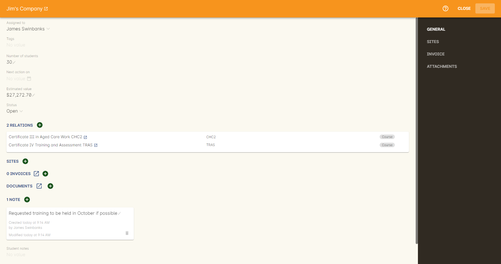
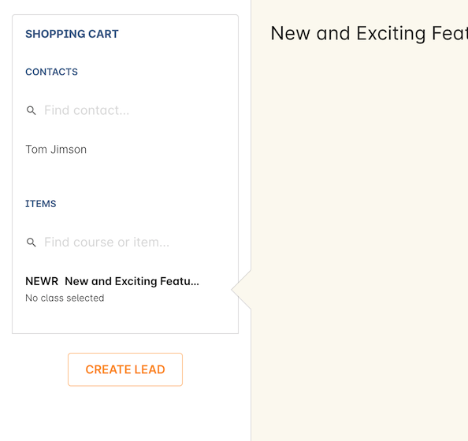
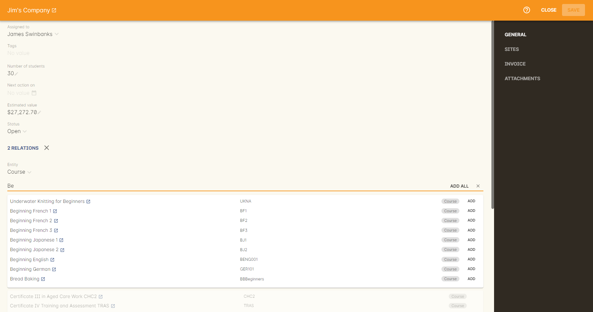
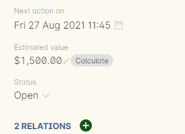

[[leads]]
== Leads

A lead is a record of a contact's expression of interest in something you are selling, and a way for your marketing and sales team to manage the sales process, one step at a time. They can be as small and simple, or large and detailed as you like. Contacts can have more than one lead to reflect where a company or student may wish to express interest in multiple enrolments or products.

Leads must be linked with a contact record, but can also be linked with courses and products through a relation, sites and documents.

Leads can also be linked with one or multiple <<quotes,quotes>>.

[[leads-new]]
=== Creating a new lead

There are two ways to create a new lead; within the leads window, or via the checkout. To create a lead directly within the leads window, go to the leads window and click the + icon in the bottom-right corner.

Add a contact by typing their name and selecting a record from the drop-down list. The record must already exist in the system before you can create a lead for it.

[IMPORTANT]
====
Leads cannot be created without a contact, at minimum.
====

You can set a number of students to indicate the potential number of enrolments or sales. Set a 'next action on' date and time, set a status of Open or Closed, add tags (useful if you want to add more detail to your leads for grouping). You can also add a site preference for the lead, <<documentManagement, documents>>, invoices (or quotes) and notes.

[[leads-newCheckout]]
=== Creating new leads in Checkout

A fast way of creating leads is to do so directly from within the checkout.

Add a single contact and any number of courses to the checkout, without selecting any classes. A 'create lead' button will appear. Click this to create a lead record using the data from the checkout.

[[leads-relations]]
=== Adding relations

As the purpose of a lead is to capture someone's expression of interest, you want to know exactly what they're interested in, and this is done by creating relations with both courses and products. For a relation to be created, the course or product must already exist in the system.

Click the + button next to Relations, then using either a query, or by typing out the name or the code of the course or the product, you'll see a selection of choices in a drop-down list. Click the 'Add' button next to each record you want to add to the lead, or click 'Add all' if you want to add all of them.

When you add a relation, you can make onCourse calculate the estimated value by clicking the 'Calculate' button. This pulls the enrolment fee data from the last class for that course, or the product price per single unit. You can edit this value manually as well.

[[leads-addQuote]]
=== Adding a Quote to a lead

A quote is an invoice that can be edited; like a draft invoice. You can learn more about <<quotes,quotes here>>.

To add a quote to a lead, while in the lead edit view click the + button next to 'Invoices'. You can only add a quote to a saved lead, so make sure its saved first.

This will open the Invoices screen in a new window, to a new quote record. The 'Lead' and 'Invoice to' field's will be pre-filled with the contact's details, and just like an invoice you'll need to create a quote line, the same way you do an <<invoice-create,invoice line>>. This way you can add multiple quote lines, assign them to a class budget and make any adjustments you need to.

When you're done, click Save and the quote will be saved.

Go back to the Lead and refresh the page, you'll see the quote under Invoices in the lead record.

[[leads-documents]]
=== Adding a document

You can add a document by simply dragging and dropping it from your desktop over the Documents + button. Or, if you've already got the document in your system, click the + and type out its name in onCourse, then select it from the list.

[[leads-notes]]
=== Add a note

Click the + button next to Notes to add a new note. Type the text into the card, then click the 'Save' button to save the record.

[[Leads-convertSale]]
=== Coverting a Lead to a Sale

When in the Leads list view, you can highlight a single lead record and, from the cogwheel menu, select 'convert lead to sale'. This will move the contact and any courses associated with the lead into the checkout, where you can then complete the enrolment. Similarly, if a lead with related courses that have no future classes is converted, only the contact will appear in the checkout.

====
NOTE: If a lead has no related courses, it can't be converted to a sale.
====

If a lead is converted to a sale, but then abandoned, the lead will remain a lead until it is converted again and the sale completed.