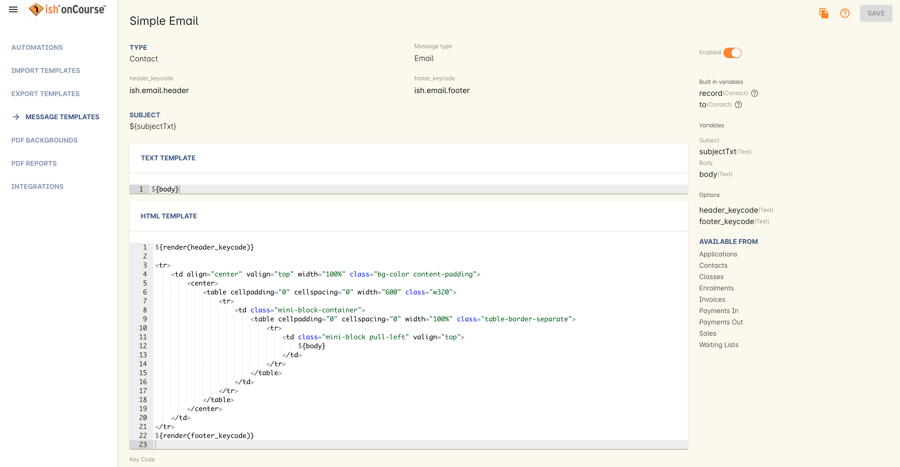
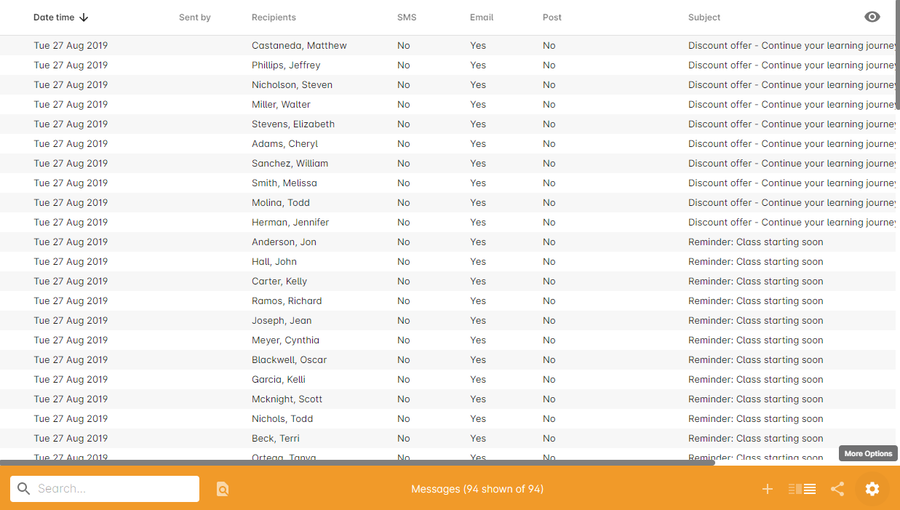
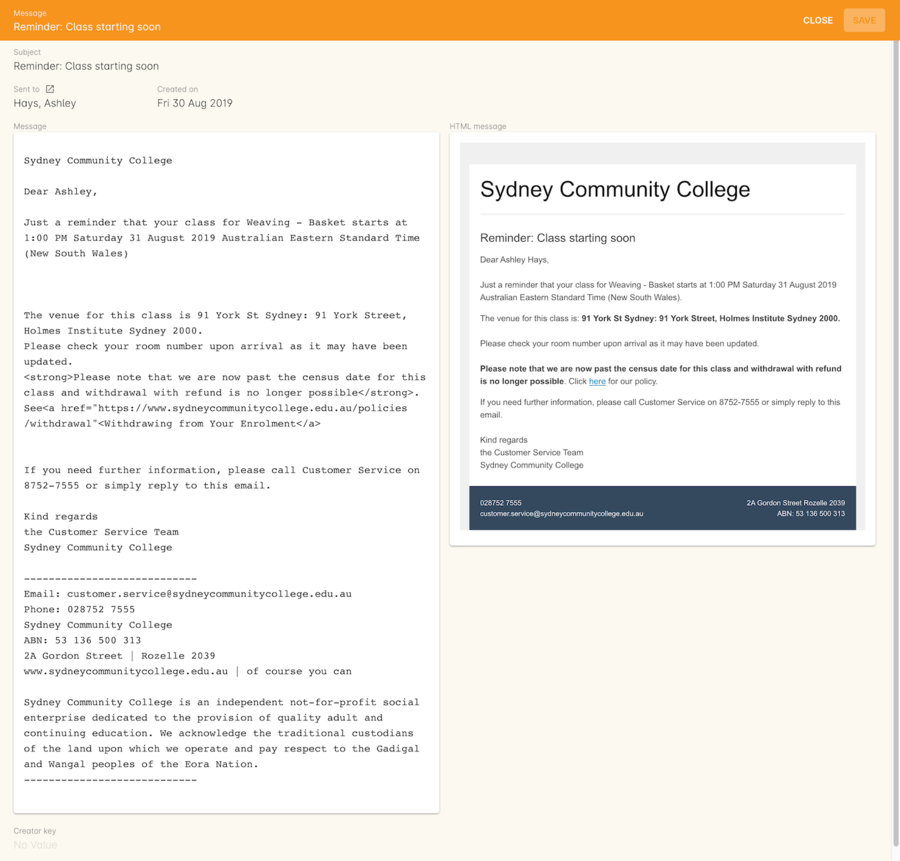
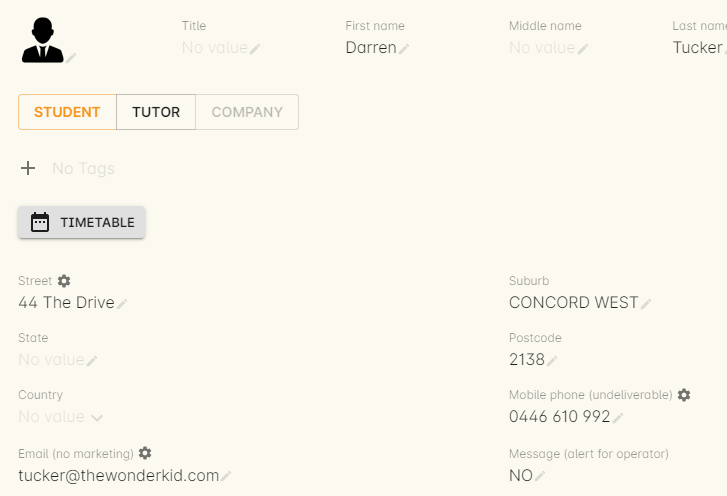
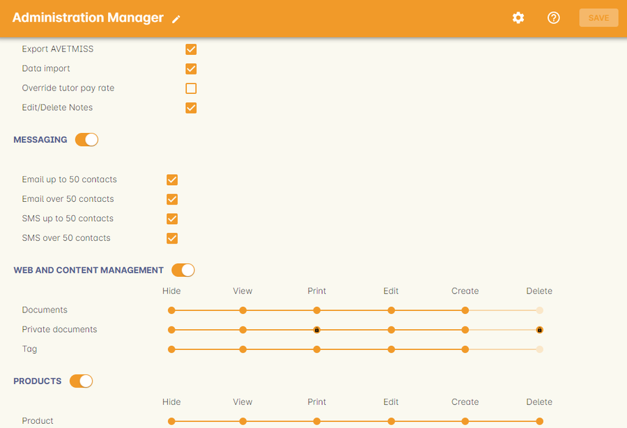
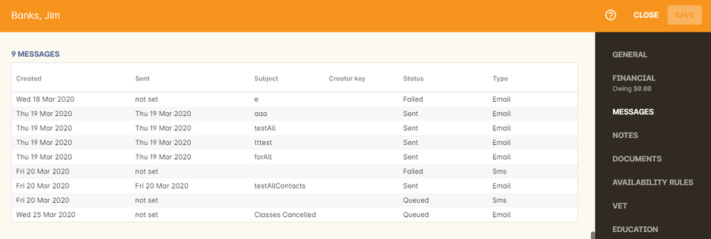

[[messages]]
== Sending messages

onCourse can send a mix of email or SMS messages to the contacts you have collected contact details for.
Contacts can also manage their subscriptions to your public tag groups via their onCourse web portal.

Whenever you create a message using https://demo.cloud.oncourse.cc/message[the onCourse interface], the collected list of contacts is automatically de-duplicated so you don't send someone the same message twice, and the list can be sent a combination of email & SMS depending on the contact details you have available.
Selected contacts without the chosen method or methods or communication available can be exported into a separate list so you can manually contact them.

Contacts who have asked not to be contacted via particular methods e.g. SMS are automatically suppressed from messaging lists.
You can override this suppression in the case of emergency contact e.g. a message to advise students that their tutor is sick and a session is cancelled.

onCourse messaging is for outbound messages only.
Inbound messages will be sent to the reply address specified in your message and will not be visible in onCourse.

[[messages-selectingPeople]]
=== Selecting people to contact

==== From contact, tutor or student lists

If you wish to find a group of contacts who have a particular history of interactions with your college, onCourse will allow you to perform advanced search functions, then use the combined email & SMS messaging tool to contact these clients.
For example, you can search for all students who enrolled in a course containing the word "french" in the last 365 days and then send them all an invitation to enrol in your new class, Provence Study Tour, prior to its public release.
Any of the standard and advanced search mechanisms in the contact list view can be used to choose people to send a message to.

Once you have made your selection, highlight the people you wish to contact and choose "send message..." from the cogwheel in the bottom right.
You can send a message in this way to 1 person or 20,000 people, and onCourse has special code to optimise delivery to very large lists.

==== From classes

Highlight one or more classes from the class list view and choose "send message to tutors from..." or "send message to student from..." from the cogwheel.
Every tutor or student from those classes will be sent a message.

==== From waiting lists

Highlight one or more records in the waiting list view and choose "send message..." from the cogwheel.
Every potential student will be sent a message of your creation.
A good way to use this is to search for all waiting list records for a particular course or group of courses.
Then send them a message to let them know a new class has just been scheduled and let them know to enrol online or call the office.
Read <<waitingLists, our Waiting List chapter>> for more information about waiting lists.

[[messages-intergratedMail]]
=== Sending an integrated mail message

The type of message you want to send depends on the Template you select in the Send Message window.
If you select an email template, you will send an email.
If you select an SMS template, you will send an SMS. The window heading will update with either Email or SMS to confirm your selection.

As emails and SMS's use Message Templates to define their styling, you do not need to type out any code when sending a message.
Simply select your template, type out your message and hit send.
The message will capture any line breaks without the need for adding HTML tags.

ish onCourse integrates email & SMS export functionality within the database.
This means that not only can you quickly contact all students who studied with you last term, or quickly reschedule a class when the tutor calls in sick, but that a full history of all these messages are stored right in the students' records.

Sophisticated bounce processing is in place for email, notifying you if a message is undeliverable.

After you have selected the list of people you wish to contact using one of the methods described in the previous section, you can begin selecting the methods which you will use to contact them.

For example, if you have 26 contacts selected in a message window and of those 26, 22 have email addresses available to contact, there will be 4 people who are listed as 'wont be contacted'.
If you have mobile phone numbers for those four people you could chose to SMS them only, by selecting the option 'send SMS' and not including people who are emailed.
By using this combined method you can reach more people via their preferred medium, or in the case of emergencies, attempt to reach people via multiple mediums.

In this example the user is sending an email using the template 'Simple Email' to 13 students. 19 are selected, but 2 are suppressed while 4 are classed as unreachable or do not have an email address.

==== Understanding email messaging

Email messaging in onCourse is managed by your own mail server.
In the Messaging section of the Preferences window, you can set up the email server address and account details.
You can also set up how bounced emails are processed.
More information is available in the <<generalPrefs, General Preferences>> chapter.

Not every email you send from onCourse will reach the intended contact.
There are many reasons for this and they include:

. The email address you collected from the student was incorrect.
This is less likely if the student enrolled online and was required to type in their email address themselves rather than have a staff member translate it from a handwritten form.
Common errors include incorrect domain names e.g. bigpond.com.au instead of bigpond.com and simple typos.
If the user account you are trying to send to doesn't exist, you should expect an undeliverable message to the 'from' address used when you sent the message and the message will be marked as failed in onCourse.
. The user's account marked your message as spam. onCourse emails are sent one at a time to your email server, so if the user has successfully received email from you in the past, there is no difference between a message sent out of onCourse than one sent directly from your own email account.
There is no notification to you if the message is marked as spam, and will show as 'sent' in onCourse.
Their spam filter may have quarantined your message for reasons like using keywords in your message body such as 'special offer', 'Dear sir/madam' or other negatively scoring terms.
Read up on keywords that are commonly blocked at
http://spamassassin.apache.org/tests_3_3_x.html[Spam Assassin]
. The user's account is full, or otherwise unavailable for accepting messages.
The user account may have been disabled by their system administrator, i.e. if an employee has left an organisation, or is possibly unavailable due to technical issues like their mail server losing it's internet connection.
Your own mail server may attempt to resend the message, depending or the response it has received.
You may see the message in onCourse remains in a queued state.
On the sixth failed attempt the message will be discarded, and you will see in onCourse the message marked as failed, and the users email address marked as undeliverable.
. Problems with your own mail server sending large numbers of outbound messages.
If you are sending many emails for an email campaign, your own mail server may have some established rules to block potential spam activity from inside your network.
Before you begin sending 500 or more messages, speak to your mail server manager and ensure there are no system policies that will prevent you from running your marketing campaign.

===== Plain text and HTML messages

Messages sent manually through onCourse use Message Templates which contain two types of email formats - plain and HTML, each contained within a single message template.
HTML messages are formatted and usually include images, hyperlinks and styled font and content.
A plain text email message is just that - it contains only plain text without any additional styling.

Message Templates can be edited in the Automation window, under the Message Templates heading.
You can create both Email and SMS templates.

[NOTE]
====
Messages sent via the cogwheel *do not* use Email Templates.
They use Message Templates.
====

==== Understanding SMS Messaging

SMS messaging is available in onCourse and can be a method of communication for any contacts with a valid mobile number.
Note that only the phone number recorded in the mobile phone field is used - if you have recorded a mobile phone number in the work or home number fields, it will not be available for SMS.

There is no requirement for formatting the mobile phone number in onCourse to make it accessible. 10 digits are standard for a mobile phone, beginning in Australia with 04. Whether or not you format your phone numbers with spaces it up to you - onCourse will strip out these characters during the outbound SMS, without modifying any of the data you have stored.

A small charge per use applies to SMS messaging, as per your onCourse contract agreement.
The outbound message from information is defined in the Messaging section of the Preferences window, in the 'SMS from' field.
Most companies use their business name here, so they do not need to identify themselves in the message body.
Like email, SMS messaging is outbound only, and if you use a name in the from field, there is no ability for the customer to respond.
Alternatively you could use a valid mobile number in your settings, if you wished to accept inbound SMS also, and remember to identify your business name in each SMS you send.

It is important to remember that SMS messages are not delivered in real time, even though most peoples experiences of mobile phones work that way.
Like email, SMS messages are handled through a delivery network but in this case delivery rules are all managed by the receiver's mobile phone provider.
Most providers give about a two day time-to-live on SMS messages.
This means if the phone is off the network (no coverage or switched off) and re-registers on the network within two days that the message was sent, then it will be received.
If the phone is off the network for longer than that, then the mobile phone provider may discard the message entirely.
There is no notification back to the sender if the message is successfully delivered or discarded.

Inside the contact record in onCourse, the message is marked as sent if it makes it successfully to the outbound SMS gateway.
Beyond that point the message can not be tracked.
Please contact ish if you find SMS messages are failing as there may be instances where the SMS gateway is experiencing a fault.

[[messages-listView]]
=== Messages list view

You can view a list of all messages that have been sent in the Messages list view.
You can find this by typing 'Messages' into the Find Anything search on the Dashboard.
This list also includes all messages sent automatically via script triggers.

In this window you will be able to see the following information:

* The date and time that the message was sent.
* Which onCourse user sent it.
* Who the recipient or recipients were.
If the message was sent to more than one recipient then the data in the column with read something like e.g. Steve Handt and 4 others.
* Whether the message was sent by SMS, Email or Post.
* The subject name of the message.

Just like other list views you have the ability to perform a search, or advanced search by using the magnifying glass icon at the top left side of the window.

You can see the full message by double clicking on one of the records in the list.
You can also find the full list of the contact that the message was sent to.

[NOTE]
====
You can't modify any of the content in the messages edit view.
====

[[messages-Exporting]]
=== Exporting contact details for other messaging tools

Using the postal export option as outlined in the previous section is the simplest way to export name, address and email data for importing data into other messaging tools.

If you require more information than what is available in this export option, you can run a standard CSV export on the contact record table and customise the output as required.
More information about exports is available in <<importExport, the Importing and Exporting chapter>>.

[[messages-optInAndOut]]
=== Messaging opt in and opt out

Students have the option to opt out of all marketing communication from your organisation, or from a particular method of marketing such as SMS.
However, if you have urgent information to convey, such as a class cancellation, you are still able to use your communication tools to contact them quickly while respecting their request not to receive unsolicited marketing emails or SMS.

During the online enrolment process, students can opt of our messaging from any type when they are providing their contact details.
By default, all types of communication are set to allow.
Student's can also log into their portal at any time and change their preferences.

onCourse users can also manually reset the availability of each of the postal, SMS and email settings using the cog wheels in the contact window.

When a contacts address has been marked as undeliverable, either automatically by repeat failed sending attempts, or manually e.g. return to sender postal mail, this contact will not be sent any further messages using the onCourse integrated messaging tool to the undeliverable medium.

Using the advanced search function, you can search for contacts who have undeliverable methods of contact and make an effort to follow them up to obtain up to date contact details.

[[messages-Permissions]]
=== Message permissions and message history

Within the onCourse Security window, an onCourse user group can be set to allow emails and SMS's to over or under 50 contacts.
This is to prevent onCourse enrolment staff, for example, accidentally sending an email blast to your entire database but allows them sufficient permission to contact all the students from a single class and advise them of changed conditions.

Each message that is sent from onCourse is also stored within the contacts record.
The message can be double clicked on to show the content of the message.
This can provide an added level of security and allow you to quickly follow up any student's query regarding a message they received from your college.
All automatic messages sent from onCourse are also recorded here.

[[messages-automaticMessages]]
=== Automatic messages in onCourse

When a student enrols in a class and an invoice is created, two automatic emails are sent from onCourse.
These emails are sent for both online enrolments and enrolments processed through the office.
Where the payer is a different person to the enrolling student, the invoice is emailed to the payer while the enrolment confirmation is emailed to the student.
If the payer and the student is the same person, they will receive two emails.

onCourse uses standard templates to send plain text emails to payers and students.
These emails can be resent from the enrolment window cogwheel or the invoice window cogwheel.
These reports can also be printed in hard copy and mailed to the student if required.
Note that the format for the printed and emailed invoices and enrolment confirmation are different, due to the different mediums they are sent with, but they contain the same information.

The automatic enrolment confirmation email includes a block of text with the class start date and time and link through to the full website description, maps, tutor profile and other details of the class.

The tax invoice which is provided to the payer shows the total amount payable, amount paid, tax applicable and amount outstanding.
For many payers this invoice is also the payment receipt where they have paid some or all of the fee on enrolment.

=== Avoiding spam filters

You want most of your outbound messages to be delivered successfully, so there are a few tips to help this happen.

==== SPF

If you have an SPF record on your domain and is is hosting your onCourse service, you'll want to add our SPF record as well.
Without this, lots of your email will be dropped.

....
include:_spf.oncourse.cc
....

==== Content

Write emails which contain substantial content and not just a link.
Spam filters analyse the words in your message for common phrases.

==== Reputation

Use a third party service like Mailchimp to send your bulk marketing or newsletter emails and keep onCourse's messaging system for procedural emails or very targeted marketing campaigns.
Mail servers classify the source of email with a reputation score and you don't want to damage yours unnecessarily.
