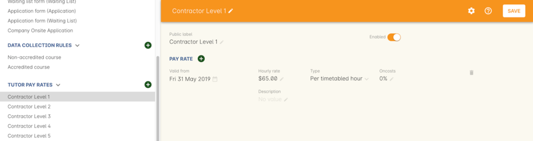
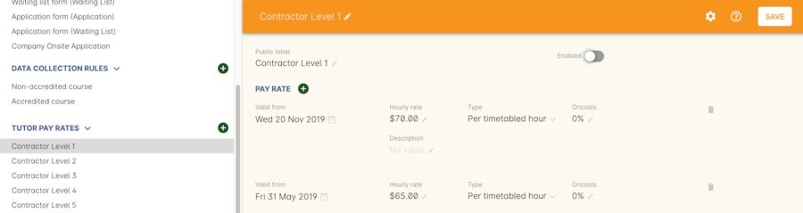
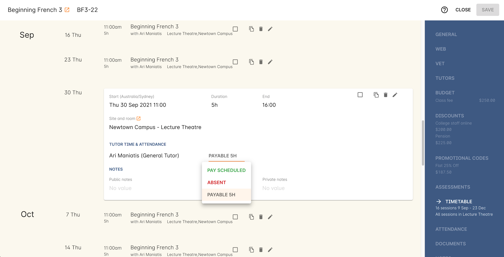
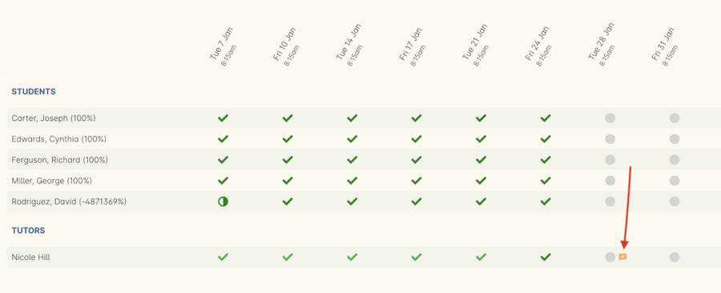
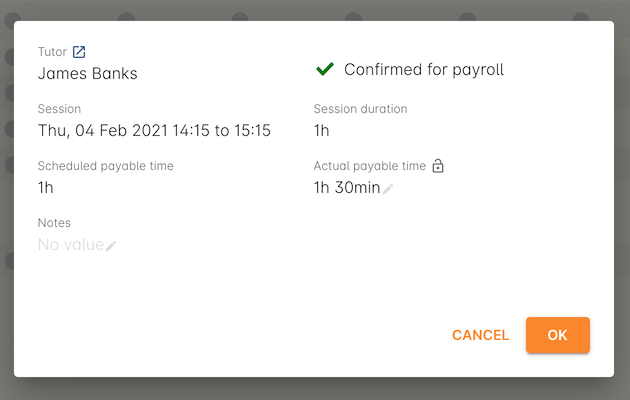
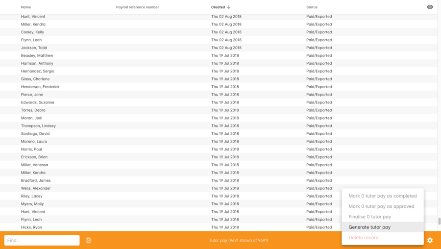
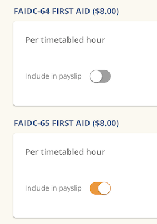
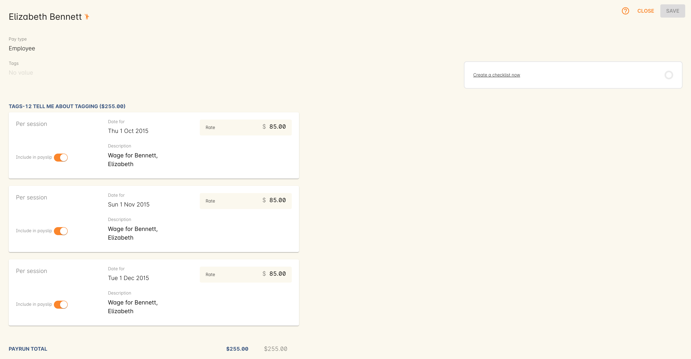
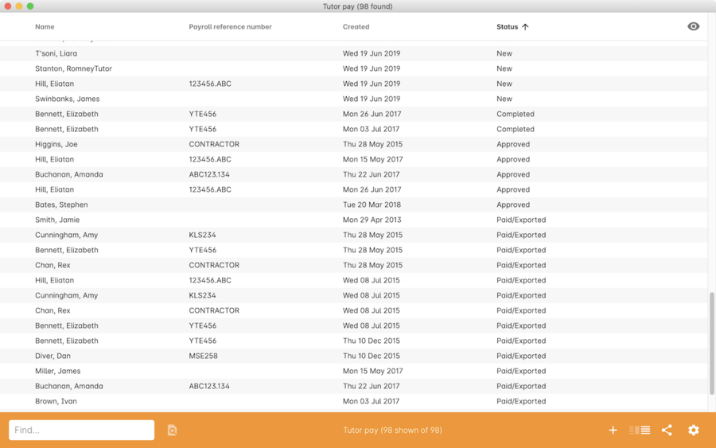
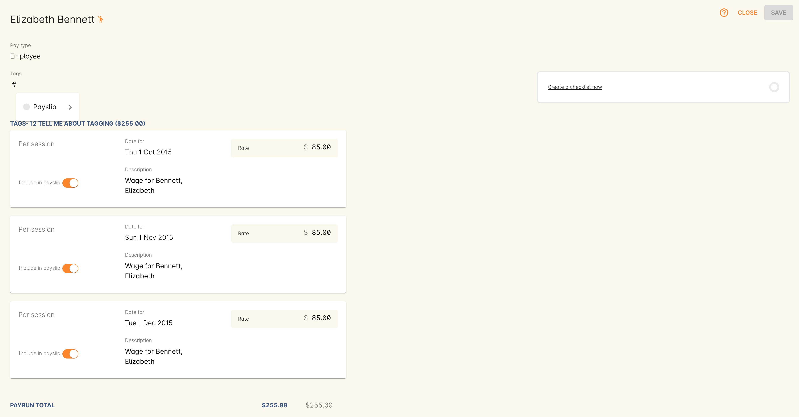

[[payroll]]
== Tutor pay

In this chapter, we cover how to set up standard rates of pay for your Tutors, how to include Tutor costs within the overall class budget, confirming Tutor attendance / hours worked and how to generate Tutor pay from onCourse.

Before you work through this section, you need to ensure you have already set up a class with a timetable and have assigned a tutor.

[[payroll-payRates]]
=== Types of pay

Pay rates can be of the following types:

Fixed::
A flat amount of pay payable to the tutor on the first day of the class. The fixed type of pay has no relation to the tutors teaching schedule in the class timetable, or number of students enrolled. A tutor who is eligible for a fixed pay type does not need to be assigned to any of the class sessions, but does need to be added to the class tutor section.

Per session::
An amount paid per session in the class timetable only where the tutor is assigned to that session. This rate is payable regardless of the duration or payable time set for the session.

Per enrolment::
A per enrolment rate of pay pays the tutor an amount multiplied by the number of active enrolments in the class at the time the payroll is run. A per enrolment rate of pay can be paid in addition to a per session, or per timetabled hour rate and may be used for additional allowances, such as an assessment marking allowance. Like fixed types, per enrolment types are payable on the start date of the class, and can be paid to tutors not attached to deliver any of the class sessions e.g. an assessor.

Per timetabled hour::
This is the most common type of pay rate used, and is based on the tutor's attendance at a session i.e. the tutor is assigned to the session, and the session duration is 3 hours therefore the tutor is paid for their rate per timetabled hour x 3 hours. There is also an additional 'Payable Time' field for each session that can override the session duration for payroll purposes e.g. to pay to an additional hour to allow for opening and closing a venue, or to pay less time than the session duration, to account for unpaid breaks. As the timetable is changed, the amount payable to the tutor will automatically increase or decrease. Fixed payroll wage types and per enrolment types can be paid in addition to a per timetabled hour rate to a single tutor in a class.

Per student contact hour::
Per student is a rate that's paid per sactive enrolment, per hour of delivery. A rate set for this type is multiplied by both the number of active enrolments at the time the payroll is run x the number of timetabled hours for each session. It is more commonly used for the provision of government funding than it is for payroll. Per student contact hour pay lines are calculated as a single wage line due on the start of the class and can be used in combination with other pay types. The 'Payable time' field in the timetable also sets the hours multiplier for this rate.

Per unit::
This is most commonly added as a secondary payment to cover variable costs like travel or food allowances. You can set the Per Unit rate as well as the number of units.

Pay rate can be assigned on oncost to take into account any additional expenses related to employment, such as superannuation, leave loading, payroll tax and workers compensation costs. Oncosts are added to the budget to reflect the costs of employment, they are not added to or displayed on the payslip.

==== Updating pay

Once a pay run has been generated tutors with pay cannot then be deleted from the class or timetable which are linked to those payslips. You can however change the payable hours in the timetable sessions and they will not update the payslips which are already generated.

If you add a tutor to additional classes or timetables and assign a pay in those class budgets, then tutor pay will be generated on your next pay run no matter how far in the past you've made that change. This allows you to correct past underpayments in payroll by just adding the correct rates within a class budget and linking them to the tutor.

If your pay rate doesn't start until today, but the class start date is prior to today, no automatic pay rate will be found when you add the Tutor to the class. You can still create a manual pay line in the class. Also, if the pay rate changes during the class progress, i.e. class spans June and July, and at the start of the financial year a new pay rate applies, that class budget information will only show the original pay rate in the cost calculations, but the actual payslip calculations will be correct as to the timing of each session and the pay rate that applied as each session was delivered.

[[payroll-defaultRates]]
=== Default pay rates

onCourse allows you to https://demo.cloud.oncourse.cc/preferences/tutorRoles/[assign pay rates] to Tutor types. These are used by default but can be overridden or edited per class as needed. So when you assign a tutor to a class timetable and give them a role of "assessor" any pay rates from that role are automatically applied.

You can assign multiple payrates for a single tutor role, each with a starting date. This allows you to plan for future award and negotiated rate changes even if that change occurs in the middle of a class timetable. onCourse will automatically adjust the pay rate on the transition date.

==== Disabling tutor roles

If a tutor role and rate is no longer used by your college, you can make the role inactive.

To make a role inactive, select the pay rate you'd like to disable and then click the 'Enabled' switch so that it appears deactivated. Inactive roles will show as greyed out in the Tutor Pay Rates list.

[[payroll-classBudget]]
=== Class budget

Once you have defined the default pay rates for the various classifications of Tutors you employ, you can use these to automatically add wages costs to your class budgets. You can do this by adding Tutors to classes. You can learn more about that in our <<classes-Tutor, Classes section>>.

[TIP]
====
If you do not know who the individual Tutor will be in advance to your class scheduling, we recommend you set up a Tutor named something like 'To Be Advised' whom you can assign to classes. This will allow you take wages into account in your initial class budget and viability calculations. When you know the name of the individual who will be running the class you can replace TBA with the actual Tutor, and make any changes to their pay rate as required.
====

[[payroll-attendance]]
=== Attendance

Not only is attendance used for students, it is also used to generate the tutor payroll at the default rate scheduled, or record whether they stayed for longer or shorter than their scheduled time. You must confirm tutor attendance for payroll to be processed, either by setting it manually or allowing the 'generate tutor pay' process to set all unmarked attendance as payable.

Tutor attendance can be set for each session in the class Attendance section. Attendance can only be confirmed for sessions that the tutor is assigned to in the class timetable.

. Open a class record and navigate to the attendance section.
. For each session, click on the attendance field and set the appropriate attendance. Click once to confirm payroll for that session/date (the tutor should be paid the scheduled rate), twice to reject payroll for that session/date (the tutor should not be paid for this session). Three clicks will set the session back to not confirmed.
+
Attendance can also be set in bulk by clicking on the downward arrow icon next to the tutor name or a class date and choosing one of the options from the drop down.
+

To change the payable time for a session to more than or less than the scheduled payroll time:

. Click on the note icon to the right of the attendance icon. This icon appears when move your you mouse over the area.
+

. In the sheet that opens, you will see the default payable time (minutes) with a locked icon next to it. Make sure the tutor is confirmed for payroll. Unlock the field to change the value. You can also optionally add a note to explain the payroll variation.
+

[[payroll-payslips]]
=== Generating Tutor pay

onCourse generates Tutor pay records in bulk, up until a specified date, based on the wages set in the class budget and the class attendance records for Tutors.

Tutor pay is run for payslips up to and including your defined date. It's best to use yesterdays date if you do not want todays payslips included.

If payroll has not been confirmed in the classes for the individual sessions, then tutor pay will not be processed. However, you can use the 'generate tutor pay' function and confirm in bulk all currently unconfirmed sessions. To generate tutor pay, simply:

. Open the Tutor pay window
. Click the cogwheel and select the "Generate tutor pay"
+

+
. Enter the date you want the payroll run until. The date chosen _will be included_ in the pay generation. A count of the confirmed and unprocessed wages and the unconfirmed wages will display on the sheet too.
+

+
. Use the open related icon to see all the classes that have unconfirmed tutor wages. You can then print reports from the classes list view to ensure your course coordinators mark their tutor payroll confirmations.
. You can choose to proceed to only process wages that have already been confirmed, or by clicking 'confirm now', automatically set all unconfirmed sessions to confirmed so the payroll can be processed. There is no undo option from here, so proceed with caution.
. Press save and wait until a new list view, showing all newly created Tutor pay records is displayed. They will have a creation date of 'today' and will be marked with a status of 'new'.

onCourse assists you to view the payslips by tutor with the Payslip report. This report is a summary of the payslips by classes, session, and can be run against a single tutor, a group of tutors, or all tutors.

[[payroll-status]]
==== Status

The status of a tutor pay record relates to where it is in your payroll workflow.

New:: This is a newly created entry and can be edited or deleted as required.
Completed:: This is for records that have been initially reviewed, had any additional custom pay lines attached and is now ready for final approval.
Approved:: This record has been reviewed and is approved for payment/export.
Paid/Exported:: This record has been exported and is considered paid. The record cannot be edited or deleted.

[[payroll-aboutTutorPayRecords]]
==== Tutor pay records

Once Tutor pay records have been created they can be edited. Each Tutor pay record has a list of items grouped by class and based on the relevant attendance/wages/sessions for that class. Payslips can only be edited with they have a status of 'new'. Once you finalise or export them they become locked.

Switching off the 'Include in payslip' option will remove it from being paid in this payroll cycle. The next time you run a payroll it will be added to the tutor's payslip again.

Additional custom or manual Tutor pay items can be added to the payslip by clicking on the + next to 'Add new custom pay item'. Add a description and the payment amount then save the record.

Tutor Pay can be modified until it is finalised. To finalise a Tutor pay record select it and choose "Finalise Tutor pay" from cogwheel menu. The finalised Tutor pay records display status "Paid/Exported".
These pays can no longer be edited or deleted.

You do not want to automatically confirm all sessions for payment if you have a manual process where you confirm each session at a time. It is perfectly ok to proceed to process the payroll with unconfirmed sessions. Those that aren't confirmed will not be processed until they are.

[CAUTION]
====
Tutor pay can have following statuses: New, Completed, Approved and Paid/Exported.
Only a status of "Paid / Exported" prevents the editing of the record.
====

[[payroll-employeesContractors]]
==== Managing employees vs contractors

As the onCourse payroll functionality is a time and attendance calculation, rather than a complete payroll system that calculates income tax and leave allowances, both employees and contractors should be treated in the same way within the system.

If you are exporting the tutor payslip data from onCourse into your primary accounting system to complete the final stages of the payroll process, you will want to be able to clearly identify your employees and contractors.

In the onCourse tutor contact record, on the section labelled tutor, you can enter a payroll reference number. This number is shown in the list of payslips generated. Often employees and contractors will have different types of identification numbers, for example all employees may have a unique ID from the primary payroll system used to match them on import, and contractors have the label 'contractor'. In the payslip list view, this makes employees and contractors easy to identify.

You may then select your employee payslip records and export and finalise them, locking the payslip from further adjustment and locking the attendance and approval data for the included pay lines.

Employee payslips may be exported from onCourse and marked as finalised on a fortnightly basis, but you also need to keep a track of your contractor invoices - have they been issued to you as expected, and do they match the amount you budgeted for?

In this case, having time and attendance payslips generated for your contractors gives you the data you need to compare against the invoice you receive. These contractors may not invoice you on the same cycle as employees are paid, even though onCourse will create the payslip data for them on the same cycle. However, by having the payslip data in onCourse with a status of 'new' provided you don't finalise that payslip, each fortnight when you run the generate pay process, the contractor payslip will be added to.

This way, over time, you may have eight weeks, or four pay cycles of contractor data in a single payslip which matches their eventual invoice. When the invoice is received, you can compare it to this payslip, and the finalise the payslip that matches your invoice.

You may choose to defer some pay lines if they aren't included on the invoice received, and that is fine, it means they will come back again the next time you run a pay cycle, but this time on a new payslip.

[[payroll-tagging]]
==== Tagging Payslips

Payslips are taggable to assist you in creating your own custom steps for handling payroll processing. For example, you might have tags like:

* Awaiting approval
* HR to review
* PAYG
* Waiting tutor invoice
* Exported

==== Creating payroll through the class window

You can also create payroll through the cogwheel menu in the Class list view. You can either generate pay for selected classes that you click on to highlight, or if no classes are selected, pay will generate for all classes. Once the classes are selected, click the cogwheel and select Generate tutor pay.

[[payroll-securityAccess]]
=== Payroll access control

A number of access control options exist around the tutor pay functions, so you can ensure that only users with the appropriate permissions have the ability to create, edit, approve or override pays. See <<advancedSetup-accessControl>> for more information on setting up Access control.

Tutor Roles::
permission to view, edit or create new tutor roles and pay rates
Tutor Pay::
permission to view, edit or create payslips
Override tutor session payable time::
permission for the payable time to be overridden at the session level from the scheduled payable time
Bulk confirm tutor wages::
permission to automatically approve all un-approved sessions for payment for the next pay run
Override tutor pay rate::
permission to edit the tutor pay rate to a value different to the tutor role default when a tutor is assigned to a class

[[payroll-FAQs]]
=== Payroll Questions and Answers

*Q:* Can I have multiple tutors teaching, and being paid for the same session?

*A:* Yes, you can assign many tutors to a session. Each tutor is attached to the class with their own payroll type and rate, and this is the rate that will apply to them as they teach the session. Each tutor attached to the session will be paid their rate multiplied by the session's payable time, in the case of per timetabled hour pay rates.

If the tutors attached to the session have different payable times due to them i.e. only one of the tutors is paid an extra hour for opening and closing the venue, then use the tutor payroll confirmation in the class attendance section to vary the payable time for each appropriate session for that tutor only.

Tutor payable time can be either increased or decreased from the scheduled session time.

*Q:* I have a five hour class, with one tutor teaching for the full five hours, and other teaching only for two of those hours. How do I record their different payable times?

*A:* There are a few options available here, depending on how you wish to present the class timetable to the tutors and students attending. One option is to break the single five hour session into a three hour and two hour session, and assign the five hour tutor to both, and the two hour tutor to their session only. The class budget will then show the correct expenses for tutor wages. The benefit of this approach is that both tutors will see the times they are expected to be teaching in their timetable. Your onCourse website will slightly alter the display of the class details block when you have broken a day into multiple sessions so it is clear to potential students what the delivery structure looks like and what the class start and end times are.

A second option would be to keep the single five hour session and have both tutors assigned. The two hour attending tutor, instead of having a per timetabled hour rate could have their wage line overridden to a per session rate, that you manually worked out to be the per timetabled hour rate x 2. This will give you the correct class budget payroll expenses, but the two hour tutor will see in their timetable that they are 'teaching' a five hour session.

A third option would be to keep both tutors assigned as above, but use the attendance marking function for the two hour attending tutor to mark their payable time to be 120 minutes only. This option will generate the correct payroll for the tutor, but the budget will show that you expect to pay them for five hours of attendance, not two, so will be overestimating the class costs. The tutor timetable will also show that the two hour tutor is 'teaching' a five hour session.

*Q:* A tutor called in sick and was replaced by a casual. How can I reflect this so they are not paid for that class session?

*A:* You can either untick the tutor from the session who didn't attend or mark their attendance record with a red cross (rejected for payroll). Either option will prevent a per timetabled hour or per session payroll type being generated for them for that particular session.

You can then add the casual who filled in for them to the class and just assign them to that session and ensure the appropriate wage line is added to the budget for them (it's best to untick the option 'add selected tutor to all class sessions' when you just want to add a casual replacement tutor to a single session)

*Q:* Our award requires the tutors to be paid for a minimum of two hours per session, but the session is only one and a half hours long. How can I pay them correctly?

*A:* The payable time field in the session on the timetable is the first option for overriding the pay, so you could increase this from the default session time of 1 hr 30 mins to the two hours you want the tutors to be paid. This would then show in the budget the correct costs for the tutors wage.

Alternatively, you could override the tutor pay rate from the normal per timetabled hour option to a per session option where you manually worked out the 2 hour rate. This would also keep the budget accurate.

The other option would be to use the session by session payable time value, and increase their payable time from 90 mins to 120 mins, so the correct pay was generated, however it wouldn't affect the budget projection, which would keep their estimated pay amount being multiplied by 1hr 30 mins per session. This is a better choice if you had two tutors assigned to the session and only one of the tutors was affected by this award condition.

*Q:* Our award requires tutors to be paid an additional 20% of their normal hourly rate when they work 4 hours or less.
How can I calculate this?

*A:* There are a few ways you could approach this change of rate.

One option would be two have two different roles which each had two different per timetabled hour rates e.g. Tutor Part Time, $40 per timetabled hour and Tutor Casual with a rate of $48 per timetabled hour. You would then choose the appropriate role and rate when you assign the tutor to the class, knowing it's daily session duration and if they are being paid at the Part Time or Casual rate.

The second option is to use a single rate, but for the sessions with a 4 hour or less duration, to add 20% more time than the session duration to the session payable time. 20% of an hour of payable time is 12 minutes, so if they are working for 3 hrs, you could pay them the Part Time rate for 3 hrs and 36 min payable time to get 3 hours of payable time at the Casual rate.

Keeping in mind that a tutor in onCourse has a role and rate which applies to all of their sessions for that class, so using an increase in the payable hours is a good option if the session duration, and appropriate pay rate, varies during the class. For example if the first 9 sessions of the class are 6 hours long, so the tutor is paid at the Part Time rate, but the last session is an exam and only 3 hours long, so the tutor should is paid at the higher per hour Casual rate for this session only. This is where changing the payable time to 3 hrs and 36 mins would be most appropriate.

A final option, if trying to calculate the difference in payable time to arrive at the new rate is too complicated, is to add a second wage line to the budget for that tutor for a fixed rate of the extra amount they should be paid. In this example, for the final 3 hour exam session, the tutor would be paid an additional $32 on top of their normal hourly rate. Remember that if you choose this option, the fixed amount will show up in the payroll run for the first class session, as all fixed rate types are payable on class commencement. You can use the untick option for that line in the payslip to remove it on every payslip generated until the pay run when you want it to be paid, but this requires a little more manual intervention.

*Q:* Our tutors are paid a fixed daily rate when they work between 6 and 8 hours. How can I set this up?

*A:* onCourse does not have a concept of a daily rate. A per session rate may be an appropriate way to express this provided your class timetable has only one session per day.

If single day in the class timetable is often broken into multiple sessions, expressing the daily rate as a per timetabled hour rate would be more appropriate. For example, if the daily rate was $300, you may choose to express this as a per timetabled hour rate of $50 per hour, and you would then ensure all classes with a daily duration between 6 and 8 hours have the payable time per day set to 6 hours.

If your teaching day started at 9am, finished at 4pm and the day was broken into 3 x 2 hour sessions with gaps between them for breaks, the default payable time would be the same as the session time, so you wouldn't need to alter anything and the daily rate would be calculated correctly.

If your teaching day started at 9am and finished at 5pm with a single session having an 8 hr duration, you could adjust the payable time to 6 hrs so the daily rate would calculate correctly.