[[processingEnrolments]]
== Processing Enrolments

[[processingEnrolments-Definitions]]
=== Terms and Definitions

Checkout is a tool available to you in onCourse, it allows you to easily enrol a student into a class in just a few steps.

Enrolment:::
An enrolment is an instance in which a person has elected to partake in a class for different reasons, they will supply their details and this will be stored in the onCourse database.
Invoice:::
An invoice is a record/document that represents income of some sort.
This can be an enrolment into a class or other goods and services provided.
An invoice is basically a bill.
Payment:::
A payment is an instance in which money owing has been successfully taken from one party and transferred to another.
Student:::
A student in onCourse is a type of contact, one who is currently or has previously been enrolled into a class and is being taught by another person/resource.
Payer:::
A payer is someone who has personally paid an invoice for an enrolment in a class.
It is important to note that a payer does not necessarily need to be the person taking the class, or even an individual for that matter.
They can be a relative, friend, manager or company.

[[processingEnrolments-quickEnrol]]
=== Working with Checkout

You can access Checkout from the Favourites section of the Dashboard, or by typing 'Checkout' into the Find Anything search on the Dashboard.
Checkout is the only window that cannot be removed from the Dashboard Favourites view.

Checkout is a tool in which you can enrol students into classes.
Most of the fields have auto complete functionality which means when you start typing, onCourse starts finding students that start with that name, and will display the results on the right hand side of the window.

The following will identify the different elements of the Checkout window, and what their purpose is, the left side of the windows allows you to search for previous records that are stored on your database, where the right side houses the fields and functions.

* *_Shopping Cart_*: This first section is where you select the contacts being enrolled or sold too, and the items (either courses, products etc) being sold.
Once done, click the Summary section in the left-hand column to move on to the next step.
** *_Contacts_*: This field allows you to add a new contact or search for previous contacts that are already stored on your database, they can be a student, a tutor or a company.
Type the surname to search, then select the contact record from the list on the right.
The name will be added under the Contacts.
** *_Items_* This field displays all courses, memberships, vouchers and products.
Type the name of the course or product, or the code, to filter the search.
+
For Courses, select a course to see a list of upcoming classes with details and a price.
Click the class to add to the cart.
If the course contains classes that are already finished, they can be viewed by clicking the 'Show Finished Classes' link at the top of the search results area.
These can also be added to the cart.
+
For Products, Vouchers and Memberships, click the record you want to add.
The details will be shown in the search result window, while the record will also be added to the cart.
* *_Summary_*: This section displays the summary of what's been added to the cart, who the defined payer of the invoice being generated is, and the . You can select or deselect items for different contacts here, useful for when you are enrolling multiple people at once in different courses.
This also has the Discounts field, where promotional codes can be added and removed per line item.
Once you're done, click the Payment section in the left to move on to the final step.
** *_Discounts_*: Enter any promotional codes for discounts into the Find Promotions field.
If they are entered correctly, the discount will be automatically applied to the items it should apply to (as defined in the discount record itself).
The name of any discounts applying to the cart will appear in the left hand column, just below the Find Promotions field.
** *_This Invoice_*: This section shows you the make-up of the current sale, including each line item and which contact it's attached to.
You can review each line item by clicking it to expand the section.
You'll see a Studey Reason question that can be answered here.
You can also edit the discount per line item by clicking on the line item, then selecting an invoice from the drop down box.
If there's no discount to select, it will show 'No discount'.
* *_Payment_*: This is the final step in the checkout process.
Here you can see the payer's (the contact defined in the previous step) previoud credit available, and any amounts owing from previous invoices as well.
You can organise payment plans, and then once you're ready to complete the payment, select a payment type.
If you have a payment plan with more than one payment in place, and you select payment type Credit Card, you'll be shown a special checkbox that allows you to automatically deduct future payment amounts from a saved credit card.
** *_Previous Credit/Owing_*: Both of these sections are clickable, and will shows you either any available credit that can be used by the payer, or any invoices from prior transactions with owing amounts.
By default all of these are ticked in both sections, so make a habit of going into this section before finalising payment and ensuring you're apllying the right invoices and credit notes to the transaction.
** *_Payment Plan_*: The payment plan lays out in a simple way how the current invoice is going to be paid off over time.
There can be up to three parts to a payment plan (Pay Now, Pay by date, and Pay Later).
+
Pay Now means this is the amount to be paid upfront right now after taking into account any applied previous credit and debts.
If you change the Pay Now amount to an amount less than the amount owed in the current invoice, then a Pay by Date step will appear.
You can add any many if these steps as you like, just edit the amount payable on the prior step to create a new one.
You can either use the date set by the system for the next payment, or you can set your own date by clicking the field.
The last step is called Pay Later, and will only appear if there is an owing amount on the payer's account that is not expected to be paid in the current transaction.
** *_Payment Method_*: This is where you select the method of payment.
If you select Credit Card, this will open the online payment gateway where you can enter the details.
Any other payment type will allow you to confirmt eh payment amount and then hit Finalize Checkout to complete the transaction.

[[processingEnrolments-Creating]]
=== Creating an enrolment with Checkout

This section will provide you with clear and concise instructions on how to achieve certain things within Checkout, like enrolling a student.

Every Checkout process generates an invoice, even if there is no payment involved.
Sometimes, this invoice will be for $0.00, for example if there is no cost to enrol in the selected class.
Sometimes the invoice will be paid in full on enrolment, and also be a receipt of payment.
Sometimes the invoice will be partially paid or not paid at all.
The default setting for Checkout to default payments to full payment or no payment is set in the Financial Preferences window.

When processing an enrolment via the onCourse client, it is possible to issue an invoice to the customer who won't be paying the course fee at the time of enrolment, even if your usual preference is set to pay in full.
This is done by changing the payment method to 'no payment' from the default option 'credit card'.

* A contact can be a student or a payer, a company can be listed as a payer but can not be a student.
* Student names can be entered in this fashion: "Smith, John".
When you type a comma, the auto complete looks up all students with "Smith" as a surname.
As you continue to type letters of the first name, the list is reduced.
* You can also type student names like this: "John Smith".
When you do this, the auto complete feature will not start showing you choices until you have typed a few letters of the student's surname.
* If the student you are enrolling has a contact record at your college, you can select them from the list on the right hand side of the window.
* When searching for a students record a list will appear on the right of the window, you will see their full name, suburb, date of birth and email address, to assist you in selecting the right record.
+
[NOTE]
====
The USI field will be disabled along with you not being able to change student name of date of birth, in Checkout, if the USI has been verified.
====

* If the student you wish to enrol is new to your college, you can select the option "New contact..." which will appear on the right hand window when you click on the 'Enter contact...' field.
* Once you have selected your student, you will see their information in the Checkout window, this is the same information you see in their contact record, you can then make changes to any of the contact details, notes or AVETMISS information as needed.
* If there is a third party payer you will need to add them as a contact and create a relationship to the student.
This can be found at the bottom of the page under the General tab in the contacts record, it will say 'Above contact is X of the payer'.
* When you complete the enrolment, the changes will be saved.
If you cancel the enrolment, your changes will not be saved.

==== How to create an enrolment - Checkout Basics

[NOTE]
====
The most important thing to remember about Checkout is that all enrolments processed in a single onCourse Checkout process generate one invoice to a single payer.
This could be for one student enrolling and paying for themselves in one or more classes, or another contact enrolling and paying for one or more students to enrol in one or more classes.
*If two friends are enrolling in a class together and paying separately, you would process their enrolments as two separate Checkout processes.*
====

. Open "Checkout"
. In the "Enter contact..." field, type in a name of the contact you are trying to enrol.
If the correct contact populates on the right hand window, then select them and they will be added to the cart.
If the person you need is not in the system, you can create their profile by clicking on the 'Create New Student' button on the right hand side on the window.
Complete their contact detail information, then click Save.
+
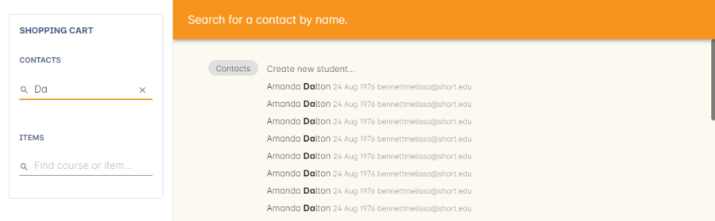
. After the contact is selected, click on the "Find course or item" field on the left hand side.
. Here you enter the items you're selling; either a course, product, membership or voucher.
You can type the name or the code of any product and it will appear in the search result in section to the right.
. If searching for a course, once the course is located then selected, a list of the upcoming classes for this course will be shown, click a date to add it to the cart.
By default, only current and future classes will be shown however you can also show and select old classes by clicking the 'Show Finished Classes' link at the top of the window.
Similarly, if you want add an old class to the cart, you can do so by clicking it.
. If adding a MEMBERSHIP, VOUCHER, or PRODUCT, search for a name or SKU code, and then click on the choice to add it to the cart.
Repeat this as many times as you need to until everything is added.
You'll set Product quantity in the next steps.
. Once the cart has all the contacts and items added, next we need to review the invoice, so click Summary in the left column.
. If you have either a voucher or promotion code you can input this into the 'Find promotions' field under the Discounts header.
Enter the promo code, it will validate automatically.
If nothing appears, the code was incorrect.
If the code is correct, a discount will appear underneath the Discounts header.
You can click the discount to review the record.
. Click 'This Invoice' to see the details of the current transaction being performed.
Here you can set the payer, set who's being enrolled in what course, and set the quantity of any products that were added to the cart.
Review everything here before moving on to the final step by clicking 'Payment'.
If 'Payment' doesn't appear below the Summary, then you haven't assigned all cart items to contacts and will need to do so before advancing.
. The Payment window is the final step in the checkout.
Here you can finalise the payment, including whether or not to apply any previous credits or debts to the current transaction.
To review any credits on their peyers account, click 'Previous Credit', and then click the checkbox next to any credit note you'd like to apply to the current transaction.
Similarly, to apply any additionally owed invoices to the current transaction, click 'Previous owing' and click the checkbox next to any owing invoices.
This will all be collated in the payment plan.
. The Payment Plan appears below the previous credit/owing sections.
Pay Now is the amount expected to be paid in this current transaction, with any additional credits or invoices applied.
If you aren't accepting full payment straight away, you can edit the amount in this field and it will add a second field with a date and the remaining amount.
You can change this date and amount and add as many additional payments as you like, until the invoice is paid in full.
Anything listed under Pay Later is an amount owing in the future that does yet require payment.
. Lastly, select your payment type.
Credit Card will open the credit card payment portal in the section to the right.
Enter the details and click Finalise Checkout.
Any other payment method will simply show the amount to be paid, and a Finalise Checkout button.
Complete your transaction and then click the Finslise Checkout button.
. You will see a Transaction Successful screen along with a snapshot of the invoice just paid.
You can now close the tab.

==== Discounting the enrolment fee

When processing an enrolment through Checkout, you can discount course fees by using a pre-created discount.
When a discount is applied to a class, it can be automatically offered to people who meet pre-defined criteria, e.g. seniors, people who hold a certain membership, students re-enrolling within a defined time period or students enrolling in a defined date range.
You can also apply one manually by checking the Discount drop down box within the class invoice line of the Summary.

More about concessions and promotions can be found in the
link:concessions.html#concessions-whatIsAConcession[Concessions and
Memberships chapter]

If an automatic discount has been created, the student meets the requirements of the discount and the class they are enrolling in has been set to allow that type of discount, then the discount will automatically be applied when they enrol.

If a student is automatically eligible for more than one type of discount, the higher discount will be applied.

You can also manually switch to a lower, eligible discount or override the discount amount applied.

==== Adding a promotional code

Promotional codes can be used by students enrolling over the web and by administration staff via onCourse Checkout.
In both instances, the code word must be supplied for the student to gain access to the discount.

When processing an enrolment, enter the code in the 'Enter voucher or promotion...' field, and press the + button next to the field in Checkout.
This will then discount the eligible classes as appropriate.

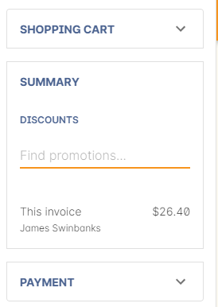

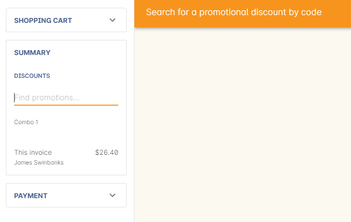

==== Reviewing the invoice in the Summary

To review the tax invoice, you must click on the Summary section below the cart.
Here you can set who is being enrolled into what, who is paying for what, and who is getting what.

. If you have more than one contact added, you can choose who the payer is by hovering thew mouse over their name and clicking the 'Set as Payer' button.
The payer is identified by the 'Payer' label next to their name.
. Any enrolments or products you have already added to this Checkout will be itemised automatically on the invoice, with any discount or tax applied.
You can review this by clicking the invoice line to expand it.
. You can set the quanitity of any product in this screen
. Set who will receive confirmation emails.
In the example below, both Adam and Adam's employer, who is paying for the enrolment in two classes, will receive confirmation emails.
As the payer, only Adam's employer will receive an invoice.
. Set any public notes or customer reference number you'd like to add to the invoice.
Public notes will appear on the top of any invoice PDF you generate or print out, but do not appear in the default invoice emails sent out.

An example of the Summary section of Checkout

==== Manually adjusting the price of an enrolment using discounts

Sometimes you need to manually adjust the price of an enrolment for one reason or another - perhaps you cancelled a class that was sold using a discount that's no longer valid and you want to offer that discount to those re-enrolling.
To do this, the class needs to have a valid and eligible discount attached to it.
If it does, you can manually adjust the discounted amount within the Summary section of the checkout.

In the summary, click on the enrolment and check there is a discount available.
If there is, you'll be able to click the padlock next to the price and enter a new price.
The breakdown of the new enrolment fee will be displayed and this will be updated within that class's budget.

==== Adding a 3rd party payer

To add a 3rd party payer to a transaction:

. Add the student contact to the cart
. If the third party is already related to the student you have added, you can find them quickly by clicking Find contact field after already adding the related contact - they will appear already in the right without any searching required.
+
Jim's Company appears as his employer because the relationship has already been defined in each contact record.
. If the contact is not currently related to the student, to add the payer to the enrolment, add them as a contact in the same way as you added the student to Checkout.
You do not need to enrol them in any classes, however, if they are a friend or family member they may be both enrolling and paying.
. You can create a relationship between contacts at this point within the newly created contact by scrolling to 'Relation' inside the new record, clicking the + button then searching for and adding the contact and relationship.
When done, hit Save.
+
Setting up a contact relation
. Set the classes for the student(s) as per the usual process, then go to the Summary section
. In the Summary, hover your mouse over the payer's contact name and click 'Set as Payer'.
That will set this contact as the payer for this invoice.
. When finalised, the invoice will only go to the payer.
The enrolment confirmation will go to the student(s) enrolling.

==== Enrolling multiple students in multiple classes

Checkout can be used to enrol many students in many classes, provided they are all being paid for by a single payer.

In this example, two students from the same company are each enrolling in two classes.
Both students are attending one class together, and then they are each attending another, different class.

. Add the students and their company to Checkout
. Add the classes that each student will attend, even if both aren't attending all the added classes, you can assign them in the later step.
When you're done, go to Summary.
+
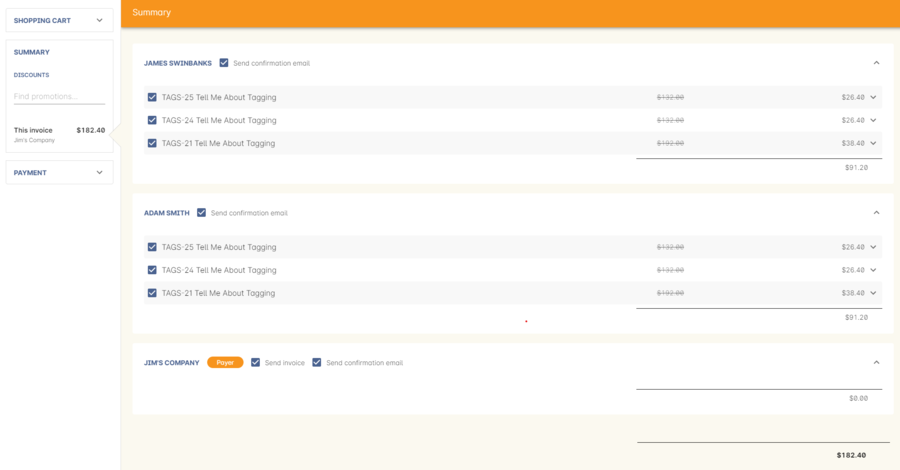
. In Summary, each class added to the cart will be shown under each student.
Make sure there's a checkmark next to each class the student will be enrolled into.
. Hover your mouse over the name of the company.
You'll see a 'Set as Payer' button appear, click it to set the company as the payer.
. When everything is set, move on to Payments.
You can accept payment as you normally would.
The invoice will go to the company contact, while the confirmation emails will go to the students.

==== Enrolling a student in credit or debt

To enrol a student in credit or debt basically means that the student (when the student is the payer) you are about to enrol owes your organisation money through unpaid or partially paid fees, or your organisation owes this student money via an onCourse credit note, perhaps because the student cancelled an enrolment in a prior class.
To achieve one of these you would need to make sure the following:

. The student must have been previously enrolled in a class.
. The student must have accrued either credit or debit depending on their previous engagements with your organisation.
. Once trying to enrol the student, you will notice the amount either in "Previous credit" or "Previous owing" in the Payments step of Checkout.
. If the student has credit to their name, then the balance outstanding will be less than cost of the enrolment.
The student may use all or some of their credit during this enrolment.
If the student has insufficient credit available to cover the cost of this enrolment, they can pay the balance outstanding as per a standard enrolment.
. If the student has a debt, and your financial preferences are to pay the enrolment in full, then the default payment amount will be the total they owe.
As per the previous section 'How to review a contact's invoices', you can choose which, if any, of the outstanding invoices you wish to pay now.
. Keep in mind the outstanding balance in any Checkout will be the balance of the payer's account.
For many enrolments, the payer and student are the same person.
However, if the payer is another person or company, their credit can be used to pay for another student's enrolment.

=== Funding Invoice

Funding Invoice is a second invoice created with the purpose of tracking funded training payments.
This section _will not appear_ unless your new enrolment meets the following criteria:

* It is a single enrolment
* the class being enrolled in has a default funding contract that isn't 'fee for service (non-funded)'

If you don't wish to use this section, you can flick the switch at the top of the window to disable it and continue on to the Payments window.

To learn more about the function of funding invoices, look at <<rto_funding-invoices>>.

[[processingEnrolments-paymentOptions]]
=== Checkout payment options

By default the first contact is nominated as the payer.
If you wish to switch this to another contact, in the Summary hover your mouse over the name of the contact you want to set as the payer and click 'Set as Payer' button that appears.

If a third party, such as an employer or agency are paying the fee, and if the payer has any amount outstanding, that information will be added to the total fee.
You can choose to pay the full amount owing, zero, or a portion of the amount owing by editing the 'Pay Now' price that appears in the payment section of the checkout.

If a voucher is being used to pay for an enrolment, you need to add the voucher before choosing how to pay any balance outstanding by an alternate method.

If your financial preferences for the class are set to pay in full, but you are taking a partial payment now, you can edit the amount the contact wants to pay at this time by clicking on the pen icon above Pay Now and editing the amount.
This will add a new payment to the payment chedule where you can set the amount and the due date.
You can add as many additional payments as you like, but the amount must add up to the invoice total.

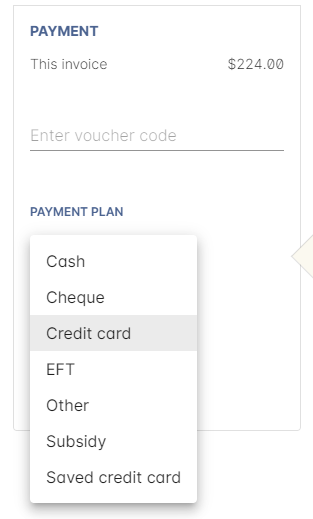

There is no default payment type, you must always select one.
Select or change the payment type by clicking on the drop down box under the Payment Method header and clicking a selection.

Anything you record as a payment at this point should only be a payment you have received right now - this is not the place to record the way the student is intending to pay at some point in the future.

You can only select Credit Card in onCourse if you have a merchant account linked to onCourse for taking direct payments.
If you do not have a merchant account linked, and you take a credit card payment via your EFTPOS terminal or another online gateway service, you will need to record that payment type as EFTPOS or other.

If you do have a merchant account linked to onCourse and you select credit card, the secure payment gateway will appear.
The enrolment save process will not complete until the bank validates the card number (see below for more details on how this works).

If the payer has a saved credit card on their contact record, you can select 'Saved credit card' to attempt payment against that saved card.

==== Applying previous credit or debt to a payment

In the Payments section you can review any other unpaid invoice(s) that are connected the Checkout invoice payer by clicking on 'Previous owing'.
You can select or unselect any of the invoices the contact wants to make a payment against at this time by clicking on the related check box.
By default any invoices that have a due date in the future will be suppressed.An example of the window you see when you wish to review a contact's previous owing invoices

If you are enrolling a student in more than one class, with one or both containing two different payment plans, the system will select one and apply it to the whole invoice.
This is because invoices can only have one assigned payment plan.

[NOTE]
====
If you absolutely must have two different payment plans, then you'll need to run through two separate transactions.
====

==== Using a voucher for payment

If the student or payer has a Gift Voucher or a Package Voucher they wish to redeem for this enrolment, then you need to record these details first.

Enter the voucher code in the 'Enter voucher or promotion...' field.
The balance available on the voucher will automatically be applied to any of the eligible enrolments in this Checkout window.

You can then proceed to take payment for any outstanding balance via an alternate method such as cash or credit card.

==== Recording a cash payment

To record a cash payment simply select 'cash' from the payment type drop down menu, once you have confirmed the payment amount is correct, just click finalise checkout to complete the enrolment.

Any cash payments you make will be linked to your user location for your banking process.
These cash payments will be need to be reconciled when you run 'Deposit banking' from your location.

==== Recording a cheque payment

To record a cheque payment you will need to follow these steps:

. Select 'cheque' from the payment type drop down menu and the window will refresh to update the payment type
. Once you have confirmed the payment amount matches the cheque amount, just click finalise checkout to complete the enrolment
+
Like cash, cheque payments are linked to your user location for banking.

==== Recording an EFTPOS payment

An incoming course payment may have been processed on an EFTPOS terminal external to the onCourse system, even though the payment has been processed, you will still need to record the fact that the payment has been made within onCourse.
To do this you will need to follow these steps:

. Select EFT from the payment type drop down menu
. Once you have confirmed the payment amount, just click finalise checkout to complete the enrolment

[[processingEnrolments-creditCards]]
=== Processing a credit card payment

onCourse processes credit card payments via a secure payment gateway within onCourse and verifies the credit card details in real time with the bank.

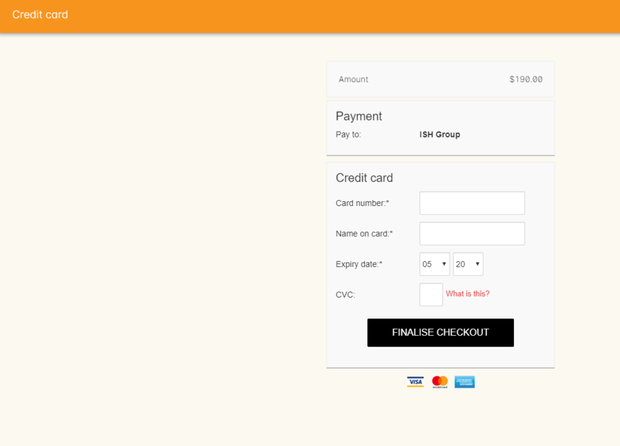

[[processingEnrolments-newcreditCards]]
==== Using a new credit card

To process a new credit card payment you need to do the following steps:

. Select Credit Card from the payment type drop down menu during the Payment step of Checkout.
. The credit card secure payment gateway will open in the section to the right of the Payments column.
. Enter the credit card details into the secure payment window and then click the Submit button to process the payment
+
Whilst the secure payment is being processed, the Checkout window will remain open with a processing enrolment message being displayed.
. The payment will be processed and if successful, the payment gateway window will display the message *payment was successful* you can then close the payment browser window
. The Checkout window will also update to show that the transaction was successful, you can then click finalise transaction and then send the enrolment confirmation as per the standard process.
. Click the 'Share' icon next to the invoice on the Transaction Succesul window to open the Share menu on that invoice record in order to generate and print the Invoice.
You can also click the go to shorcut icons to go directly to either the payment record or the invoice.
. You can either close the tab or click 'Start New Checkout' to start a new transaction in a fresh checkout window.

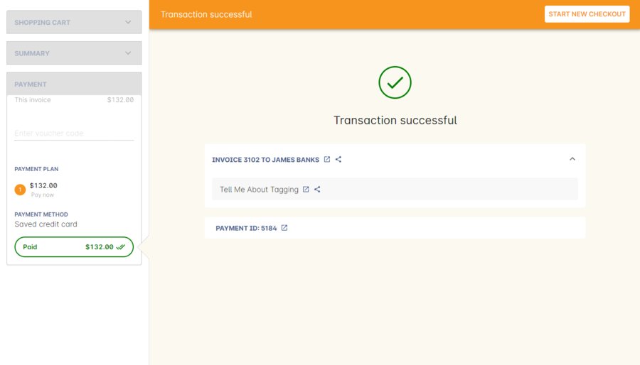

[NOTE]
====
In the event that there is an outage with your internet connection whilst a credit card transaction is being processed, or you close the browser window without cancelling the payment attempt in the window, the payment will time out in 20 minutes.
During this timeout period, the Checkout window will remain locked.
An error message will appear notifying you "Payment was expired by timeout.
The enrolment and unpaid invoice have been saved." Checkout will then allow you to save and close the enrolment with or without sending the normal notifications to the contacts.
You can then reopen Checkout and attempt to process the payment again.
====

[[processingEnrolments-savedcreditCards]]
==== Using a saved credit card

To process a payment using a saved credit card, the payer must have a credit card saved to their contact record.
You can see this in their contact record, under 'Financial'.
To select this option in Checkout, choose 'Saved Credit Card', then click Finalise Transaction.

[[processingEnrolments-failedcreditCards]]
=== Managing cancelled and failed credit card transactions

This section outlines how you manage the payment cancellation process and how onCourse reconciles those cancelled transactions

==== How to cancel a credit card transaction

You don't technically need to cancel credit card payments in onCourse.
You can simply change the Payment Method.

. With the credit card gateway open, simply click the 'Payment Method' field and make another selection.

==== How to manage transactions where the payment has failed

When a credit card payment has failed, the secure payment window will display the message *Payment Failed* and a reason for the failure.
You can either:

. click 'Try Again' to try a new card
. change the payment type and accept another type of payment, or
. change the Pay Now price to $0 to create the invoice and enrolment only, and accept payment at a later date.

[[processingEnrolments-paymentIn]]
=== Processing payments after the enrolment process

If an invoice is unpaid at the time of enrolment, or partially paid, at a later date you will need to collect the rest of the money owed to you.

Until the balance of the invoice is paid, the payer will be recorded in the system as a debtor, and you can find them quickly in the invoice window using the filter 'unpaid invoices'.

When a payment is made, you need to record the details of the payment, to reduce the balance of the debtors account.
You can do this either though Checkout, or by following the Payment In instructions below.

==== Processing a Payment In

Payments In must be processed from the owing invoice, or by clicking the + button in the Payments In window.

To accept a payment in on an invoice:

. Go the Invoices window
. Search for the invoice you wish to add a payment against, click it to highlight it
. Click the cogwheel in the bottom-right of the window and select 'Apply payment in'
. This will open the Checkout to the Payment window.
The owing amount will appear in the Pay Now section.
You can review any additional owing invoices on this contact's record.
Click the checkbox next to them to add them to the current payment.If the debtor has more than one invoice with a balance outstanding, by default the payment will apply to the oldest invoice(s)
. Once the invoices are selected, select a payment type and apply the payment.
Click Finalise Checkout to finalise the transaction.
+
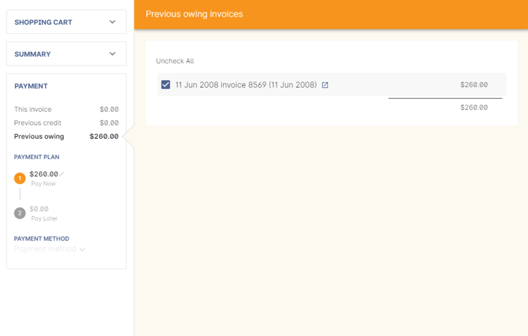
. After the transaction is deemed successful, you'll be shown a review of the created invoice.
. After you complete this process an email will be sent to the payer with the payment details and the payer record will appear in the list view of "Payment In".

Clicking the + button will open a blank Checkout window, where you can add a contact, proceed to the payments window and select any prviously owing invoices due for payment.

[[processingEnrolments-batch]]
==== Batch Payments In via Payments In

You can process a batch of payments using the batch payments in window.
From Payments In, click the + button and select "Process all due payments"

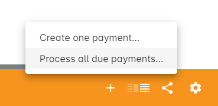

[[processingEnrolments-invoicesAndEnrolmentConfirmations]]
=== Sending invoices and confirmations

While reviewing the Summary in the Checkout is where you set who will be sent what in terms of confirmations and invoice notifications.

By default, the payer will receive the invoice, and everyone will receive confirmation emails.
However these can be switched off per contact in the summary by unticking the checkbo next to each option.

The enrolment confirmation goes to each student who has enrolled in a class.
The tax invoice only goes to the payer.
For example, if three friends were attending a class together, paid for by one of them as a gift to the others, you can set it so that the invoice and confirmation goes to the payer, and the others get nothing to retain the surprise.

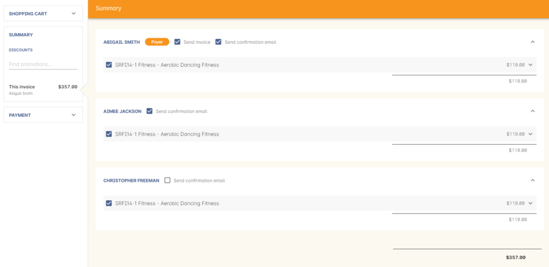

[[processingEnrolments-traineeships]]
=== Traineeship Classes

In onCourse, Traineeship Classes are a special type of class that can only take one enrolment per class.
They can only be created using marked
link:courses.html#courses-traineeships[Traineeship Courses].

You can create traineeship classes the same way that you do normal classes, by creating them in advance in the Classes window, or by duplicating them from an already existing, or previously completed traineeship class by clicking the cogwheel and selecting 'Duplicate traineeship and enrol'.
This will create a new copy of the highlighted traineeship class, and also open the Checkout with the selected class already chosen as an item.
Process payment to complete the enrolment.

[[AVETMISSEnrolments]]
=== Adding additional AVETMISS and other reporting information to an enrolment

Some additional information you need to record for your AVETMISS, traineeship, CRICOS or VET Fee-Help reporting can be added to the enrolment record after it has been created.
This information can not be added in Checkout at the time you create the enrolment.

To locate an enrolment, go to Enrolments and search for the enrolment you have created.
Double click on your enrolment to open it in edit mode.

When editing a funding field on an enrolment with associated outcomes, a pop-up will open asking if you'd like to update the associated outcomes with the same change.
Click the checkbox next to each field you'd like replicated across each outcome attached to the updated enrolment.

==== Fields to set at the enrolment level

In the VET section of the enrolment, you can set a value for the following fields.
Most of these field only affect AVETMISS reporting.

*Study Reason* reported in the NAT00120 for students enrolling in a qualification or skills set.
If you don't set a value here, the default '11 - other reasons' will be exported

*Fee Exemption Concession Type* reported in the NAT00120 as a below the line state reporting option

*Associate Course Identifier (SA - SACE Student ID)* reported in the NAT00120 as a below the line state reporting option

*Full Time Flag (QLD)* reported in the NAT00120 as a below the line state reporting option

*VET in Schools Enrolment* reported in the NAT00120. If you don't tick this option, an N for No will be exported as default

*Outcome Identifier - Training Organisation* reported in the NAT00120 as a below the line state reporting option.
If you are reporting a Smart & Skilled enrolment in NSW, this is where you record a student who did not commence their training after being issued a Commitment ID

*Training Contract: apprenticeships* reported in the NAT00120 for students undertaking funded training

*Client Identifier: apprenticeships* reported in the NAT00120 for students undertaking funded training

*CRICOS: Confirmation of Enrolment* This is not a field reported in AVETMISS, but used for management of CRICOS (overseas) students and reporting to PRISMS

*Eligibility exemption identifier (Vic)* reported in the NAT00120 as a below the line state reporting option

*VET FEE HELP indicator (Vic)* reported in the NAT00120 as a below the line state reporting option

*Training Plan Developed (NSW)* reported in the NAT00120 as a below the line state reporting option

==== Fields that can be overridden at the enrolment level

On the enrolment general tab, you can override the default values set in other places in onCourse.
Generally, these shared fields flow from the Class to the Enrolment, then to the Outcome.

[NOTE]
====
Changing a default value _will not_ have any affect on records that already exist.
Instead, the new defaults will only take affect in any new records created after the change, and for any records specifically edited to reflect that change.
====

*Funding source - National* This is inherited from the college default preferences, or from the class VET tab settings and can be overridden on the general tab for all outcomes attached to the enrolment, or on the outcomes tab for individual outcomes attached to the enrolment.
This value is reported in the NAT00120 file.

*Funding Source - State* This is inherited from the class VET tab settings and can be overridden on the general tab for all outcomes attached to the enrolment, or on the outcomes tab for individual outcomes attached to the enrolment.
This value is reported in the NAT00120 as a below the line state reporting option.

*Purchasing Contract Identifier (NSW Commitment ID)* This is inherited from the class VET tab settings and can be overridden on the general tab for all outcomes attached to the enrolment, or on the outcomes tab for individual outcomes attached to the enrolment.
If you are using this field for reporting into NSW, to record a Smart & Skilled Commitment ID, the enrolment is the place to enter this information.
This value is reported in the NAT00120 as a below the line state reporting option.

==== Fields that can be set at the outcome level

*Status* This is the Outcome Identifier - National that is reported in the NAT00120 file.

*Hours Attended* reported in the NAT00120 as a below the line state reporting option, only for outcomes with a status of 'withdrawn'

*Specific program identifier* this is the Specific Funding Identifier reported in the NAT00120

==== Fields that can be overridden at the outcome level

*Module Code/ Module Name* While this field doesn't display with a lock/unlock symbol, by default it is showing outcomes linked via the enrolment in the course where the outcomes the student will complete were defined.
These outcomes can be changed to any other unit of competency in the database.
This value is reported in the NAT00120 and the NAT0060 files.

*Start Date* This information is derived from the class, and based on either the start date of the sessions for a timetabled class, or the student's enrolment date for a self paced class.
This can be overridden in the list view of the edit view.
This value is reported in the NAT00120 file.

*End Date* This information is derived from the class, and based on either the end date of the sessions for a timetabled class, or the student's enrolment date plus the class duration for a self paced class.
This value is reported in the NAT00120 file.

*Reportable Hours* These are the Scheduled hours as reported in the NAT00120. They are derived from the nominal hours set at the unit of competency level.
This value is reported in the NAT00120 file.

*Delivery Mode* This value is derived from the default college preferences, or the class delivery mode.
If no delivery mode is set, onCourse will automatically export 'classroom based (10)' for all enrolments except those with RPL or credit transfer status, where it will export delivery mode 'not applicable (90)'.
If the only correct value for exporting is 'not applicable (90)' because of the Status set, then onCourse will always export this value no matter what option you set in this field.
This value is reported in the NAT00120 file

*Funding Source - National* This is derived from the college default preferences, from the class VET settings, or from the enrolment and can be overridden on a per outcome basis as needed.
This value is reported in the NAT00120 file.

*Purchasing Contract Identifier* This is derived from the class VET settings, or the enrolment and can be overridden for individual outcomes attached to the enrolment.
If you are using this field for reporting into NSW, to record a Smart & Skilled Commitment ID, the enrolment is the place to enter this information.
This value is reported in the NAT00120 as a below the line state reporting option.

*Funding Source State* This is derived from the class VET tab settings, or the enrolment and can be overridden for individual outcomes attached to the enrolment.
This value is reported in the NAT00120 as a below the line state reporting option.

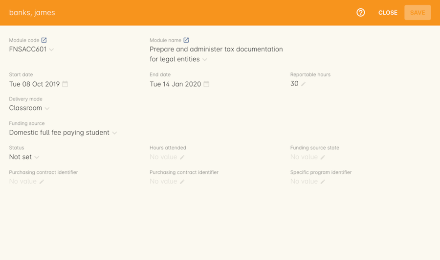

==== VET Fee Help fields in the enrolment

Information about setting VET Fee Help field values in the enrolment can be found in link:FEEHELP.html#FEEHELP-loanRequests[Student VET Fee-Help
Loan Requests.]

==== Enrolment Attachments

Enrolment records can contain private note records and document attachments on the 'Attachments' tab of the record.
More information can be found in link:documentManagement.html[documentation management.]

[[processingEnrolments-FAQs]]
=== Checkout FAQ

If you have a question about Checkout that is not answered by this chapter, please feel free to post a question in our forum or lodge an onCourse support request.

==== How do I manage an overpayment made by a student?

onCourse does not allow overpayments of invoices.
This is a deliberate design function to ensure data entry errors are not made.
If a student presents a cheque made out for the wrong amount, so you can bank and process the cheque you can do the following:

. Create the enrolment as usual in Checkout
. Add an 'other charge' to the enrolment, with a line item title like 'overpayment'
. Process the payment in Checkout with the total balance of the cheque that has been presented.
. Go to Invoices and create a manual credit note for the person who made an overpayment.
This credit can then be used towards other enrolments or refunded.

==== What do I do if I have recorded a payment (money) without any payment actually being made or I recorded the wrong amount?

If for example a student has not actually made a physical payment on their enrolment, but an onCourse user recorded their enrolment in onCourse as paid, you will need to follow these steps to resolve it.
Only unreconciled payments can be reversed.

. Locate the payment record in the 'Payment in' window and select it by single clicking it
. In the to right hand corner or the window, go to the cogwheel and select the option 'Reverse payment'.
This will create a new neagtive payment in against the invoice(s) where it was originally applied.
Those invoices will now have a balance outstanding as before you completed the original transaction.
. When you complete the reversal process, the status of the payment in will change from success to success (reversed).
. You can now process the correct payment in method at the time the student pays or for the correct amount that was received.

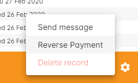

==== How do I change part of an enrolment fee to a business, and part to a student?

The best way to charge part of an enrolment fee to someone and another part to someone else would be to follow these steps.
We will use an example of a $100 enrolment where a student has paid half of an enrolment and the other half has been paid for by their job network agency:

. Create a credit note for the student for $50 (half of the class fee).
This will now drop their balance outstanding down to $50 (or $0 if they have already paid their half)
. Create a manual invoice for the job network agency in the invoice window for the remaining $50.
. Process the payment in for Job network invoice when they pay it.

For an invoice, you can not record some of the payment coming from a person other than the payer (in this case the student).
The reason you would use this method is so that if the student's enrolment is cancelled for some reason, they will only be entitled to a $50 refund, rather than the full $100.

==== How do I provide a student with a discount after they have already enrolled?

Invoices in onCourse are immutable; you can't change them after they have already been issued.

You can choose to either cancel the original enrolment and process it again correctly, with the discount or you can create a manual credit note for the student

If the student has already paid the full amount, they will end up with credit that can be refunded or used towards another enrolment.
If the student hasn't paid against the original invoice, they will now have a lower balance due, because of their credit note.

==== How do I check to see if a student has been enrolled?

You can go to the Enrolment list view window and type the student's name into the basic search.
Double-click on the record to open it and view it in more detail.
You can also check within the Class record itself by scrolling down to the Enrolments section, then clicking the 'Successful and Queued' button to open the enrolments window with all that classes current successful enrolments displayed.

If you require more information about an individual enrolment you can double click on an record; this will open the enrolment record to show it in more detail.

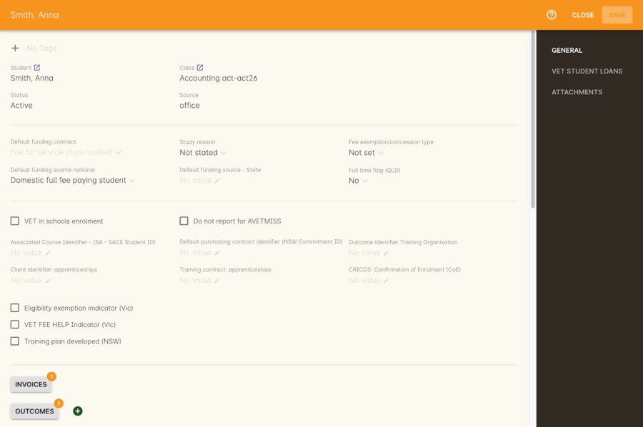

==== What happens if a student doesn't meet the class age restrictions?

If a class has a minimum, maximum or age range set for enrolment in the General section of the class, then during Checkout, each student attempting to enrol in the class will have their date of birth checked.

If the student doesn't have a date of birth at all, then they will not be allowed to enrol until a valid date of birth is provided.

If the student has a date of birth that means they do not meet the age requirements, they will not be able to enrol.

If the student is enrolling via the office, then their date of birth can be modified.
If the student is self enrolling on the website, and has previously provided their date of birth, they can not change their date of birth without contacting the office.
If you approve and change their date birth in onCourse, they will then be allowed to enrol in this class on the website.

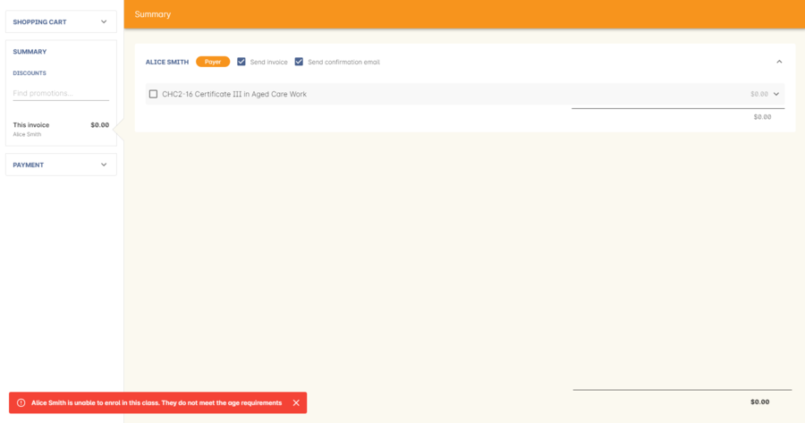

