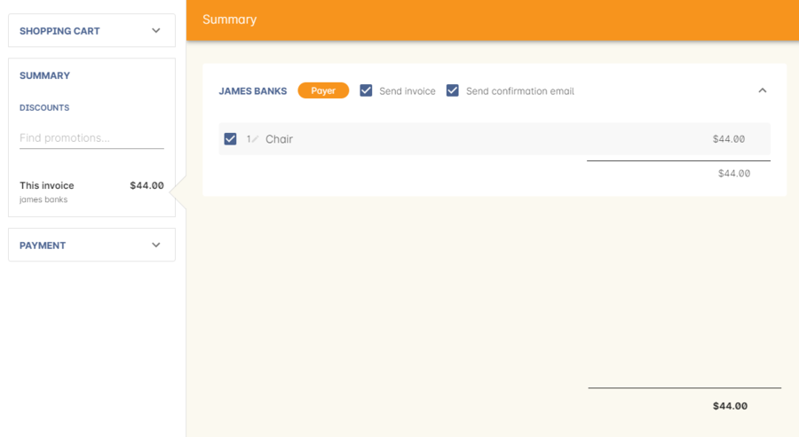
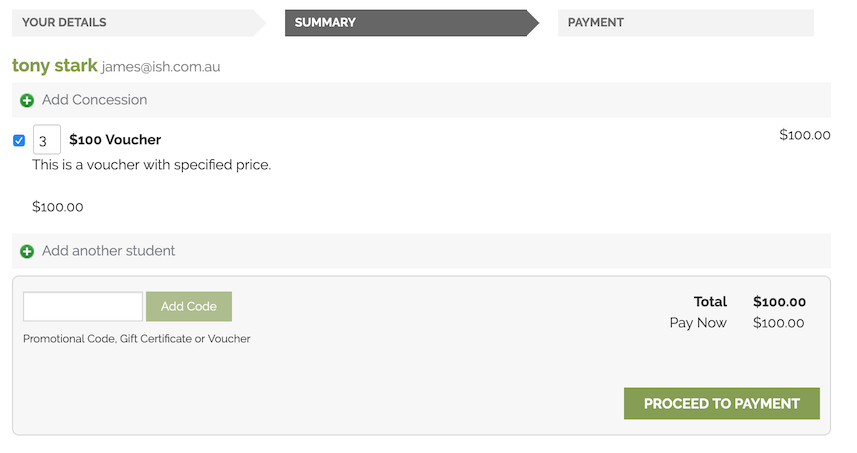

[[product]]
== Other products

A range of products can be sold through onCourse.
You have already seen how you can create classes and open them for enrolment at any price you set.
In addition to enrolments in classes you can also sell:

* Memberships
* Vouchers
* Products

In this chapter we'll focus on the last of these items: product sales.
For more information on memberships, see <<concessions, Concessions and Memberships>> chapter, and for more information on vouchers see <<vouchers, the Vouchers chapter>>.

Products in onCourse are a simple way to supply additional, defined items during an enrolment sale. onCourse does not manage a stock inventory or the shipping of products.
It is expected that most products will be supplied to the student in person when they attend the class.

[[products-navigatingAround]]
=== Navigating around the Product window

To open the product window, search for Products on the Dashboard.

image::images/products_list.png[ View of the products window in three-column view]

[[products-Adding]]
=== Adding a new product

There are a number of fields when creating a new product record.
They are:

* Name - allows you to name the product.
* Code - allows you to create a code for this product.
* Description - this allows you to include a description of the product in rich text, useful for the online marketing of the product.
* Income account - allows you to select what income account this is connected to.
* Fee - ex tax shows the Fee excluding any tax, Total Fee shows the full free including tax.
Choose the tax setting from the Tax drop down box.
* Status - you can choose whether this product can be either disabled; purchased in the office only; or purchased in the office as well as online.
* Corporate Pass - This feature allows you to link a number of Corporate Pass to products.
You can find the list of Corporate Passes linked to the product by clicking on the Corporate Passes tab in the products edit view.

[[products-relatingToACourse]]
=== Relating a product/course to another course

Products can be related to courses, for example, if there is a textbook you suggest purchasing a long with enrolling in the course.

After you have created the product, open the course which you with to relate it to, on the Marketing tab.

Click on the plus button + next to the section heading 'Related courses/products' to add a new product to the list.

Search for the product by its name, SKU or Course Code, click the 'add' button and then click Save.
The product will then appear on the web and in checkout as a suggested related purchase during enrolment in a class from this course.

image::images/related_product.png[ Adding a membership 'Sydney School Membership' to the course]

[[products-Purchasing]]
=== Purchasing a product in onCourse

A product can be purchased from checkout, either in conjunction with an enrolment or as a standalone purchase.

Products can be purchased by clicking on the field 'Find course or item...' then you can either click on the 'Products' button on the right side of the page and select one of the products listed.
Alternatively you can start typing the name of the product and select from the search results on the right.

Once you have found the product you want to add you can choose who you want to supply it to, if there is more than one contact listed.
Then you can specify the quantity of products want to be bought.

[NOTE]
====
If you change the 'Price each ex tax' field it will update the Total price to the correct amount, this will work in reverse also.
====

=== Purchasing a Product online

A product can also be purchased online provided its status allows it.
For a product to be available online, the status field on its product record must be set to 'can be purchased in office and online'.

After a user adds a product to their cart and proceeds to checkout, once they complete any marketing questions and get to the summary page, they will be able to set the quantity of the product they're purchasing and the checkout price will be updated automatically.

