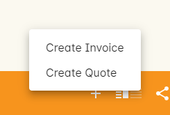
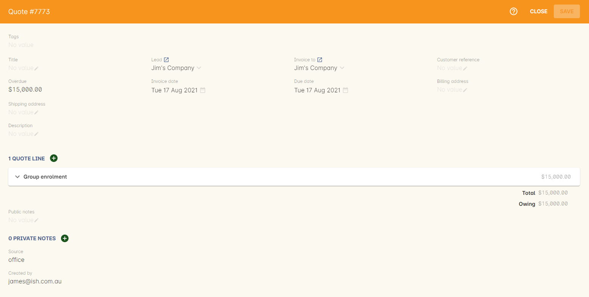
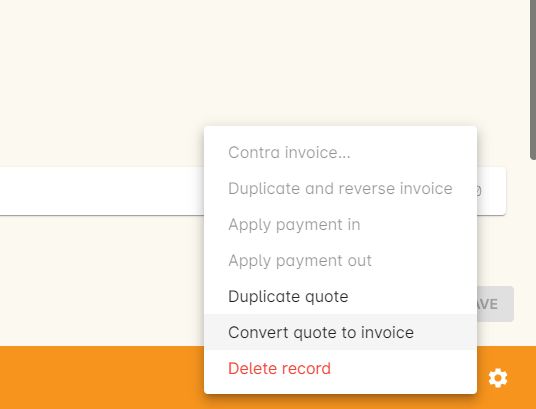

[[quotes]]
== Quotes

Quotes allow you to offer a customised, editable quote to a contact in your system without it becoming an obligation to buy. If a quote is accepted, they can then be turned into Invoices with the click of a button. They must be linked with a Lead. You can read more about <<leads,Leads here>>.

A quote is like a draft invoice, it can be changed and edited as many times as you like up until it becomes an invoice. Once a quote becomes an invoice, it can no longer be edited.

[IMPORTANT]
====
A quote must, at minimum, link to a lead and contain one quote line before it can be saved.
====

[[quotes-create]]
=== Creating a new quote

There are two main ways to create a new quote:

1. From within the 'Invoices' window, click the + button, then click 'Create Quote'.
2. Within the lead record, click the + button next to the 'Invoices' heading and a new quote will open in another window.

Link the quote to a lead and add a quote line, add a title if required, then click Save to save the quote.

==== Adding quote lines to a quote

To add a new quote line, within the quote record click the + button next to 'Quote Lines'.

Just like invoice lines, quote lines can be assigned to a specific account, have its own description, unit count and quantity, be assigned to an individual class budget or enrolment, and have a discount assigned to it as well.

You can add or remove as many quote lines to a quote as you need, but a quote must have at least one quote line in order to be saved.

=== How to edit a quote

To edit a quote, go to the Invoices window and make sure only the Quotes core filter is selected. Double-click the quote you wish to edit.

[[quotes-convert]]
=== Converting a quote into an invoice

When you're done with the quote process and wish to convert it to an invoice, highlight the quote from the invoices list view, click the cogwheel and select 'Convert quote to invoice'.

=== How to duplicate a quote

You can easily duplicate a quote using the duplicate function in the cogwheel menu, as in the screenshot above. Highlight the quote, click the cogwheel and select 'Duplicate quote'. A duplicate record will be created. Make your changes then hit 'Save' to see it added to the list.

=== Printing a quote

If you want to print a quote to send to a contact, you can do so by highlighting the quote and clicking the Share icon. There is a specific Quote PDF that uses the 'Title' field as a reference that we provide as a default PDF report.